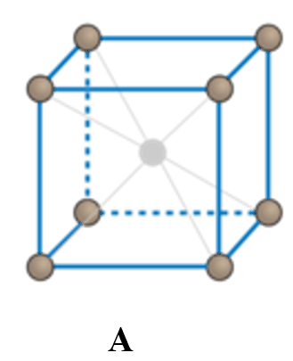
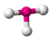

<!--
author:   Don Calbreath, Ph.D.

email:    LiaScript@web.de

version:  0.0.1

language: en

narrator: US English Female

comment:  CK-12 Chemistry Intermediate Quizzes and Tests complements the CK-12 Chemistry Intermediate FlexBook® textbook and includes one quiz per lesson, one chapter test, and one unit test.

logo:     ../cover.jpg

tags:      chemistry, flexbook, science

-->

# CK-12 Chemistry - Intermediate Quizzes and Tests

> This document was automatically translated to LiaScript from
>
> https://www.ck12.org/quizbook/ck-12-chemistry-intermediate-quizzes-and-tests/

## 1.0 Introduction to Chemistry Assessments

<article>

</article>

### 1.1 What is Chemistry?

<article>

Lesson Quiz
-----------

**Name\_\_\_\_\_\_\_\_\_\_\_\_\_\_\_\_\_\_\_ Class\_\_\_\_\_\_\_\_\_\_\_\_\_\_ Date\_\_\_\_\_\_\_\_**

_Multiple Choice:_

1.  Copernicus studied
    1.  anatomy
    2.  painting
    3.  movement of the sun
    4.  movement of the planets
2.  Our major source of energy today is
    1.  wind
    2.  fossil fuels
    3.  nuclear energy
    4.  solar power
3.  Genetic information is contained in
    1.  proteins
    2.  enzymes
    3.  DNA
    4.  lipids
4.  Which one of the following is not a material created by chemists?
    1.  liquid crystals
    2.  enzymes
    3.  plastics
    4.  ceramics
5.  Chemists contribute to the growth of food by all of the following except
    1.  developing new fertilizers
    2.  causing soil erosion
    3.  creating new pesticides
    4.  making new soil supplements
6.  Algae blooms in water are caused by
    1.  excess oxygen in the water
    2.  death of fish
    3.  decrease in oxygen in the water
    4.  fertilizer run-off from the ground
7.  Many scientists believe that global warming is caused by
    1.  sun spots
    2.  increase in carbon dioxide from burning fossil fuels
    3.  lowered carbon dioxide due to increased use by plants
    4.  forest fires
8.  Improved rubber compounds for tires might be developed by
    1.  an inorganic chemist
    2.  a biochemist
    3.  an organic chemist
    4.  a physical chemist
9.  There is often overlap between the disciplines of biochemistry and
    1.  inorganic chemistry
    2.  analytical chemistry
    3.  organic chemistry
    4.  physical chemistry
10. All of the following are body parts developed by chemists except
    1.  hip replacement
    2.  artificial skin
    3.  plastic blood vessels
    4.  artificial liver

_True/False:_

11. \_\_\_\_\_ Microscopic refers to the small particles that make up all matter.
12. \_\_\_\_\_ Observing the rusting of iron is a microscopic process.
13. \_\_\_\_\_ Chemistry is the study of planetary orbits.
14. \_\_\_\_\_ The alchemists were never successful in their attempts to make gold.
15. \_\_\_\_\_ The elixir of life was supposed to convey immortality to humans.
16. \_\_\_\_\_ Pure chemistry always has a practical goal.
17. \_\_\_\_\_ The development of wrinkle-free fabrics is an example of applied chemistry.
18. \_\_\_\_\_ Studying how fast crystals form from salt solutions would be done by a physical chemist.
19. \_\_\_\_\_ A biochemist would do research on glucose use by the liver.
20. \_\_\_\_\_ Mercury is not toxic to humans.

_Fill in the blanks:_

21. Chemistry is the study of the \_\_\_\_\_\_\_\_\_\_\_\_\_\_\_\_ of matter and the \_\_\_\_\_\_\_\_\_\_ that matter undergoes.
22. Matter is anything that has \_\_\_\_\_\_\_\_\_\_\_ and takes up space.
23. A \_\_\_\_\_\_\_\_\_\_\_\_\_\_\_ would study the structure of the hemoglobin molecule and how it transports oxygen.
24. An organic chemistry works mainly with \_\_\_\_\_\_\_\_\_\_\_\_ compounds.
25. The \_\_\_\_\_\_\_\_\_\_\_\_ chemist would be interested in the analysis of rubies.
26. \_\_\_\_\_\_\_\_\_\_\_\_ chemistry is the study of the composition of matter, with a focus on separating, identifying, and quantifying chemical samples.
27. One element known to cause brain damage in children is \_\_\_\_\_\_\_\_\_\_.
28. Nuclear \_\_\_\_\_\_\_\_ is a process that occurs in the sun and stars.
29. Alchemy contributed to the production of \_\_\_\_\_\_\_\_\_.
30. The first attempts to classify substances were made by \_\_\_\_\_\_\_\_\_\_\_\_.
31. Iron is caused to rust by exposure to \_\_\_\_\_\_\_\_ and \_\_\_\_\_\_\_\_\_\_\_\_.

_Short Answers:_

32. Rock salt sprinkled on ice will cause the ice to melt. Is this a macroscopic or microscopic process?
33. Some scientists study the chemical processes that take place in the sun. Is this pure or applied chemistry? Explain your answer.
34. Why are some people concerned about using nuclear power plants to generate electricity?

</article>

### 1.2 The Scientific Method

<article>

Lesson Quiz
-----------

**Name\_\_\_\_\_\_\_\_\_\_\_\_\_\_\_\_\_\_\_ Class\_\_\_\_\_\_\_\_\_\_\_\_\_\_ Date\_\_\_\_\_\_\_\_**

_Multiple Choice:_

1.  Copernicus made the following contribution to scientific progress
    1.  research on the behavior of solar flares
    2.  measured the path of the moon
    3.  developed the idea of the heliocentric solar system
    4.  discovered the double helix
2.  The Renaissance was
    1.  a time of scientific progress
    2.  a medieval fair
    3.  a time when science was not important
    4.  a form of music
3.  Experiments are important because they
    1.  provide jobs for scientists
    2.  test the laws of science
    3.  test the hypothesis
    4.  identify the control group
4.  A theory has been
    1.  repeatedly tested and shown to be true
    2.  repeatedly tested without clear conclusions
    3.  tested once and accepted
    4.  poorly accepted by other scientists
5.  All but one statement below tell why scientists work in groups
    1.  problems are complex
    2.  research progress takes a lot of time and money
    3.  some scientists are lazy and steal the ideas of others
    4.  research progress occurs in small steps, so many people are needed
6.  What does peer review do for science?
    1.  allows reviewers to eliminate research they don’t agree with
    2.  makes sure research papers have reliable information
    3.  costs extra money
    4.  helps get a textbook written
7.  A scientific law
    1.  is always true
    2.  might be disproved at some point in the future
    3.  is another term for a hypothesis
    4.  does not have a lot of data to support it
8.  The independent variable
    1.  always increases with an increase in temperature
    2.  is never affected by temperature
    3.  is changed during the experiment
    4.  stays the same throughout the experiment
9.  In order to accept the results of an experiment
    1.  other scientists must have failed to repeat it
    2.  it must be repeatable
    3.  a report needs to be written
    4.  only a few people need to agree with the data
10. The control group for an experiment
    1.  checks the reproducibility of the experiment
    2.  serves as the dependent variable
    3.  serves as the independent variable
    4.  does not experience the variable being tested

_True/False:_

11. \_\_\_\_\_ A theory has been widely tested
12. \_\_\_\_\_ A theory never changes
13. \_\_\_\_\_ The control group also has the experiment run on it
14. \_\_\_\_\_ The Renaissance put an emphasis on observation and experimentation
15. \_\_\_\_\_ The National Science Foundation is the only agency that funds research.
16. \_\_\_\_\_ The dependent variable is the one that is changed during the experiment.
17. \_\_\_\_\_ If experimental results are inconsistent with a hypothesis, the hypothesis must be changed or discarded.
18. \_\_\_\_\_ An experiment must only be repeated by the group originally proposing the hypothesis in order for the hypothesis to be accepted.
19. \_\_\_\_\_ Publishing research in a scientific journal is not the only way to get the information out to others.
20. \_\_\_\_\_ A valid explanation for an observation does not need to be tested if it sounds reasonable.

_Matching:_

21. \_\_\_\_\_ I develop an initial explanation that answers the question I ask.
22. \_\_\_\_\_ My final explanation has been repeatedly tested and is accepted by many scientists.
23. \_\_\_\_\_ I see something that is puzzling and that I cannot explain.
24. \_\_\_\_\_ what I get when I run an experiment
25. \_\_\_\_\_ variable observed during an experiment
26. \_\_\_\_\_ no known exceptions

a. observation

b. theory

c. hypothesis

d. dependent

e. results

f. law

_Fill in the blanks:_

27. The Renaissance was a time of great \_\_\_\_\_\_\_\_\_\_ in Europe.
28. Leonardo da Vinci carried out systematic studies of \_\_\_\_\_\_\_\_ and \_\_\_\_\_\_\_\_\_.
29. Great advancements in \_\_\_\_, \_\_\_\_\_, and \_\_\_\_ were made during the Renaissance period.
30. The \_\_\_\_\_\_\_\_\_ model said that the Earth revolved around the Sun.
31. The scientific method is a \_\_\_\_\_\_\_\_\_ and \_\_\_\_\_\_\_\_\_\_ approach to the acquisition of knowledge.

_Critical Write Question:_

32. I want to study the effect of chocolate chips on the baking time of cookies. My experiment involves mixing different amounts of chocolate chips into cookie dough and baking the cookies in the oven at 350 °F for 30 minutes. I will assess the effect by observing the hardness of the final product.
    1.  What is the independent variable in this experiment? Explain your answer.
    2.  How many dependent variables are there? List them and explain your answer.
    3.  Should I carry out my cookie research by myself or have other people help? Explain your answer.
    4.  Briefly describe two ways I can share my cookie research with other scientists.

</article>

### 1.3 Introduction to Chemistry

<article>

Chapter Test
------------

**Name\_\_\_\_\_\_\_\_\_\_\_\_\_\_\_\_\_\_\_ Class\_\_\_\_\_\_\_\_\_\_\_\_\_\_ Date\_\_\_\_\_\_\_\_**

_Multiple Choice:_

1.  Baking soda produces \_\_\_\_\_\_ during cooking.
    1.  air
    2.  carbon dioxide
    3.  water
    4.  hydrogen gas
2.  Which of the following is not a part of the macroscopic world?
    1.  rainwater
    2.  rusting iron
    3.  bacteria
    4.  leaves
3.  What was the philosopher’s stone?
    1.  a material that protected the body
    2.  a rock that Aristotle sat on while he taught
    3.  a material used to refine ores
    4.  a substance that could change lead into gold
4.  Which of the following would not be considered applied chemistry?
    1.  study of the atomic structure of rubidium
    2.  use of rubidium in jewelry
    3.  treatment of disease using rubidium solutions
    4.  research on how to dissolve rubidium
5.  Which of the following statements about fossil fuels is incorrect?
    1.  coal, petroleum, and natural gas are fossil fuels
    2.  they are a nonrenewable energy source
    3.  the global supply of fossil fuels will never be used up
    4.  fossil fuels supply most of our energy needs today
6.  Which of the following statements is correct?
    1.  plastics are never used in hip replacement because they wear out quickly
    2.  genetically modified corn requires more pesticides that the non-modified plant
    3.  plastic tubing has been successfully used to repair diseased blood vessels
    4.  drugs do not affect any chemical processes in the body
7.  Which one of the following is a material that was not developed by chemists?
    1.  quartz
    2.  adhesives
    3.  copper cables
    4.  polymers
8.  Nuclear fusion
    1.  is used to generate electrical energy
    2.  takes place in the sun and stars
    3.  involves making large molecules from smaller ones
    4.  takes place at low temperatures
9.  The dependent variable
    1.  does not change as the temperature increases
    2.  will change as the independent variable changes
    3.  never changes
    4.  is varied in the experiment to see how it influences the results
10. One of the following statements about Leonardo da Vinci is not true
    1.  he was called the father of modern science
    2.  he studied water flow
    3.  he discovered penicillin
    4.  he did medical dissections

_True/False:_

11. \_\_\_\_\_ A tablet of ibuprofen is macroscopic.
12. \_\_\_\_\_ Applied chemistry is involved in looking for basic scientific ideas.
13. \_\_\_\_\_ The alchemists wanted to find the philosopher’s stone.
14. \_\_\_\_\_ A biochemist studies how the pancreas affects blood glucose levels.
15. \_\_\_\_\_ A physical chemist looks at the composition of rocks.
16. \_\_\_\_\_ Nuclear energy is safer than using fossil fuels.
17. \_\_\_\_\_ Mercury has been shown to be a toxic element.
18. \_\_\_\_\_ Algae in water is a result of too little fertilizer.
19. \_\_\_\_\_ Peer review helps make sure scientific papers are reliable.
20. \_\_\_\_\_ Grant money can be used to purchase test tubes.

_Fill in the blanks:_

21. \_\_\_\_\_ is a toxic element other than lead that is no longer used to any extent.
22. Drugs work because of their \_\_\_\_\_\_\_\_\_\_ with other chemicals in the body.
23. Kevlar was discovered by \_\_\_\_\_\_\_\_\_\_\_\_ \_\_\_\_\_\_\_\_\_\_\_\_\_\_\_ .
24. Alchemists laid the foundation for the production of \_\_\_\_\_\_\_\_\_\_\_\_\_\_\_\_\_ .
25. Organic chemistry and \_\_\_\_\_\_\_\_\_\_ are often closely connected.
26. List the five points of the scientific method in order:
    1.  \_\_\_\_\_\_\_\_\_\_
    2.  \_\_\_\_\_\_\_\_\_\_
    3.  \_\_\_\_\_\_\_\_\_\_
    4.  \_\_\_\_\_\_\_\_\_\_
    5.  \_\_\_\_\_\_\_\_\_\_
27. When scientists write grant proposals, they explain the \_\_\_\_\_ and \_\_\_\_\_\_\_ \_\_\_\_\_\_ of their research.

_Short Answers:_

28. Why is peer review an important part of the publication of scientific results?
29. Give an example in the medical field where a scientist might use more than one chemistry discipline.

</article>

## 2.0 Matter and Change Assessments

<article>

</article>

### 2.1 Properties of Matter

<article>

Lesson Quiz
-----------

**Name\_\_\_\_\_\_\_\_\_\_\_\_\_\_\_\_\_\_\_ Class\_\_\_\_\_\_\_\_\_\_\_\_\_\_ Date\_\_\_\_\_\_\_\_**

_Multiple Choice:_

1.  One of the following is not a physical property of iron.
    1.  malleability
    2.  magnetism
    3.  rusting
    4.  color
2.  You have a sample of cobalt chloride with the following properties. Which one is an intensive property?
    1.  654 grams
    2.  density of 3.356 g/cm_3_
    3.  melting point of 735°C
    4.  sky blue color
3.  The ability of aluminum to be formed into sheets is called
    1.  malleability
    2.  ductility
    3.  conductivity
    4.  deformability
4.  Which of the following is not a characteristic of a sample of sodium metal?
    1.  defined mass
    2.  defined volume
    3.  takes on shape of container
    4.  defined color
5.  An irreversible change would be
    1.  chipping ice to flakes
    2.  getting a hair cut
    3.  condensing steam
    4.  boiling water
6.  The particles of a solid have all the following properties except one
    1.  very close together
    2.  in fixed position
    3.  easily compressed
    4.  may not expand when heated
7.  Which of the following is not a physical change that a lead bar could undergo?
    1.  melting
    2.  boiling
    3.  being stretched
    4.  oxidation
8.  A gas sample will not demonstrate one of the following properties
    1.  has a definite volume
    2.  has no definite shape
    3.  has a definite mass
    4.  be easily compressed
9.  A pure substance has the following characteristic
    1.  uniform composition
    2.  composition not definite
    3.  can be compressed
    4.  molecules rigidly arranged
10. One of the following statements is not true of a physical change
    1.  the shape is unchanged
    2.  the chemical composition is unchanged
    3.  the identity of the material is unchanged
    4.  the reactivity is unchanged

_True/False:_

11. \_\_\_\_\_ Bromine becomes another substance when it changes from liquid to gas.
12. \_\_\_\_\_ Magnetism is a physical property.
13. \_\_\_\_\_ A sample of liquid bromine cannot evaporate.
14. \_\_\_\_\_ Metallic sodium can become a vapor.
15. \_\_\_\_\_ The volume of a sample of water does not change when heated.
16. \_\_\_\_\_ Physical changes are always reversible.
17. \_\_\_\_\_ Air can be considered a pure substance.
18. \_\_\_\_\_ Physical changes involving a change of state are reversible.
19. \_\_\_\_\_ Burning of gasoline is not a physical change.
20. \_\_\_\_\_ Chopping down a tree is a reversible physical change.

_Fill in the Blank:_

21. Making furniture from wood is a(n) \_\_\_\_\_\_\_\_\_\_\_\_\_\_\_\_\_ physical change.
22. A \_\_\_\_\_\_\_\_\_\_\_\_\_\_ takes the shape of its container.
23. A \_\_\_\_\_\_\_\_\_\_\_ forms when mercury is boiled.
24. The freezing point of bromine is a \_\_\_\_\_\_\_\_\_\_\_\_ property.
25. The rich red color of a ruby is an \_\_\_\_\_\_\_\_\_\_\_\_ property while the mass of the ruby is an \_\_\_\_\_\_\_\_\_\_\_\_\_ property.
26. \_\_\_\_\_\_\_\_\_\_ is the amount of space occupied by a material.
27. A \_\_\_\_\_\_\_\_\_\_\_ has a definite volume and shape.
28. \_\_\_\_\_ is the term used for a substance which has neither a definite shape nor a definite volume at room temperature.
29. The ability of copper to be made into sheets is called \_\_\_\_\_\_\_\_\_\_\_\_\_\_\_\_.
30. \_\_\_\_\_\_\_, \_\_\_\_\_\_\_, and \_\_\_\_\_\_\_\_\_\_\_\_ are excellent conductors of electricity.
31. How does the shape of a water sample change when it goes from liquid to solid?
32. Iodine has a melting point of 113.7°C and a boiling point of 184.3°C. Give the state an iodine sample is in at the following temperatures:
    1.  205.3°C \_\_\_\_\_\_\_\_\_\_
    2.  104.7°C \_\_\_\_\_\_\_\_\_\_
    3.  176.9°C \_\_\_\_\_\_\_\_\_\_

</article>

### 2.2 Classification Of Matter

<article>

Lesson Quiz
-----------

**Name\_\_\_\_\_\_\_\_\_\_\_\_\_\_\_\_\_\_\_ Class\_\_\_\_\_\_\_\_\_\_\_\_\_\_ Date\_\_\_\_\_\_\_\_**

_Multiple Choice:_

1.  A chemical symbol is
    1.  something students need to memorize
    2.  a unique one- or two-letter abbreviation for an element
    3.  something that always refers to a Greek or Latin name
    4.  a letter than can refer to several elements
2.  The process of breaking a compound down into its elements is called
    1.  recombination
    2.  rearrangement
    3.  dessication
    4.  decomposition
3.  Which of the following is an element?
    1.  sea water
    2.  salt
    3.  a gold ring
    4.  methane gas
4.  Sodium chloride is changed to metallic sodium and chlorine gas. This process represents a
    1.  physical change
    2.  chemical change
    3.  nuclear change
    4.  elemental change
5.  Chicken noodle soup is a \_\_\_\_\_\_\_\_\_\_ mixture.
    1.  homogeneous
    2.  heterogeneous
    3.  homogenized
    4.  heterophilic
6.  Distillation is a process of separating materials by
    1.  differences in solubility
    2.  differences in particle size
    3.  differences in color
    4.  differences in boiling point
7.  H2SO4 is a(n)
    1.  element
    2.  mixture
    3.  compound
    4.  heterogeneous solution
8.  A chemical formula
    1.  shows the elements in a compound
    2.  shows how to make a compound
    3.  shows the mixture present
    4.  shows the decomposition's products
9.  Filtration separates
    1.  two or more liquid phases
    2.  solids in a heterogeneous mixture
    3.  solids from liquids in a heterogeneous mixture
    4.  solids from liquids in a homogeneous mixture
10. Another term for a homogeneous mixture is a
    1.  solution
    2.  suspension
    3.  solubilizer
    4.  stabilizer

_True/False:_

11. \_\_\_\_\_ One element can be converted to another element using chemical processes.
12. \_\_\_\_\_ A mixture can only have two components.
13. \_\_\_\_\_ Potassium iodide (KI) is a mixture of potassium and iodine.
14. \_\_\_\_\_ A chemical symbol for an element must have only one letter.
15. \_\_\_\_\_ Blood is a heterogeneous mixture.
16. \_\_\_\_\_ The compound NiS is composed of nickel and sodium.
17. \_\_\_\_\_ Cooking oil is a homogeneous mixture.
18. \_\_\_\_\_ A homogeneous mixture consists of one phase.
19. \_\_\_\_\_ Elements can be broken down into simpler substances.
20. \_\_\_\_\_ The two or more elements in a compound have been chemically combined.

_Fill in the blank:_

21. Sucrose (C12H22O11) is composed of \_\_\_\_\_\_\_\_\_\_\_\_\_, \_\_\_\_\_\_\_\_\_\_\_\_\_\_\_\_\_\_, and \_\_\_\_\_\_\_\_\_\_\_\_.
22. The chemical symbol for silver is \_\_\_\_\_\_ and the Latin name is \_\_\_\_\_\_\_\_\_\_\_\_\_\_\_.
23. Cu/Sn would represent a mixture of \_\_\_\_\_\_ and \_\_\_\_\_\_\_\_\_\_\_.
24. Sushi is a \_\_\_\_\_\_\_\_\_\_\_\_\_\_ mixture of rice and fish.
25. Kalium is the Latin name for the element \_\_\_\_.

_Matching:_

26. \_\_\_\_\_ change that produces matter with a different composition
27. \_\_\_\_\_ a mixture that is not uniform throughout.
28. \_\_\_\_\_ separate solid from liquids in a heterogeneous mixture.
29. \_\_\_\_\_ has uniform composition and properties

a. heterogeneous

b. phase

c. chemical change

d. filtration

30. Listed below are the boiling points for several petroleum fractions. Describe how you would separate diesel oil from everything else.

| Fraction | Boiling Point (0C) | Use |
| --- | --- | --- |
| butane | below 30 | natural gas |
| gasoline | 100-150 | car and truck fuel |
| diesel oil | 200-300 | fuel for trucks and trains |
| greases and waxes | 400-500 | lubricants |

31. Describe how you would separate a mixture of lead buckshot and potassium nitrate fertilizer.

</article>

### 2.3 Changes in Matter

<article>

Lesson Quiz
-----------

**Name\_\_\_\_\_\_\_\_\_\_\_\_\_\_\_\_\_\_\_ Class\_\_\_\_\_\_\_\_\_\_\_\_\_\_ Date\_\_\_\_\_\_\_\_**

_Multiple Choice:_

1.  Which of the following is a physical change?
    1.  oxidation of sulfur
    2.  melting of sulfur
    3.  reduction of sulfur
    4.  combustion of sulfur
2.  One chemical property of the element sodium is
    1.  a density of 0.968 grams/cm_3_
    2.  a melting point of 97.8°C
    3.  forms hydrogen gas when added to water
    4.  becomes transparent at extremely high pressures
3.  Which of the following energy changes is associated with a chemical reaction?
    1.  condensation of steam
    2.  melting of lead
    3.  compressing of air
    4.  heating of mercuric oxide
4.  One of the following is not a sign of a chemical reaction
    1.  change of color
    2.  formation of a precipitate
    3.  release of energy
    4.  production of a gas
5.  Lead iodide produces a \_\_\_\_\_\_\_\_ color.
    1.  yellow
    2.  orange
    3.  red
    4.  tan
6.  \_\_\_\_\_ is an example of a chemical change
    1.  melting
    2.  rusting
    3.  boiling
    4.  freezing
7.  Terms that are not used to describe chemical changes include
    1.  fermenting
    2.  condensing
    3.  burning
    4.  rotting
8.  A more general term for the rusting process is
    1.  erosion
    2.  explosion
    3.  corrosion
    4.  collusion
9.  Zinc reacts with hydrochloric acid to form
    1.  oxygen
    2.  hydrogen
    3.  chlorine
    4.  helium
10. The reaction of magnesium with oxygen is called
    1.  reduction
    2.  fermentation
    3.  decomposition
    4.  combustion

_True/False:_

11. \_\_\_\_\_ The reactants are listed on the right hand side of the arrow in a chemical equation.
12. \_\_\_\_\_ Minor products can be omitted from a chemical equation.
13. \_\_\_\_\_ The conversion of mercuric oxide to mercury produces energy during the reaction.
14. \_\_\_\_\_ Iron reacts with oxygen to form rust.
15. \_\_\_\_\_ Nitrogen gas forms when lead nitrate and potassium iodide react.
16. \_\_\_\_\_ In the reaction between zinc and sulfur, zinc is a reactant.
17. \_\_\_\_\_ Chemical properties can only be observed after the reaction has occurred.
18. \_\_\_\_\_ If zinc and sulfur are mixed at room temperature, no reaction occurs.
19. \_\_\_\_\_ No color change takes place when zinc and sulfur react.
20. \_\_\_\_\_ Light is emitted when mercuric oxide decomposes.

_Fill in the Blank:_

21. In the reaction involving the electrolysis of water, we can write the following equation:
22. $2H_2O \rightarrow 2H_2 + O_2$
    1.  One reactant in this process is \_\_\_\_\_\_\_.
    2.  One product in this process is \_\_\_\_\_\_\_.
23. The color in the test tube changes from \_\_\_\_\_\_\_ to \_\_\_\_\_\_ when mercuric oxide is heated.
24. Which of the following is a physical change and which is a chemical change?
    1.  Hydrogen and oxygen produce water \_\_\_\_\_\_\_\_\_\_\_\_.
    2.  Chlorine gas has a maximum solubility in water at 49°F.\_\_\_\_\_\_\_\_\_
    3.  Isopropyl alcohol forms water and carbon dioxide when burned.\_\_\_\_\_\_\_\_\_\_\_\_\_\_
    4.  Nitrogen gas is very compressible \_\_\_\_\_\_\_\_\_\_\_\_\_
25. A \_\_\_\_\_\_\_\_\_\_\_\_ is a solid product that can form in a liquid mixture.

_Short Answers:_

25. A copper penny is left outside for a long period of time and becomes green. Is this a chemical change or a physical change? How would you tell?
26. When iron is heated, it gives off a red glow. Is this a sign that a chemical change has taken place?

</article>

### 2.4 Matter and Change

<article>

Chapter Test
------------

**Name\_\_\_\_\_\_\_\_\_\_\_\_\_\_\_\_\_\_\_ Class\_\_\_\_\_\_\_\_\_\_\_\_\_\_ Date\_\_\_\_\_\_\_\_**

_Multiple Choice:_

1.  One of the following is not a physical property of osmium
    1.  density of 22.59 g/cm_3_
    2.  boiling point of 5012°C
    3.  forms osmium tetroxide with air
    4.  silver metal
2.  A reversible change is
    1.  trimming a tree
    2.  cooking a steak
    3.  cutting up a potato
    4.  making ice cubes
3.  Which of the following is not true of gases?
    1.  a hydrogen sample has a constant volume when the temperature changes
    2.  oxygen can be compressed easily
    3.  nitrogen molecules are very far apart in the gaseous state
    4.  molecules of chlorine gas are constantly moving
4.  Which of the following is a pure substance?
    1.  air
    2.  nitrogen
    3.  iron alloy
    4.  salt water
5.  Only one of the following is a homogeneous mixture
    1.  chocolate chip ice cream
    2.  iced tea with lemon
    3.  coffee with sugar
    4.  root beer float
6.  Sodium chloride forms sodium ions and chloride ions when dissolved in water. This process represents a
    1.  physical change
    2.  chemical change
    3.  nuclear change
    4.  elemental change
7.  One of the following is not a characteristic of the compound NaHCO3
    1.  composed of four elements
    2.  cannot be broken down into simpler substances
    3.  can undergo chemical changes
    4.  elements are combined in fixed proportions
8.  The symbol Sn represents the element
    1.  arsenic
    2.  antimony
    3.  mercury
    4.  tin
9.  The Latin word for potassium is
    1.  natrium
    2.  kalium
    3.  plumbum
    4.  stibium
10. A gas is produced when zinc reacts with
    1.  hydrochloric acid
    2.  sulfur
    3.  mercuric oxide
    4.  water

_True/False:_

11. \_\_\_\_\_ A chemical symbol for an element can have up to three letters.
12. \_\_\_\_\_ Water is fairly incompressible.
13. \_\_\_\_\_ A physical change does not involve a change in the identity of the sample.
14. \_\_\_\_\_ Mercury can be broken down into simpler components.
15. \_\_\_\_\_ Nitrogen at room temperature is very compressible.
16. \_\_\_\_\_ A homogeneous mixture consists of two or more phases.
17. \_\_\_\_\_ Iodine gas is formed from the reaction between potassium iodide and water.
18. \_\_\_\_\_ Distillation separates materials on the basis of boiling point.
19. \_\_\_\_\_ Distillation columns are cooled by compressed air.
20. \_\_\_\_\_ Boiling water is a chemical change.

_Matching:_

21. \_\_\_\_\_\_ the chemical symbol for iron.
22. \_\_\_\_\_ a form of matter with a definite volume, but an indefinite shape.
23. \_\_\_\_\_ separate gold dust from river water.
24. \_\_\_\_\_ a solid product that can form in a liquid mixture.

a. liquid

b. filtration

c. precipitate

d. Fe

_Fill in the blank:_

25. A \_\_\_\_\_\_ is formed when mercury is heated above its boiling point of 356.7°C.
26. The chemical symbol for gold is \_\_\_\_\_\_ and the Latin name is \_\_\_\_\_\_\_\_\_\_\_\_\_\_\_ .
27. Rust is the product of the reaction between iron and \_\_\_\_\_\_\_\_\_\_\_\_\_\_ .
28. Zinc sulfide is the product formed in the reaction between \_\_\_\_\_\_ and \_\_\_\_\_.
29. \_\_\_\_\_\_ is the measure of the amount of matter that an object contains.
30. A \_\_\_\_\_ forms when mercury is boiled.

_Short Answers:_

31. Can air exist as a pure substance? Explain your answer.
32. How would you separate a mixture of salt, olive oil, and water?

</article>

## 3.0 Measurements Assessments

<article>

</article>

### 3.1 The International System of Units

<article>

Lesson Quiz
-----------

**Name\_\_\_\_\_\_\_\_\_\_\_\_\_\_\_\_\_\_\_ Class\_\_\_\_\_\_\_\_\_\_\_\_\_\_ Date\_\_\_\_\_\_\_\_**

_Multiple Choice:_

1.  The SI symbol K stands for
    1.  kilogram
    2.  kilometer
    3.  kelvin
    4.  kilo
2.  The SI symbol for the amount of a substance is
    1.  mol
    2.  mole
    3.  m
    4.  molar
3.  1500 megabytes is equivalent to
    1.  $1.5 \times 10^3 \ gigabytes$
    2.  $1.5 \times 10^2 \ kilobytes$
    3.  $1.5 \times 10^{-2} \ gigabtyes$
    4.  $1.5 \times 10^6 \ kilobytes$
4.  The prefix hecto has an exponential factor of
    1.  $1 \times 10^2$
    2.  $1 \times 10^{-2}$
    3.  $1 \times 10^4$
    4.  $1 \times 10^{-4}$
5.  It takes \_\_\_\_\_\_\_\_\_\_\_ dekaliters to make 100 L.
    1.  1000
    2.  1
    3.  10
    4.  0.1
6.  The Kelvin scale has \_\_\_\_\_\_ degrees between the melting point of ice and the boiling point of water.
    1.  125
    2.  150
    3.  75
    4.  100
7.  The freezing point of water on the Kelvin scale is
    1.  273.15
    2.  373.15
    3.  173.15
    4.  473.15
8.  The number 0.0015 can be represented by
    1.  $1.5 \times 10^3$
    2.  $1.5 \times 10^2$
    3.  $1.5 \times 10^{-3}$
    4.  $1.5 \times 10^{-2}$
9.  The boiling point of water on the Celsius scale is
    1.  0°C
    2.  90°C
    3.  110°C
    4.  100°C
10. On which astronomical body will ten pounds of water weight less than it will on the Earth?
    1.  Jupiter
    2.  the moon
    3.  the sun
    4.  Arcturus

_True/False:_

11. \_\_\_\_\_SI is the abbreviation for the Le Système International.
12. \_\_\_\_\_ A measurement includes both a number and a unit.
13. \_\_\_\_\_ The ampere is another unit for mass.
14. \_\_\_\_\_ There are 103 hg in 10.3 kg.
15. \_\_\_\_\_ Very large volumes may be conveniently expressed in microliters.
16. \_\_\_\_\_ There is no molecular motion at 0°C.
17. \_\_\_\_\_ Kinetic energy is the energy due to motion.
18. \_\_\_\_\_ The joule is the SI unit for energy.
19. \_\_\_\_\_ Particles of a cold material move faster than particles of a hot material.
20. \_\_\_\_\_ The Fahrenheit scale is commonly used for scientific work.

_Fill in the Blank:_

21. Give the decimal or scientific notation for the following:
    1.  10956. \_\_\_\_\_
    2.  $67.3 \times 10^2$ \_\_\_\_\_
    3.  0.0045 \_\_\_\_\_
    4.  $8.2 \times 10^{-2}$ \_\_\_\_\_
22. The freezing point of water on the Celsius scale is \_\_\_\_\_°C.
23. \_\_\_\_\_\_\_\_\_\_\_\_\_ is a measure of the average \_\_\_\_\_\_\_\_\_ energy of the particles in matter.
24. Weight measures the effect of \_\_\_\_\_\_\_\_\_\_ on an object.
25. When two objects at different temperatures are brought into contact with one another, heat flows from the object at the \_\_\_\_\_\_\_ temperature to the object at the \_\_\_\_\_\_\_\_\_\_\_temperature.
26. The Celsius temperature scale was developed by the \_\_\_\_\_\_\_\_astronomer \_\_\_\_\_\_\_ \_\_\_\_\_\_.

_Short Answers:_

27. In a space capsule in outer space, why do objects float around?
28. Why is the SI system easier to use than the British system of units (feet, inches, pounds, ounces)?

</article>

### 3.2 Unit Conversions

<article>

Lesson Quiz
-----------

**Name\_\_\_\_\_\_\_\_\_\_\_\_\_\_\_\_\_\_\_ Class\_\_\_\_\_\_\_\_\_\_\_\_\_\_ Date\_\_\_\_\_\_\_\_**

_Multiple Choice:_

1.  The metric system uses powers of \_\_\_\_\_\_\_ to make conversions.
    1.  100
    2.  10
    3.  0.1
    4.  0.01
2.  A conversion factor is a ratio of \_\_\_\_\_\_\_\_\_\_ measures
    1.  opposite
    2.  larger
    3.  smaller
    4.  equivalent
3.  To convert from centimeters to meters, multiple the centimeter value by
    1.  10
    2.  0.1
    3.  100
    4.  0.01
4.  Area is a unit derived from the base units
    1.  $length \times mass$
    2.  $width \times volume$
    3.  $length \times volume$
    4.  $length \times width$
5.  The units for speed are
    1.  m/s
    2.  kg/s
    3.  m/L
    4.  m_2_/s
6.  Density is
    1.  $mass \times volume$
    2.  an intensive property
    3.  $\frac{volume}{mass}$
    4.  an extensive property
7.  The SI unit for concentration is mol/L. What does “mol” represent?
    1.  volume of material
    2.  temperature of material
    3.  mass of material
    4.  density of material
8.  Dimensional analysis
    1.  measures room size
    2.  uses units to set up problems correctly
    3.  defines SI units
    4.  eliminates the need for a calculator

_True/False:_

9.  \_\_\_\_\_ Helium is heavier than carbon dioxide.
10. \_\_\_\_\_ Ice will sink in 100% ethanol.
11. \_\_\_\_\_ The SI unit of force is the newton.
12. \_\_\_\_\_ One hour = 360 seconds.
13. \_\_\_\_\_ 4 cups/2 pints is a conversion factor.
14. \_\_\_\_\_ In using dimensional analysis, the units do not need to be included in the calculations.
15. \_\_\_\_\_ The SI unit for energy is the joule.
16. \_\_\_\_\_ The official SI unit for density is g/m_3_.

_Fill in the Blank:_

17. \_\_\_\_\_ has a density of 19.3 g/mL.
18. There are \_\_\_\_\_\_\_\_\_ mm in 12 cm.
19. If 4 cups = two pints and 4 cups = 1 quart, there are \_\_\_\_\_\_\_\_ pints in 1 quart.
20. A \_\_\_\_\_\_ unit is a unit that results from a mathematical combination of SI base units.

_Perform the Following Calculations_

21. There are 2.54 cm in one inch. I only have a centimeter ruler, but need to cut a 12 inch strip of duct tape. How much duct tape will I cut?
22. The lab instructor wants to prepare enough NaBr solution so that each of the 25 students will have 40 mL. He only has a two liter flask to store the solution in. Will there be enough room for all the solution?
23. A runner decides to participate in a 7.2 km run , but only knows miles (he did not pay attention to the chemistry lecture on units). He does learn that there are 1.6 km in a mile. How far (in miles) will he be running?
24. How many $\mu L$ are there in 0.0245 mL?
25. Gold is selling for $37.33/gram. I have 45.7 grams of pure gold. How much money will I get when I sell it?
26. Gold has a density of 19.3 g/mL. I have a metal sample that I was told was pure gold. It has a mass of 397.2 grams and a volume of 33.1 mL. Is this a pure sample of gold?
27. A swimming pool has the following dimensions: $20 \ m \times 10 \ m \times 5 \ m$. What is the volume of the pool?
28. An old folk song starts “It’s a long hard road from Lynchburg to Danville ...”. The distance between these two towns in southern Virginia is 70.3 miles. If a car travels at 55 miles/hour, how long will it take to get from one town to the other?
29. Why is a golf ball heavier than a tennis ball?
30. Helium gas has a density of 0.166 g/L at 20°C while radon gas has a density of 9.23 g/L at the same temperature. What can we infer about the relative sizes of the two types of atoms?

</article>

### 3.3 Uncertainty in Measurements

<article>

Lesson Quiz
-----------

**Name\_\_\_\_\_\_\_\_\_\_\_\_\_\_\_\_\_\_\_ Class\_\_\_\_\_\_\_\_\_\_\_\_\_\_ Date\_\_\_\_\_\_\_\_**

_Multiple Choice:_

Use the diagrams below to answer the first three questions. Each X represents data points and the O indicates the accepted value.

1.  Data set one is
    1.  accurate but not precise
    2.  precise but not accurate
    3.  both accurate and precise
    4.  neither accurate nor precise
2.  Data set two is
    1.  accurate but not precise
    2.  precise but not accurate
    3.  both accurate and precise
    4.  neither accurate nor precise
3.  Data set three is
    1.  accurate but not precise
    2.  precise but not accurate
    3.  both accurate and precise
    4.  neither accurate nor precise
4.  The experimental value of a measurement is
    1.  voted on by the lab team
    2.  obtained from the instructor
    3.  looked up on the internet
    4.  measured during the experiment
5.  The percent error is
    1.  an absolute value
    2.  the ratio of experimental value to accepted value
    3.  the ratio of accepted value to experimental value
    4.  always a whole number
6.  The amount of uncertainty in a measurement depends upon
    1.  the length of the ruler
    2.  operator error only
    3.  calibration of the balance
    4.  operator error and measurement equipment
7.  The inventory report shows 23 graduated cylinder in the stockroom. How many significant figures are in this number?
    1.  one
    2.  two
    3.  none
    4.  infinite
8.  Insignificant figures
    1.  are always ignored
    2.  help locate decimal points
    3.  are never reported
    4.  indicate accuracy
9.  The value 0.008140 has \_\_\_\_ significant figures.
    1.  one
    2.  two
    3.  three
    4.  four
10. For addition and subtraction, it is the position of the \_\_\_\_\_ that influences the rounding of the value.
    1.  decimal point
    2.  leading zero
    3.  first digit
    4.  final digit

_True/False:_

11. \_\_\_\_\_ Precision is a measure of how close the values are to the accepted value.
12. \_\_\_\_\_ The percent error cannot be calculated if the experimental value and the accepted value are the same.
13. \_\_\_\_\_ When calculating percent error, the accepted value is in the denominator.
14. \_\_\_\_\_ The significant figures in a measurement consist of all the certain digits in that measurement plus one uncertain or estimated digit.
15. \_\_\_\_\_ All nonzero digits in a number are significant.
16. \_\_\_\_\_ When 1.023 is divided by 0.447, the answer will be rounded to four significant figures.
17. \_\_\_\_\_ In rounding numbers in addition and subtraction problems, use the number of decimal places as a guide in deciding how to round.
18. \_\_\_\_\_ Zeros that appear between other nonzero digits are always significant.

_Fill in the Blank:_

19. Fill in the following table:

| Experiment | Accepted Value | Experimental Value | Percent Error |
| --- | --- | --- | --- |
| a.  | 14.85 | 12.99 |     |
| b.  | 14.85 | 16.32 |     |
| c.  | 14.85 |     | +2.7 |

20. Fill in the following table:

| Number | How Many Significant Figures? |
| --- | --- |
| a. $7.2 \times 10^{-4}$ |     |
| b. $33.709$ |     |
| c. $1408$ |     |
| d. $2.69 \times 10^3$ |     |

21. Give the answer (with the correct number of significant figures) for the following calculations:
    1.  $67 \times 23.12 =$
    2.  $867 + 23.4 =$
    3.  $\frac{805}{35} =$
    4.  $296.4 - 39.1$

_Short Answers:_

22. Why would we have a rounding rule (below 5, drop; above 5 round up)?
23. How can we be confident that the density of gold is really 19.3 g/mL?

| Experiment | Accepted Value | Experimental Value | Percent Error |
| --- | --- | --- | --- |
| a.  | 14.85 | 12.99 | 12.5% |
| b.  | 14.85 | 16.32 | 9.9% |
| c.  | 14.85 | 15.25 | +2.7 |

| Number | How Many Significant Figures? |
| --- | --- |
| a. $7.2 \times 10^{-4}$ | two |
| b. $33.709$ | five |
| c. $1408$ | four |
| d. $2.69 \times 10^3$ | three |

</article>

### 3.4 Measurements

<article>

Chapter Test
------------

**Name\_\_\_\_\_\_\_\_\_\_\_\_\_\_\_\_\_\_\_ Class\_\_\_\_\_\_\_\_\_\_\_\_\_\_ Date\_\_\_\_\_\_\_\_**

_Multiple Choice:_

Three different technicians measured the amount of silver in an ore sample. The data for each technician are listed below. The accepted value as determined by a certified laboratory is 14.07 grams. Use this data to answer the first three multiple choice questions.

| Analysis | Technician One | Technician Two | Technician Three |
| --- | --- | --- | --- |
| 1   | 12.98 | 13.98 | 11.45 |
| 2   | 17.62 | 14.22 | 11.63 |
| 3   | 10.51 | 13.87 | 12.09 |
| 4   | 7.35 | 14.15 | 11.84 |

1.  Data from technician one is
    1.  accurate but not precise
    2.  precise but not accurate
    3.  both accurate and precise
    4.  neither accurate nor precise
2.  Data from technician two is
    1.  accurate but not precise
    2.  precise but not accurate
    3.  both accurate and precise
    4.  neither accurate nor precise
3.  Data from technician three is
    1.  accurate but not precise
    2.  precise but not accurate
    3.  both accurate and precise
    4.  neither accurate nor precise
4.  The SI unit for mass is
    1.  g
    2.  kg
    3.  mol
    4.  K
5.  It takes \_\_\_\_\_\_\_\_\_ L to make 5 kL.
    1.  500
    2.  5
    3.  5000
    4.  0.5
6.  Density is
    1.  $\frac{mass}{volume}$
    2.  $\frac{volume}{mass}$
    3.  $mass \times volume$
    4.  $\frac{(mass)^2}{volume}$
7.  The parameters that determine the joule are
    1.  $force \times length$
    2.  $force \times mass$
    3.  $force \times volume$
    4.  $force \times area$
8.  The prefix milli has an exponential factor of
    1.  $1 \times 10^{-9}$
    2.  $1 \times 10^{-6}$
    3.  $1 \times 10^{-3}$
    4.  $1 \times 10^{-12}$
9.  To convert from kilograms to grams, multiply the kilogram value by
    1.  $10$
    2.  $1 \times 10^2$
    3.  $1 \times 10^2$
    4.  $1 \times 10^4$
10. The value 1.070 has \_\_\_\_ significant figures
    1.  two
    2.  four
    3.  one
    4.  three

_True/False:_

11. \_\_\_\_\_ N is another unit for mass
12. \_\_\_\_\_ Very small volumes may conveniently be expressed as $\mu L$.
13. \_\_\_\_\_ SI is the abbreviation for Le Système International d’Unités.
14. \_\_\_\_\_ A measurement includes only a number.
15. \_\_\_\_\_ 4 quarts/1 gallon is a conversion factor.
16. \_\_\_\_\_ Carbon dioxide has a higher density than radon.
17. \_\_\_\_\_ Temperature is an indicator of particle kinetic energy.
18. \_\_\_\_\_ All gases have a density less than that of water.
19. \_\_\_\_\_ The Swiss astronomer Anders Celsius developed the Celsius temperature scale.
20. \_\_\_\_\_ Precision is a measure of how close the experimental values are to one another.

_Fill in the Blank:_

21. The boiling point of water on the Kelvin scale is \_\_\_\_\_\_\_\_ °K.
22. There are \_\_\_\_\_\_ mL in $1098 \ \mu L$.
23. If there are 2.54 cm in an inch and 12 inches in a foot, how many cm are in a foot?
24. What is the area in square centimeters of a small pond that measures $3.6 \ m \times 7.2 \ m$?
25. The speed of light is $3.0 \times 10^8 \ m/s$. The moon is 384,400 km from the earth. How long does it take light reflected by the moon to reach us?
26. A small cruise ship contains 354,000 gallons of fuel. If the ship sails without stopping and burns 936 gallons of fuel per hour, will it be able to sail from London to New York (3459 miles) at a speed of 20 miles/hour without running out of fuel?

_Short Answers:_

27. Archimedes was asked to determine whether the gold in the king’s crown was actually pure gold. How would you help Archimedes solve this problem using nothing more than a set of scales and a basin of water?
28. The United States “officially” uses the British system of pounds, inches, and gallons (among others). Would there be any advantages to changing all our measurements to the metric system like the rest of the world? Explain your answer.

</article>

## 4.0 Atomic Structure Assessments

<article>

</article>

### 4.1 Atoms

<article>

Lesson Quiz
-----------

**Name\_\_\_\_\_\_\_\_\_\_\_\_\_\_\_\_\_\_\_ Class\_\_\_\_\_\_\_\_\_\_\_\_\_\_ Date\_\_\_\_\_\_\_\_**

_Multiple Choice:_

1.  Democritus believed the atom was
    1.  indivisible
    2.  made up of smaller particles
    3.  universally accepted
    4.  experimentally verified
2.  Dalton believed that atoms could be
    1.  broken into parts
    2.  rearranged to create other atoms
    3.  combined to form compounds
    4.  used to form elements
3.  By the 1700s scientists knew about
    1.  neutrons
    2.  elements
    3.  electrons
    4.  protons
4.  Samples of a specific compound from different sources obey the law of
    1.  multiple proportions
    2.  simple proportions
    3.  definite proportions
    4.  ideal proportions
5.  Our idea of the atom
    1.  has not changed since Democritus
    2.  has been fairly constant for 200 years
    3.  is essentially what John Dalton described
    4.  is very different from what Dalton described
6.  Chemical reactions change the \_\_\_\_\_\_ of atoms
    1.  composition
    2.  arrangement
    3.  size
    4.  shape
7.  Methane (one C, 4 H) and ethane (2 C, 6H) illustrate the law of
    1.  definite proportions
    2.  multiple proportions
    3.  additive proportions
    4.  conservation of mass
8.  The law of conservation of mass says that the mass of products in a reaction
    1.  is greater than the mass of reactants
    2.  is less that the mass of reactants
    3.  is equal to the mass of reactants
    4.  all of the above
9.  Atoms combine in simple \_\_\_\_\_\_\_\_\_\_\_ to form compounds.
    1.  proportions
    2.  fractional ratios
    3.  whole number ratios
    4.  variable ratios
10. A rearrangement of atoms could be called
    1.  chemical reaction
    2.  nuclear fission
    3.  transmutation
    4.  elemental partition

_True/False:_

11. \_\_\_\_\_ Carbon and oxygen can only combine to form one compound.
12. \_\_\_\_\_ The mass of reactants must equal the mass of products.
13. \_\_\_\_\_ John Dalton was the first person to propose a detailed structure for the atom.
14. \_\_\_\_\_ Mass ratio must be a whole-number ratio.
15. \_\_\_\_\_ Chemical reactions can change the identity of atoms.
16. \_\_\_\_\_ All samples of pure water contain the same ratio of H to O.
17. \_\_\_\_\_ Dalton predicted the idea of the neutron.
18. \_\_\_\_\_ The ideas of Democritus were rejected because there was no way to prove them.
19. \_\_\_\_\_ Dalton’s ideas about the atom were based (in part) on the law of definite proportions.
20. \_\_\_\_\_ Dalton’s theory was proposed in 1743.

_Fill in the Blank:_

21. The Greek word “atomos” means \_\_\_\_\_\_\_\_\_\_\_\_\_\_\_\_.
22. The approach of Democritus was \_\_\_\_\_\_\_\_\_\_\_\_, not scientific.
23. Formation of 46 grams of product from 46 grams of reactant illustrates the law of \_\_\_\_\_\_\_ of mass.
24. In the 1790s, a greater emphasis began to be placed on the \_\_\_\_\_\_\_\_\_\_\_ analysis of chemical reactions.
25. Mass cannot be \_\_\_\_\_\_\_\_\_\_\_ or \_\_\_\_\_\_\_\_\_\_\_\_ during a chemical reaction.
26. A given chemical compound always contains the same elements in the exact same \_\_\_\_\_\_\_\_ by mass.
27. An \_\_\_\_\_\_ is the smallest particle of an element that retains the properties of that element.
28. The sizes of atoms of the same element are \_\_\_\_\_\_\_\_ .
29. Lead forms two compounds with oxygen. One compound contains 2.98 g of lead and 0.461 g of oxygen. The other contains 9.89 g of lead and 0.763 g of oxygen. For a given mass of oxygen, what is the lowest whole-number mass ratio of lead in the two compounds?

_Short Answers:_

30. What is a model? How does a model of the atom help understand a real atom?
31. A certain reaction uses 34.6 grams of reactants and forms 19.3 grams of product A plus a gas. Does this disprove the law of conservation of mass? Explain you answer.

</article>

### 4.2 The Nuclear Model of the Atom

<article>

Lesson Quiz
-----------

**Name\_\_\_\_\_\_\_\_\_\_\_\_\_\_\_\_\_\_\_ Class\_\_\_\_\_\_\_\_\_\_\_\_\_\_ Date\_\_\_\_\_\_\_\_**

_Multiple Choice:_

1.  Dalton had a better idea of the atom than Democritus because
    1.  Dalton was smarter
    2.  Dalton had studied more science
    3.  Democritus did no experiments
    4.  Dalton had a better lab
2.  A cathode ray tube emits
    1.  protons and electrons
    2.  electrons only
    3.  protons only
    4.  neither protons or electrons
3.  Thomson showed the cathode ray had mass by using a
    1.  electronic balance
    2.  magnet
    3.  electric current
    4.  paddle wheel
4.  Rutherford used \_\_\_\_\_\_\_ foil to study atomic structure.
    1.  aluminum
    2.  lead
    3.  gold
    4.  platinum
5.  Millikan’s \_\_\_\_\_\_ drop experiments helped determine some properties of the electron.
    1.  water
    2.  oil
    3.  octane
    4.  propane
6.  A neutron has a charge of
    1.  +1
    2.  \-1
    3.  0
    4.  \-2
7.  What did Eugene Goldstein first call protons?
    1.  channel rays
    2.  canal rays
    3.  cathane rays
    4.  chain
8.  In the “plum pudding” model of the atom, the electrons were
    1.  mixed in the nucleus with the protons
    2.  orbiting around the protons
    3.  layered on the surface of the proton mass
    4.  surrounded by the protons
9.  The plum pudding model was proposed by
    1.  Eugene Goldstein
    2.  Robert Millikan
    3.  Ernest Rutherford
    4.  J.J. Thomson
10. Rutherford’s atomic model became known as the \_\_\_\_\_\_ model.
    1.  neutron
    2.  nucleus
    3.  nuclear
    4.  noodle

_True/False:_

11. \_\_\_\_\_ Dalton assumed that atoms could be further divided.
12. \_\_\_\_\_ The electron and the neuron have essentially the same mass.
13. \_\_\_\_\_ The Rutherford model of the atom came after the Thomson model.
14. \_\_\_\_\_ The charge on the neutron is zero.
15. \_\_\_\_\_ The electron has a mass 1/1840 of that of the proton.
16. \_\_\_\_\_ Millikan originally called the electron a corpuscle.
17. \_\_\_\_\_ Goldstein discovered the proton.
18. \_\_\_\_\_ Most alpha particles were not deflected by the gold foil.
19. \_\_\_\_\_ Rutherford concluded that the electrons deflected the alpha particles.
20. \_\_\_\_\_ Electrical charges are carried by particles of matter.

_Fill in the Blank:_

21. Millikan’s studies measured the \_\_\_\_\_\_ of an electron.
22. A cathode ray tube has \_\_\_\_\_\_ at either end of the tube.
23. Cathode rays were deflected \_\_\_\_\_\_\_\_\_\_ a negatively charged metal plate and \_\_\_\_\_\_\_\_ a positively charged plate.
24. The \_\_\_\_\_\_\_ is a positively charged subatomic particle that is present in all atoms.
25. An alpha particle is about \_\_\_\_\_ times the size of a hydrogen atom.
26. A small number of alphas particles bounced off the gold foil at \_\_\_\_\_\_\_\_\_\_\_ angles.
27. The unique \_\_\_\_\_ and \_\_\_\_\_\_\_\_\_ of subatomic particles gives each element its specific identity.
28. The \_\_\_\_\_\_\_\_ was the first subatomic particle discovered.
29. The cathode ray travels from the \_\_\_\_\_\_ to the \_\_\_\_\_\_\_\_\_\_.
30. \_\_\_\_\_\_\_\_\_\_ charges attract one another.

_Short Answer:_

31. How did the discovery of the electron lead to other discoveries about the atom?
32. How would Thomson have interpreted the gold foil experiment to support his “plum pudding” model?

</article>

### 4.3 Isotopes and Atomic Mass

<article>

Lesson Quiz
-----------

**Name\_\_\_\_\_\_\_\_\_\_\_\_\_\_\_\_\_\_\_ Class\_\_\_\_\_\_\_\_\_\_\_\_\_\_ Date\_\_\_\_\_\_\_\_**

_Multiple Choice:_

1.  The number of protons represents the
    1.  atomic mass
    2.  atomic number
    3.  atomic weight
    4.  atomic isotope
2.  The number of electrons in an element equals
    1.  the number of neutrons
    2.  the number of protons
    3.  the number of protons + neutrons
    4.  the number of protons – neutrons
3.  An element has an atomic number of 25. That element is
    1.  Na
    2.  Sr
    3.  Mn
    4.  Cr
4.  One proper way to indicate an isotope of Si with an atomic mass of 28 is
    1.  28-Si
    2.  Si-28
    3.  28Si
    4.  $\overset{28}{Si}$
5.  How many neutrons are in the nucleus of $^{96}_{42} Mo$?
    1.  53
    2.  42
    3.  48
    4.  54
6.  Two isotopes of an element differ in the number of
    1.  neutrons
    2.  protons
    3.  electrons
    4.  muons
7.  The carbon-12 nuclide is used to define the
    1.  atomic mass
    2.  atomic weight
    3.  atomic mass unit
    4.  atomic weight unit
8.  The most abundant isotope of oxygen is
    1.  O-16
    2.  O-17
    3.  O-18
    4.  O-19
9.  Average atomic mass is calculated from
    1.  atomic mass and atomic number
    2.  average of isotope masses
    3.  atomic masses and abundance of isotopes
    4.  relative abundance of isotopes
10. A mass spectrometer can determine
    1.  proton mass
    2.  neuron mass
    3.  electron mass
    4.  atomic mass

_True/False:_

11. \_\_\_\_\_ Most elements have only two isotopes.
12. \_\_\_\_\_ Isotopic composition affects chemical reactivity.
13. \_\_\_\_\_ “Nuclide” refers to the nucleus of a given isotope of an element.
14. \_\_\_\_\_ The symbol 82Pb indicates an element with an atomic mass of 82.
15. \_\_\_\_\_ Ge-73 is another way of showing atomic mass.
16. \_\_\_\_\_ The isotope $^{101}_{44} Ru$ has 57 neutrons.
17. \_\_\_\_\_ The isotope in problem 16 has 47 electrons.
18. \_\_\_\_\_ Atoms are electrically neutral.
19. \_\_\_\_\_ The presence of isotopes supports Dalton’ atomic theory.
20. \_\_\_\_\_ The number of neutrons = mass number – atomic number.

_Fill in the Blank:_

| Element | Symbol | Protons | Neutrons | Electrons | Atomic Number | Atomic Mass |
| --- | --- | --- | --- | --- | --- | --- |
| Indium | In  |     |     | 49  |     | 114 |
| Yttrium | Y   |     | 50  |     | 39  |     |
| Sulfur | S   |     |     |     | 16  | 32  |
| Rubidium | Rb  | 37  |     |     |     | 85  |
| Argon | Ar  |     | 22  | 18  |     |     |

22. Calculate the average atomic mass of the following:
    
    In-113 4.29% and I-115 95.7%
    
23. Neutrons do not contribute to chemical reactivity and new compound formation. What changes would we have to make in writing chemical symbols if neutrons somehow changed in the course of a reaction?

| Element | Symbol | Protons | Neutrons | Electrons | Atomic Number | Atomic Mass |
| --- | --- | --- | --- | --- | --- | --- |
| Indium | In  | 49  | 65  | 49  | 49  | 114 |
| Yttrium | Y   | 39  | 50  | 39  | 39  | 89  |
| Sulfur | S   | 16  | 16  | 16  | 16  | 32  |
| Rubidium | Rb  | 37  | 48  | 37  | 37  | 85  |
| Argon | Ar  | 18  | 22  | 18  | 18  | 40  |

</article>

### 4.4 Atomic Structure

<article>

Chapter Test
------------

**Name\_\_\_\_\_\_\_\_\_\_\_\_\_\_\_\_\_\_\_ Class\_\_\_\_\_\_\_\_\_\_\_\_\_\_ Date\_\_\_\_\_\_\_\_**

_Multiple Choice:_

1.  Which of the following reactions illustrates the law of conservation of mass?
    1.  43.2 g A + 17.9 g B → 30.1 g C + 31.0 g D
    2.  68.2 g A → 27.1 g B + 43.5 g C
    3.  12.3 g A + 9.6 g B → 23.9 g C
    4.  18.7 g A + 22.4 g B → 26.3 g C + 21.6 g D
2.  Rutherford used gold foil to study
    1.  nuclear particles
    2.  atomic structure
    3.  neutron composition
    4.  atomic masses
3.  The oil drop experiment was performed by
    1.  Thomson
    2.  Goldstein
    3.  Millikan
    4.  Dalton
4.  Canal rays was the first name given to
    1.  neutrons
    2.  electrons
    3.  protons
    4.  gluons
5.  The nuclear model of the atom replaced the \_\_\_\_\_\_\_\_\_\_ model.
    1.  plum pudding
    2.  cherry pie
    3.  fudge sundae
    4.  plum tart
6.  The atomic mass equals
    1.  the number of protons
    2.  the number of neutrons
    3.  the number of protons + neutrons
    4.  the number of electrons + neutrons
7.  The symbol $^{108}_{47} Ag$ represents an isotope with
    1.  atomic number 108 and atomic mass 155
    2.  atomic number 108
    3.  atomic number 47 and atomic mass 61
    4.  atomic number 47 and atomic mass 108
8.  Which of the following was not part of Democritus’ model of the atom?
    1.  basic unit of matter
    2.  indivisible
    3.  smallest unit of matter
    4.  reacted to form molecules
9.  A chemical reaction is
    1.  a rearrangement of atoms
    2.  a dividing of atoms
    3.  a creation of new atoms
    4.  a disappearance of atoms
10. The cathode ray tube helped in the discovery of
    1.  neutrons
    2.  electrons
    3.  atoms
    4.  nuclides

_True/False:_

11. \_\_\_\_\_ Carbon and oxygen can form ten different compounds.
12. \_\_\_\_\_ Water has the same H:O ratio on Mars as it does on Earth.
13. \_\_\_\_\_ Millikan discovered the electron using an oil drop apparatus.
14. \_\_\_\_\_ The proton is 1840 times as heavy as the electron.
15. \_\_\_\_\_ The proton is much heavier than the neutron.
16. \_\_\_\_\_ The isotope $^{178}_{72} Hf$ has 106 neutrons.
17. \_\_\_\_\_ Cs-132 has 132 neutrons.
18. \_\_\_\_\_ Neutrons play an important role in chemical reactivity.
19. \_\_\_\_\_ The nucleus of an atom is electrically positive.
20. \_\_\_\_\_ The ideas of Democritus became popular very quickly.

_Fill in the Blank:_

21. The chemical and \_\_\_\_\_\_\_ properties of compounds are different than the properties of the \_\_\_\_\_\_\_\_\_\_ from which they were formed.
22. Mass is \_\_\_\_\_\_\_\_ conserved in chemical reactions.
23. Two carbon-oxygen compounds are carbon dioxide and carbon \_\_\_\_\_\_\_ .
24. The three fundamental particles are called the \_\_\_\_\_\_\_\_\_\_, the \_\_\_\_\_\_\_\_\_\_, and the \_\_\_\_\_\_\_.

| Element | Symbol | Protons | Neutrons | Electrons | Atomic Number | Atomic Mass |
| --- | --- | --- | --- | --- | --- | --- |
| cesium | $^{129}_{55} Cs$ |     |     |     |     |     |
| iridium | Ir  | 77  |     |     |     | 192 |
| arsenic | As  |     | 41  |     |     | 74  |
| palladium | Pd  |     |     | 46  |     | 106 |

26. Carbon and hydrogen form many compounds. Methane has 1 carbon and 4 hydrogens while ethane had 2 carbons and 6 hydrogens. Carbon has an atomic mass of 12 and H has an atomic mass of 1. What is the mass ratio of H to carbon in the two compounds?
27. There are two isotopes of boron. Boron-10 has a mass of 10.012937 amu and makes up 19.9% of the total. Boron-11 has a mass of 11.009305 amu and comprises 80.1% of the total. Calculate the average atomic mass of boron.

| Element | Symbol | Protons | Neutrons | Electrons | Atomic Number | Atomic Mass |
| --- | --- | --- | --- | --- | --- | --- |
| cesium | $^{129}_{55} Cs$ | 55  | 74  | 55  | 55  | 129 |
| iridium | Ir  | 77  | 115 | 77  | 77  | 192 |
| arsenic | As  | 33  | 41  | 33  | 33  | 74  |
| palladium | Pd  | 46  | 60  | 46  | 46  | 106 |

</article>

## 5.0 Electrons in Atoms Assessments

<article>

</article>

### 5.1 Light

<article>

Lesson Quiz
-----------

**Name\_\_\_\_\_\_\_\_\_\_\_\_\_\_\_\_\_\_\_ Class\_\_\_\_\_\_\_\_\_\_\_\_\_\_ Date\_\_\_\_\_\_\_\_**

_Multiple Choice:_

1.  The visible spectrum of light spans the range of approximately
    1.  300-500 nm
    2.  400-600 nm
    3.  300–700 nm
    4.  400-700 nm
2.  Energy levels of electrons in an atom are
    1.  continuous
    2.  discrete
    3.  random
    4.  variable
3.  A low-frequency wave has a \_\_\_\_\_\_ wavelength.
    1.  long
    2.  short
    3.  variable
    4.  high
4.  The units of frequency are
    1.  meters/second
    2.  cycles/meter
    3.  cycles/second
    4.  meters/minute
5.  The Brackett series of hydrogen emission lines represent drops in energy from higher levels to the \_\_\_\_\_\_\_\_\_ level.
    1.  $n = 1$
    2.  $n = 2$
    3.  $n = 3$
    4.  $n = 4$
6.  The emission spectrum for helium contains \_\_\_\_\_ lines than the hydrogen spectrum.
    1.  more
    2.  the same
    3.  less
    4.  variable
7.  The photoelectric effect shows that light
    1.  is composed of waves
    2.  can be divided into discrete wavelengths
    3.  has properties of a particle
    4.  is continuous
8.  The photoelectric effect was first demonstrated by
    1.  Albert Einstein
    2.  Robert Millikan
    3.  John Dalton
    4.  J.J. Thomson
9.  The amplitude of a wave is its
    1.  frequency
    2.  height
    3.  wavelength
    4.  velocity
10. Frequency is represent by the Greek letter
    1.  η
    2.  σ
    3.  ν
    4.  λ

_True/False:_

11. \_\_\_\_\_ The wavelengths of infrared light are longer than those of visible light.
12. \_\_\_\_\_ An electron and a photon are of equal mass.
13. \_\_\_\_\_ Electrons move to lower energy levels as they emit energy.
14. \_\_\_\_\_ Two of the hydrogen emission lines are in the infrared region.
15. \_\_\_\_\_ The threshold frequency is the minimum frequency of light that will eject electrons from a surface.
16. \_\_\_\_\_ The Bohr model of the atom explains the emission lines of iron.
17. \_\_\_\_\_ Electromagnetic radiation exhibits wavelike behavior.
18. \_\_\_\_\_ Light from a heated body is emitted at all wavelengths.
19. \_\_\_\_\_ Light as a particle helps explain some experimental results.
20. \_\_\_\_\_ Classical physics could completely explain the photoelectric effect.

_Fill in the Blank:_

21. The wavelengths of visible light are \_\_\_\_\_\_ than those of infrared light.
22. A \_\_\_\_\_\_\_ is the minimum amount of energy that can be gained or lost by an electron.
23. \_\_\_\_\_\_\_\_ cells are commonly found in common devices such as calculators.
24. One hertz equals \_\_\_\_\_\_\_\_\_\_\_\_\_.
25. The \_\_\_\_\_\_\_\_\_ \_\_\_\_\_\_\_\_ for an atom is the lowest energy state for that atom.
26. An atom is in an \_\_\_\_\_\_\_ state when its potential energy is higher than that of the ground state.
27. An \_\_\_\_\_\_\_\_ \_\_\_\_\_\_\_\_\_\_ spectrum is seen when light emitted from an atom passes through a prism.
28. The change in energy when an electron makes the transition from one energy level to another can be calculated using the term \_\_\_\_\_\_.
29. X-rays have \_\_\_\_\_\_\_\_\_\_ energy levels than microwaves.

_Calculate:_

30. What is the frequency of light that has a wavelength of $6 \times 10^{-10}$ m?
31. What is the frequency of light that has an energy of $3.71 \times 10^{-17}$ J?

_Short Answer:_

32. Why does the gas in a gas discharge tube need to be at low pressure in order for the gas to emit light when an electric current is passed through the tube?

</article>

### 5.2 The Quantum Mechanical Model

<article>

Lesson Quiz
-----------

**Name\_\_\_\_\_\_\_\_\_\_\_\_\_\_\_\_\_\_\_ Class\_\_\_\_\_\_\_\_\_\_\_\_\_\_ Date\_\_\_\_\_\_\_\_**

_Multiple Choice:_

1.  The study of motion in large objects is called
    1.  traditional mechanics
    2.  quantum mechanics
    3.  classical mechanics
    4.  quantized mechanics
2.  According to the Heisenberg Uncertainty Principle, the velocity and position of which of the following can never be measured very accurately?
    1.  a traveling missile
    2.  an electron in motion
    3.  a hockey puck shot at the goal
    4.  atomic emission lines
3.  An electron cloud
    1.  shows exactly where the electron is located
    2.  gives a 75% probability of where the electron is located
    3.  gives a 90% probability of where the electron is located
    4.  gives a 65% probability of where the electron is located
4.  Each electron can be described by \_\_\_\_\_ quantum numbers.
    1.  two
    2.  four
    3.  six
    4.  eight
5.  The highest allowable sublevel for $n = 3$ is
    1.  s
    2.  f
    3.  d
    4.  p
6.  The spin quantum number has \_\_\_\_\_ values.
    1.  two
    2.  three
    3.  one
    4.  four
7.  The units of mass in the de Broglie wave equation are
    1.  µg
    2.  mg
    3.  g
    4.  kg
8.  An increase in the quantum number n means \_\_\_\_\_\_\_\_ in the distance of the electron from the nucleus.
    1.  an increase
    2.  no change
    3.  a decrease
    4.  a variable response
9.  If the principal quantum number $n = 4$, the angular quantum number can have values for zero to
    1.  2
    2.  4
    3.  1
    4.  3
10. The magnetic quantum number tells us the
    1.  shape of the orbital
    2.  orientation of the orbital around the nucleus
    3.  distance of the orbital from the nucleus
    4.  spin of the orbital

_True/False:_

11. \_\_\_\_\_ The Bohr model of the atom only explains the behavior of the hydrogen electron.
12. \_\_\_\_\_ Electrons in atoms do not have defined energy levels.
13. \_\_\_\_\_ It is not possible to measure simultaneously the exact velocity and location of a jet plane traveling at 645 miles/hour.
14. \_\_\_\_\_ The Schrödinger wave equation predicts the probability of finding an electron in a given area of space.
15. \_\_\_\_\_ An orbital represents a two-dimensional area of space.
16. \_\_\_\_\_ The spin quantum number can have up to four values.
17. \_\_\_\_\_ The s orbital has a spherical shape.
18. \_\_\_\_\_ The principal quantum number designates the principal energy level occupied by the electron.
19. \_\_\_\_\_ The term for the discrete energy levels of an electron is quantal.
20. \_\_\_\_\_ Two electrons in the same orbital cannot have the same spin quantum number.

_Fill in the Blank:_

21. The following image is a depiction of a \_\_\_\_ orbital.
    
    
    
22. A d orbital electron can assume any one of \_\_\_\_\_ different orientations.
23. If the angular momentum quantum number has an l of 0, that designates an \_\_\_ orbital.
24. The study of the motions of subatomic particles is called \_\_\_\_\_\_ \_\_\_\_\_\_\_\_ .
25. Solutions to the Schrödinger equation are called \_\_\_\_\_\_\_ functions.
26. Each electron can be described by \_\_\_\_ quantum numbers.
27. A maximum of \_\_\_\_ electrons can be found in p orbitals.
28. The equation that described the wave nature of any particle was developed by \_\_\_\_\_\_ \_\_\_\_\_\_\_\_\_ .
29. Calculate the wavelength of a space shuttle with a mass of $2.05 \times 10^7 \ kg$ travelling at a rate of $7.85 \times 10^3 \ m/s$.

_Short Answer:_

30. What major change in our thinking about the path of a moving electron had to be made with the advent of quantum theory?

</article>

### 5.3 Electron Arrangement in Atoms

<article>

Lesson Quiz
-----------

**Name\_\_\_\_\_\_\_\_\_\_\_\_\_\_\_\_\_\_\_ Class\_\_\_\_\_\_\_\_\_\_\_\_\_\_ Date\_\_\_\_\_\_\_\_**

_Multiple Choice:_

1.  The iodine atom has the electronic configuration \[Kr\]4d_10_5s_2_5p_5_. The number of valence electrons in this atom is
    1.  ten
    2.  fifteen
    3.  five
    4.  seven
2.  Lower orbitals are filled before upper orbitals is a statement of the
    1.  Hund’s rule
    2.  Aufbau principle
    3.  Pauli exclusion principle
    4.  de Broglie principle
3.  The electron configuration for 12Mg is
    1.  \[Ne\]3s_2_
    2.  \[Rn\]3s_2_
    3.  \[Ne\]3s_2_3p_2_
    4.  \[Rn\]3s_1_
4.  Electron configuration superscripts indicate
    1.  orbital shape
    2.  valence electrons
    3.  number of electrons in a given sublevel
    4.  number of reactive electrons
5.  In writing the electron configuration for 14Si, the noble gas to use as a shorthand symbol is
    1.  86Rn
    2.  2He
    3.  10Ne
    4.  18Ar
6.  According to the Aufbau principle, the \_\_\_\_ electrons are next in line of filling after the 6s electrons.
    1.  5d
    2.  4f
    3.  4d
    4.  6p
7.  Unpaired electrons in orbitals are a consequence of the
    1.  Hund’s rule
    2.  Pauli exclusion principle
    3.  Aufbau principle
    4.  Scrödinger equation
8.  The first five electron sublevels in order of filling are
    1.  1s, 2s, 3s, 2p, 3p
    2.  1s, 2s, 2p, 3s, 3p
    3.  1s, 2s, 3s, 3p, 2s
    4.  1s, 3s, 2s, 3p, 2p
9.  Valence electrons are
    1.  unpaired electrons in the outermost principal energy level
    2.  all electrons in the outermost orbital
    3.  electrons in the outermost principal energy level
    4.  electrons with paired spin in the outermost principal energy level
10. The orbital filling for 3Li is
    1.  $\uparrow\downarrow \ \ \uparrow$
    2.  $\uparrow\quad \uparrow\downarrow$
    3.  $\uparrow\uparrow \ \ \downarrow$
    4.  $\uparrow\uparrow \downarrow$

_True/False:_

11. \_\_\_\_\_ An atom’s electron configuration only describes the arrangement of the valence electrons.
12. \_\_\_\_\_ We can indicate the exact location of any electron.
13. \_\_\_\_\_ 5B will have one unpaired electron.
14. \_\_\_\_\_ Chlorine (\[Ne\]3s_2_3p_5_ has two unpaired electrons.
15. \_\_\_\_\_ All unpaired electrons must have the same spin.
16. \_\_\_\_\_ Orbitals and sub-levels are filled with electrons in order of increasing energy.
17. \_\_\_\_\_ Neon has one set of unpaired electrons.
18. \_\_\_\_\_ The electron configuration for 8O is 1s_2_2s_2_2p_4_.
19. \_\_\_\_\_ 4Be (1s_2_2s_2_) has four valence electrons.
20. \_\_\_\_\_ The sum of the superscripts in an electron configuration is equal to the number of electrons in that atom.

_Fill in the Blank:_

21. The first ten electrons of the sodium atom are the \_\_\_\_\_\_\_\_\_ electrons.
22. In each case, indicate the next sublevel to be filled after the indicated sublevel has all its electrons:
    1.  4s
    2.  5p
    3.  3d
    4.  6s
23. Write the electron configurations for the following atoms:
    1.  19K
    2.  21Sc
    3.  15P
    4.  18Ar
24. Use arrows to indicate the orbital configurations of the following atoms.
    1.  selenium: \[Ar\] 3d_10_4s_2_4p_4_ – include only the valence electrons
    2.  titanium: \[Ar\] 3d_2_4s_2_
    3.  niobium: \[Kr\]4d_4_5s
25. Two of the isotopes of tungsten are W-180 and W-186. How does the change in the number of neutrons affect the electron configuration of tungsten?

</article>

### 5.4 Electrons in Atoms

<article>

Chapter Test
------------

**Name\_\_\_\_\_\_\_\_\_\_\_\_\_\_\_\_\_\_\_ Class\_\_\_\_\_\_\_\_\_\_\_\_\_\_ Date\_\_\_\_\_\_\_\_**

_Multiple Choice:_

1.  Wavelength is defined as
    1.  the height of the wave
    2.  the distance between two peaks
    3.  the frequency of the wave
    4.  the speed of the wave
2.  One of the following statements about the photoelectric effect is not true
    1.  the idea was developed by Albert Einstein
    2.  the effect can be seen at all frequencies of light
    3.  light can behave as a particle
    4.  electrons can be displaced when light shines on a metal surface
3.  The spin quantum number gives
    1.  the angular momentum of the electron
    2.  the rate of rotation of the electron
    3.  the direction of spin of the electron
    4.  the position of the orbital
4.  Chromium has the following electron distribution: \[Ar\]3d_5_4s. How many valence electrons does chromium have?
    1.  six
    2.  one
    3.  five
    4.  two
5.  Wavelength is designated by the symbol
    1.  ν
    2.  δ
    3.  η
    4.  λ
6.  Frequency is measured as
    1.  cycles/second
    2.  cycles/minute
    3.  seconds/cycle
    4.  vibrations/minute
7.  There are \_\_\_\_\_ possible orientations for p orbitals.
    1.  one
    2.  three
    3.  two
    4.  four
8.  The total number of allowable orbitals in the principal energy level $n = 3$ is
    1.  6
    2.  12
    3.  9
    4.  3
9.  The units of velocity in the de Broglie wave equation are
    1.  km/sec
    2.  m/sec
    3.  cm/sec
    4.  m/minute
10. In writing the electron configuration for 24Cr, the noble gas to use as a shorthand symbol is
    1.  36Kr
    2.  10Ne
    3.  18Ar
    4.  54Xe

_True/False:_

11. \_\_\_\_\_ Unpaired electrons may have different spins.
12. \_\_\_\_\_ 5B (1s_2_2s_2_2p) has four valence electrons.
13. \_\_\_\_\_ The p orbital has two lobes.
14. \_\_\_\_\_ The allowable spin quantum numbers are +2/3 and -2/3.
15. \_\_\_\_\_ A photon has a greater mass than an electron.
16. \_\_\_\_\_ The second energy level is filled at the end of the second period.
17. \_\_\_\_\_ There is no 6f atomic sub-level.
18. \_\_\_\_\_ 18Ar has one unpaired electron.
19. \_\_\_\_\_ A filled orbital has an equal number of electrons spinning in each direction.
20. \_\_\_\_\_ The Aufbau principle gives the order of electron filling in atoms.

_Fill in the Blank:_

21. What is the atomic number for the element with the following filling pattern: 1s_2_2s_2_2p_5_ \_\_\_\_\_
22. What is the wavelength of light which has a frequency of 1015 Hz?
23. Write the electron configurations for the following elements:
    1.  22Ti
    2.  19K
    3.  13Al
24. Use arrows to indicate the orbitals for the following – ignore the noble gas component
    1.  vanadium: \[Ar\]3d_3_4s_2_
    2.  germanium (valence elecrons only): \[Ar\]3d_10_4s_2_4p_2_
    3.  polonium: \[Hg\]6p_4_
25. Calculate the wavelength of a bumblebee with a mass of $1 \times 10^{-3} \ kg$ travelling at a rate of 2 m/s.

_Short Answer:_

26. Why would Einstein propose that the electron had properties of a particle?

</article>

## 6.0 The Periodic Table Assessments

<article>

</article>

### 6.1 History of the Periodic Table

<article>

Lesson Quiz
-----------

**Name\_\_\_\_\_\_\_\_\_\_\_\_\_\_\_\_\_\_\_ Class\_\_\_\_\_\_\_\_\_\_\_\_\_\_ Date \_\_\_\_\_\_\_\_**

_Multiple Choice:_

1.  \_\_\_\_\_\_\_\_\_\_\_\_ developed the idea of triads.
    1.  Mendeleev
    2.  Dobereiner
    3.  Newland
    4.  Moseley
2.  The Law of Octaves stated that every \_\_\_\_\_\_ element had similar properties.
    1.  eighth
    2.  fourth
    3.  second
    4.  tenth
3.  In Mendeleev’s table, elements were arranged \_\_\_\_\_\_\_\_\_\_ in order of increasing atomic mass.
    1.  left to right
    2.  right to left
    3.  top to bottom
    4.  bottom top
4.  The first element discovered based on Mendeleev’s predictions was
    1.  eka-gallium
    2.  aluminum
    3.  eka-aluminum
    4.  gallium
5.  The physicist \_\_\_\_\_\_\_\_\_ proposed that the periodic table be based on atomic number.
    1.  Rutherford
    2.  Moseley
    3.  Thomson
    4.  Newland
6.  Each horizontal row of today’s periodic table corresponds to the beginning of a new
    1.  principal energy level
    2.  spin quantum number
    3.  orbital filling
    4.  orbital sublevel
7.  The vertical columns of the periodic table represent
    1.  elements with similar atomic masses
    2.  elements with similar atomic radii
    3.  elements with similar chemical reactivity
    4.  elements with similar numbers of neutrons
8.  The only metal that is a liquid at room temperature is
    1.  sodium
    2.  radon
    3.  mercury
    4.  osmium
9.  The triad system of classification was based on
    1.  atomic number divided by three
    2.  both physical and chemical properties
    3.  similarities in orbitals
    4.  atomic mass multiplied by three
10. The official numbering system for groups uses the numbers
    1.  1-16
    2.  1-20
    3.  1-19
    4.  1-18

_True/False:_

11. \_\_\_\_\_\_ The lanthanide series is listed separately because those atoms are much larger than the others in that period.
12. \_\_\_\_\_\_ The Law of Octaves was widely accepted when it was first proposed.
13. \_\_\_\_\_\_ When the atomic masses of lithium and potassium are averaged, the resulting number is very close to the atomic mass of sodium.
14. \_\_\_\_\_\_ Mendeleev wrote the information about each element on separate note cards.
15. \_\_\_\_\_\_ Study of X-ray spectra led to the current definition of atomic number.
16. \_\_\_\_\_\_ Elements with similar chemical properties appear in the same horizontal group.
17. \_\_\_\_\_\_ The International Chemistry Union developed the current numbering system for the periodic table.
18. \_\_\_\_\_\_ Silicon is a typical metalloid.
19. \_\_\_\_\_\_ Period two has 18 elements in it.
20. \_\_\_\_\_\_ There are four broad classes of elements based on physical properties.

_Fill in the Blank:_

21. The vertical columns of the periodic table are called \_\_\_\_\_\_.
22. The Law of Octaves did not seem to work for elements heavier than \_\_\_\_\_\_\_\_.
23. Element 101 is named \_\_\_\_\_\_\_\_\_\_\_\_ in honor of the founder of the periodic table.
24. In the modern periodic table, elements are arranged in order of increasing \_\_\_\_\_\_ \_\_\_\_\_\_\_\_\_\_.
25. A \_\_\_\_\_ is a good conductor of heat and electricity.
26. A period is a \_\_\_\_\_\_\_\_\_\_\_ row of the periodic table.
27. Metals are \_\_\_\_\_\_ and \_\_\_\_\_\_\_\_.
28. Some new elements have been found in nature, while others have been \_\_\_\_\_\_\_\_\_ in the lab.
29. Approximately \_\_\_\_\_\_\_\_\_\_ % of the elements in the periodic table are metals.
30. The majority of nonmetals are \_\_\_\_\_.

_Short Answers:_

31. Would a computer have helped Mendeleev develop his periodic table? Explain your answer. Assume there was no internet available at the time.
32. A solid has been turned in to the research lab with a request to classify it as a metal, nonmetal, or metalloid. Describe how this could be done.

| Test | Metal | Nonmetal | Metalloid |
| --- | --- | --- | --- |
| heat conductivity | good | very poor | some |
| electrical conductivity | good | very poor | some |
| malleability | very malleable | little malleability | some |
| ductility | very ductile | little ductility | some |

</article>

### 6.2 Electron Configuration and the Periodic Table

<article>

Lesson Quiz
-----------

**Name\_\_\_\_\_\_\_\_\_\_\_\_\_\_\_\_\_\_\_ Class\_\_\_\_\_\_\_\_\_\_\_\_\_\_ Date \_\_\_\_\_\_\_\_**

_Multiple Choice:_

1.  The first 3s sublevel appears in period
    1.  one
    2.  two
    3.  three
    4.  four
2.  The \_\_\_\_ sublevel first appears in period five.
    1.  3d
    2.  4s
    3.  4p
    4.  4d
3.  The element with the electron configuration \[Kr\]4d_5_5s_2_ appears in period
    1.  seven
    2.  five
    3.  three
    4.  four
4.  An element with the electron configuration \[Ar\]3d_5_4s_2_ is in the \_\_\_\_\_\_\_
    1.  f block
    2.  d block
    3.  p block
    4.  s block
5.  All of the following are f-block elements except
    1.  Re
    2.  Sm
    3.  Ho
    4.  Ce
6.  Only one of the following is a p-block element
    1.  Te
    2.  Ta
    3.  Ti
    4.  Tm
7.  One of the following is not a group one element
    1.  Rb
    2.  Ca
    3.  Fr
    4.  Li
8.  The p-block consists of elements in groups
    1.  1-2
    2.  3-12
    3.  13-16
    4.  13-18
9.  Group 17 elements are called
    1.  inert gases
    2.  noble gases
    3.  halogens
    4.  halides
10. The transition elements have the \_\_\_\_\_ sublevel being filled
    1.  s
    2.  p
    3.  d
    4.  f

_True/False:_

11. \_\_\_\_\_\_ Period six contains 32 elements.
12. \_\_\_\_\_\_ The 3d sublevel fills during the fourth period.
13. \_\_\_\_\_\_ The s-block elements are largely unreactive.
14. \_\_\_\_\_\_ Radium is a group 2 element.
15. \_\_\_\_\_\_ Helium has a 1s_2_ electron configuration and is placed in group 18.
16. \_\_\_\_\_\_ The _p_ sublevel always fills after the _s_ sublevel of a given principal energy level.
17. \_\_\_\_\_\_ In scandium \[Ar\]3d_1_4s_2_, the 3d electron is added before the 4s electron.
18. \_\_\_\_\_\_ There are ten elements in each period of the d-block.
19. \_\_\_\_\_\_ The actinides consists of nine elements.
20. \_\_\_\_\_\_ Many transition element compounds are brightly colored.

_Fill in the Blank:_

21. Reactions between alkali metals and \_\_\_\_\_ are extremely vigorous.
22. There are \_\_\_\_\_\_ periods on the periodic table.
23. The f sublevel has \_\_\_\_\_ orbitals.
24. The \_\_\_\_\_ \_\_\_\_\_\_ are in group 18.
25. Alkaline earth elements all have \_\_\_\_ valence electrons, found in the outermost \_\_\_ sublevel.
26. Transition elements found pure in nature are \_\_\_\_\_, \_\_\_\_\_\_, and \_\_\_\_\_\_.
27. The halogens react vigorously with the \_\_\_\_\_ metals.
28. Compounds of xenon have been formed through reaction with \_\_\_\_\_\_\_ gas.
29. Fill in the blanks

| Configuration | Period | Group | Block | Valence Electrons |
| --- | --- | --- | --- | --- |
| \[Xe\]4f_14_5d_5_6s_2_ |     |     |     |     |
| \[Ne\]3s_2_3p |     |     |     |     |
| 1s_2_2s_2_2p_3_ |     |     |     |     |

_Short Answer:_

30. Why is helium a group 18 element?

| Configuration | Period | Group | Block | Valence Electrons |
| --- | --- | --- | --- | --- |
| \[Xe\]4f_14_5d_5_6s_2_ | six | six | d   | two |
| \[Ne\]3s_2_3p | three | thirteen | p   | three |
| 1s_2_2s_2_2p_3_ | two | fifteen | p   | five |

</article>

### 6.3 Periodic Trends

<article>

Lesson Quiz
-----------

_Multiple Choice:_

1.  The atomic radius is measured in
    1.  picometers
    2.  nanometers
    3.  femtometers
    4.  micrometers
2.  The outer electron configuration for group 14 is
    1.  ns_2_
    2.  np_4_
    3.  ns_2_p_3_
    4.  ns_2_p_4_
3.  When oxygen forms an ion, the name ends in
    1.  ate
    2.  ite
    3.  ode
    4.  ide
4.  Ionization energy is the energy needed to
    1.  remove an electron from an atom
    2.  add an electron to an atom
    3.  add an electron to an ion
    4.  remove a proton from an atom
5.  For each period in the periodic table, the ionization energy is highest in group
    1.  15
    2.  18
    3.  13
    4.  10
6.  The elements of group \_\_\_\_ gain electrons most readily.
    1.  4
    2.  7
    3.  13
    4.  17
7.  Electron shielding is
    1.  blocking inner orbital electron removal by outer electrons
    2.  inner electron partially shielding outer electrons from proton charge
    3.  blocking of protons from inner electron attractions
    4.  p orbital blocking of s orbital removal
8.  Electron affinity is the
    1.  energy released when an electron is lost
    2.  energy released when electrons change orbitals
    3.  energy released when an atom gains an electron
    4.  energy needed to release an electron from an atom
9.  The atomic radius
    1.  decreases from top to bottom on the periodic table
    2.  increases from left to right across the periodic table
    3.  increases from top to bottom on the periodic table
    4.  is greatest in the middle of the periodic table
10. All of the following statements about electronegativity are true with one exception
    1.  electronegativity is not a measured unit of energy
    2.  involves repulsion of electrons on a compound
    3.  fluorine is the most electronegative atom
    4.  electronegativity values for metals are generally low

_True/False:_

11. \_\_\_\_\_\_ For group one elements, the ionic radius increases as the atomic number increases.
12. \_\_\_\_\_\_ Elements within a group share similar chemical properties.
13. \_\_\_\_\_\_ Some valence electrons are in d and f orbitals.
14. \_\_\_\_\_\_ Ions form by atoms losing or gaining electrons.
15. \_\_\_\_\_\_ The sulfide ion is formed when sulfur loses two electrons.
16. \_\_\_\_\_\_ It is easier to remove a paired electron than an unpaired electron.
17. \_\_\_\_\_\_ The second ionization energy for an element is always less than the first ionization energy.
18. \_\_\_\_\_\_ The radius of the calcium ion is less than the radius of the calcium atom.
19. \_\_\_\_\_\_ The noble gases have very high electronegativity values.
20. \_\_\_\_\_\_ The electron affinities of group 17 elements is much higher than those of group two elements.

_Fill in the Blank:_

21. A positively charged ion is called a \_\_\_\_\_\_\_ and a negatively charge ion is called an \_\_\_\_\_\_.
22. As the atomic \_\_\_\_\_ increases within a period, the atomic \_\_\_\_\_\_\_ decreases.
23. The outer electron configuration for group 16 is \_\_\_\_\_\_\_\_.
24. The chemical symbol for the magnesium ion is \_\_\_\_\_\_.
25. Ionization energies are measured in \_\_\_\_\_\_\_.
26. Ionization energies generally \_\_\_\_\_\_\_\_ from top to bottom within a group.
27. The removal of electrons always results in a cation that is \_\_\_\_\_\_ than the parent atom.
28. \_\_\_\_\_\_\_ attracts electrons better than any other element.
29. The distance between two adjacent aluminum atoms is 286 pm. The atomic radius of the AL atom is \_\_\_\_\_\_\_ pm.

_Short Answers:_

30. The potassium atom has 19 protons and 19 electrons. What will potassium most likely do to form an ion? The following patters are observed with regard to ionization energies (IE):

| Element | IE1 | IE2 | IE3 | IE4 |
| --- | --- | --- | --- | --- |
| Li  | 520 | 7300 | \----- | \----- |
| B   | 801 | 2430 | 3660 | 25,000 |
| Mg  | 738 | 1450 | 7730 | \----- |

Explain why the ionization energy suddenly increases significantly in each case.

</article>

### 6.4 The Periodic Table

<article>

Chapter Test
------------

**Name\_\_\_\_\_\_\_\_\_\_\_\_\_\_\_\_\_\_\_ Class\_\_\_\_\_\_\_\_\_\_\_\_\_\_ Date \_\_\_\_\_\_\_\_**

_Multiple Choice:_

1.  Ions are formed by
    1.  only loss of electrons
    2.  loss or gain of electrons
    3.  only gain of electrons
    4.  simultaneous loss and gain of electrons
2.  40Zr belongs in the
    1.  s-group
    2.  p-group
    3.  d-group
    4.  f-group
3.  Mendeleev organized his periodic table based on
    1.  electron orbitals
    2.  electron number
    3.  atomic number
    4.  atomic mass
4.  Ra is in the \_\_\_\_\_\_\_ group.
    1.  alkali metals
    2.  alkaline earth metals
    3.  halogens
    4.  noble gases
5.  A group in the periodic table is
    1.  a horizontal row of elements
    2.  adjacent periods of elements
    3.  a vertical column of elements
    4.  adjacent columns of elements
6.  The d sublevel has \_\_\_\_ electrons
    1.  6
    2.  2
    3.  10
    4.  14
7.  The lanthanides are found in group \_\_\_\_\_ of the periodic table
    1.  5
    2.  3
    3.  7
    4.  10
8.  Moseley made the following improvement to Mendeleev’s periodic table
    1.  used atomic numbers instead of atomic mass
    2.  developed more accurate atomic mass values
    3.  based the table on electron configurations
    4.  organized the table based on protons plus neutrons
9.  The group 14 elements have the electron configuration
    1.  ns_2_np_3_
    2.  nsnp_4_
    3.  ns_2_np_2_
    4.  nd_10_s_2_p_2_
10. Period 5 of the periodic table contains \_\_\_\_\_\_ elements
    1.  12
    2.  6
    3.  24
    4.  18

_True/False:_

11. \_\_\_\_\_\_ Ionization energy increases markedly after all valence electrons have been removed.
12. \_\_\_\_\_\_ Metalloids have one less valence electrons than metals in the same period.
13. \_\_\_\_\_\_ Newland’s idea of octaves did not work well for elements with atomic numbers higher than calcium.
14. \_\_\_\_\_\_ 70Yb is a p-block element
15. \_\_\_\_\_\_ The ion formed when Be loses an electron has a smaller atomic radius than the parent atom.
16. \_\_\_\_\_\_ As the atomic number increases within a group, the atomic radius also increases.
17. \_\_\_\_\_\_ A nonmetal has a high electrical conductivity.
18. \_\_\_\_\_\_ The number of valence electrons and the outer electron configuration are constant within a group.
19. \_\_\_\_\_\_ All noble gases have the ns_2_np_6_ electron configuration.
20. Chlorine is the most electronegative element.

_Fill in the Blank:_

Use a periodic table to help answer the following questions

21. All group 12 elements have a \_\_\_\_\_\_\_ valence electron configuration.
22. The period 7 group 3 elements are known as \_\_\_\_\_\_\_\_\_ and are characterized by having unfilled \_\_\_\_ and \_\_\_\_ orbitals.
23. More energy is released in the formation of a \_\_\_\_\_\_ ion than for the anions of any other elements.
24. Dobereiner’s proposal about triads was the precursor of the idea of similar \_\_\_\_\_ of elements within groups.
25. Which halogen has an atomic number of 53 and an atomic mass of 126.0? \_\_\_\_\_
26. The inner transition elements are known as the \_\_\_\_\_\_ and \_\_\_\_\_\_\_\_\_. The majority of these elements have unfilled \_\_\_\_\_ sublevels.
27. The electron configuration \[Xe\]4f_14_5d_9_6s represents the element \_\_\_\_\_.
28. Write the electron configuration for 15P

_Short Answers:_

29. Explain why all valence electrons are either in an s or p orbital.
30. The first ionization energy for 5B is 801 kJ/mol while the first ionization energy for 13Al is 578 kJ/mol. Offer a reasonable explanation for this observation.

</article>

## 7.0 Chemical Nomenclature Assessments

<article>

</article>

### 7.1 Ionic Compounds

<article>

Lesson Quiz
-----------

**Name \_\_\_\_\_\_\_\_\_\_\_\_\_\_\_\_\_\_\_\_\_ Class \_\_\_\_\_\_\_\_\_\_\_\_\_\_\_\_\_\_\_\_\_\_ Date \_\_\_\_\_\_\_\_\_\_\_\_\_\_\_\_**

_Multiple Choice:_

1.  A molecular formula shows
    1.  how many atoms are in the molecule
    2.  the arrangement of atoms in a molecule
    3.  the lowest whole-number ratio of atoms in a molecule
    4.  the three-dimension array of ions in a molecule
2.  One of the following is not a monatomic ion
    1.  Na_+_
    2.  Cl_\-_
    3.  ClO_\-_
    4.  O_2-_
3.  The oxide ion has a charge of
    1.  +1
    2.  +2
    3.  \-1
    4.  \-2
4.  The magnesium ion has a charge of
    1.  +1
    2.  +2
    3.  \-1
    4.  \-2
5.  The Stock system is used in naming compounds containing
    1.  metals
    2.  cations
    3.  transition metals
    4.  transition anions
6.  The correct name for the As_3-_ ion is
    1.  arsenic
    2.  arsenous
    3.  arsenide
    4.  arsenate
7.  The correct charge for the chromium(III) ion is
    1.  Cr_+_
    2.  Cr_2+_
    3.  Cr_3+_
    4.  Cr_4+_
8.  \_\_\_\_\_ is the name for the HPO4_2-_ ion
    1.  monohydrogen phosphate
    2.  hydrogen phosphite
    3.  biphosphate
    4.  hydrogen phosphate
9.  Parentheses are used in ionic formulas when
    1.  ionic symbols equal one another
    2.  more than one polyatomic ion is present
    3.  separating cations and anions
    4.  when more than one monatomic ion is present
10. Hg2_2+_ is a
    1.  polyatomic cation
    2.  polyatomic compound
    3.  monatomic cation
    4.  trivalent cation

_True/False:_

11. \_\_\_\_\_ Na2Cl2 is the correct empirical formula for sodium chloride.
12. \_\_\_\_\_ Ionic compounds exist in three-dimensional arrays of ions.
13. \_\_\_\_\_ The proper designation of charge for the potassium ion is K_+1_.
14. \_\_\_\_\_ HCO3_\-_ is the symbol for the bicarbonate anion.
15. \_\_\_\_\_ The peroxide anion is monatomic.
16. \_\_\_\_\_ Chlorine can form four different anions with oxygen.
17. \_\_\_\_\_ The final formula for a ternary ionic compound must be neutral.
18. \_\_\_\_\_ Zn6(PO4)4 is the correct empirical formula for zinc phosphate.
19. \_\_\_\_\_ All carbon-containing compounds are considered to be organic.
20. \_\_\_\_\_ A ternary compound consists of three or more elements.

_Fill in the Blank:_

21. Name the following compounds:
    1.  Ag2S
    2.  Fe2O3
    3.  CuCl2
    4.  AuBr
    5.  MnO
    6.  Ag3SO4
22. Write formulas for the following compounds
    1.  lead(II) nitride
    2.  cobalt(III) selenide
    3.  rubidium dichromate
    4.  magnesium cyanide
    5.  lithium hypochlorite
    6.  ammonium arsenate

_Short Answer:_

23. What is the advantage of using a chemical formula instead of a chemical name?

</article>

### 7.2 Molecular Compounds

<article>

Lesson Quiz
-----------

**Name \_\_\_\_\_\_\_\_\_\_\_\_\_\_\_\_\_\_\_\_\_ Class \_\_\_\_\_\_\_\_\_\_\_\_\_\_\_\_\_\_\_\_\_\_ Date \_\_\_\_\_\_\_\_\_\_\_\_\_\_\_\_**

_Multiple Choice:_

1.  Only one of the following statements about molecular compounds is true:
    1.  molecular compounds exist in extended arrays
    2.  molecular compounds are made up of alternating positive and negative ions
    3.  molecular compounds form bonds between pairs of atoms
    4.  molecular compounds are represented by empirical formulas
2.  Which of the following is a binary molecular compound?
    1.  NaCl
    2.  CH3Cl
    3.  Na2Cr2O7
    4.  CH3CH2CH3
3.  The prefix \_\_\_\_\_\_\_ could designate a compound with six carbon atoms.
    1.  tetra
    2.  hexa
    3.  octa
    4.  deca
4.  The compound tribromopentane contains \_\_\_\_\_\_ bromine atoms
    1.  two
    2.  three
    3.  four
    4.  five
5.  The element \_\_\_ follows Cl when writing binary compound formulas.
    1.  O
    2.  H
    3.  Br
    4.  S
6.  The formula for sulfur dioxide is
    1.  SO
    2.  S2O
    3.  SO2
    4.  S2O2
7.  The formula P2O5 represents the compound
    1.  pentoxide diphosphate
    2.  diphosphorus pentoxide
    3.  phosphorus pentaoxide
    4.  diphosphopentoxide
8.  The formula BH3 represents the compound
    1.  boron trihydride
    2.  beryllium trihydride
    3.  boron trihydrate
    4.  boron trihydogen
9.  Tellurium trioxide is represented by the following formula
    1.  Te2O3
    2.  TeO3
    3.  Te3O2
    4.  TeO4
10. Oxygen difluoride has the formula
    1.  OF3
    2.  O3F
    3.  O3F3
    4.  OF2

_True/False:_

11. \_\_\_\_\_ Carbon tetrachloride is an ionic compound.
12. \_\_\_\_\_ Carbon monoxide contains one oxygen atom.
13. \_\_\_\_\_ Cl and O can combine in a variety of ratios.
14. \_\_\_\_\_ Generally, the most electronegative element is written first in a formula.
15. \_\_\_\_\_ The prefix mono is always used if there is one atom of the first element.
16. \_\_\_\_\_ The ending of the second element’s name is changed to -_ide_.
17. \_\_\_\_\_ Four oxygen atoms is always referred to as tetraoxide.
18. \_\_\_\_\_ Metalloids generally form molecular compounds.
19. \_\_\_\_\_ Hepta- is the prefix used to designate six atoms of a specific element in a compound.
20. \_\_\_\_\_ The name dinitrogen monoxide suggests a compound containing two nitrogen atoms and one oxygen atom.
21. Name the following compounds:
    1.  S2Cl2
    2.  NO2
    3.  CCl4
    4.  IBr4
    5.  BrF5
    6.  SiO3
22. Write formulas for the following compounds:
    1.  bromochloride
    2.  oxygen difluoride
    3.  phosphorus trihydride
    4.  diiodine pentoxide
    5.  tricarbon octabromide
    6.  disulfur difluoride

_Short Answer:_

23. How are the atoms held together in molecular compounds? How does this differ from attraction in ionic compounds?

</article>

### 7.3 Acids and Bases

<article>

Lesson Quiz
-----------

**Name \_\_\_\_\_\_\_\_\_\_\_\_\_\_\_\_\_\_\_\_\_ Class \_\_\_\_\_\_\_\_\_\_\_\_\_\_\_\_\_\_\_\_\_\_ Date \_\_\_\_\_\_\_\_\_\_\_\_\_\_\_\_**

_Multiple Choice:_

1.  \_\_\_\_\_\_\_\_\_\_ produce H_+_ when dissolved in water.
    1.  acids
    2.  molecular compounds
    3.  bases
    4.  ionic compounds
2.  A \_\_\_\_\_\_\_\_\_ produces hydroxide ions when dissolved in water.
    1.  acid
    2.  molecular compounds
    3.  base
    4.  ionic compounds
3.  A base contains at least one \_\_\_\_ atom
    1.  Na
    2.  O
    3.  K
    4.  Cl
4.  One of the following does not contain acids
    1.  citrus fruits
    2.  citrus juices
    3.  drain cleaners
    4.  vinegar
5.  Acid structure is
    1.  extended
    2.  three-dimensional
    3.  ionic
    4.  molecular
6.  Base structure is
    1.  molecular
    2.  covalent
    3.  ionic
    4.  shared electrons
7.  NH4OH is properly named
    1.  nitrogen tetrahydride hydroxide
    2.  ammonium hydroxide
    3.  ammonium basic oxide
    4.  nitrogen hydroxide
8.  The proper name for HCl in water is
    1.  hydrogen chloride
    2.  hydrochloride
    3.  hydrochloric acid
    4.  hydride chloric acid
9.  When the anion ends in -_ite_, the suffix for the acid is
    1.  \-_us_
    2.  \-_ic_
    3.  \-_ate_
    4.  \-_ous_
10. It is the \_\_\_\_\_ of the anion that determines how the acid is named.
    1.  suffix
    2.  prefix
    3.  beginning
    4.  middle

_True/False:_

11. \_\_\_\_\_ A binary acid is composed of hydrogen and one other element.
12. \_\_\_\_\_ CH3Cl is an acid
13. \_\_\_\_\_ All monatomic anions end in -_ide_.
14. \_\_\_\_\_ The acid prefix for an anion ending in -_ide_ is hypo-.
15. \_\_\_\_\_ The proper name for Ca(OH)2 is calcium dihydroxide.
16. \_\_\_\_\_ The hydroxide ion is polyatomic.
17. \_\_\_\_\_ Acids are electrically neutral.
18. \_\_\_\_\_ H2SO4 is called hydrosulfic acid.
19. \_\_\_\_\_ All inorganic bases are called hydroxides.
20. \_\_\_\_\_ An -_ite_ anion requires the use of -_ous_ in naming the acid.

_Fill in the Blank:_

21. Name the following compounds:
    1.  HBr
    2.  HNO2
    3.  Ba(OH)2
    4.  RbOH
    5.  H3PO3
    6.  H2CrO4
22. Write the formulas for the following compounds:
    1.  carbonic acid
    2.  hydroiodic acid
    3.  strontium hydroxide
    4.  iron(II) hydroxide
    5.  permanganic acid
    6.  chloric acid

_Short Answer:_

23. Why does the definition of an acid include two parts? Is it enough to say that acids contain hydrogen atoms?

</article>

### 7.4 Chemical Nomenclature

<article>

Chapter Test
------------

**Name \_\_\_\_\_\_\_\_\_\_\_\_\_\_\_\_\_\_\_\_\_ Class \_\_\_\_\_\_\_\_\_\_\_\_\_\_\_\_\_\_\_\_\_\_ Date \_\_\_\_\_\_\_\_\_\_\_\_\_\_\_\_**

_Multiple Choice:_

1.  An acid contains at least one \_\_\_\_ atom.
    1.  O
    2.  Cl
    3.  H
    4.  N
2.  The Stock system is used with
    1.  transition metals
    2.  noble gases
    3.  alkali metals
    4.  halogens
3.  The molecular formula shows
    1.  the shape of the molecule
    2.  the number of atoms in the molecule
    3.  the number of ions in the molecule
    4.  the whole number ratio of atoms in the molecule
4.  Cations are generally formed by
    1.  removing some of the valence electrons
    2.  removing only one of the valence electrons
    3.  removing all the valence electrons
    4.  adding to the valence electron sublevel
5.  Transition metals
    1.  are found in groups 1 and 2
    2.  form more than one type of stable cation
    3.  are all f block elements
    4.  are atomically unstable
6.  Oxygen trifluoride has the following formula
    1.  OF3
    2.  O3F
    3.  O3F3
    4.  OF2
7.  Selenium dioxide has the following formula
    1.  SeO3
    2.  Se3O2
    3.  SeO2
    4.  Se2O2
8.  When dissolved in water, HCl gas will
    1.  stay unchanged
    2.  form extended arrays of HCl molecules
    3.  form HCl_+_ ions
    4.  form H_+_ and Cl_\-_
9.  A binary compound
    1.  contains two types of atoms
    2.  contains atoms combined in ratios of two
    3.  is a compound made of two metals
    4.  is a compound made of two nonmetals
10. The correct name for Sn3P2 is
    1.  tin phosphide
    2.  tin(II) phosphate
    3.  tin(II) phosphide
    4.  tin phosphate

_True/False:_

11. \_\_\_\_\_ KMnO4 is a ternary compound.
12. \_\_\_\_\_ Ca(II) is the correct way to name the Ca_2+_ ion.
13. \_\_\_\_\_All binary compounds are electrically neutral.
14. \_\_\_\_\_ A polyatomic ion has a charge of +2 or greater.
15. \_\_\_\_\_ Carbon dioxide has two carbons in between two oxygens.
16. \_\_\_\_\_ The formula for carbon tetrabromide is CBr4.
17. \_\_\_\_\_ A base produces hydronium ions when dissolved in water.
18. \_\_\_\_\_ All monatomic ions end in ate.
19. \_\_\_\_\_ CN_\-_ is the cyanate anion.
20. \_\_\_\_\_ AgCl is known as silver chloride.

_Fill in the Blank:_

21. Name the following compounds
    1.  NaClO3
    2.  K2SO3
    3.  H3PO4
    4.  MnCl2
    5.  AuI3
    6.  Ba(NO3)2
    7.  H2SO4
22. Write formulas for the following compounds
    1.  dinitrogen pentoxide
    2.  nickel(II) chloride
    3.  iron(III) silicate
    4.  hydroiodic acid
    5.  chromium(II) hydroxide
    6.  carbon tetranitrate
    7.  ammonium cyanide

_Short Answer:_

23. Why is it so important to have he exact name and formula for a compound?

</article>

## 8.0 Ionic and Metallic Bonding Assessments

<article>

</article>

### 8.1 Ions

<article>

Lesson Quiz
-----------

**Name \_\_\_\_\_\_\_\_\_\_\_\_\_\_\_\_\_\_\_\_\_ Class \_\_\_\_\_\_\_\_\_\_\_\_\_\_\_\_\_\_\_\_\_\_ Date \_\_\_\_\_\_\_\_\_\_\_\_\_\_\_\_**

_Multiple Choice:_

1.  All of the elements below have two valence electrons except
    1.  Sr
    2.  Ra
    3.  Cr
    4.  Be
2.  Tc has \_\_\_\_\_\_ valence electrons
    1.  2
    2.  5
    3.  7
    4.  9
3.  Which of the following transition metal ions is not particularly stable?
    1.  Co_2+_
    2.  Cu_+_
    3.  Ag_+_
    4.  Zn_2+_
4.  Anions are formed when
    1.  atoms lose one electron
    2.  atoms gain one electron
    3.  atoms lose their valence shell electrons
    4.  atoms add electrons to fill their valence shell
5.  In order to achieve a full octet, the arsenic atom will most likely
    1.  lose 3 electrons
    2.  gain 3 electrons
    3.  lose 5 electrons
    4.  lose 2 electrons
6.  The electron configuration for the Mo_+_ ion is
    1.  \[Kr\]4d_5_5s
    2.  \[Xe\]4d_5_
    3.  \[Kr\]4d_4_
    4.  \[Kr\]4d_5_
7.  Atoms of \_\_\_\_\_\_ tend to gain electrons to satisfy the octet rule.
    1.  gases
    2.  halogens
    3.  metals
    4.  noble gases
8.  The P_3-_ anion is isoelectric with
    1.  Ne
    2.  Xe
    3.  Kr
    4.  Ar
9.  S-block elements have a maximum of \_\_\_ valence electrons
    1.  1
    2.  3
    3.  2
    4.  4
10.  is the electron dot structure for which set of elements?
    1.  halogen
    2.  group one
    3.  noble gases
    4.  group two

_True/False:_

11. \_\_\_\_\_ \[Ar\]3d_3_4s_2_ is the electron configuration for vanadium.
12. \_\_\_\_\_ Mg_2+_ and Ar are isoelectronic.
13. \_\_\_\_\_ The pseudo noble gas electron configuration for some transition elements contains 16 electrons.
14. \_\_\_\_\_ All the period six elements have a filled 4f principal energy level.
15. \_\_\_\_\_ Barium can achieve a complete outermost principal energy level by losing two electrons.
16. \_\_\_\_\_ Linus Pauling first proposed the octet rule.
17. \_\_\_\_\_ Zr has two valence electrons.
18. \_\_\_\_\_ The electron dot diagram for Cs will have two dots in it.
19. \_\_\_\_\_ Electron dot diagrams for a given group are identical (except for the element symbol).
20. \_\_\_\_\_ The octet rule indicates that elements form compounds in ways that give each element eight electrons.

_Fill in the Blank:_

21. Which cation is isoelectronic with Cl_\-_?
22. Draw electron dot diagrams for
    1.  P
    2.  Po
    3.  As
23. Write the ion formed by each of the following elements in order to fulfill the octet rule:
    1.  B
    2.  I
    3.  Zn
    4.  Be
24. Write the electron configurations for the following ions:
    1.  Ag_+_
    2.  Se_2-_
    3.  Tc_2+_
    4.  Te_2-_

_Short Answer:_

25. Do the transition elements always follow the Aufbau rules?

</article>

### 8.2 Ionic Bonds and Ionic Compounds

<article>

Lesson Quiz
-----------

**Name \_\_\_\_\_\_\_\_\_\_\_\_\_\_\_\_\_\_\_\_\_ Class \_\_\_\_\_\_\_\_\_\_\_\_\_\_\_\_\_\_\_\_\_\_ Date \_\_\_\_\_\_\_\_\_\_\_\_\_\_\_\_**

_Multiple Choice:_

1.  One of the following statements is not true
    1.  the K-Cl ionic bond is weaker than the Na-Cl ionic bond
    2.  the Ra-Cl ionic bond is stronger than the Be-Cl ionic bond
    3.  the Li-Cl ionic bond is stronger than the Rb-Cl ionic bond
    4.  the Mg-Cl ionic bond is stronger than the Ba-Cl ionic bond
2.  Oxygen can most easily form an ion by
    1.  adding two electrons
    2.  adding four electrons
    3.  losing two electrons
    4.  losing four electrons
3.   is the electron dot symbol for the group two element
    1.  Be
    2.  S
    3.  P
    4.  Li
4.  The formula unit for aluminum sulfate is
    1.  AlSO4
    2.  Al(SO4)2
    3.  Al2(SO4)3
    4.  Al3(SO4)_2_
5.  Models of ionic compounds can be illustrated using a \_\_\_\_\_\_\_ model
    1.  ball and stick
    2.  crystal lattice
    3.  ball and chain
    4.  stick crystal
6.  Only one of the following compounds will not conduct electricity when melted
    1.  KCl
    2.  CaBr2
    3.  CH3Br
    4.  NaI
7.  Which of the following ions will form the weakest bond with Na_+_
    1.  F_\-_
    2.  I_\-_
    3.  Cl_\-_
    4.  Br_\-_
8.  The nitride anion involves the addition of \_\_\_\_ electrons to the N atom.
    1.  2
    2.  3
    3.  1
    4.  4
9.  Ionic compounds exist in extended arrays to
    1.  make stacking easier
    2.  balance charges
    3.  minimize potential energy of the system
    4.  optimize electron transfer
10. The most accurate representation of ion packing is the
    1.  ball and stick model
    2.  space filling array model
    3.  space balancing array model
    4.  ball and rod model

_True/False:_

11. \_\_\_\_\_ Copper can lose two electrons to form an ion.
12. \_\_\_\_\_ One formula unit of Al2(SO4)3 contains two sulfates for every aluminum.
13. \_\_\_\_\_ All group 2 cations will have the same packing arrangement.
14. \_\_\_\_\_ The coordination number tells how many ions surround an ion of opposite charge.
15. \_\_\_\_\_ Coordination numbers for the cation and anion in a crystal are identical.
16. \_\_\_\_\_ Transition ions give rise to color in crystals.
17. \_\_\_\_\_ Melted CsCl can conduct electricity.
18. \_\_\_\_\_ Ions of the same charge repel one another.
19. \_\_\_\_\_ Ion crystals form rough jagged edges when they break.
20. \_\_\_\_\_  is the period 4 electron dot formula for germanium.

_Fill in the Blank:_

21. LiCl and PbCl2 are both ionic compounds. Which cation will more strongly attract the chloride ions? Explain your answer.
22. Iodine is a \_\_\_\_\_\_\_ and \_\_\_\_\_ one electron to become an anion.
23. The formula unit of an ionic compound is always an \_\_\_\_\_\_\_ formula.
24. \_\_\_\_ and \_\_\_\_ alternate in the extended three-dimensional array of an ionic compound.
25. Why do CsCl and LiCl not have identical packing arrangements?
26. What type of packing arrangement does CoCl2 have when dissolved in water?
27. \_\_\_\_\_\_\_\_ charged particles attract one another.
28. An \_\_\_\_\_ compound is an electrically \_\_\_\_\_\_ compound consisting of \_\_\_\_\_ and \_\_\_\_\_ ions.

</article>

### 8.3 Metallic Bonds

<article>

Lesson Quiz
-----------

**Name \_\_\_\_\_\_\_\_\_\_\_\_\_\_\_\_\_\_\_\_\_ Class \_\_\_\_\_\_\_\_\_\_\_\_\_\_\_\_\_\_\_\_\_\_ Date \_\_\_\_\_\_\_\_\_\_\_\_\_\_\_\_**

_Multiple Choice:_

1.  A metallic bond is
    1.  the attraction of metal ions to one another
    2.  the attraction of metal ions to mobile electrons
    3.  the force generated by stationary electrons
    4.  a bond between a metallic cation and an anion
2.  Metals conduct heat because
    1.  electrons vibrate freely
    2.  electrons are easily elevated to higher energy levels
    3.  electrons release energy when they drop to lower energy levels
    4.  electrons flow freely through the metal
3.  Atoms in metals
    1.  are stationary
    2.  vibrate freely
    3.  flow through the metal surface
    4.  experience periodic loss of electricity
4.  The \_\_\_\_\_\_\_\_\_\_ metal crystal has the greatest amount of space between atoms
    1.  hexagonal
    2.  polyhedric
    3.  cubic face centered
    4.  cubic body centered
5.  Which two metal crystal structures have the same coordination number?
    1.  body-centered cubic and hexagonal
    2.  face-centered cubic and hexagonal
    3.  body-centered cubic and face-centered cubic
    4.  face-centered cubic and polygonal
6.  Brass is an alloy composed of
    1.  copper and tin
    2.  zinc and tin
    3.  zinc and vanadium
    4.  copper and zinc
7.  Only one of the following is a constituent of steel
    1.  copper
    2.  boron
    3.  strontium
    4.  calcium
8.  One of the following is not a property of metals
    1.  high ductility
    2.  high malleability
    3.  high melting point
    4.  high compressibility
9.  The photoelectric effect contributes to the \_\_\_\_\_\_ of metals
    1.  luster
    2.  malleability
    3.  conductivity
    4.  ductility
10. The cubic body-centered crystal structure is seen in the metal \_\_\_\_\_\_.
    1.  Al
    2.  Cd
    3.  Cr
    4.  Cu

_True/False:_

11. \_\_\_\_\_ The major constituent of steel is iron.
12. \_\_\_\_\_ Brass is an alloy of copper and tin.
13. \_\_\_\_\_ Close packing provides room for the electrons to flow easily.
14. \_\_\_\_\_ Brass is used in the manufacture of trumpets.
15. \_\_\_\_\_ Se shows a high degree of metallic bonding.
16. \_\_\_\_\_ The hexagonal packing arrangement can be seen in crystals of Mg.
17. \_\_\_\_\_ Metallic materials are very brittle.
18. \_\_\_\_\_ Metal cations are surrounded by mobile electrons.
19. \_\_\_\_\_ Metal electrons are primarily associated with specific atoms.
20. \_\_\_\_\_ In the body-centered cubic structure, one metal atom is in the very center of the structure.

_Fill in the Blank:_

21. An alloy is a mixture of \_\_\_\_\_ or more elements, at least one of which is a \_\_\_\_\_\_.
22. Name the crystal structures:

A: \_\_\_\_\_\_\_\_\_\_\_\_\_\_\_\_\_\_\_\_\_\_\_\_\_\_\_\_\_\_\_\_\_ B: \_\_\_\_\_\_\_\_\_\_\_\_\_\_\_\_\_\_\_\_\_\_\_\_\_\_\_\_\_\_\_\_\_ C: \_\_\_\_\_\_\_\_\_\_\_\_\_\_\_\_\_\_\_\_\_\_\_\_\_\_\_\_\_\_\_\_\_

23. The model of metallic bonding is called the \_\_\_\_\_\_\_\_\_\_\_ model.

24. Alloys are commonly used in \_\_\_\_\_\_\_\_\_ objects because the properties of the mixtures are often more \_\_\_\_\_\_ than the pure metal.

25. Write definitions for the following terms:

1.  substitutional alloy
2.  interstitial alloy
3.  bronze
4.  brass
5.  closest packing

_Short Answer:_

26. Which energy level electrons would you expect to be most mobile? Explain your answer.

</article>

### 8.4 Ionic and Metallic Bonding

<article>

Chapter Test
------------

**Name \_\_\_\_\_\_\_\_\_\_\_\_\_\_\_\_\_\_\_\_\_ Class \_\_\_\_\_\_\_\_\_\_\_\_\_\_\_\_\_\_\_\_\_\_ Date \_\_\_\_\_\_\_\_\_\_\_\_\_\_\_\_**

_Multiple Choice:_

1.  A +2 charge will be seen when \_\_\_ forms an ion
    1.  Na
    2.  O
    3.  Mg
    4.  Rn
2.  The electron configuration for \_\_\_\_\_ is \[Ne\]3s_2_3p_6_
    1.  Na_+_
    2.  S_2-_
    3.  Mg_2+_
    4.  P_2-_
3.  The formula unit for aluminum sulfate is
    1.  AlSO4
    2.  Al3(SO4)2
    3.  Al(SO4)2
    4.  Al2(SO4)3
4.  The coordination number for an ionic compound is
    1.  the number of ions in the crystal
    2.  the number of ions in the molecule
    3.  the number of ions immediately surrounding an ion of opposite charge
    4.  the number of ions immediately surrounding an ion of like charge
5.   is the electron dot symbol for
    1.  C
    2.  Al
    3.  Au
    4.  Mn
6.  The ball and stick model shows
    1.  shared electrons
    2.  cation relationships
    3.  ion packing
    4.  ion distribution
7.  Which of the following ions will form the weakest ionic bond with Cl?
    1.  Cs_+_
    2.  Ca_2+_
    3.  Na_+_
    4.  Be_2+_
8.  Metals conduct electricity because
    1.  electrons vibrate freely
    2.  electrons are easily elevated to higher energy levels
    3.  electrons release energy when they drop to lower energy levels
    4.  electrons flow freely through the metal
9.  Cations are formed by
    1.  adding electrons to the valence shell
    2.  adding electrons to lower energy levels
    3.  losing all their valence electrons
    4.  losing lower energy level electrons
10. A charge of \_\_\_\_ is very common for transition metal ions
    1.  2_\-_
    2.  2_+_
    3.  3_+_
    4.  3_\-_

_True/False:_

11. \_\_\_\_\_ The crystal structure of any ionic compound must reflect its formula unit
12. \_\_\_\_\_ Co can lose two electrons to form an ion
13. \_\_\_\_\_ A half-filled d sublevel is very unstable.
14. \_\_\_\_\_ NaCl has a high melting point
15. \_\_\_\_\_ Melted CaBr will not conduct electricity.
16. \_\_\_\_\_ The crystal structure of a compound must reflect its formula unit.
17. \_\_\_\_\_ Cr has one valence electron.
18. \_\_\_\_\_  is the electron dot formula for a halogen atom.
19. \_\_\_\_\_ Under typical conditions, a maximum of three electrons will be gained during anion formation.
20. \_\_\_\_\_ Fe2O3 is the principal component of rust.

_Fill in the Blank:_

21. A pseudo noble gas electron configuration contains \_\_\_ electrons.
22. Draw the electron dot diagram for
    1.  oxygen
    2.  Ca
    3.  He
    4.  Sr
23. Indicate whether electrons will be lost or gained when the following elements form ions and state the number of electrons involved.
    1.  H
    2.  Hf
    3.  Po
    4.  Se
24. A \_\_\_\_\_\_\_\_\_\_\_ model of crystal structure shows the ions in contact with each other.

_Short Answer:_

25. Explain why Fe can form a 3+ cation.

</article>

## 9.0 Covalent Bonding Assessments

<article>

</article>

### 9.1 Lewis Electron Dot Structures

<article>

Lesson Quiz
-----------

**Name\_\_\_\_\_\_\_\_\_\_\_\_\_\_\_\_\_\_\_ Class\_\_\_\_\_\_\_\_\_\_\_\_\_\_ Date \_\_\_\_\_\_\_\_**

_Multiple Choice:_

1.  One of the following is not a polyatomic ion
    1.  SO2
    2.  SO3_\-_
    3.  SO4_2-_
    4.  HSO3_\-_
2.  Atoms have \_\_\_\_\_\_\_ potential energy when they are bonded than when they are isolated
    1.  higher
    2.  lower
    3.  equal
    4.  variable
3.  A bond in which two atoms share one or more pairs of electrons is called a
    1.  coordinate bond
    2.  coordinate covalent bond
    3.  covalent bond
    4.  cohesive bond
4.  The Lewis structure  represents a compound with
    1.  seven single bonds and one double bond
    2.  five single bonds and two double bonds
    3.  six single bonds and one double bond
    4.  eight single bonds
5.  A resonance structure
    1.  gives a realistic picture of shifting bonds
    2.  accurately shows the differing structural isomers
    3.  is a hybrid of all the possible structures
    4.  shows different atomic charges that exist
6.  One of the following does not represent an exception to the octet rule.
    1.  NO2
    2.  PCl5
    3.  BH3
    4.  BeCl2
7.  The amount of energy needed to break a halogen-halogen bond is
    1.  fairly small
    2.  high
    3.  very high
    4.  moderate
8.  Which is the proper way to represent the Lewis structure for a polyatomic ion?
    1.  \[L_+_\]
    2.  L_+_
    3.  \[L\]_+_
    4.  L\[_+_\]
9.  In the CO molecule, the coordinate covalent bond is formed by
    1.  carbon contributing an s electron
    2.  oxygen contributing a lone pair.
    3.  carbon contributing a lone pair
    4.  oxygen contributing an s electron
10. A double bond is formed by two atoms
    1.  sharing one pair of electrons
    2.  sharing two lone pairs of electrons
    3.  sharing two pairs of electrons
    4.  sharing one lone pair of electrons

_True/False:_

11. \_\_\_\_\_ The central atom in a Lewis structure is the least electronegative.
12. \_\_\_\_\_ A covalent bond forms when two singly occupied orbitals overlap with each other.
13. \_\_\_\_\_ The structure C=C is the Lewis structure for a double bond.
14. \_\_\_\_\_ The electrons that form a covalent bond must have opposite spin.
15. \_\_\_\_\_ A carbon-carbon double bond has a higher bond energy than a carbon-carbon single bond.
16. \_\_\_\_\_ The nitrogen-nitrogen triple bond is very reactive.
17. \_\_\_\_\_ The d-sublevel electrons can be used in bonding in some cases.
18. \_\_\_\_\_ Many polyatomic ions exhibit resonance forms.
19. \_\_\_\_\_ In ozone, the two oxygen-oxygen bonds are identical.
20. \_\_\_\_\_ The F2 molecule contains two shared pairs of electrons.

_Fill in the Blank:_

21. Draw the Lewis structures for
    1.  OH_\-_
    2.  NH3
    3.  Cl-Br
22. Draw the structural formulas for
    1.  
    2.  
    3.  
23. Which exception to the octet rule is shown by BH3. Explain your answer
24. The two identical bonds in O3 are stronger and shorter than a typical O-O single bond but longer and weaker than an O-O double bond. What can we conclude about the structure of the ozone molecule?
25. How is a resonance structure a type of model for a molecule?
26. Why is the O atom represented by  in Lewis structures?
27. A structural formula uses \_\_\_\_\_ to show bonds between atoms.
28. \_\_\_\_\_\_\_\_\_\_\_\_ is the energy required to break a covalent bond between two atoms.

</article>

### 9.2 Molecular Geometry

<article>

Lesson Quiz
-----------

**Name\_\_\_\_\_\_\_\_\_\_\_\_\_\_\_\_\_\_\_ Class\_\_\_\_\_\_\_\_\_\_\_\_\_\_ Date \_\_\_\_\_\_\_\_**

**Note: all images in this lesson are in the public domain or taken from CK-12 materials.**

_Multiple Choice:_

1.  The VSEPR model explains
    1.  reactivity of molecules
    2.  molecular composition
    3.  spacing of atoms in a molecule
    4.  orbital structure of electrons
2.  The AB3 configuration is
    1.  trigonal pyramidal
    2.  trigonal planar
    3.  trigonal parallel
    4.  trigonal bipyramidal
3.  Sulfur hexafluoride has the following VSEPR configuration
    1.  trigonal bipyramidal
    2.  tetrahedral
    3.  linear
    4.  octahedral
4.  The AB2E designation can be seen in
    1.  methane
    2.  ammonia
    3.  ozone
    4.  water
5.  A distorted tetrahedron molecular geometry is seen in the \_\_\_\_\_\_\_ molecule.
    1.  SF5
    2.  ClF3
    3.  SF4
    4.  Cl2F5
6.  A tetrahedral electron domain geometry can have one of the following molecular geometries
    1.  seesaw
    2.  T-shaped
    3.  square planar
    4.  bent
7.  Xenon tetrafluoride has a Lewis structure consisting of
    1.  four single bonds and two lone pairs
    2.  four single bonds and one lone pair
    3.  four single bonds
    4.  four single bonds and three lone pairs
8.  The triiodide ion has a \_\_\_\_\_\_\_ geometry
    1.  octahedral
    2.  linear
    3.  square pyramidal
    4.  T-shaped
9.  The H-O-H bond angle is
    1.  109.5°
    2.  107°
    3.  104.5°
    4.  103.2°
10. A characteristic of the ClF3 molecule is
    1.  two lone pair sets of electrons
    2.  one lone pair set of electrons
    3.  trigonal pyramidal domain geometry
    4.  tetrahedral domain geometry

_True/False:_

11. \_\_\_\_\_ The VSEPR model is based on the fact that electrons repel one another.
12. \_\_\_\_\_ In the VSEPR model, double and triple bonds are treated differently than single bonds.
13. \_\_\_\_\_ In the VSEPR model, the central atom is the least electronegative.
14. \_\_\_\_\_ Only central atom lone pair electrons are considered to affect geometry.
15. \_\_\_\_\_ Only bonding pair electrons are considered in the electron domain geometry.
16. \_\_\_\_\_ Sulfur hexafluoride (SF6) has no lone pair electrons.
17. \_\_\_\_\_ In a perspective drawing of a molecule, a solid triangle is visualized as receding into the page.
18. \_\_\_\_\_ All four atoms in BF3 lie in the same plane.
19. \_\_\_\_\_ Molecular geometry deals with the three-dimensional arrangement of atoms in a molecule.
20. \_\_\_\_\_ The valence orbital is the outermost occupied space in an atom.

_Fill in the Blank:_

21. Name the molecule below. Indicate the VSEPR classification. What does the dotted line represent? What does the solid triangle represent? What does the single solid line represent?

22. Why does the ozone molecule take on a bent configuration?

23. The molecular geometry of ammonia is \_\_\_\_\_\_\_\_.

24. Why does the sulfur tetrafluoride molecule have a distorted tetrahedron configuration?

25. Chlorine trifluoride has a \_\_\_\_\_\_\_\_\_\_\_molecular geometry and \_\_\_\_\_\_\_ lone pairs.

26. The water molecule has \_\_\_\_\_\_ lone pairs of electrons on the O atom and a \_\_\_\_\_\_\_\_\_ molecular geometry.

27. Name the following types of structures (E = lone pair electrons)

1.  
2.  
3.  

28. Match the structure with the compound

1.  PCl5
2.  SF6
3.  H2O

**Image 1**

**Image 2**

**Image 3**

</article>

### 9.3 Polarity and Intermolecular Forces

<article>

Lesson Quiz
-----------

_Multiple Choice:_

1.  A bond that shows strong attraction of electrons by one atom is called
    1.  polar covalent
    2.  non-polar covalent
    3.  ionic
    4.  covalent
2.  A partial charge is represented by
    1.  $\Delta$
    2.  $\lambda$
    3.  $\delta$
    4.  $\alpha$
3.  The Si-Br bond is
    1.  mostly ionic
    2.  partially ionic
    3.  polar covalent
    4.  mostly covalent
4.  A dipole is represented by
    1.  plus ---- minus
    2.  plus ----- plus
    3.  minus ----- plus
    4.  minus ---- minus
5.  Random motions of electrons are called
    1.  London dispersion forces
    2.  Lewis dispersion forces
    3.  Gibbs dispersion forces
    4.  Pauling dispersion forces
6.  An atom that could form a H bond with an appropriate H atom is
    1.  C
    2.  Si
    3.  I
    4.  O
7.  The physical state of an ionic compound at room temperature is
    1.  solid
    2.  liquid
    3.  gas
    4.  liquid or gas
8.  Hydrogen bonding is a particularly strong form of
    1.  ion-dipole interaction
    2.  ion-ion interaction
    3.  ion- covalent interaction
    4.  dipole-dipole interaction
9.  The relative ability of an atom to attract electrons is called
    1.  electronegativity
    2.  electropolarity
    3.  electropositivity
    4.  electrodispersion
10. One of the following is not a diatomic element
    1.  hydrogen
    2.  helium
    3.  nitrogen
    4.  iodine

_True/False:_

11. \_\_\_\_\_ A single water molecule can form H-bonds with more than one other water molecule.
12. \_\_\_\_\_ Hydrogen bonds make it possible for water to be a liquid at room temperature.
13. \_\_\_\_\_ CsO would be expected to be a mostly covalent compound.
14. \_\_\_\_\_ Bonds between two non-metal atoms are usually covalent in nature.
15. \_\_\_\_\_ HI molecules are held together by hydrogen bonds.
16. \_\_\_\_\_ The Si-I bond would be considered to be polar covalent.
17. \_\_\_\_\_ Electrons are not shared equally in a non-polar covalent bond.
18. \_\_\_\_\_ Partial positive and negative charges are used to indicate uneven electron distribution in a covalent bond.
19. \_\_\_\_\_ A molecule with two poles is called a dipole.
20. \_\_\_\_\_ When placed between oppositely charged plates, polar molecules orient themselves so that their positive ends are closer to the positive plate.

_Fill in the Blank:_

21. Classify the following bonds as mostly ionic, polar covalent, or mostly covalent.
    1.  Si-P
    2.  Ca-O
    3.  H-Br
22. Define the following terms:
    1.  van der Waals forces
    2.  diatomic element
    3.  dipole
    4.  polar molecule
23. Which of the following pairs of molecular components will form hydrogen bonds? X = remainder of molecule.
    1.  X-N-H and H-C-X
    2.  X-O-H and H-F
    3.  X-O-H and H-N-X
    4.  I-H and H-O-X
24. Arrange the following in terms of increasing polarity, beginning with the least polar:
    1.  Ca-As
    2.  Pt-I
    3.  Si-F
    4.  Al-Cl
    5.  H-O
25. Can an ether (generic structure C-O-C) form H-bonds with water?

</article>

### 9.4 Hybridization of Atomic Orbitals

<article>

Lesson Quiz
-----------

**Name\_\_\_\_\_\_\_\_\_\_\_\_\_\_\_\_\_\_\_ Class\_\_\_\_\_\_\_\_\_\_\_\_\_\_ Date \_\_\_\_\_\_\_\_**

_Multiple Choice:_

1.  Unpaired electrons are required in order to form
    1.  p orbitals
    2.  ions
    3.  covalent bonds
    4.  dipoles
2.  In forming a bond, potential energy reaches a minimum
    1.  before the electrons interact
    2.  at twice the atomic radius
    3.  when the nuclei connect
    4.  when the bond length is achieved
3.  Covalent bonds are formed when
    1.  partially filled atomic orbitals overlap
    2.  full orbitals interact
    3.  partially filled orbitals dissociate
    4.  full orbitals hybridize
4.  The bond angles in methane are
    1.  107°
    2.  109.5°
    3.  104.5°
    4.  90°
5.  The ammonia molecule displays \_\_\_\_\_ hybridization
    1.  sp
    2.  sp_2_
    3.  sp_3_
    4.  sp_4_
6.  he electron domain geometry for BF3 leads to \_\_\_\_\_ hybridization.
    1.  sp
    2.  sp_2_
    3.  sp_3_
    4.  sp_4_
7.  The electron domain geometry of sp_2_ hybrid orbitals is
    1.  trigonal planar
    2.  linear
    3.  hexagonal
    4.  bent
8.  One of the following does not have linear electron domain geometry.
    1.  BeH2
    2.  NH3
    3.  CO2
    4.  C2H2
9.  Octahedral electron domain geometry is seen in \_\_\_\_\_ hybridization.
    1.  sp_2_
    2.  sp_3_d
    3.  sp_3_d_2_
    4.  sp_3_
10. Ethyne is a linear carbon molecule which contains \_\_\_\_\_.
    1.  two single bonds between the two carbons
    2.  a triple bond between the two carbons
    3.  a double bond and a single bond between the two carbons
    4.  two double bonds between the two carbons

_True/False:_

11. \_\_\_\_\_ Overlapping orbitals can be of different types.
12. \_\_\_\_\_ Hybridization can involve f orbitals.
13. \_\_\_\_\_ In C=C, one bond is a sigma bond and the other is a pi bond.
14. \_\_\_\_\_ A sigma bond is formed by overlapping orbitals side to side.
15. \_\_\_\_\_ In a molecule with linear electron domain geometry, the hybridization of the central atom is sp.
16. \_\_\_\_\_ If the hybridization of the central atom is sp_2_, the electron domain geometry is trigonal planar.
17. \_\_\_\_\_ Oxygen in compounds has two lone pair sets of electrons.
18. \_\_\_\_\_ The pi bond extends above and below the plane of the molecule.
19. \_\_\_\_\_ Triple bonds are composed of three sigma bonds.
20. \_\_\_\_\_ In a pi bond, orbitals overlap in a side-to-side fashion.

_Fill in the Blank:_

21. Define the following terms:
    1.  hybridization
    2.  valence bond theory
    3.  hybrid orbitals
    4.  sigma bond
    5.  pi bond
22. Describe the bonding that takes place in each of the following diatomic molecules
    1.  CS2
    2.  I2
    3.  H2S
23. Indicate the hybridization of the central carbon atom in each of the following:
    1.  CH4
    2.  
    3.  
24. How can SF6 involve d orbitals when there are no d electrons in either atom?

</article>

### 9.5 Covalent Bonding

<article>

Chapter Test
------------

**Name\_\_\_\_\_\_\_\_\_\_\_\_\_\_\_\_\_\_\_ Class\_\_\_\_\_\_\_\_\_\_\_\_\_\_ Date \_\_\_\_\_\_\_\_**

_Multiple Choice:_

1.  In the NH4 ion, the coordinate covalent bond is formed by
    1.  nitrogen contributing an s electron
    2.  nitrogen contributing a lone pair.
    3.  hydrogen contributing a lone pair
    4.  hydrogen contributing an s electron
2.  One of the following represents an exception to the octet rule
    1.  F2
    2.  C2H4
    3.  NO2
    4.  O3
3.  The AB2 configuration is
    1.  linear
    2.  trigonal planar
    3.  square planar
    4.  tetrahedral
4.  Methane has the following configuration
    1.  trigonal bipyramidal
    2.  tetrahedral
    3.  linear
    4.  octahedral
5.  The H-C-H bond angle is
    1.  109.5°
    2.  107°
    3.  104.5°
    4.  103.2°
6.  The –N-H ---- O-C interaction is an example of
    1.  ion-dipole interaction
    2.  ion-ion interaction
    3.  ion- covalent interaction
    4.  dipole-dipole interaction
7.  One of the elements below is diatomic
    1.  iron
    2.  magnesium
    3.  helium
    4.  iodine
8.  One of the following is not true about van der Waals forces
    1.  ion-ion interactions
    2.  dipole-dipole forces
    3.  dispersion forces
    4.  hydrogen bonds
9.  CHBr3 displays \_\_\_\_\_\_ hybridization
    1.  sp
    2.  sp_2_
    3.  sp_3_
    4.  sp_4_
10. A C=C bond consists of
    1.  two $\sigma$ bonds
    2.  two $\pi$ bonds
    3.  one $\pi$ bond
    4.  one $\sigma$ bond and one $\pi$ bond

_True/False:_

11. \_\_\_\_\_ The central atom in a Lewis structure is the most electronegative.
12. \_\_\_\_\_ The f-sublevel electrons can be used in bonding in some cases.
13. \_\_\_\_\_ In the VSEPR model, double and triple bonds are treated the same as single bonds.
14. \_\_\_\_\_ Lone pair electrons on any atom in the structure affect geometry.
15. \_\_\_\_\_ Carbon dioxide is a linear molecule.
16. \_\_\_\_\_ In the VSEPR model, valence electron pairs are attracted to one another.
17. \_\_\_\_\_ Bonds between two non-metal atoms are usually dipole in nature.
18. \_\_\_\_\_ The symbol $\delta^+$ is used to indicate a partial positive charge on an atom.
19. \_\_\_\_\_ Nitrogen in compounds has one lone pair set of electrons.
20. \_\_\_\_\_ A pi bond is formed by overlapping orbitals side to side.

_Fill in the Blank:_

21. Which exception to the octet rule is seen in NO2. Explain your answer.
22. Draw the Lewis structure for
    1.  O2
    2.  HBr
    3.  F2
23. Name the molecular geometry structure below
    1.  
    2.  
    3.  
24. Arrange the following in terms of polarity, beginning with the least polar
    1.  In-Cl
    2.  H-Br
    3.  Zn-F
    4.  N-O
    5.  Ga-Br
25. Define the following terms:
    1.  London dispersion forces
    2.  diatomic element
    3.  coordinate covalent bond
    4.  valence shell
    5.  valence bond theory
26. Describe the hybridization of the central atom in each of the following:
    1.  BF3
    2.  CCl4
    3.  CO2

</article>

## 10.0 The Mole Assessments

<article>

</article>

### 10.1 The Mole Concept

<article>

Lesson Quiz
-----------

**Name\_\_\_\_\_\_\_\_\_\_\_\_\_\_\_\_\_\_\_ Class\_\_\_\_\_\_\_\_\_\_\_\_\_\_ Date\_\_\_\_\_\_\_\_**

_Multiple Choice:_

1.  The molecule CH2CHCH3CH2CHF(CH3)2CCH3 contains \_\_\_ H atoms
    1.  16
    2.  22
    3.  18
    4.  20
2.  An exact quantity
    1.  has been measured very carefully
    2.  is found by counting
    3.  is determined by several labs
    4.  has been defined by an international commission
3.  A representative particle of silicon dioxide is
    1.  a grain of sand
    2.  an atom of silicon
    3.  a molecule of SiO3
    4.  a molecule of SiO2
4.  One of the following statements about atomic mass is untrue. Atomic mass is
    1.  a relative number
    2.  based on carbon-12
    3.  based on H-1
    4.  used to determine molar mass
5.  There are \_\_\_\_\_ chocolate chips in five dozen chocolate chips
    1.  5
    2.  60
    3.  50
    4.  30
6.  The \_\_\_\_\_ is the SI unit for the amount of a substance.
    1.  milligram
    2.  milliliter
    3.  mole
    4.  micron
7.  The representative particle for O2 is the
    1.  atom
    2.  molecule
    3.  formula unit
    4.  mole
8.  Molar mass is defined as the mass of
    1.  one mole of a solution
    2.  on mole of representative particles of a substance
    3.  $6.02 \times 10^{20}$ particles
    4.  one Avogadro’s number of atoms
9.  The representative particle for KBr is the
    1.  atom
    2.  formula unit
    3.  molecule
    4.  extended lattice
10. The molar mass of an element is
    1.  the atomic mass expressed in grams
    2.  the molecular mass
    3.  the atomic mass expressed in amu
    4.  the atomic mass expressed in milligrams

_True/False:_

11. \_\_\_\_\_ Dimensional analysis uses conversion factors.
12. \_\_\_\_\_ The representative particle for H2 is the atom.
13. \_\_\_\_\_ “Formula mass” can apply to both molecules and ions.
14. \_\_\_\_\_ Ionic compounds exist as discrete molecules.
15. \_\_\_\_\_ A mole of CH2CHCH3CH2CHF(CH3)2CCH3 contains nine moles of carbon.
16. \_\_\_\_\_ Avogadro’s number has been experimentally determined.
17. \_\_\_\_\_ Atomic masses on the periodic table are usually whole numbers.
18. \_\_\_\_\_ The molecular mass of a compound is the mass of one mole of that compound.

_Short Answers:_

19. You are buying chocolate chip cookies for the chess club. There are ten members of the club and they will each eat eight cookies. How many cookies do you need to buy?
20. Convert the given number of particles to moles
    1.  $1.7 \times 10^{14}$ atoms of Pt
    2.  $3.8 \times 10^{26}$ molecules of ethane
    3.  $5.1 \times 10^{12}$ formula units of LiBr.
    4.  3.7 molecules N2
21. Convert the moles to the number of representative particles
    1.  24 mol gold
    2.  0.15 mol trinitrotoluene
    3.  0.57 mol MgBr2
    4.  0.83 mol O2
22. Calculate the formula mass for each of the following compounds
    1.  PtCl6
    2.  N2
    3.  CH3CH2OCH3
    4.  FeO2C6H4

</article>

### 10.2 Mass, Volume, and the Mole

<article>

Lesson Quiz
-----------

**Name\_\_\_\_\_\_\_\_\_\_\_\_\_\_\_\_\_\_\_ Class\_\_\_\_\_\_\_\_\_\_\_\_\_\_ Date\_\_\_\_\_\_\_\_**

_Multiple Choice:_

1.  One of the following is not a representative particle
    1.  atoms
    2.  ions
    3.  molecules
    4.  formula units
2.  In order to convert between mass and number of particles, a conversion to \_\_\_ is first required.
    1.  grams
    2.  volume
    3.  moles
    4.  atoms
3.  The molar mass of CuCl2 is
    1.  134.6
    2.  98.9
    3.  207.7
    4.  63.55
4.  The compound whose molar mas is 212.4 is
    1.  CsBr
    2.  RbI
    3.  KF
    4.  CaF2
5.  One of the following is not a property of a gas
    1.  compressibility
    2.  crowded molecules
    3.  negligible particle size
    4.  expandability
6.  STP stands for
    1.  sequentially timed pressure
    2.  standard telemetry process
    3.  standard temperature and pressure
    4.  standard temperature processing
7.  Gas density can be calculated using
    1.  $D = \text{molar mass} \times 22.4$
    2.  $D = \text{molecular mass} \div 22.4$
    3.  $D = \text{molecular mass} \times 22.4$
    4.  $D = \text{molar mass} \div 22.4$
8.  The mole road map cannot be used in calculations of
    1.  volume
    2.  concentration
    3.  mass
    4.  representative particles
9.  One mole of gas = 22.4 L only at
    1.  0ºC and 1 atm pressure
    2.  32ºC and one atm pressure
    3.  0ºK and one atm pressure
    4.  0ºF and one atm pressure
10. One of the following does not affect gas volume
    1.  high pressure
    2.  size of gas molecules
    3.  high temperature
    4.  low pressure

_True/False:_

11. \_\_\_\_\_ The number of moles of a solid can be determined by measuring the volume of the solid.
12. \_\_\_\_\_ As the temperature increases, the gas volume increases.
13. \_\_\_\_\_ Units for gas density are kg/L
14. \_\_\_\_\_ The density for hydrogen is greater than the density of air..
15. \_\_\_\_\_ A balance can be used to directly determine the number of moles in a material.
16. \_\_\_\_\_ Equal volumes of H2 and Xe at STP contain different numbers of particles.
17. \_\_\_\_\_ Equal volumes of H2 and Xe at STP have different masses.
18. \_\_\_\_\_ The density of a gas at a specific temperature and pressure is dependent on its molar mass.

_Short Answers:_

19. Find the mass of the following materials:
    1.  0.45 moles C
    2.  2.67 moles Hg
    3.  1.9 moles MgCl2
    4.  4.3 moles CH2\=CH-CH2F
20. Determine the number of moles in each of the following:
    1.  153 g P2O5
    2.  75.3 g N2O2
    3.  17.4 g HCl
    4.  $92.6 \ g \ CH \equiv C-CHBr_2$
21. How many moles of gas in each of the following?
    1.  839 L of argon
    2.  164 L of hydrogen
    3.  63.7 L of fluorine
22. How much volume is occupied by the following gases?
    1.  26.4 moles sulfur dioxide
    2.  14.5 moles helium
    3.  32.7 moles chlorine
23. Calculate the density of each of the following gases:
    1.  CH3CH3
    2.  $CH \equiv CH$
    3.  H2S
24. Calculate the molar mass of the gas when given the density at STP
    1.  $\text{density} = 2.86 \ g/L$
    2.  $\text{density} =1.96 \ g/L$
    3.  $\text{density} = 0.09 \ g/L$

</article>

### 10.3 Chemical Formulas

<article>

Lesson Quiz
-----------

**Name\_\_\_\_\_\_\_\_\_\_\_\_\_\_\_\_\_\_\_ Class\_\_\_\_\_\_\_\_\_\_\_\_\_\_ Date\_\_\_\_\_\_\_\_**

_Multiple Choice:_

1.  A hydrate can be converted to its anhydrous form by
    1.  heating
    2.  vacuum distillation
    3.  chemical treatment
    4.  lowering the temperature
2.  The percent composition tells us
    1.  the purity of the compound
    2.  the amount of each element present
    3.  the yield of the reaction
    4.  the amount needed for a reaction
3.  An empirical formula will not provide the following information
    1.  lowest whole-number ratio of elements
    2.  elemental composition of the compound
    3.  the molecular mass of the compound
    4.  the relative amounts of elements in the compound
4.  Mass spectrometers can determine
    1.  molecular mass
    2.  molecular formula
    3.  molar mass
    4.  molar formula
5.  Percent composition is defined as
    1.  $\text{mass of element} \times \text{mass of compound} \times 100$
    2.  $\text{mass of compound} \div \text{mass of element} \times 100$
    3.  $\text{(mass of element} \div \text{mass of compound)} \times 100$
    4.  $\text{(mass of element} \div \text{mass of compound)}\div 100$
6.  One of the following is not needed to determine percent of a hydrate’s mass
    1.  number of water molecules
    2.  molecular mass of compound
    3.  reactivity of compound
    4.  molecular mass of water
7.  The molecular formula for cyclohexane is C6H12. The correct empirical formula is
    1.  C2H4
    2.  CH3
    3.  CH
    4.  CH2
8.  Cobalt chloride hydrate has the following color
    1.  magenta
    2.  blue
    3.  orange
    4.  yellow

_True/False:_

9.  \_\_\_\_\_ Purity of the compound affects determination of percent composition.
10. \_\_\_\_\_ Hydrate water molecules are bound to the crystal lattice of a formula unit.
11. \_\_\_\_\_ Ionic compounds exist as discrete molecules.
12. \_\_\_\_\_ Elemental analysis gives information for determination of empirical formulas.
13. \_\_\_\_\_ In many situations, the molecular formula and the empirical formula are the same.
14. \_\_\_\_\_ Acetic acid and glucose have different empirical formulas.
15. \_\_\_\_\_ The empirical formula mass is the molar mass represented by the empirical formula.
16. \_\_\_\_\_ Hydrates may contain fractional molecules of water.

_Short Answers:_

17. Determine the percent composition of the following compounds.
    1.  RbI
    2.  Na2O
    3.  CH3OH
18. Determine the percent composition from the following analytical data:
    1.  Analysis of a 30.9 g sample of a compound yielded 9.63 g S and 21.3 g Cl.
    2.  A sample with a mass of 95.2 g contains 40.8 g C and 54.4 g O.
    3.  A sample has a mass of 0.432 g and contains only O and F. The oxygen content is 0.128 g.
19. Calculate the percent by mass of water in the following compounds:
    1.  $LiNO_3 \cdot 3H_2O$
    2.  $CoF_2 \cdot 4H_2O$
    3.  $ZnSO_4 \cdot 7H_2O$
20. Calculate the empirical formula from the data below:
    1.  47.9% Zn, 52.1% Cl
    2.  20.23% Al, 79.77% Cl
    3.  24.74% K, 34.7% Mn, 40.50% O
21. Determine the molecular formula:
    1.  empirical formula ClCH2 molar mass 98.96 g/mol
    2.  empirical formula C10H7O2 molar mass 318.31 g/mol
    3.  empirical formula C4H5N2 molar mass 194.16 g/mol

</article>

### 10.4 The Mole

<article>

Chapter Test
------------

**Name \_\_\_\_\_\_\_\_\_\_\_\_\_\_\_\_\_\_\_\_\_ Class \_\_\_\_\_\_\_\_\_\_\_\_\_\_\_\_\_\_\_\_\_\_ Date \_\_\_\_\_\_\_\_\_\_\_\_\_\_\_\_**

_Multiple Choice:_

1.  A representative particle of carbon dioxide is
    1.  an atom
    2.  a molecule
    3.  22.4L
    4.  an ion
2.  Atomic mass is based on
    1.  C-12
    2.  H-1
    3.  O-16
    4.  C-14
3.  The mole is the SI unit for
    1.  volume of material
    2.  mass of reactant
    3.  amount of a substance
    4.  mass of a substance
4.  The term amu stands for
    1.  atomic molecular unit
    2.  atomic mass unit
    3.  atomic molar unit
    4.  anion mass unit
5.  Gas volume is not affected by
    1.  high pressure
    2.  temperature
    3.  size of gas molecules
    4.  low pressure
6.  One mole of gas equals \_\_\_\_\_ at STP
    1.  22.4 L
    2.  22.8 L
    3.  23.9 L
    4.  22.4 mL
7.  The representative particle for HCl is the
    1.  atom
    2.  molecule
    3.  ion
    4.  formula unit
8.  Water molecules in a hydrate are
    1.  ionically attached to the molecule
    2.  covalently bound to the molecule
    3.  covalently bound to the lattice
    4.  incorporated into the crystal lattice
9.  The amount of each substance present in a compound can best be learned from the
    1.  molar mass
    2.  empirical formula
    3.  percent composition
    4.  empirical mass
10. The molecular formula for ethylbenzene is C8H10. The empirical formula would be
    1.  C3H5
    2.  C4H6
    3.  C4H5
    4.  C3H6

_True/False:_

11. \_\_\_\_\_ Units for gas density are g/mL
12. \_\_\_\_\_ The representative particle for H2 is the molecule.
13. \_\_\_\_\_ Equal volumes of N2 and Rn gases have the same number of particles.
14. \_\_\_\_\_ The molar mass of a compound is the mass of one mole of representative particles of that compound.
15. \_\_\_\_\_ The amount of matter in a gas can be measured by its volume.
16. \_\_\_\_\_ The term formula mass can only be applied to molecules.
17. \_\_\_\_\_ The units for molar mass are g/mol.
18. \_\_\_\_\_ Gas volume increases when the temperature decreases.
19. \_\_\_\_\_ One atom of the most abundant isotope of hydrogen has a mass of approximately 1 amu.
20. \_\_\_\_\_ Empirical formulas are determined using elemental analysis.

_Short Answers:_

21. Make the following calculations of properties of gases
    1.  How many moles of SO2 are in 745 L at STP?
    2.  What is the volume of 325 moles of N2?
    3.  What is the density of a gas with a molar mass of 78 g/mole?
22. Determine the following formula masses:
    1.  NH4Cl
    2.  NaHCO3
    3.  C17H18F3NO
23. How many moles are each of the following?
    1.  270 g KBr
    2.  397 g Li2SO4
24. Calculate the percent by mass of water in the following compounds
    1.  $CoCl_2 \cdot 6H_2O$
    2.  $PbCl_2 \cdot 3H_2O$
25. How many particles are there in
    1.  0.2 moles FeSO4
    2.  1.7 moles CH4
26. What is the mass of
    1.  1.7 moles CaBr2
    2.  0.48 moles N2O
27. Determine the percent composition for the following
    1.  A compound contains 6.2 g C, 4.1 g H, and 15.9 g O
    2.  A compound contains 1.2 moles C and 3.2 moles H

</article>

## 11.0 Chemical Reactions Assessments

<article>

</article>

### 11.1 Chemical Equations

<article>

Lesson Quiz
-----------

**Name \_\_\_\_\_\_\_\_\_\_\_\_\_\_\_\_\_\_\_\_\_ Class \_\_\_\_\_\_\_\_\_\_\_\_\_\_\_\_\_\_\_\_\_\_ Date \_\_\_\_\_\_\_\_\_\_\_\_\_\_\_\_**

_Multiple Choice:_

1.  A product is
    1.  material acted upon
    2.  material made in the reaction
    3.  starting material
    4.  process of reacting
2.  Which of the following is not a word equation?
    1.  $\text{flour} + \text{water} + \text{yeast} \rightarrow \text{bread}$
    2.  $\text{sodium} + \text{water} \rightarrow \text{sodium hydroxide} + \text{hydrogen}$
    3.  $\text{drive down highway} \rightarrow \text{don't get lost}$
    4.  $\text{silver nitrate} + \text{sodium chloride} \rightarrow \text{silver chloride} + \text{sodium nitrate}$
3.  The proper form for a chemical equation is
    1.  $\text{reactants} \rightarrow \text{products}$
    2.  $\text{reactants produce products}$
    3.  $\text{products} \rightarrow \text{reactants}$
    4.  $\text{products are formed from reactants}$
4.  The symbol $\Delta$ in a chemical equation means
    1.  change in volume
    2.  change in rate
    3.  material is heated
    4.  material is cooled
5.  The symbol $\xrightarrow{pt}$ indicates that
    1.  Pt is one of the reagents
    2.  Pt is a catalyst in the reaction
    3.  Pt is a product
    4.  Pt is added after the reaction starts
6.  Only one of the following is used to describe the physical state of a reactant or product
    1.  $w$
    2.  $p$
    3.  $l$
    4.  $r$
7.  In a chemical formula, the subscript stands for the number of
    1.  atoms of an element in the compound
    2.  molecules in the reaction
    3.  products that will be formed
    4.  reactants needed for the reaction to proceed
8.  Balancing equations relies on the law of
    1.  conservation of energy
    2.  conservation of momentum
    3.  conservation of mass
    4.  conservation of heat
9.  Only one of the following techniques is used in balancing chemical equations
    1.  change subscripts
    2.  change coefficients
    3.  add extra materials
    4.  only balance key reagents
10. Which of the following shows the balanced equation for the combustion of ethane(C2H6)?
    1.  $C_2H_6 + O_2 \rightarrow 2 CO_2 + H_2O$
    2.  $C_2H_6 + O_2 \rightarrow 2 CO_2 + 3 H_2O$
    3.  $2 C_2H_6 + 7 O_2 \rightarrow 4 CO_2 + 6 H_2O$
    4.  $2 C_2H_6 + 6 O_2 \rightarrow 2 CO_2 + 6 H_2O$

_True/False:_

11. \_\_\_\_\_ Atoms cannot be created or destroyed.
12. \_\_\_\_\_ The symbol $(s)$ means the material is in solution.
13. \_\_\_\_\_ In burning, a material reacts with hydrogen gas.
14. \_\_\_\_\_ Tarnish is silver sulfide
15. \_\_\_\_\_ A skeleton equation shows only the important reactants and products.
16. \_\_\_\_\_ The symbol $\rightleftarrows$ represents a reversible reaction.
17. \_\_\_\_\_ Equations should be balanced even if the formulas are incorrect.
18. \_\_\_\_\_ In balancing equations, a coefficient of 1 is never shown.
19. \_\_\_\_\_ All coefficients must be at the lowest possible ratio in a properly balanced equation.
20. \_\_\_\_\_ A skeleton equation shows the relative amounts of all materials in the reaction.

_Fill in the Blank:_

21. Write skeleton equations for the following reactions:
    1.  $\text{barium chloride} + \text{potassium sulfate} \rightarrow \text{barium sulfate} + \text{potassium chloride}$.
    2.  $\text{calcium chloride} + \text{potassium phosphate} \rightarrow \text{potassium chloride} + \text{calcium phosphate}$
    3.  $\text{calcium hydroxide} + \text{sulfuric acid} \rightarrow \text{calcium sulfate} + \text{water}$
    4.  $\text{sodium} + \text{iron(III) chloride} \rightarrow \text{iron} + \text{sodium chloride}$
22. Balance the following equations:
    1.  $AgI + Na_2S \rightarrow Ag_2S + NaI$
    2.  $Ba_3N_2 + H_2O \rightarrow Ba(OH)_2 + NH_3$
    3.  $CaCl_2 + Na_3PO_4 \rightarrow Ca_3(PO_4)_2 + NaCl$
    4.  $FeS + O_2 \rightarrow Fe_2O_3 + SO_2$
    5.  $PCl_5 + H_2O \rightarrow H_3PO_4 + HCl$
    6.  $KClO_3 + P_4 \rightarrow P_4O_{10} + KCl$
    7.  $Fe + HC_2H_3O_2 \rightarrow Fe(C_2H_3O_2)_3 + H_2$
    8.  $NH_4OH + KAl(SO_4)_2 \cdot 12H_2O \rightarrow Al(OH)_3 + (NH_4)_2SO_4 + KOH + H_2O$

</article>

### 11.2 Types of Chemical Reactions

<article>

Lesson Quiz
-----------

**Name \_\_\_\_\_\_\_\_\_\_\_\_\_\_\_\_\_\_\_\_\_ Class \_\_\_\_\_\_\_\_\_\_\_\_\_\_\_\_\_\_\_\_\_\_ Date \_\_\_\_\_\_\_\_\_\_\_\_\_\_\_\_**

_Multiple Choice:_

1.  One of the following is not a type of chemical reaction
    1.  combination
    2.  decomposition
    3.  subtraction
    4.  hydrogen replacement
2.  The general equation for a single-replacement reaction is
    1.  $A + B \rightarrow AB$
    2.  $A + BC \rightarrow AC + B$
    3.  $AC + BD \rightarrow AD + BC$
    4.  $AB \rightarrow A + B$
3.  Sr reacts with HCl in a \_\_\_\_\_\_\_ reaction
    1.  decomposition
    2.  halogen replacement
    3.  hydrogen replacement
    4.  combination
4.  Metal hydroxides form \_\_\_\_\_ when heated
    1.  metal oxide + water
    2.  metal + water
    3.  metal + oxygen
    4.  metal oxide + hydrogen
5.  One of the following statements about combination reactions is not true.
    1.  magnesium reacts with oxygen to form magnesium oxide
    2.  the reaction of nonmetals with each other forms a molecular compound
    3.  a combination reaction is also called a retrosynthesis
    4.  sodium and chlorine react to form a compound
6.  $Al + Ni(NO_3)_2 \rightarrow Al(NO_3)_3 + Ni$ is an example of a \_\_\_\_\_\_\_\_\_reaction
    1.  combination
    2.  decomposition
    3.  double-replacement
    4.  single-replacement
7.  One of the following is not a possible outcome of a double-replacement reaction
    1.  formation of a gas
    2.  formation of a macromolecular compound
    3.  formation of a precipitate
    4.  formation of a molecular compound
8.  A combustion reaction involves a reaction with \_\_\_\_ gas.
    1.  N2
    2.  H2
    3.  Cl2
    4.  O2
9.  One of the following does not react with water
    1.  Co
    2.  Li
    3.  Ca
    4.  Ba
10. In the reaction between silver nitrate and sodium chloride, \_\_\_\_\_ is formed.
    1.  hydrogen gas
    2.  a precipitate
    3.  chlorine gas
    4.  water

_True/False:_

11. \_\_\_\_\_ There are four basic types of reactions.
12. \_\_\_\_\_ Magnesium is a more reactive metal than copper.
13. \_\_\_\_\_ Potassium can be stored in open air.
14. \_\_\_\_\_ Some combination reactions are also combustion reactions.
15. \_\_\_\_\_ Fluorine exists in nature as a monatomic element.
16. \_\_\_\_\_ Sulfur can form more than one compound when reacting with oxygen.
17. \_\_\_\_\_ In a decomposition reaction, a binary compound forms its elements.
18. \_\_\_\_\_ A metal carbonate decomposes to form a metal oxide and water.
19. \_\_\_\_\_ Transition metals can often form more than one compound when combined with oxygen.
20. \_\_\_\_\_ $Ca + Br_2 \rightarrow CaBr$.

_Fill in the Blank:_

21. Write the formulas for the product(s) of the following reactions and balance the resulting equations. Write NR if no reaction takes place.
    1.  $Zn + HCl \rightarrow$
    2.  $Pb + ZnSO_4 \rightarrow$
    3.  $C_6H_{12}O_6 + O_2 \rightarrow$
    4.  $AlCl_3 + HgCl_2 \rightarrow$
    5.  $Ag + S \rightarrow$
    6.  $Na + H_2O \rightarrow$
    7.  $AgNO_3 + K_3PO_4 \rightarrow$
    8.  $Zn + NaF \rightarrow$
    9.  $F_2 + MgCl_2 \rightarrow$
    10. $Mg + O_2 \rightarrow$
    11. $Cu(OH)_2 + HBr \rightarrow$
    12. $CH_3CH_2OH + O_2 \rightarrow$

</article>

### 11.3 Chemical Reactions

<article>

Chapter Test
------------

**Name \_\_\_\_\_\_\_\_\_\_\_\_\_\_\_\_\_\_\_\_\_ Class \_\_\_\_\_\_\_\_\_\_\_\_\_\_\_\_\_\_\_\_\_\_ Date \_\_\_\_\_\_\_\_\_\_\_\_\_\_\_\_**

_Multiple Choice:_

1.  The reaction of calcium and oxygen to form calcium oxide is written
    1.  $Ca + O \rightarrow CaO$
    2.  $Ca + O_2 \text{ yields } CaO$
    3.  $Ca + O_2 \rightarrow CaO_2$
    4.  $2Ca + O_2 \rightarrow 2 CaO$
2.  One of the following is not a type of chemical reaction
    1.  double-replacement
    2.  single-replacement
    3.  oxygen replacement
    4.  halogen replacement
3.  The general equation for a double-replacement reaction is
    1.  $A + B \rightarrow AB$
    2.  $A + BC \rightarrow AC + B$
    3.  $AC + BD \rightarrow AD + BC$
    4.  $AB \rightarrow A + B$
4.  The reaction $CH_4 + O_2 \rightarrow CO_2 + H_2O$ is both a combination reaction and a \_\_\_\_\_\_\_ reaction.
    1.  combustion
    2.  double-replacement
    3.  single-replacement
    4.  decomposition
5.  A skeleton equation
    1.  shows all the needed materials and their amounts
    2.  shows only the needed materials
    3.  shows only the important materials
    4.  shows only the amounts of needed materials
6.  Hydrogen at room temperature would have the following subscript
    1.  $(s)$
    2.  $(l)$
    3.  $(g)$
    4.  $(w)$
7.  $Ca + O_2 \rightarrow CaO$ violates the law of
    1.  conservation of energy
    2.  conservation of heat
    3.  conservation of mass
    4.  conservation of elements
8.  The equation $2C_8H_{18} + 24O_2 \rightarrow 16CO_2 + 18H_2O$ has an imbalance of \_\_\_\_ atoms
    1.  C
    2.  O
    3.  H
    4.  H + O
9.  One of the following metals reacts with cold water
    1.  Cr
    2.  Ba
    3.  Ni
    4.  Mg
10. The most reactive halogen is
    1.  iodine
    2.  bromine
    3.  fluorine
    4.  chlorine

_True/False:_

11. \_\_\_\_\_ Magnesium reacts dramatically when ignited.
12. \_\_\_\_\_ Transition metals only form one product in a reaction with oxygen.
13. \_\_\_\_\_ $H_2 + O_2 \rightarrow H_2O$ is a skeleton equation.
14. \_\_\_\_\_ The symbol $(aq)$ represents a material in water-based solution.
15. \_\_\_\_\_ The symbol $\xrightarrow{\Delta}$ indicates a catalyst is used in the reaction.
16. \_\_\_\_\_ A combination reaction can result in the formation of a more complex product.
17. \_\_\_\_\_ Oxides of sulfur help produce acid rain.
18. \_\_\_\_\_ The decomposition of HgO produces a change in color.
19. \_\_\_\_\_ Sodium hydroxide decomposes to form sodium oxide and water.
20. \_\_\_\_\_ Ni will react with steam, but not cold water.

_Fill In the Blank:_

21. Indicate the type of reaction represented by each equation:
    1.  $Na_3PO_4 + 3 KOH \rightarrow 3 NaOH + K_3PO_4$
    2.  $Pb + FeSO_4 \rightarrow PbSO_4 + Fe$
    3.  $C_6H_{12} + 9 O_2 \rightarrow 6 CO_2 + 6 H_2O$
    4.  $CaCO_3 \rightarrow CaO + CO_2$
    5.  $P_4 + 3 O_2 \rightarrow 2 P_2O_3$
22. Predict the product(s) of the following reactions.
    1.  $AlBr_3 + Cl_2 \rightarrow$
    2.  $MgI_2 + Mn(SO_3)_2 \rightarrow$
    3.  $RbNO_3 + BeF_2 \rightarrow$
    4.  $Al + Ag_2CrO_4 \rightarrow$
23. Balance the following equations:
    1.  $B_2Br_6 + HNO_3 \rightarrow B(NO_3)_3 + HBr$
    2.  $NH_3 + O_2 \rightarrow NO + H_2O$
    3.  $CO + H_2 \rightarrow C_8H_{18} + H_2O$
    4.  $Na_3PO_4 + HCl \rightarrow NaCl + H_3PO_4$
    5.  $HClO_4 + P_4O_{10} \rightarrow H_3PO_4 +Cl_2O_7$

</article>

## 12.0 Stoichiometry Assessments

<article>

</article>

### 12.1 Mole Ratios

<article>

Lesson Quiz
-----------

**Name \_\_\_\_\_\_\_\_\_\_\_\_\_\_\_\_\_\_\_\_\_ Class \_\_\_\_\_\_\_\_\_\_\_\_\_\_\_\_\_\_\_\_\_\_ Date \_\_\_\_\_\_\_\_\_\_\_\_\_\_\_\_**

_Multiple Choice:_

1.  You invite three other people over to watch the Super Bowl. In preparing for the day, you assume each person will consume three soft drinks and $\frac{1}{2}$ bag of chips. At the grocery store, you purchase one 12-pack of soft drinks and two bags of chips. However, each of the three brings a friend, requiring an emergency run back to the grocery store. What do you buy to deal with the increase in friends?
    1.  one bag of chips
    2.  $\frac{3}{4}$ of a 12-pack of soft drinks
    3.  1.5 bags of chips and $\frac{3}{4}$ of a 12-pack of soft drinks
    4.  two bags of chips and a 12-pack of soft drinks
2.  Stoichiometric calculations require
    1.  the number of grams of reactant
    2.  the number of moles of product
    3.  a balanced equation
    4.  a word equation
3.  Amounts of materials for chemical reactions are generally expressed in all the units below except
    1.  moles
    2.  µmL
    3.  grams
    4.  µmoles
4.  Dinner for six is being prepared. The menu includes broccoli, which one person refuses to eat. The recipe at hand calls for one cup of broccoli to serve two people. How much broccoli needs to be prepared?
    1.  2 cups
    2.  3 cups
    3.  2.5 cups
    4.  3.5 cups
5.  In a reaction, 5 moles reactant produces 3 moles of product. The following expression allows the calculation of the mole ratio reactant/product:
    1.  $\frac{3}{5}$
    2.  $5-3$
    3.  $\frac{5}{3}$
    4.  $5+3$

_True/False:_

6.  \_\_\_\_\_ In question number one about the Super Bowl, if three additional people drop in at half-time , you will need to purchase one more bag of chips and one more 12-pack of soft drinks.
7.  \_\_\_\_\_ The coefficients of a balance equation represent only the number of moles of materials.
8.  \_\_\_\_\_ The production of ammonia from nitrogen and hydrogen is known as the Haber process.
9.  \_\_\_\_\_ The number of moles of material is conserved when the reactants are converted to products.
10. \_\_\_\_\_ A mole ratio tells us directly the number of grams of reactant needed to produce product.

_Short Answers:_

11. $4FeS_2 + 11O_2 \rightarrow 2Fe_2O_3 + 8SO_2$
12. Calculate the mole ratio of
    1.  FeS2 to O2
    2.  FeS2 to Fe2O3
    3.  O2 to SO2
13. $3Ca + 2AlCl_3 \rightarrow 3CaCl_2 + 2Al$
14. Calculate the mole ratio of
    1.  Ca to Al
    2.  CaCl2 to AlCl3
    3.  Ca to CaCl2
15. $2NaOH + Cl_2 \rightarrow NaCl + NaClO + H_2O$
    1.  How many moles of NaOH are needed to form 2.3 moles NaClO?
    2.  How much NaCl will be formed from 1.7 moles Cl2?
    3.  How much NaCl will be formed from 3.1 moles NaOH?
16. $SiCl_4 + 4H_2O \rightarrow H_4SiO_4 + 4HCl$
    1.  How much SiCl4 is needed to produce 2.7 moles HCl?
    2.  How many moles H4SiO4 will be formed from 3.9 moles SiCl4?
    3.  How much water is needed to produce 2.5 moles H4SiO4?
17. $CaC_2 + 2H_2O \rightarrow C_2H_2 + Ca(OH)_2$
    1.  How many moles C2H2 can be formed from 8.3 moles CaC2?
    2.  How much water is required to produce 3.7 moles Ca(OH)2?
    3.  How many moles Ca(OH)2 can be produced from 4.2 moles CaC2?
18. $Al_4C_3 + 12H_2O \rightarrow 3CH_4 + 4Al(OH)_3$
    1.  How many moles Al4C3 are needed to produce 4.6 moles CH4?
    2.  How many moles CH4 are formed when the reaction produces 7.3 moles Al(OH)3?
    3.  How much Al(OH)3 will be formed from 2.1 moles Al4C3?

</article>

### 12.2 Stoichiometric Calculations

<article>

Lesson Quiz
-----------

**Name \_\_\_\_\_\_\_\_\_\_\_\_\_\_\_\_\_\_\_\_\_ Class \_\_\_\_\_\_\_\_\_\_\_\_\_\_\_\_\_\_\_\_\_\_ Date \_\_\_\_\_\_\_\_\_\_\_\_\_\_\_\_**

_Short Answers:_

1.  $Ca_3P_2 + 6H_2O \rightarrow 3Ca(OH)_2 + 2PH_3$
    1.  How many moles of Ca3P2 are needed to prepare 57.7 grams PH3?
    2.  How many moles of Ca(OH)2 can be made from 100 grams Ca3P2?
    3.  How many moles PH3 are formed in a reaction that yields 98.4 grams Ca(OH)2?
2.  $2NaHCO_3 \rightarrow Na_2CO_3 + CO_2 + H_2O$
    1.  How many liters of CO2 at STP are produced from the reaction of 4.7 moles NaHCO3?
    2.  How many grams of NaHCO3 are required to form 2.1 moles Na2CO3?
    3.  How many grams carbon dioxide at STP are produced in a reaction that forms 1.9 moles sodium carbonate?
3.  $2Au_2O_3 \rightarrow 4Au + 3O_2$
    1.  What volume of O2 at STP is produced from the reaction of 212 grams of Au2O3?
    2.  How many grams of Au are produced?
    3.  How much Au2O3 is needed to form 85 grams gold?
4.  $Au_2S_3 + 3H_2 \rightarrow 2Au + 3H_2S$
    1.  How many moles of Au2S3 is required to form 56 grams of H2S at STP?
    2.  What volume of hydrogen at STP is needed to form 450 grams of gold?
    3.  How many grams of Au2S3 is needed to produce this amount of gold?
5.  $4NH_3 + 6NO \rightarrow 5N_2 + 6H_2O$
    1.  What volume of N2 at STP is produced from the reaction of 7.9 L NO with ammonia?
    2.  How many liters of ammonia at STP will be consumed in the above process?
    3.  If 2.4 moles of ammonia react with excess NO, how many grams of N2 will be formed?
6.  $FeCl_3 + 3NH_4OH \rightarrow Fe(OH)_3 + 3NH_4Cl$
    1.  Excess ammonium hydroxide is reacted with 75.2 grams FeCl3. How many grams Fe(OH)3 are formed?
    2.  How much ammonium hydroxide is needed to form 64 grams iron(III) hydroxide?
    3.  How much iron(III) chloride is needed to react completely with 41 grams ammonium hydroxide?

</article>

### 12.3 Limiting Reactant and Percent Yield

<article>

Lesson Quiz
-----------

**Name \_\_\_\_\_\_\_\_\_\_\_\_\_\_\_\_\_\_\_\_\_ Class \_\_\_\_\_\_\_\_\_\_\_\_\_\_\_\_\_\_\_\_\_\_ Date \_\_\_\_\_\_\_\_\_\_\_\_\_\_\_\_**

_Multiple Choice:_

1.  After a reaction was run, there were 12.7 grams of reagent B left over. Reagent B is the
    1.  superfluous reagent
    2.  excess reagent
    3.  extra reagent
    4.  limiting reagent
2.  Reagent A was used in a reaction. At the end of the reaction, no reagent A remained. Reagent A is the
    1.  excess reagent
    2.  insufficient reagent
    3.  limiting reagent
    4.  restricted reagent
3.  The amount of product that is expected to be formed is the
    1.  theoretical yield
    2.  predicted yield
    3.  limiting yield
    4.  desired yield
4.  The amount of product seen at the end of a chemical reaction is used to determine
    1.  desired yield
    2.  actual yield
    3.  measured yield
    4.  predicted yield
5.  In order to calculate percent yield, all of the following information is needed except
    1.  theoretical yield
    2.  amount actually obtained
    3.  expected amount
    4.  amount of excess reagent

_True/False:_

6.  \_\_\_\_\_ The presence of moisture in the product does not affect determination of actual yield.
7.  \_\_\_\_\_ The product must be pure in order to determine actual yield.
8.  \_\_\_\_\_ The excess reagent is always due to incomplete reactions.
9.  \_\_\_\_\_ Excess reagent is calculated from mole data.
10. \_\_\_\_\_ A balanced equation is necessary for theoretical yield calculations.

_Short Answers:_

**Part A – Limiting Reagent and Excess Reagent**

For problems 11-15, determine

a. the limiting reagent

b. the excess reagent

c. the number of moles of excess reagent

11. 25.0 grams of chlorine reacts with 29.0 grams of sodium
12. $2Na + Cl_2 \rightarrow 2 NaCl$
13. 2.80 g Mg reacts with 11.0 g O2
14. $2Mg + O_2 \rightarrow 2MgO$
15. 75.4 grams of C2H3Br3 reacts with 47.1 grams of O2
16. $4C_2H_3Br_3 + 11O_2 \rightarrow 8CO_2 + 6H_2O + 6Br_2$
17. 22.5 grams of CoO reacts with 2.6 grams of O2
18. $4CoO+O_2 \rightarrow 2Co_2O_3$
19. 21 grams sodium nitrate reacts with 15 grams sulfuric acid
20. $2NaNO_3(s) + H_2SO_4(l) \rightarrow Na_2SO_4(s) + 2HNO_3(g)$

**Part B – Theoretical Yield, Percent Yield**

For each of the following reactions, calculate

a. theoretical yield

b. percent yield

16. 65 grams of CaCO3 is heated to give 18 grams of CaO
17. $CaCO_3 \rightarrow CaO + CO_2$
18. 59 mol of Ca3(PO4)2 is used and 95 mol of CaSiO3 is obtained
19. $Ca_3(PO_4)_2 + 3 SiO_2 + 5 C \rightarrow 3 CaSiO_3 + 2 P + 5 CO$
20. 55.3 g WO3 yields 40.7 g of tungsten
21. $WO_3 + 3 H_2 \rightarrow W + 3 H_2O$
22. 420 g CS2 produces 740 g CCl4
23. $CS_2 + 3 Cl_2 \rightarrow CCl_4 + S_2Cl_2$
24. 0.40 g NO2 forms 0.39 g N2O5
25. $2 NO_2 + O_3 \rightarrow N_2O_5 + O_2$

</article>

### 12.4 Chapter Twelve Exam

<article>

Lesson Quiz
-----------

**Name \_\_\_\_\_\_\_\_\_\_\_\_\_\_\_\_\_\_\_\_\_ Class \_\_\_\_\_\_\_\_\_\_\_\_\_\_\_\_\_\_\_\_\_\_ Date \_\_\_\_\_\_\_\_\_\_\_\_\_\_\_\_**

_Multiple Choice:_

1.  A certain reaction produces 56.2 grams of product. This data is called the
    1.  theoretical yield
    2.  percent yield
    3.  actual yield
    4.  predicted yield
2.  At the completion of a reaction, 6.3 grams of reagent A were left over. Reagent A is the
    1.  excess reagent
    2.  extra reagent
    3.  limiting reagent
    4.  remaining reagent
3.  You are preparing pizzas to eat while watching the NCAA championship game on TV. Your recipe calls for 27 slices of pepperoni for each pizza. You have 142 slices of pepperoni. How many complete pizzas can you prepare?
    1.  four
    2.  six
    3.  five
    4.  seven
4.  In the reaction $A + B \rightarrow C + D$, 7.2 moles A form 5.4 moles C. The mole ratio A:C is
    1.  2:1
    2.  4:2
    3.  3:2
    4.  4:3
5.  The coefficients in a chemical equation represent the \_\_\_\_\_\_\_\_ of the individual materials
    1.  number of grams
    2.  number of moles
    3.  volume
    4.  molar designations
6.  In the reaction for the Haber process, $N_2(g) + 3H_2(g) \rightarrow 2NH_3(g)$. The mole ratio of hydrogen to ammonia can be expressed in any of the following ways except
    1.  3:2
    2.  9:6
    3.  5:3
    4.  6:4
7.  In the reaction $C_3H_8 + 5O_2 \rightarrow 4H_2O + 3CO_2$, you react 2.5 moles C3H8 with 14.7 moles oxygen. The reaction goes to completion with 100% yield. What reagent is left over and how much of that reagent remains:
    1.  0.23 moles C3H8
    2.  2.2 moles O2
    3.  1.7 moles C3H8
    4.  1.6 mole O2
8.  The amount of a given substance in moles x mole ratio = ?
    1.  moles of unknown substance
    2.  percent yield
    3.  grams of unknown substance
    4.  theoretical yield

_True/False:_

9.  \_\_\_\_\_ The limiting reagent is the amount of material remaining after the reaction is completed.
10. \_\_\_\_\_ A balanced equation can be used to determine actual yield of a reaction.
11. \_\_\_\_\_ Actual yield is not affected by purity of product.
12. \_\_\_\_\_ Mass must be conserved in a chemical reaction.
13. \_\_\_\_\_ The mole ratio allows conversion from moles of given substance to moles of unknown substance.
14. \_\_\_\_\_ Side reactions do not influence the actual yield.
15. \_\_\_\_\_\_ Percent yield is obtained by dividing actual yield by theoretical yield and multiplying by 100%.
16. \_\_\_\_\_\_ In the laboratory, amounts of materials are usually expressed in terms of mass.

_Short Answers:_

17. 1.  In the reaction $3Br_2 + 2FeI_3 \rightarrow 3I_2 + 2 FeBr_3$, how many moles of iodine are produced if 4.7 moles bromine are reacted with excess iron(III) iodide?
    2.  How many moles of FeI3 are needed to react completely with 145 g Br2?
    3.  What is the theoretical yield of I2 under the conditions of problem (c) above?
    4.  The reaction produced 197.2 g I2. What is the percent yield?
    
    1.  In the reaction $I_2O_5(g) + 5 CO(g) \rightarrow 5 CO_2(g) + I_2(g)$, how many moles of carbon monoxide is needed to react with 47.2 L of I2O5 at STP?
    2.  How many grams of I2 will be formed under the above conditions?
    3.  The reaction is carried out and 469.7 g I2 are formed. What is the percent yield?
18. Use the reaction $3Zn + 2MoO_3 \rightarrow Mo_2O_3 + 3ZnO$ to solve the following problems.
    1.  What is the limiting reagent when 20.0 g MoO3 reacts with 10.0 g Zn?
    2.  How much ZnO will be formed under these conditions?
    3.  If the percent yield for the reaction is 72%, how much ZnO was actually formed?
19. Use the reaction $F_2(g) + MgCl_2(s) \rightarrow Cl_2(g) + MgF_2(s)$ to answer the following questions:
    1.  What volume of Cl2 gas is formed at STP from the reaction of 7.2 mol F2?
    2.  How many liters of Cl2 are formed at STP from 24.6 g MgCl2?
    3.  How many grams of F2 are needed to carry out the reaction in (b)?

</article>

## 13.0 States of Matter Assessments

<article>

</article>

### 13.1 Kinetic - Molecular Theory and Gases

<article>

Lesson Quiz
-----------

**Name\_\_\_\_\_\_\_\_\_\_\_\_\_\_\_\_\_\_\_ Class\_\_\_\_\_\_\_\_\_\_\_\_\_\_ Date \_\_\_\_\_\_\_\_**

_Multiple Choice:_

1.  One of the following is not a part of the kinetic-molecular theory
    1.  matter is composed of tiny particles
    2.  particles are in constant motion
    3.  only atoms are affected by the theory
    4.  kinetic energy is related to temperature
2.  Ideal gas particles are all of the following except
    1.  small spheres
    2.  close together
    3.  volume of particles insignificant
    4.  in constant motion
3.  Gas particles are
    1.  strongly attracted toward one another
    2.  connected by dipole-dipole forces
    3.  have no intermolecular attractions
    4.  connected by van der Waals forces
4.  Gas exert pressure because of
    1.  the mass of the particles
    2.  the intermolecular forces
    3.  the closeness of the particles
    4.  the rapid motions of the particles
5.  A mercury barometer measures
    1.  atmospheric pressure
    2.  tire pressure
    3.  pressure inside a container
    4.  vapor pressure
6.  One of the following statements about atmospheric pressure is not true
    1.  pressure due to downward force of air particles
    2.  pressure due to upward motion of air particles
    3.  higher at lower altitudes
    4.  can be related to mm Hg
7.  Absolute zero is the temperature at which
    1.  hydrogen freezes
    2.  the Kelvin scale no longer works
    3.  there is no molecular motion
    4.  all atomic vibrations are at a maximum
8.  The Kelvin temperature is an indication of
    1.  molecular stretching
    2.  kinetic energy of the particles
    3.  reactivity of the molecules
    4.  size of the molecules
9.  Pressure can be calculated using the formula
    1.  force $\div$ area
    2.  mass $\div$ acceleration
    3.  area $\div$ force
    4.  area $\div$ mass
10. Vapor pressure is determined using a
    1.  manometer
    2.  mercury barometer
    3.  aneroid barometer
    4.  water barometer

_True/False:_

11. \_\_\_\_\_ The barometer was invented by Luigi Torricelli
12. \_\_\_\_\_ One standard atmospheric pressure is equivalent to 760 torr.
13. \_\_\_\_\_ Gravity is responsible for gas pressure inside a balloon.
14. \_\_\_\_\_ Collisions between gas particles are elastic collisions.
15. \_\_\_\_\_ The kinetic-molecular theory applies to all particles.
16. \_\_\_\_\_ Real gases behave exactly like ideal gases.
17. \_\_\_\_\_ Molecules of H2 in the gas phase interact by way of hydrogen bonds.
18. \_\_\_\_\_ A given mass exerts more pressure on a large surface area than on a small surface area.
19. \_\_\_\_\_ Gravity holds atmospheric gases in place.
20. \_\_\_\_\_ Kinetic energy increases as the temperature increases.

_Fill in the Blank:_

21. List the five points of the kinetic-molecular theory.
22. Define the following terms:
    1.  pressure
    2.  ideal gas
    3.  atmospheric pressure
    4.  absolute zero
23. Make the following conversions:
    1.  1.7 atm to torr
    2.  780 mm Hg to kPa
    3.  245 kPa to atm
    4.  450 kPa to mm Hg
    5.  987 torr to atm

</article>

### 13.2 Liquids

<article>

Lesson Quiz
-----------

**Name\_\_\_\_\_\_\_\_\_\_\_\_\_\_\_\_\_\_\_ Class\_\_\_\_\_\_\_\_\_\_\_\_\_\_ Date \_\_\_\_\_\_\_\_**

_Multiple Choice:_

1.  In liquids, the intermolecular forces are
    1.  weak
    2.  intermittent
    3.  strong
    4.  minor
2.  One similarity between liquids and gases
    1.  both types of particles are close together
    2.  both are fluids
    3.  both have definite shapes
    4.  both types of particles are far apart
3.  Surface tension is a measure of
    1.  elastic force in the liquid’s surface
    2.  pressure against the sides of the container
    3.  resistance to flow
    4.  ability to float solid objects
4.  One of the following statements about evaporation of a liquid is true
    1.  only occurs above the boiling point of a liquid
    2.  occurs at temperatures below the boiling point of a liquid
    3.  higher temperatures decrease the rate of evaporation
    4.  takes place only in closed containers
5.  One of the following statements about liquid in a closed container is not true
    1.  particles in the vapor state collide against the walls of the container
    2.  liquids with weak intermolecular forces evaporate more quickly
    3.  particles with strong intermolecular forces have high vapor pressures
    4.  vapor pressure value depends upon the specific liquid
6.  The standard pressure for measuring boiling point is
    1.  1.2 atm
    2.  105.9 kPa
    3.  760 torr
    4.  740 mm Hg
7.  The boiling point of ethanol will be lowest
    1.  on a mountain top
    2.  at the sea shore
    3.  in the desert
    4.  beside a lake
8.  The intermolecular interaction that will produce the highest surface tension is
    1.  dipole-dipole interactions
    2.  ionic bonds
    3.  hydrogen bonds
    4.  van der Waals forces
9.  Vapor pressure
    1.  can be measured with a barometer
    2.  increases with an increase in temperature
    3.  is higher with particles that have strong intermolecular interactions
    4.  is not affected by molecular structure
10. Boiling point
    1.  is lower at higher barometric pressure
    2.  is higher at low barometric pressure
    3.  is lower at low barometric pressure
    4.  is not affected by barometric pressure

_True/False:_

11. \_\_\_\_\_ In a closed container, the rate of evaporation is greater than the rate of condensation.
12. \_\_\_\_\_ Liquids with particles of higher kinetic energy will evaporate more quickly than a liquid whose particles have low kinetic energy.
13. \_\_\_\_\_ Diethyl ether has a higher vapor pressure than water.
14. \_\_\_\_\_ At a given temperature, all the particles of a liquid have the same kinetic energy.
15. \_\_\_\_\_ Liquids are less dense than gases.
16. \_\_\_\_\_ Liquids are classified as fluids
17. \_\_\_\_\_ A rock will float on water because of the high surface tension of the liquid.
18. \_\_\_\_\_ At the boiling point of a liquid, all the particles have enough kinetic energy to evaporate.
19. \_\_\_\_\_ A manometer uses a U-tube to determine vapor pressure.
20. \_\_\_\_\_ A dynamic equilibrium exists when the rate of evaporation is greater than the rate of condensation.

_Fill in the Blank:_

21. Define the following terms:
    1.  fluid
    2.  surface tension
    3.  vaporization
    4.  evaporation
    5.  condensation
22. \_\_\_\_\_\_\_\_\_\_ is a measure of the pressure exerted by the vapor that forms \_\_\_\_\_ its liquid form in a sealed container.
23. When the liquid in a closed container is \_\_\_\_\_, more molecules escape the liquid phase and evaporate.
24. Which of the following molecules will have the lowest vapor pressure?
    1.  CH3CH2CH3
    2.  CH3CH2NH2
    3.  CH3CH2\-O-CH2CH3
25. In order for a molecule to escape into the \_\_\_\_ state, it must have enough \_\_\_\_\_\_\_\_ energy to overcome the \_\_\_\_\_\_\_\_\_\_\_\_\_ attractive forces in the liquid.
26. What is the difference between vaporization and evaporation?

</article>

### 13.3 Solids

<article>

Lesson Quiz
-----------

**Name\_\_\_\_\_\_\_\_\_\_\_\_\_\_\_\_\_\_\_ Class\_\_\_\_\_\_\_\_\_\_\_\_\_\_ Date \_\_\_\_\_\_\_\_**

_Multiple Choice:_

1.  One of the following is not true of solids
    1.  particles are closely packed
    2.  very compressible
    3.  solid form most dense of all three forms of matter
    4.  a condensed state
2.  Solid carbon dioxide
    1.  melts readily
    2.  converts to a liquid at -78°C
    3.  converts directly to a gas
    4.  is a solid at room temperature
3.  Solids can be classified into \_\_\_\_ crystal systems.
    1.  three
    2.  seven
    3.  four
    4.  six
4.  One of the following is not a crystal system
    1.  biclinic
    2.  monoclinic
    3.  triclinic
    4.  cubic
5.  In the tetragonal crystal system
    1.  $a \ne b \ne c; \alpha = \beta = \gamma = 90^\circ$
    2.  $a = b = c; \alpha = \beta = \gamma = 90^\circ$
    3.  $a \ne b \ne c; \alpha \ne \beta \ne \gamma \ne 90^\circ$
    4.  $a = b \ne c; \alpha = \beta = \gamma = 90^\circ$
6.  In the simple cubic system unit cell, atoms or ions are
    1.  at the corners and multiple atoms or ions are in the center of each of the six faces
    2.  at the corners and a single atom or ion in the center of each of the six faces
    3.  only at the corners of the unit cell
    4.  only in the center of the unit cell
7.  One of the following statements about ionic crystals is not true
    1.  generally formed between metals and group 16 or 17 non-metals
    2.  brittle
    3.  some contain polyatomic ions
    4.  low melting points
8.  One of the following is not true about metallic crystals:
    1.  consist of cations
    2.  have very mobile electrons
    3.  narrow range of melting points
    4.  good conductors of electricity
9.  Covalent network crystals
    1.  are connected by ionic bonds
    2.  are hard and brittle
    3.  conduct electricity well in molten state
    4.  have low melting points
10. One of the following is not an amorphous solid
    1.  diamond
    2.  glass
    3.  plastic
    4.  rubber

_True/False:_

11. \_\_\_\_\_ Nonmetallic polyatomic ions are often found in ionic crystals.
12. \_\_\_\_\_ The edge lengths of a crystal are represented by $\alpha$, $\beta$, and $\gamma$.
13. \_\_\_\_\_ Solids have a vapor pressure.
14. \_\_\_\_\_ The melting point of solid aluminum is the same as the freezing point of liquid aluminum.
15. \_\_\_\_\_ The hexagonal crystal structure can be represented by $a = b = c; \alpha = \beta = \gamma \ne 90^\circ$.
16. \_\_\_\_\_ The majority of solids are crystalline in nature.
17. \_\_\_\_\_ The cubic crystal system is composed of four different types of unit cells.
18. \_\_\_\_\_ Boron is an example of a covalent network crystalline solid.
19. \_\_\_\_\_ Molecular crystals are connected by covalent bonds.
20. \_\_\_\_\_ Glass can be considered to be a supercooled liquid.

_Fill in the Blank:_

21. Identify the following unit cells:
    1.  
    2.  
    3.  
22. Define the following terms:
    1.  crystal
    2.  sublimation
    3.  deposition
    4.  melting point
    5.  unit cell
23. Match the cell dimensions with the appropriate cell:
    1.  $a = b = c; \alpha = \beta = \gamma = 90^\circ \qquad \qquad 1. \text{ tetragonal}$
    2.  $a = b \ne c; \alpha = \beta = \gamma = 90^\circ \qquad \qquad 2. \text{ cubic}$
    3.  $a \ne b \ne c; \alpha = \beta = \gamma = 90^\circ \qquad \qquad 3. \text{ orthorhombic}$
24. List two examples of
    1.  ionic crystals
    2.  metallic crystals
    3.  covalent network crystals
    4.  molecular crystals

</article>

### 13.4 Changes of State

<article>

Lesson Quiz
-----------

**Name\_\_\_\_\_\_\_\_\_\_\_\_\_\_\_\_\_\_\_ Class\_\_\_\_\_\_\_\_\_\_\_\_\_\_ Date \_\_\_\_\_\_\_\_**

_Multiple Choice:_

1.  The hydrogen bonds in frozen water begin to break apart
    1.  as the ice warms
    2.  at 0°K
    3.  at 0°C
    4.  after the ice has completely melted
2.  During the melting process
    1.  the temperature of the system gradually increases
    2.  the temperature remains constant
    3.  the temperature of the liquid portion increases
    4.  the temperature of the ice increases
3.  Water vaporizes to steam at a temperature of
    1.  100 K
    2.  273 K
    3.  373 K
    4.  150 K
4.  The transition from a liquid to a solid is known as
    1.  freezing
    2.  condensation
    3.  sublimation
    4.  vaporization
5.  The change of state behavior for any material can be represented by a
    1.  temperature curve
    2.  condensing curve
    3.  heating curve
    4.  melting curve
6.  A phase diagram for a material provides all the following information except
    1.  the behavior of the gas under pressure
    2.  the behavior of the solid under pressure
    3.  the effect of pressure on the liquid to gas transition
    4.  the effect of impurities in the material
7.  All of the following statements about the water phase diagram are true except
    1.  an increase in pressure increases the boiling point
    2.  a decrease in pressure lowers the freezing point
    3.  a decrease in temperature lowers the pressure needed for boiling
    4.  an increase in temperature at constant pressure facilitates the shift from liquid to gas
8.  Steam condenses to water at a temperature of
    1.  273 K
    2.  473 K
    3.  100°C
    4.  0°C
9.  The equilibrium between the solid and gas states is represented by
    1.  freezing
    2.  condensation
    3.  deposition
    4.  vaporization
10. A cooling curve represents all of the following except
    1.  the transition from vapor to liquid
    2.  the transition from liquid to solid
    3.  the overall change from vapor to solid
    4.  the transition from solid to vapor

_True/False:_

11. \_\_\_\_\_ Temperature is always constant during a change of state
12. \_\_\_\_\_ Phase diagrams only show solid to liquid transitions.
13. \_\_\_\_\_ The heating curve for carbon dioxide at one atm pressure shows two plateaus.
14. \_\_\_\_\_ Melting of ice involves disruption of hydrogen bonds.
15. \_\_\_\_\_ The cooling curve is the reverse of the heating curve.
16. \_\_\_\_\_ Ice is less dense than liquid water.
17. \_\_\_\_\_ Ice at -5°C can be converted to water by decreasing the pressure.
18. \_\_\_\_\_ Under the right conditions, solid ice can be directly changed to vapor.
19. \_\_\_\_\_ Melting and boiling points cannot be determined from a heating curve.
20. \_\_\_\_\_ Hydrogen bonds are important in both the solid and liquid stages of water.

_Fill in the Blank:_

21. Define the following terms:
    1.  freezing
    2.  deposition
    3.  triple point
    4.  critical pressure
    5.  phase diagram
22. Fill in the blanks:
    1.  At a sufficiently low pressure, the \_\_\_\_\_\_\_\_ phase does not exist.
    2.  As \_\_\_\_\_ is steadily added to the ice block, the water molecules will begin to \_\_\_\_\_\_\_ faster and faster as they absorb \_\_\_\_\_\_\_\_\_\_ energy.
23. Use the phase diagram for carbon dioxide below to answer the following questions:

1.  At 250 K and 1 bar pressure, what is the physical state of CO2?
2.  At 100 bar pressure and 250 K, what is the physical state of CO2?
3.  At one bar pressure and 250 K temperature, CO2 is a gas. How can it be sold as dry ice?

</article>

### 13.5 States of Matter

<article>

Chapter Test
------------

_Multiple Choice:_

1.  One of the following is not a form of matter
    1.  solid
    2.  liquid
    3.  vacuum
    4.  vapor
2.  Pressure equals
    1.  $\frac{force}{area}$
    2.  $\frac{area}{force}$
    3.  $force \times area$
    4.  $force + area$
3.  Atmospheric pressure is measured with a
    1.  manometer
    2.  barometer
    3.  telemeter
    4.  sphygmomanometer
4.  The kinetic energy in a sample of sulfur
    1.  is increased with a decrease in temperature
    2.  decreases as the temperature goes up
    3.  is not affected by temperature
    4.  increases as the temperature increases
5.  Gases and liquids have one property in common.
    1.  both are compressible
    2.  both are fluids
    3.  both have particles that are close together
    4.  both have strong interactions among the particles of the material
6.  The elastic force in the surface of a liquid is called
    1.  surface tension
    2.  surface pressure
    3.  surface attraction
    4.  surface energy
7.  Vapor pressure is influenced by all of the following except
    1.  temperature
    2.  atmospheric pressure
    3.  molecular mass
    4.  intermolecular forces
8.  A manometer is used to measure
    1.  atmospheric pressure
    2.  pressure in a closed reaction vessel
    3.  reaction pressure
    4.  vapor pressure
9.  Solids and liquids have the following property in common
    1.  particles close together
    2.  both flow freely
    3.  both have defined shape
    4.  both take the shape of the container
10. Metallic crystals
    1.  are poor conductors of electricity
    2.  consist of anions
    3.  have mobile electrons
    4.  have a narrow range of melting points

_True/False:_

11. \_\_\_\_\_The kinetic-molecular theory applies to all forms of matter.
12. \_\_\_\_\_ When gas particles collide, kinetic energy is increased.
13. \_\_\_\_\_ A heavier rock exerts the same pressure on the ground as a lighter rock of the same dimensions.
14. \_\_\_\_\_ Intermolecular forces hold liquid particles together.
15. \_\_\_\_\_ High kinetic energy in a liquid decreases the evaporation rate.
16. \_\_\_\_\_ Evaporation of a liquid occurs below the boiling point.
17. \_\_\_\_\_ A barometer is a system for measuring atmospheric pressure.
18. \_\_\_\_\_ Solid particles are organized in regular three-dimensional arrays.
19. \_\_\_\_\_ Surface tension measures the pull of liquid particles by the walls of the containing vessel.
20. \_\_\_\_\_ The edge lengths of a crystal are presented by a, b, and c.

_Fill in the Blank:_

21. Define the following terms:
    1.  pressure
    2.  evaporation
    3.  unit cell
    4.  critical pressure
22. Make the following conversions:
    1.  972 torr to atm
    2.  302 kPa to torr
    3.  4.7 atm to mm Hg
    4.  845 mm Hg to kPa
23. Which of the molecules below will demonstrate the lowest surface tension?
    1.  $CH_3CH_2CH_2-OH$
    2.  $$
        \begin{align*}
        CH_3 & CH-O-CH_3\\
        \qquad & |\\
        N & H_2
        \end{align*}
        $$
        
    3.  $CH_2=CH_2$
24. Use the graph below to answer the following questions about chloroform:

1.  What is the approximate vapor pressure at 60°C?
2.  At what temperature is the vapor pressure 10,000 mm Hg?

25. Use the phase diagram for water to answer the following questions:

1.  If the pressure on the system is increased, what happens to the temperature needed to freeze water?
2.  How does an increase in pressure influence the boiling point of water?

</article>

## 14.0 The Behavior of Gases Assessments

<article>

</article>

### 14.1 Gas Properties

<article>

Lesson Quiz
-----------

**Name \_\_\_\_\_\_\_\_\_\_\_\_\_\_\_\_\_\_\_\_\_ Class \_\_\_\_\_\_\_\_\_\_\_\_\_\_\_\_\_\_\_\_\_\_ Date \_\_\_\_\_\_\_\_\_\_\_\_\_\_\_\_**

_Multiple Choice:_

1.  Most of the volume of a gas is
    1.  the gas molecules
    2.  rapidly moving particles
    3.  empty space
    4.  kinetic energy
2.  Intermolecular forces in a gas
    1.  hold the gas particles together
    2.  contribute to gas pressure
    3.  slow the particles down
    4.  are insignificant
3.  Air molecules increase in velocity when
    1.  the temperature is raised
    2.  when the temperature is lowered
    3.  when more molecules are added to the container
    4.  when molecules are removed from the container
4.  An increase in kinetic energy
    1.  increases the volume of a rigid container
    2.  increases the pressure in the container
    3.  decreases the pressure in the container
    4.  decreases the temperature of the system
5.  After driving in the desert for several hours, the car tire pressure will
    1.  decrease
    2.  not change
    3.  increase
    4.  depends on how fast the car is moving
6.  Gas pressure in a rigid vessel will increase when
    1.  gas particles are removed
    2.  the vessel is cooled
    3.  the vessel is heated
    4.  the outside pressure is increased
7.  One of the following is not part of the kinetic-molecular theory
    1.  gas particles move in straight lines
    2.  collisions with other particles cause loss of energy
    3.  particles do not lose energy when they collide with container walls
    4.  gas particle size is insignificant.
8.  An increase in the number of gas particles in a rigid container
    1.  causes a decrease in pressure
    2.  causes a decrease in temperature
    3.  increases intermolecular interactions
    4.  causes an increase in pressure
9.  If the volume of a container of gas is increased, one of the following will not happen
    1.  pressure will decrease
    2.  number of collisions with a unit area of the container wall will decrease
    3.  pressure will increase
    4.  kinetic energy of individual collisions will not be affected
10. An increase in temperature causes air molecules to
    1.  increase in kinetic energy
    2.  decrease in kinetic energy
    3.  increase intermolecular interactions
    4.  decrease intermolecular interactions

_True/False:_

11. \_\_\_\_\_ Basketballs are checked for pressure after a game.
12. \_\_\_\_\_ The air in a fully inflated bicycle tire is at a lower pressure that the outside air.
13. \_\_\_\_\_ A given volume of gas has a definite three-dimensional character.
14. \_\_\_\_\_ Gases are less compressible than liquids.
15. \_\_\_\_\_ Most of the volume of a gas is made up of the volumes of the gas particles.
16. \_\_\_\_\_ Removing gas particles from a rigid container lowers the pressure in the system.
17. \_\_\_\_\_ Doubling the Celsius temperature doubles the pressure of a rigid container.
18. \_\_\_\_\_ An increase in temperature increases the kinetic energy of gas particles.
19. \_\_\_\_\_ At STP, the average distance between gas particles is about ten time the diameter of the gas particle.
20. \_\_\_\_\_ An elastic collision is one in which kinetic energy is lost.

_Fill in the blank:_

21. Gases are unlike other states of \_\_\_\_\_\_ in that a gas \_\_\_\_\_\_\_ to fill the shape and \_\_\_\_\_\_ of its container.
22. \_\_\_\_\_\_\_\_ is a measure of how much a given \_\_\_\_\_\_\_ of matter decreases when placed under pressure.
23. If the volume of a container is \_\_\_\_\_\_\_\_\_, the gas molecules have less space in which to move around.

_Short Answer:_

24. A balloon is filled to a pressure of 1 atm on the top of Mt. Whitney (14,505 feet) in California during the winter (snow is on the ground and the temperature is about 15°F). The balloon is quickly transported by drone to Badwater in Death Valley (282 feet below sea level), just 76 miles away from Mt. Whitney. The temperature at Badwater is 64°F. Describe the effects of these changes on the balloon.
25. Your friend wants to use an inflatable rubber raft to do a Polar Bear Plunge on New Year’s Day. He inflates the raft to one atm in his garage (74°F). He then drives out to the lake where he and his friends are going to swim (very briefly!) in water at a temperature of 36°F. He hopes the raft will keep him out of the water. What do you think of his idea?

</article>

### 14.2 Gas Laws

<article>

Lesson Quiz
-----------

**Name \_\_\_\_\_\_\_\_\_\_\_\_\_\_\_\_\_\_\_\_\_ Class \_\_\_\_\_\_\_\_\_\_\_\_\_\_\_\_\_\_\_\_\_\_ Date \_\_\_\_\_\_\_\_\_\_\_\_\_\_\_\_**

_Multiple Choice:_

1.  Boyle’s Law can be expressed mathematically as
    1.  $\frac{P}{V} = k$
    2.  $P \times V = k$
    3.  $P \times k = V$
    4.  $\frac{V}{P} = k$
2.  Boyle’s Law states that, for a gas at constant temperature,
    1.  the volume increases as the pressure increases
    2.  the volume decreases as the pressure decreases
    3.  the volume increases as the pressure decreases
    4.  the volume decreases as the pressure decreases
3.  Charles’ Law states that, for a gas at constant pressure
    1.  the volume increases as the temperature increases
    2.  the volume decreases as the temperature increases
    3.  the volume increases as the temperature decreases
    4.  an increase in volume causes an increase in temperature
4.  Charles’ Law can be stated
    1.  $\frac{V}{T} = k$
    2.  $V \times T = k$
    3.  $\frac{T}{V} = k$
    4.  $V \times k = T$
5.  For Gay-Lussac’s Law to be applicable, a \_\_\_\_\_ container is needed
    1.  flexible
    2.  large
    3.  rigid
    4.  small
6.  Avogadro’s Law relates
    1.  number of moles and temperature
    2.  volume and number of moles
    3.  number of grams and pressure
    4.  number of grams and temperature
7.  Gay-Lussac’s Law states
    1.  $\frac{P}{T} = K$
    2.  $\frac{T}{P} = k$
    3.  $K \times P = T$
    4.  $P \times T = k$
8.  In Avogadro’s Law, if a rigid container is used, the relationship exists between
    1.  volume and temperature
    2.  pressure and volume
    3.  pressure and number of moles
    4.  pressure and temperature
9.  When using the combined gas law, the only constant is
    1.  temperature
    2.  amount of gas
    3.  pressure
    4.  volume
10. The combined gas law contains all the individual gas laws except
    1.  Boyle
    2.  Charles
    3.  Gay-Lussac
    4.  Avogadro

_True/False:_

11. \_\_\_\_\_ In an inverse relationship, as one variable increase, the other also increases.
12. \_\_\_\_\_ A plot of Charles’ Law gives a straight line.
13. \_\_\_\_\_ For accurate calculations all temperatures must be in Celsius.
14. \_\_\_\_\_ As the absolute temperature approaches zero K, the volume also approaches zero.
15. \_\_\_\_\_ Charles’ Law requires a flexible container.
16. \_\_\_\_\_ A plot of Boyle’s Law gives a straight line.
17. \_\_\_\_\_ An increase in temperature produces an increase in kinetic energy.
18. \_\_\_\_\_ In Avogadro’s Law calculations, grams of material can be used for n.
19. \_\_\_\_\_ In combined gas law calculations, pressures can only be in atm.
20. \_\_\_\_\_ The formula for the combined gas law is $P \times \frac{V}{T} = k$.

_Fill in the Blank:_

21. At constant temperature, $V_1 = 650 \ mL, P_1= 465 \ torr, V_2 = 360 \ mL, P_2 = ?$
22. At constant temperature, $V_1 = 345 \ mL, P_1 = 780 \ torr, P_2 = 970 \ torr, V_2 = ?$
23. At constant pressure, the temperature of 550 mL of gas is increased from 270 K to 420 K. What is the new volume?
24. At constant pressure, the volume of helium increase from 560 mL at 245 K to 970 mL. What is the new temperature?
25. At constant volume, a tank of gas shows a pressure of 2500 atm at 290 K. The tank is then placed in a metal shed where the temperature is 320 K. What is the new pressure?
26. A rigid cylinder of gas shows a pressure of 600 torr at 215 K. It is moved to a new storage site where the pressure is now 750 torr. What is the new temperature?
27. Carry out the following calculations:

a.

$P_1 = 3.5 \ atm \qquad P_2 = ?$

$V_1 = 450 \ mL \qquad \ \ V_2 =790 \ mL$

$T_1 = 290 \ K \qquad \quad T_2 = 360 \ K$

b.

$P_1 = 840 \ torr \qquad P_2 = 390 \ torr$

$V_1 = 245 \ mL \qquad \ \ \ V_2 = ?$

$T_1 = 940 \ K \qquad \quad T_2 =780 \ K$

28. A 2.4 L balloon holds 3.7 mol He. If 1.6 mol He are added to the balloon, what is the new volume?

29. A balloon containing 2.6 mol hydrogen has a volume of 3.9 L. More hydrogen is added to the balloon, giving it a volume of 17.1 L. How many moles of hydrogen were added?

</article>

### 14.3 Ideal Gases

<article>

Lesson Quiz
-----------

Name \_\_\_\_\_\_\_\_\_\_\_\_\_\_\_\_\_\_\_\_\_ Class \_\_\_\_\_\_\_\_\_\_\_\_\_\_\_\_\_\_\_\_\_\_ Date \_\_\_\_\_\_\_\_\_\_\_\_\_\_\_\_

_Multiple Choice:_

1.  The ideal gas law is a combination of
    1.  Boyle’s law and Charles’ law
    2.  Avogadro’s law and Gay-Lussac’s law
    3.  combined gas law and Avogadro’s law
    4.  combined gas law and law of conservation of mass
2.  The ideal gas law is stated
    1.  $PT = nRV$
    2.  $PV = nRT$
    3.  $PV = \frac{RV}{n}$
    4.  $n = \frac{RT}{PV}$
3.  The units of R require all of the following except
    1.  volume be in liters
    2.  temperature be in Kelvin
    3.  pressure be in mm Hg, kPa, or atm
    4.  pressure be in mm Hg, atm, or torr
4.  The unit for R is $J/K \cdot mol$ when the pressure is in
    1.  mm Hg
    2.  kPa
    3.  atm
    4.  psi
5.  The units for n are
    1.  grams
    2.  mass
    3.  moles
    4.  molar mass
6.  Combustion reactions involve all of the following except
    1.  oxygen as a reactant
    2.  carbon dioxide as a product
    3.  water as a product
    4.  nitrogen as a reactant
7.  The ideal gas law allows stoichiometry calculations
    1.  at any temperature and pressure
    2.  using unbalanced equations
    3.  at standard pressure only
    4.  at standard temperature only
8.  One of the following statements about ideal gases is not true
    1.  $\frac{PV}{RT}$ ratio very close to one at all temperatures
    2.  particles closely packed
    3.  negligible intermolecular interactions
    4.  size of particles insignificant
9.  At higher pressures, $\frac{PV}{RT}$ becomes less than one because
    1.  attractive forces become more significant
    2.  the space occupied by the particles becomes more significant
    3.  the kinetic energy of gas particles becomes less
    4.  the temperature increases
10. At the same temperature and pressure, which of the following gases is least likely to demonstrate ideal gas behavior?
    1.  O2
    2.  Ne
    3.  H2O
    4.  H2

_True/False:_

11. \_\_\_\_\_ For an ideal gas, the plot of $\frac{PV}{RT}$ vs. pressure is a horizontal line.
12. \_\_\_\_\_ The ideal gas law can only be used at STP.
13. \_\_\_\_\_ Temperature units for the ideal gas law can be either Celsius or Fahrenheit.
14. \_\_\_\_\_ $kPa \times L = J$
15. \_\_\_\_\_ Only temperature and pressure can be calculated using the ideal gas law.
16. \_\_\_\_\_ Avogadro’s Law shows that pressure is directly proportional to n.
17. \_\_\_\_\_ The ideal gas law shows that an increase in volume produces a decrease in pressure at constant n and T.
18. \_\_\_\_\_ The numerical value of R depends on the units for temperature.
19. \_\_\_\_\_ Evaluation of R requires that the gas be ideal.
20. \_\_\_\_\_ Gas density at non-standard conditions cannot be determined using the ideal gas law.

_Fill in the Blank:_

21. The combined gas law shows that the pressure of a gas is \_\_\_\_\_\_\_\_ proportional to volume and directly proportional to \_\_\_\_\_\_\_\_\_\_.
22. The \_\_\_\_\_\_\_ R in the equation is called the ideal gas \_\_\_\_\_\_\_\_\_\_.
23. An ideal gas is one that follows the \_\_\_\_ laws at all conditions of \_\_\_\_\_\_\_ and \_\_\_\_\_\_.
24. HF can exist as a gas above 293 K and one atm pressure. Would you expect HF to behave as an ideal gas? Explain your answer.
25. What volume of gas is occupied by 4.7 moles of nitrogen at 675 K and a pressure of 3.9 kPa?
26. How many moles of Rn are present in a sample that occupies a volume of 125 L at a pressure of 0.75 kPa and a temperature of 305 K?
27. Ammonium nitrate is heated to form N2O and water according to the following equation:
28. $NH_4NO_3 \rightarrow N_2O + 2 H_2O$
29. What mass of ammonium nitrate needs to be heated to form 125 mL of N
30. s
31. O at 125 kPa and 300 K?
32. A gas sample occupies a volume of 150 mL at a temperature of 295 K and a pressure of 98.2 kPa. How many moles of gas are there?
33. A gas occupies a space of 2.9 L at a pressure of 3.6 atm and a temperature of 315 K. It has a mass of 24.2 g. What is the molar mass?
34. Calculate the density of neon gas at 350 K and a pressure of 845 mm Hg.

</article>

### 14.4 Gas Mixtures and Molecular Speeds

<article>

Lesson Quiz
-----------

_Multiple Choice:_

1.  The partial pressure of neon is indicated by
    1.  Pne
    2.  PNe
    3.  P_Ne_
    4.  partial P Ne
2.  The symbol for mole fraction is
    1.  mf
    2.  X
    3.  Fmol
    4.  x
3.  The partial pressure of a gas equals
    1.  $\text{mole fraction} \times \text{total pressure}$
    2.  $\text{mole fraction} \div \text{total pressure}$
    3.  $\text{total pressure} \div \text{mole fraction}$
    4.  $(\text{total pressure})^2 \times \text{mole fraction}$
4.  Water displacement involves
    1.  collecting a gas by bubbling it through water
    2.  bubbling water through the gas
    3.  adding water to the gas after it is collected
    4.  removing water from the gas while it is being produced
5.  Gas collected by water displacement will
    1.  be contaminated by air
    2.  dissolve in the water
    3.  contain water vapor
    4.  be pure
6.  The pressure of a gas containing water vapor is an application of
    1.  Charles’ Law
    2.  Dalton’s Law
    3.  Boyle’s Law
    4.  Gay-Lussac’s Law
7.  Graham’s Law associates gas diffusion with
    1.  pressure
    2.  volume
    3.  actual mass
    4.  molar mass
8.  If one mole of N2 at 760 torr is added to a container holding one mole of H2 at 760 torr
    1.  the pressure in the container is 1520 torr
    2.  the pressure in the container is 380 torr
    3.  the pressure in the container is 760 torr
    4.  the pressure in the container is 1140 torr
9.  The mole fraction of nitrogen in air is calculated using the following formula
    1.  $\text{mol } N_2 \times \text{total mol}$
    2.  $\text{mol } N_2 \div \text{total mol}$
    3.  $\text{total mol} \div \text{mol } N_2$
    4.  $(\text{mol } N_2 \times \text{total mol}) \times 100$
10. The partial pressure of a gas (Px) in a mixture can be determined with
    1.  $P_x = \text{mole fraction}_x \div \text{total moles}$
    2.  $P_x = \text{total moles} \div \text{mole fraction}_x$
    3.  $P_x = \text{mole fraction}_x \times \text{total pressure}$
    4.  $P_x = \text{mole fraction}_x \div \text{total pressure}$

_True/False:_

11. \_\_\_\_\_ The total pressure in a mixture of gases is the sum of the partial pressures of the gases.
12. \_\_\_\_\_ A gas collected over water contains water vapor due to boiling at a high temperature.
13. \_\_\_\_\_ The vapor pressure of water is not affected by temperature.
14. \_\_\_\_\_ Carbon dioxide in the atmosphere exerts more pressure in air than does oxygen.
15. \_\_\_\_\_ Solids diffuse less readily than liquids.
16. \_\_\_\_\_ At the same temperature and volume, a container holding 1200 gas particles exhibits more pressure than a container holding 745 particles.
17. \_\_\_\_\_ Graham’s Law applies to both diffusion and effusion.
18. \_\_\_\_\_ Dalton found that the pressure of a gas in a mixture is affected by other gases in the system.
19. \_\_\_\_\_ The mole fraction of a gas in a mixture depends upon its structure.
20. \_\_\_\_\_ Gases with high molar masses diffuse more slowly than gases with low molar masses.

_Fill in the Blank:_

21. Define the following terms:
    1.  Dalton’s Law
    2.  Graham’s Law
    3.  partial pressure
    4.  diffusion
22. Which of the following gases will diffuse the slowest? the fastest?

$N_2, He, HC \equiv CH, Ar, Cl_2$

23. Determine the partial pressure of oxygen in a container where it is mixed with hydrogen (partial pressure 85 mm Hg) and helium (partial pressure 198 mm Hg). The pressure in the tank is 412 mm Hg.

24. Space capsules operate with an oxygen content of about 34%. Assuming a total pressure of 780 mm Hg in the space capsule, what is the partial pressure of the oxygen?

25. Under a given set of circumstances, He effuses at a rate of 425 m/s. What is the effusion rate for Ar under those circumstances?

26. Calculate the mole fraction of each gas in a mixture of 43.7 g Xe and 36.9 g Kr.

27. If the total pressure in the system is 267 kPa, what is the partial pressure of the Xe and Kr in problem 26?

28. An experiment generates 25.0 L of O2 collected over water. The atmospheric pressure is 740 mm Hg and the temperature is 25°C. What is the volume of the dry oxygen at STP?

</article>

### 14.5 The Behavior of Gases

<article>

Chapter Test
------------

_Multiple Choice:_

1.  Car tire pressure is adjusted in a warm garage and the car is then driven for several hours in subzero weather. The tire pressure will
    1.  decrease
    2.  not change
    3.  increase
    4.  depends on how fast the car is moving
2.  The gas law that states $P \times V = k$ is
    1.  Boyle’s Law
    2.  Charles’ Law
    3.  Dalton’s Law
    4.  Gay-Lussac’s Law
3.  $PV = nRT$ is a statement of
    1.  Dalton’s Law
    2.  law of partial pressures
    3.  ideal gas law
    4.  Avogadro’s Law
4.  $\text{Mole fraction} \times \text{total pressure}$ is a way to calculate
    1.  molar mass
    2.  partial pressures
    3.  universal gas constant
    4.  vapor pressure
5.  An ideal gas has the following property
    1.  particles are close together
    2.  molar mass affects pressure
    3.  intermolecular interactions negligible
    4.  particle size important for pressure
6.  Which of the following gases is least likely to show ideal behavior?
    1.  HF
    2.  Ne
    3.  Cl2
    4.  O2
7.  When gas pressure is measured in kPa, the units for R are
    1.  $L \cdot mm\ Hg/K \cdot mol$
    2.  $J/K \cdot mol$
    3.  $L \cdot atm/K \cdot mol$
    4.  $kPa/K \cdot mol$
8.  The law that relates volume and number of moles of a gas is
    1.  Dalton’s Law
    2.  Avogadro’s Law
    3.  Charles’ Law
    4.  Boyle’s Law
9.  A decrease in temperature causes air molecules to
    1.  increase in kinetic energy
    2.  increase intermolecular interactions
    3.  decrease intermolecular interactions
    4.  decrease in kinetic energy
10. The combination of the combined gas law and Avogadro’s law is
    1.  partial pressures law
    2.  law of conservation of mass
    3.  ideal gas law
    4.  molecular mass law

_True/False:_

11. \_\_\_\_\_ The plot of $\frac{PV}{RT}$ for an ideal gas is a curved line.
12. \_\_\_\_\_ At the same temperature and volume, a container holding 450 gas particles exhibits more pressure than a container holding 345 particles.
13. \_\_\_\_\_ Grahams’s Law is derived from an equation for kinetic energy.
14. \_\_\_\_\_ The ideal gas law shows that an increase in volume produces an increase in pressure at constant n and T.
15. \_\_\_\_\_ A plot of Boyle’s Law gives a straight line.
16. \_\_\_\_\_ Doubling the Kelvin temperature doubles the pressure in a rigid container.
17. \_\_\_\_\_ A decrease in temperature increases the kinetic energy of gas particles.
18. \_\_\_\_\_ An elastic collision is one in which kinetic energy is gained.
19. \_\_\_\_\_ The amount of gas is assumed to be constant when doing combined gas law calculations.
20. \_\_\_\_\_ Temperature units for gas law calculations are in Kelvin.

_Fill in the Blank:_

21. Define the following terms:
    1.  diffusion
    2.  partial pressure
    3.  Avogadro’s Law
    4.  Charles’ Law
22. Make the following calculations:
    1.  $P_1 = 3.6\ atm \ V_1 = 246\ L \ T_1 = 375\ K \ P_2 = ? \ V_2 = 816\ L \ T_2 = 523\ K$
    2.  $P_1 = 840\ mm\ Hg \ V_1 = 241\ L \ T_1 = 740\ K \ P_2 = 980\ mm \ Hg \ V_2 = ? \ T_2 = 460\ K$
23. Calculate the mole fraction for each gas in a mixture of 46.7 g Kr and 6.9 g H2.
24. A balloon containing 4.5 moles of He has a volume of 23.1 L. More helium is added, bringing the balloon to a volume of 35.2 L. How many moles He were added?
25. What volume of gas is occupied by 6.4 moles of oxygen at 298 K and a pressure of 840 mm Hg?
26. A gas occupies a volume of 4.9 L at a pressure of 502 kPa and a temperature of 356 K. It has a mass of 36.5 g. What is the molar mass?
27. Determine the partial pressure of He in a tank containing argon (partial pressure 340 mm Hg) and neon (partial pressure 195 mm Hg). The total pressure in the tank is 850 mm Hg.
28. An experiment produces 33 L of H2 collected over water. The atmospheric pressure is 755 mm Hg and the temperature is 20°C. What is the volume of the dry hydrogen at STP?

</article>

## 15.0 Water Assessments

<article>

</article>

### 15.1 Properties of Water

<article>

Lesson Quiz
-----------

**Name\_\_\_\_\_\_\_\_\_\_\_\_\_\_\_\_\_\_\_ Class\_\_\_\_\_\_\_\_\_\_\_\_\_\_ Date\_\_\_\_\_\_\_\_**

_Multiple Choice:_

1.  Water exhibits a bent molecule configuration because of
    1.  attractions between O and H
    2.  sp_3_ hybridization
    3.  two sets of lone pair O electrons
    4.  repulsions between the two $\delta^+ H$ atoms
2.  The H-O-H bond angle is
    1.  $109.5^\circ$
    2.  $105^\circ$
    3.  $109.47^\circ$
    4.  $107^\circ$
3.  Each oxygen atom has a \_\_\_\_\_\_\_\_\_ geometry around it.
    1.  square planar
    2.  trigonal
    3.  orthorhombic
    4.  tetrahedral
4.  Ice floats because
    1.  there is more space between molecules
    2.  repulsion by partial negative charge on O
    3.  there is less space between molecules
    4.  repulsion by partial positive charge on H
5.  The bent shape of the water molecule
    1.  allows molecules to come closer together
    2.  makes the entire molecule polar
    3.  permits hydrogen bond formation
    4.  helps in dissolving materials
6.  The O-H bond is polar covalent because of
    1.  the bent shape of the molecule
    2.  the electronegativity of the H atom
    3.  the lone pair electrons on O
    4.  the electronegativity of the O atom
7.  Hydrogen bonds are stronger than
    1.  covalent bonds
    2.  ionic bonds
    3.  ion-dipole bonds
    4.  dipole-dipole bonds
8.  The high boiling point of water is due to
    1.  the bent shape of the water molecule
    2.  hydrogen bonding
    3.  dipole-dipole interactions
    4.  kinetic energy of the water molecule
9.  The most accurate meniscus reading is
    1.  at eye level
    2.  below the level of the meniscus
    3.  above the level of the meniscus
    4.  taking an average of readings at different levels
10. The low vapor pressure of water is due to
    1.  high kinetic energy of the water molecules
    2.  hydrogen bonding
    3.  high molecular mass of the water molecule
    4.  dipole-dipole interactions

_True/False:_

11. \_\_\_\_\_ When water is in a thin column, the center of the surface is lower than the edges.
12. \_\_\_\_\_ The low vapor pressure of water decreases the rate of evaporation from bodies of water.
13. \_\_\_\_\_ Water reaches its highest density at $2^\circ C$.
14. \_\_\_\_\_ There are many solids that are less dense than their liquid form.
15. \_\_\_\_\_ As water approaches $0^\circ C$, the molecules begin to organize into a octahedral structure.
16. \_\_\_\_\_ The bent shape of the water molecule makes the entire structure polar.
17. \_\_\_\_\_ Each H atom can form a hydrogen bond with one O atom.
18. \_\_\_\_\_ In a water molecule, the H atoms function as dipoles.
19. \_\_\_\_\_ Very little energy is required to break the H-bonds in ice.
20. \_\_\_\_\_ As water cools, its molecular motion slows.

_Fill in the Blank:_

21. Oceans, rivers, and lakes cover about \_\_\_\_ of the Earth’s surface.
22. The highly \_\_\_\_\_ O-H bonds leave very little \_\_\_\_\_\_ density around the \_\_\_\_\_atoms.
23. The geometry around each oxygen atom consists of two \_\_\_\_\_\_\_\_ bonds and two \_\_\_\_\_\_\_\_ bonds.
24. The \_\_\_\_\_\_\_ of any liquid increases as its temperature \_\_\_\_\_\_\_\_.
25. \_\_\_\_\_ is one of only very few solids that is \_\_\_\_\_ dense than its liquid form.
26. Look at the water cycle diagram at the beginning of the lesson. List the ways that liquid water can gain access to the atmosphere.

</article>

### 15.2 Aqueous Solutions

<article>

Lesson Quiz
-----------

**Name\_\_\_\_\_\_\_\_\_\_\_\_\_\_\_\_\_\_\_ Class\_\_\_\_\_\_\_\_\_\_\_\_\_\_ Date\_\_\_\_\_\_\_\_**

_Multiple Choice:_

1.  When NaHCO3 dissociates in water, the products are
    1.  $Na^+ + H^+ + CO_3^-$
    2.  $Na^+ + H^+ + CO_3^{2-}$
    3.  $Na^+  + HCO_3^-$
    4.  $Na^+ + HCO_3^{2-}$
2.  Oil and water form two layers when mixed together. Oil is a \_\_\_\_\_\_ material.
    1.  polar
    2.  nonpolar
    3.  ionic
    4.  dipole
3.  An electrolyte shows all the following properties except
    1.  can conduct electricity when dissolved in water or melted
    2.  is ionic
    3.  does not dissociate into ions when dissolved in water or melted
    4.  forms H bonds with water molecules
4.  Fe2(SO4)3 is slightly soluble in water and forms \_\_\_\_\_ ions
    1.  3
    2.  5
    3.  12
    4.  2
5.  The double arrow in an ionization equation indicate
    1.  ionization of a weak electrolyte
    2.  ionization of a strong electrolyte
    3.  an incomplete reaction
    4.  reaction of a nonelectrolyte
6.  Water will dissolve all of the following except
    1.  table salt
    2.  sugar
    3.  vegetable oil
    4.  baking soda
7.  The geological process of \_\_\_\_\_\_\_ is a direct result of water’s dissolving power
    1.  earthquake
    2.  typhoon
    3.  tornado
    4.  erosion
8.  When a crystal of sodium chloride is placed into water,
    1.  water molecules are surrounded by sodium ions
    2.  water molecules collide with the crystal lattice
    3.  the ions react with water molecules
    4.  water molecules are surrounded by chloride ions
9.  Aqueous solutions are stabilized by
    1.  hydration
    2.  hydrolysis
    3.  precipitation
    4.  hyperactivity
10. The attractive forces between nonpolar particles are
    1.  ionic forces
    2.  covalent forces
    3.  dispersion forces
    4.  ion-dipole forces

_True/False:_

11. \_\_\_\_\_ All ionic compounds are electrolytes.
12. \_\_\_\_\_ Solutes in a true solution can be filtered out.
13. \_\_\_\_\_ Ethanol is a polar liquid.
14. \_\_\_\_\_ When KBr dissolves, the bromine ion is attracted to the O atom in water
15. \_\_\_\_\_ Sugar dissolves in water to produce ions.
16. \_\_\_\_\_ HMnO4 dissociates in water to produce H_+_ and MnO4_\-_ ions.
17. \_\_\_\_\_ HCl gas is an electrolyte.
18. \_\_\_\_\_ Solvation involves formation of solutions by nonelectrolytes.
19. \_\_\_\_\_ Water molecules surround solute particles in a random manner.
20. \_\_\_\_\_ Nonpolar particles are held together by weak dispersion forces.

_Fill in the Blank:_

21. An \_\_\_\_\_\_\_ solution is water that contains one or more \_\_\_\_\_\_\_ substances.
22. Liquids that do not \_\_\_\_\_\_ in one another are called \_\_\_\_\_\_\_\_\_.
23. Write dissociation equations for the following materials. Use NR if the material does not dissociate in water.
    1.  Na2CO3
    2.  CH4
    3.  LiC2H3O2
    4.  CH3CH2OH
    5.  KOH
24. A solution is a \_\_\_\_\_\_\_ mixture consisting of a \_\_\_\_\_\_\_\_ dissolved into a \_\_\_\_\_\_\_\_\_.

</article>

### 15.3 Colloids and Suspensions

<article>

Lesson Quiz
-----------

**Name\_\_\_\_\_\_\_\_\_\_\_\_\_\_\_\_\_\_\_ Class\_\_\_\_\_\_\_\_\_\_\_\_\_\_ Date\_\_\_\_\_\_\_\_**

_Multiple Choice:_

1.  A mixture in which some of the material settles out is called a
    1.  precipitate
    2.  suspension
    3.  colloid
    4.  solution
2.  One of the following is not a property of a solution
    1.  homogeneous mixture
    2.  particle size less than 1 nm
    3.  can filter material out of solution
    4.  does not scatter light
3.  Large particles are characteristic of a
    1.  suspension
    2.  colloid
    3.  solution
    4.  solid
4.  All of the following are colloids except
    1.  smoke
    2.  butter
    3.  milk
    4.  cola drink
5.  The scattering of light by a colloid is called the \_\_\_\_\_ effect
    1.  Timpani
    2.  Thomas
    3.  Tyndall
    4.  Tyson
6.  Colloids exhibit \_\_\_\_\_\_ motion, seen under a microscope
    1.  Bragton
    2.  Brownian
    3.  Broenian
    4.  Bigstein
7.  An example of a solid emulsion colloid is
    1.  mayonnaise
    2.  butter
    3.  marshmallow
    4.  blood
8.  A sol and gel colloid consists of
    1.  solid dispersed in liquid.
    2.  liquid dispersed in liquid
    3.  liquid dispersed in solid
    4.  gas dispersed in solid
9.  Egg yolk is added as \_\_\_\_\_\_\_ to a mixture of oil and vinegar
    1.  dispersing agent
    2.  emulsifying agent
    3.  emulsion agent
    4.  solubilizing agent
10. A liquid dispersed in a solid is called a \_\_\_\_\_\_\_ colloid
    1.  solid aerosol
    2.  liquid aerosol
    3.  solid emulsion
    4.  liquid emulsion

_True/False:_

11. \_\_\_\_\_ Colloids move in rapid and random motions
12. \_\_\_\_\_ Both ends of a soap molecule are polar.
13. \_\_\_\_\_ Light passed through a solution is not deflected.
14. \_\_\_\_\_ A colloid is a homogeneous mixture.
15. \_\_\_\_\_ Suspensions do not stay dispersed unless they are actively mixed.
16. \_\_\_\_\_ Dispersed colloid particles are about the same size as those in solutions.
17. \_\_\_\_\_ Suspensions do not scatter light.
18. \_\_\_\_\_ Mud is an example of a solid emulsion colloid.
19. \_\_\_\_\_ The rapid movements of colloidal particles can only be seen under a microscope.
20. \_\_\_\_\_ Some suspensions will be opaque.

_Fill in the Blank:_

21. Define the following terms:
    1.  colloid
    2.  emulsion
    3.  suspension
    4.  Tyndall effect
22. Colloidal particles are spread evenly throughout the \_\_\_\_\_\_\_ medium, which can be a \_\_\_\_\_, \_\_\_\_\_\_\_\_, or \_\_\_\_\_\_\_.
23. A \_\_\_\_\_\_ emulsion requires an \_\_\_\_\_\_\_ agent to be present.
24. Fill in the blanks:

| Solutions | Colloids | Suspensions |
| --- | --- | --- |
| Homogeneous |     |     |
|     | Particle size: 1-1000 nm, dispersed; large molecules or aggregates |     |
|     |     | Particles settle out |
|     | Cannot be separated by filtration |     |
| Do not scatter light |     | May either scatter light or be opaque |

</article>

### 15.4 Water

<article>

Chapter Test
------------

**Name\_\_\_\_\_\_\_\_\_\_\_\_\_\_\_\_\_\_\_ Class\_\_\_\_\_\_\_\_\_\_\_\_\_\_ Date\_\_\_\_\_\_\_\_**

_Multiple Choice:_

1.  Acetone and water mix together because acetone is a \_\_\_\_\_\_ molecule.
    1.  polar
    2.  nonpolar
    3.  ionic
    4.  dipole
2.  Water exhibits a \_\_\_\_\_\_\_ molecular configuration.
    1.  linear
    2.  bent
    3.  tetrahedral
    4.  trigonal
3.  The shape of the water molecule
    1.  facilitates solution formation
    2.  allows colloids to form
    3.  makes the entire molecule polar
    4.  helps in hydrogen bond formation
4.  Motor oil forms a colloid with water only if aided by
    1.  a solubilizer
    2.  increased temperature
    3.  an emulsifying agent
    4.  egg yolk
5.  The Tyndall effect is
    1.  visualization of a suspension
    2.  light scattering by a colloid
    3.  light scattering by a solution
    4.  rapid movement of colloid particles
6.  KClO4 dissociates to form
    1.  $K^+ + ClO_4^-$
    2.  $K^+ + Cl^- + 2 O_2$
    3.  $KCl + 2 O_2$
    4.  $KClO_2 + O_2$
7.  Hydrogen bonding affects all of the following properties of water except
    1.  solubility of polar materials
    2.  high melting point
    3.  low boiling point
    4.  lower density of solid water
8.  The meniscus for water in a thin glass column is due to
    1.  low polarity
    2.  high surface tension
    3.  repulsion of water by the glass
    4.  molecular mass of water
9.  LiCl dissolves in water because
    1.  water molecules are surrounded by lithium ions
    2.  water molecules collide with the crystal lattice
    3.  the ions react with water molecules
    4.  water molecules are surrounded by chloride ions
10. Shaving cream is an example of a \_\_\_\_\_\_\_ colloid.
    1.  sol and gel
    2.  solid aerosol
    3.  liquid aerosol
    4.  foam

_True/False:_

11. \_\_\_\_\_ The double arrow in an ionization equation indicates ionization of a weak electrolyte.
12. \_\_\_\_\_ Dipole-dipole interactions are responsible for the low vapor pressure of water.
13. \_\_\_\_\_ Each H atom can form H-bonds with two O atoms.
14. \_\_\_\_\_ Hydrogen bonds are stronger than ionic bonds.
15. \_\_\_\_\_ The most accurate meniscus readings are made at eye level.
16. \_\_\_\_\_ Ice is less dense than water.
17. \_\_\_\_\_ Water will not dissolve CH3OH.
18. \_\_\_\_\_ Non-polar molecules interact by way of dispersion forces.
19. \_\_\_\_\_ Electrolytes dissolve by forming H-bonds with water.
20. \_\_\_\_\_ Paint is a sol and gel colloid.

_Fill in the Blank:_

21. Define the following terms:
    1.  hydration
    2.  miscible
    3.  solute
    4.  electrolyte
    5.  solvation
22. A \_\_\_\_\_\_ emulsion requires an \_\_\_\_\_\_\_ agent to be present.
23. The geometry around each oxygen atom consists of two \_\_\_\_\_\_\_\_ bonds and two \_\_\_\_\_\_\_\_ bonds.
24. Write dissociation reactions for the following:
    1.  NaBr (strong electrolyte)
    2.  HCN (weak electrolyte)
    3.  HCl (strong electrolyte)
    4.  HF (weak electrolyte)

</article>

## 16.0 Solutions Assessments

<article>

</article>

### 16.1 Solubility

<article>

Lesson Quiz
-----------

**Name \_\_\_\_\_\_\_\_\_\_\_\_\_\_\_\_\_\_\_\_\_ Class \_\_\_\_\_\_\_\_\_\_\_\_\_\_\_\_\_\_\_\_\_\_ Date \_\_\_\_\_\_\_\_\_\_\_\_\_\_\_\_**

_Multiple Choice:_

1.  Some liquid medications can be administered using an oxygen inhaler. This is an example of a \_\_\_\_\_\_\_\_\_\_ solution.
    1.  gas in liquid
    2.  gas in gas
    3.  liquid in gas
    4.  liquid in liquid
2.  An example of a solid in liquid solution is
    1.  water in ammonia
    2.  cocoa in water
    3.  gravel in concrete
    4.  ice in water
3.  The form of salt that will dissolve least rapidly is
    1.  salt block
    2.  salt crystals in rock salt
    3.  salt from the salt shaker
    4.  salt for melting ice
4.  Sugar will dissolve most quickly if the solution is
    1.  allowed to sit
    2.  stirred rapidly
    3.  stirred slowly
    4.  chilled before stirring
5.  NaCl is dissolved in water until no more will go into solution. At this point the solution is
    1.  saturated
    2.  unsaturated
    3.  supersaturated
    4.  partially saturated
6.  Materials in aqueous solution
    1.  surround water molecules
    2.  are hydrated by water molecules
    3.  form hydrogen bonds with water molecules
    4.  form ionic bonds with water molecules
7.  When discussing solubility of sulfur dioxide in water, all of the following need to be considered except
    1.  pressure of the gas
    2.  temperature
    3.  nature of the solvent
    4.  molecular mass of solute
8.  Which of the following salts is most soluble at 60°C?
    1.  KNO3
    2.  NaNO3
    3.  KCl
    4.  NaCl
9.  The solubility of a gas increases as
    1.  the temperature increases
    2.  the pressure increases
    3.  the pressure decreases
    4.  the solvent becomes more polar
10. Temperature has the least effect on the solubility of
    1.  NaCl
    2.  KCl
    3.  HCl
    4.  NH4Cl

_True/False:_

11. \_\_\_\_\_ The solubility of HCl increases as the temperature decreases.
12. \_\_\_\_\_ Salt in water is an example of a solid in liquid solution.
13. \_\_\_\_\_ Decreasing surface area enhances solute contact with solvent.
14. \_\_\_\_\_ As the partial pressure increases, the solubility of a gas increases.
15. \_\_\_\_\_ Gas solubilities are commonly reported in moles/L.
16. \_\_\_\_\_ Carbon dioxide in ether is an example of a gas in liquid solution.
17. \_\_\_\_\_ Increasing collisions of solvent with solute increases the rate of solution formation.
18. \_\_\_\_\_ At 20°C, KCl is more soluble than NaCl.
19. \_\_\_\_\_ The kinetic energy of a gas increases as the temperature increases.
20. \_\_\_\_\_ Solid-solid solutions are called alloys.

_Fill in the Blank:_

21. Define the following terms
    1.  solubility
    2.  Henry’s law
    3.  saturated solution
    4.  recrystallization
    5.  solution equilibrium
22. The solubility of a gaseous solute is affected by both the \_\_\_\_\_\_ and the \_\_\_\_\_\_ of the gas.
23. There are approximately \_\_\_\_\_\_\_\_\_ g NaNO3 dissolved per 100 g water at 40°C.
24. Dissolving of a solid by water depends upon the \_\_\_\_\_\_\_ that occur between the \_\_\_\_\_\_ molecules and the particles in the solid \_\_\_\_\_\_.

_Short Answers:_

25. The solubility of a certain gas is 0.85 g/L at 20°C and 650 mm Hg. What is the solubility when the gas pressure is increased to 1340 mm Hg?
26. The solubility of a gas is 1.25 g/L at 920 mm Hg. At what pressure will the gas solubility be 0.92 g/L?

</article>

### 16.2 Solution Concentration

<article>

Lesson Quiz
-----------

**Name \_\_\_\_\_\_\_\_\_\_\_\_\_\_\_\_\_\_\_\_\_ Class \_\_\_\_\_\_\_\_\_\_\_\_\_\_\_\_\_\_\_\_\_\_ Date \_\_\_\_\_\_\_\_\_\_\_\_\_\_\_\_**

_Multiple Choice:_

1.  The symbol for molality is
    1.  m
    2.  _m_
    3.  M
    4.  _M_
2.  The symbol for molarity is
    1.  m
    2.  _m_
    3.  M
    4.  _M_
3.  Mass percent is determined by the calculation
    1.  $(\text{grams solute} \div \text{grams solvent}) \times 100 \%$
    2.  $\text{(grams solute} \div \text{grams solution}) \times 100 \%$
    3.  $(\text{grams solvent} \div \text{grams solute}) \div 100 \%$
    4.  $(\text{grams solute} \times \text{grams solvent}) \div 100 \%$
4.  In making a volume % solution, the volume of solute
    1.  depends on the solvent type
    2.  is calculated as $(\text{solute} \div \text{solvent}) \times \text{final volume}$
    3.  is added to the desired final volume
    4.  is subtracted from the desired final volume
5.  One of the following concentration units allows us to determine the number of particles present.
    1.  volume percent
    2.  percent dilution
    3.  molarity
    4.  mass percent
6.  Units for molarity are
    1.  grams/liter
    2.  grams/mL
    3.  moles %
    4.  moles/L
7.  To determine molarity, we need to know \_\_\_\_\_\_\_ of solute
    1.  grams/L
    2.  grams%
    3.  grams/mole
    4.  moles/gram
8.  Molality calculations require that we know
    1.  liters of solution
    2.  liters of solvent
    3.  kilograms of solvent
    4.  kilograms of solute
9.  The best glassware to use in preparing a solution is a
    1.  graduated cylinder
    2.  volumetric flask
    3.  calibrated beaker
    4.  buret
10. The formula to use for calculations of dilutions is
    1.  $V_1C_1 = V_2C_2$
    2.  $V_1C_2 = V_2C_1$
    3.  $\frac{V_1}{C_1} = \frac{V_2}{C_2}$
    4.  $\frac{C_1}{V_1} = \frac{C_2}{V_2}$

_True/False:_

11. \_\_\_\_\_ Molarity values are not affected by temperature
12. \_\_\_\_\_ The concentration of a solution is decreased by adding water to it.
13. \_\_\_\_\_ You can use a 1.0 liter flask to prepare 500 mL of solution.
14. \_\_\_\_\_ A dilute solution contains a relatively small amount of solute
15. \_\_\_\_\_ If the solvent evaporates from a solution, that solution becomes less concentrated.
16. \_\_\_\_\_ Mass percent is used if the solute is a solid.
17. \_\_\_\_\_ Volume percent is calculated using $\text{volume solute} \div \text{volume solvent}$.
18. \_\_\_\_\_ Volume is not preserved in many liquid solute/solvent combinations.
19. \_\_\_\_\_ “Concentrated” and “dilute” provide accurate information about solute concentrations.
20. \_\_\_\_\_ It is not important to know whether a % solution is by mass or by volume.

_Short Answers:_

21. Describe how to prepare 250 mL of a 5% (mass/mass) solution of glucose in water.
22. Describe how to prepare 500 mL of a 10% (vol/vol) solution of acetone in water.
23. How many mL of 0.45 M NaCl solution will you need to prepare 150 mL of 0.1 M NaCl?
24. You dilute 200 mL of a glucose stock solution to make 500 mL of a 0.30 M solution. What was the concentration of the stock solution?
25. Describe how to prepare 500 mL of 0.2 M LiCl.
26. You dissolve 45 g methanol ($\text{molar mass} = 32\ g/mole$) in water and dilute to 300 mL. What is the molarity of the solution?
27. How many grams of MgCl2 would you dissolve in 1.5 kilograms water to form a 0.5 m solution?
28. What is the molality of a solution in which 0.77 moles of solute are dissolved in 0.45 kg water?
29. Why would it be difficult to prepare a 0.5 M solution of CO2?
30. You are preparing molal solutions by dissolving 0.15 moles of solute into 500 grams of solvent. Solvent A has a density of 0.6 g/mL and solvent B has a density of 1.4 g/mL. Which solution will contain the higher concentration of solute?

</article>

### 16.3 Colligative Properties

<article>

Lesson Quiz
-----------

**Name \_\_\_\_\_\_\_\_\_\_\_\_\_\_\_\_\_\_\_\_\_ Class \_\_\_\_\_\_\_\_\_\_\_\_\_\_\_\_\_\_\_\_\_\_ Date \_\_\_\_\_\_\_\_\_\_\_\_\_\_\_\_**

_Multiple Choice:_

1.  A colligative property is one based on
    1.  number of covalent bonds
    2.  number of hydrogen bonds
    3.  number of particles
    4.  number of dipole-dipole interactions
2.  The freezing point of a solution is lowered by
    1.  increasing the number of solute particles
    2.  increasing the kinetic energy
    3.  decreasing the number of solute particles
    4.  increasing the pressure on the solution
3.  The freezing point of water will be lowered most by dissolving 1.0 mole of
    1.  naphthalene
    2.  NaCl
    3.  MgCl2
    4.  ether
4.  The best solute for lowering vapor pressure is one that
    1.  is slightly soluble
    2.  evaporates readily
    3.  is nonvolatile
    4.  reacts with the solvent
5.  Solvent freezing points are lowered by materials that
    1.  bring more order to the solvent molecules
    2.  disrupt the order of solvent molecules
    3.  increase kinetic energy of solvent molecules
    4.  decrease the kinetic energy of solvent molecules
6.  Vapor pressure is a \_\_\_\_\_\_ property of the solvent
    1.  physical
    2.  chemical
    3.  dynamic
    4.  kinetic
7.  $K_f$ stands for
    1.  freezing point elevation constant
    2.  molar freezing point constant
    3.  micro freezing point constant
    4.  molal freezing point constant
8.  A colligative property of water is
    1.  molecular structure
    2.  boiling point
    3.  solubility
    4.  reactivity
9.  A volatile liquid
    1.  evaporates readily
    2.  has a low vapor pressure
    3.  has a high boiling point
    4.  is unreactive
10. Molality is defined as
    1.  moles solute/moles solvent
    2.  moles solute/moles solution
    3.  moles solute/kg solution
    4.  moles solute/kg solvent

_True/False:_

11. \_\_\_\_\_ Ethylene glycol is used in many commercial antifreeze preparations.
12. \_\_\_\_\_ NaCl will depress the freezing point of water more than CaCl2.
13. \_\_\_\_\_ A colligative property is one that depends on the identity of particles.
14. \_\_\_\_\_ Liquids that do not evaporate easily have lower vapor pressures.
15. \_\_\_\_\_ Solutes used to lower vapor pressure cannot evaporate readily.
16. \_\_\_\_\_ The amount of freezing point depression is inversely proportional to the number of particles dissolved.
17. \_\_\_\_\_ Vapor pressure is determined by how rapidly molecules can escape the surface of a liquid.
18. \_\_\_\_\_ When a solute is added to a solvent, more energy must be removed from the solution in order to freeze it.
19. \_\_\_\_\_ Salt is added to an icy road to increase the boiling point of the water.
20. \_\_\_\_\_ The vapor pressure of a solution is lower, so less energy is needed to bring that pressure up to the pressure of the atmosphere.

_Fill in the Blank:_

21. Define the following terms:
    1.  freezing point depression
    2.  molal freezing point depression constant
    3.  boiling point elevation
    4.  molal boiling point elevation constant
22. When a pure \_\_\_\_\_ freezes, its particles become more \_\_\_\_\_\_ as the \_\_\_\_\_\_\_\_ forces that operate between the molecules fix each molecule in place.
23. While \_\_\_\_\_ does not depend on temperature, the \_\_\_\_\_\_ of the solution increases with temperature.

_Short Answers:_

24. We add 320 g glucose (molar mass 180 g/mole) to 0.65 kg water. What will the new freezing point be?
25. A solution is prepared of 60 g KCl in 0.700 kg water. What is the boiling pint of the new solution?
26. A solution containing 15.00 g of a carbohydrate in 100.0 g of water is found to freeze at -1.53°C. What is the molar mass of he carbohydrate?

</article>

### 16.4 Net Ionic Equations

<article>

Lesson Quiz
-----------

**Name \_\_\_\_\_\_\_\_\_\_\_\_\_\_\_\_\_\_\_\_\_ Class \_\_\_\_\_\_\_\_\_\_\_\_\_\_\_\_\_\_\_\_\_\_ Date \_\_\_\_\_\_\_\_\_\_\_\_\_\_\_\_**

_Multiple Choice:_

1.  The symbol _(aq)_ represents
    1.  water molecules as part of the reaction
    2.  hydrated particles
    3.  water of hydration
    4.  water as a product
2.  A net ionic equation shows
    1.  all the ionic components in the reaction
    2.  spectator ions
    3.  ions that are directly involved
    4.  both ions and molecules
3.  Spectator ions
    1.  help balance net ionic equations
    2.  form products
    3.  balance charges
    4.  are not involved in the reaction
4.  The compound CaSiO3 is
    1.  mostly insoluble
    2.  mostly soluble
    3.  highly soluble
    4.  soluble
5.  A single-replacement reaction involves all of the following as products except
    1.  metal
    2.  water
    3.  hydrogen
    4.  halogen
6.  One of the following would not be a reactant in a single-replacement reaction
    1.  Zn
    2.  HCl
    3.  CH3OH
    4.  I2
7.  All of the following are mostly soluble except
    1.  CsI
    2.  NaBr
    3.  LiCl
    4.  AgBr
8.  All of the following are mostly insoluble except
    1.  NaOH
    2.  Ca(OH)2
    3.  Mg(OH)2
    4.  Zn(OH)2
9.  All of the following are soluble except
    1.  (NH4)2CO3
    2.  PbCO3
    3.  NaCl
    4.  Pb(NO3)2
10. Only one of the following is soluble
    1.  KCl
    2.  AgCl
    3.  PbCl2
    4.  Hg2Cl2

_True/False:_

11. \_\_\_\_\_ Silver nitrate is completely soluble in water.
12. \_\_\_\_\_ Sodium acetate is only somewhat soluble in water.
13. \_\_\_\_\_ One reactant in a single replacement reaction is a pure neutral element.
14. \_\_\_\_\_ Single-replacement reactions do not involve spectator ions.
15. \_\_\_\_\_ In an ionic reaction, only the ions of interest are shown.
16. \_\_\_\_\_ A gas and water can be products of a double-replacement reaction.
17. \_\_\_\_\_ If copper(II) phosphate is formed in a reaction, it would be designated as (aq).
18. \_\_\_\_\_ The designation _(s)_ indicates a material in solution.
19. \_\_\_\_\_ A single-replacement reaction might have water as a reactant.
20. \_\_\_\_\_ Cesium sulfide is a soluble material.

_Short Answers:_

21. Write the molecular equation, the ionic equation and the net ionic equation for the following double replacement reactions:
    1.  silver nitrate and rubidium chloride
    2.  mercury(I) nitrate and hydrochloric acid
    3.  calcium chloride and sodium carbonate
22. Complete the following equations, balance the equations, and indicate any insoluble products with _(s)_
    1.  $Al + CuCl_2 \rightarrow$
    2.  $Br_2 + CaI_2 \rightarrow$
    3.  $Al + HCl \rightarrow$
    4.  $Mg + HCl \rightarrow$
    5.  $Zn + H_2SO_4 \rightarrow$

</article>

### 16.5 Solutions

<article>

Chapter Test
------------

**Name \_\_\_\_\_\_\_\_\_\_\_\_\_\_\_\_\_\_\_\_\_ Class \_\_\_\_\_\_\_\_\_\_\_\_\_\_\_\_\_\_\_\_\_\_ Date \_\_\_\_\_\_\_\_\_\_\_\_\_\_\_\_**

_Multiple Choice:_

1.  The solubility of a gas decreases as
    1.  the pressure increases
    2.  the temperature increases
    3.  the temperature decreases
    4.  the solvent is less polar
2.  A solid solute contact with solvent is enhanced by all of the following except
    1.  increasing surface area
    2.  stirring
    3.  crushing the solute
    4.  increasing pressure
3.  The role of water in aqueous solution formation is to
    1.  hydrate solute particles
    2.  form ionic bonds with solute
    3.  be surrounded by solute molecules
    4.  react with solute molecules
4.  Molarity allows us to calculate directly the following
    1.  freezing point depression
    2.  number of particles in solution
    3.  percent hydration
    4.  partial pressure
5.  One of the following is not affected by temperature
    1.  molarity values
    2.  gas solubility
    3.  molality values
    4.  solid solute solubility
6.  Boiling point is a \_\_\_\_\_\_\_\_\_\_ property of water
    1.  collective
    2.  collaborative
    3.  colligative
    4.  collegial
7.  The boiling point of a liquid is raised by
    1.  increasing the number of solute particles
    2.  increasing the pressure
    3.  decreasing the number of solute particles
    4.  using nonelectrolytes instead of electrolytes
8.  The symbol _(s)_ stands for
    1.  solid
    2.  solute
    3.  solvent
    4.  solution
9.  All alkali metal salts are
    1.  insoluble
    2.  mostly insoluble
    3.  mostly soluble
    4.  soluble
10. Most compounds containing the silicate ion are
    1.  insoluble
    2.  mostly insoluble
    3.  mostly soluble
    4.  soluble

_True/False:_

11. \_\_\_\_\_ The symbol for molality is m.
12. \_\_\_\_\_ Units for molarity are moles/liter.
13. \_\_\_\_\_ Dilution calculations can be made using $\frac{V_1}{C_1} = \frac{V_2}{C_2}$.
14. \_\_\_\_\_ Alloys are solutions of solids in other solids.
15. \_\_\_\_\_ Oxygen in water is an example of a gas in liquid solution.
16. \_\_\_\_\_ The freezing point of a liquid will be lowered when solute particles are removed.
17. \_\_\_\_\_ Vapor pressure is a physical property of a solution.
18. \_\_\_\_\_ The compound magnesium chromate is very soluble in water.
19. \_\_\_\_\_ Net ionic equations include spectator ions.
20. \_\_\_\_\_ A halogen is one possible product of a single-replacement reaction.

_Short Answers:_

21. Define the following terms:
    1.  recrystallization
    2.  boiling point elevation
    3.  saturated solution
    4.  solution equilibrium
22. The solubility of a gas in water is 0.56 g/L at 1.00 atm. What will be the solubility when the pressure is raised 3.9 atm?
23. The solubility of a gas is 2.5 g/L at 3560 mm Hg. t what pressure will the solubility be 1.7 g/L?
24. Describe how to prepare 250 mL of a 12% solution of potassium bromide.
25. You dissolve 35 g of Mg(NO3)2 in water and dilute to 1.0 L. What is the molarity of this solution?
26. How would you prepare 100 mL of a 0.05 m solution of CsCl in water?
27. You dissolve 139 g ethylene glycol (molar mass = 62.07 g/mole) in 500 g water. How much will that solution lower the freezing point of water?
28. Write the molecular equation, the ionic equation and the net ionic equation for each of the following reactions:
    1.  lithium sulfide and nickel(II) nitrate
    2.  barium chloride and sodium sulfate
29. Write balanced equations for the following reactions:
    1.  aluminum + zinc oxide
    2.  lithium + calcium sulfide.

</article>

## 17.0 Thermochemistry Assessments

<article>

</article>

### 17.1 Heat Flow

<article>

Lesson Quiz
-----------

**Name \_\_\_\_\_\_\_\_\_\_\_\_\_\_\_\_\_\_\_\_\_ Class \_\_\_\_\_\_\_\_\_\_\_\_\_\_\_\_\_\_\_\_\_\_ Date \_\_\_\_\_\_\_\_\_\_\_\_\_\_\_\_**

_Multiple Choice:_

1.  In order to be useful, chemical potential energy must be
    1.  stored
    2.  sequestered
    3.  released
    4.  organized
2.  All of the following statements about heat are true except
    1.  heat is a form of energy
    2.  heat is transferred from one place to another
    3.  chemical reactions can produce heat
    4.  heat energy moves from a lower temperature to a higher temperature
3.  A system is
    1.  the matter in a given space not involved in a reaction
    2.  matter in a given space that is involved in the reaction
    3.  matter in a given space that is not acted upon
    4.  matter in a given space that has already reacted
4.  If heat is absorbed from the surroundings, the process is
    1.  endothermic
    2.  exothermic
    3.  endodynamic
    4.  exodynamic
5.  One of the following is a unit of heat
    1.  caloris
    2.  joule
    3.  caloric
    4.  jole
6.  After one hour exposure to the sun, which of the following will have the greatest increase in temperature?
    1.  shallow dish of water
    2.  gallon bucket of water
    3.  swimming pool
    4.  lake
7.  Units for specific heat are
    1.  $joules/g$
    2.  $joules/kg$
    3.  $joules/g \cdot ^\circ C$
    4.  $joules/kg \cdot ^\circ C$
8.  Water is used as \_\_\_\_\_\_ in power plants
    1.  power source
    2.  fuel
    3.  coolant
    4.  thermostat
9.  The $m$ in the specific heat formula stands for
    1.  mass in grams
    2.  moles
    3.  mass in kg
    4.  molal
10. The symbol for specific heat in the equation is
    1.  $e_p$
    2.  $p_c$
    3.  $h_p$
    4.  $c_p$

_True/False:_

11. \_\_\_\_\_ A Calorie is the equivalent of 500 calories.
12. \_\_\_\_\_ When set in the sun at the same time, a gold coin will heat more rapidly than a silver coin.
13. \_\_\_\_\_ A fireplace warms a room because the heat produced by the fire is absorbed by air particles.
14. \_\_\_\_\_ Brewing coffee is an exothermic process.
15. \_\_\_\_\_ The sign of $q$ is positive for an endothermic process.
16. \_\_\_\_\_ A calorie is the amount of energy needed to raise the temperature of one gram of water by one degree C.
17. \_\_\_\_\_ One joule equals 4.184 calories.
18. \_\_\_\_\_ Water has a high specific heat.
19. \_\_\_\_\_ When two objects at different temperatures come in contact, heat flows from the lower temperature object to the higher temperature object.
20. \_\_\_\_\_ Metals are not very resistant to changes in temperature.

_Fill in the Blank:_

21. The \_\_\_\_\_\_ changes of a system occur as either \_\_\_\_\_\_ or work, or some combination of both.
22. Heat is \_\_\_\_\_ that is transferred from one object or substance to another because of a difference in \_\_\_\_\_\_\_\_\_\_\_ between them.
23. \_\_\_\_\_\_\_\_\_ is the study of energy changes that occur during \_\_\_\_\_\_\_\_\_\_ reactions and during changes of \_\_\_\_\_\_\_\_\_.
24. The \_\_\_\_\_\_\_ is the specific portion of matter in a given space that is being studied during an \_\_\_\_\_\_\_\_\_ or an \_\_\_\_\_\_\_\_\_.

_Short Answers:_

25. How many calories are there in 504 joules?
26. A 500 g sample of water loses heat as the temperature drops from 29.4°C to 19.7°C. How much energy was lost?
27. A sample of gold is heated from 12°C to 28°C and absorbs 460 joules of energy. What is the mass of the gold?
28. A 25.2 g sample of tungsten absorbs 734 J of heat. The temperature increases from 14.5°C to 85.4°C. What is the specific heat of tungsten?

</article>

### 17.2 Thermochemical Equations

<article>

Lesson Quiz
-----------

**Name \_\_\_\_\_\_\_\_\_\_\_\_\_\_\_\_\_\_\_\_\_ Class \_\_\_\_\_\_\_\_\_\_\_\_\_\_\_\_\_\_\_\_\_\_ Date \_\_\_\_\_\_\_\_\_\_\_\_\_\_\_\_**

_Multiple Choice:_

1.  Enthalpy changes are commonly measured at
    1.  constant temperature
    2.  constant pressure
    3.  constant volume
    4.  constant concentration
2.  $\Delta H$ is the designation for
    1.  enthalpy change
    2.  entropy change
    3.  entropic change
    4.  enthalpic change
3.  The designation for heat is
    1.  h
    2.  e
    3.  q
    4.  m
4.  Foam cups are commonly used to make an inexpensive
    1.  coulomb meter
    2.  colorimeter
    3.  caloric meter
    4.  calorimeter
5.  Studies of heat change would be easiest for the following type of reaction:
    1.  single-replacement
    2.  formation of a gas
    3.  combustion
    4.  formation of a precipitate
6.  One of the following is not a characteristic of an endothermic reaction
    1.  heat goes from surroundings to system
    2.  heat involved is written on the reactant side of the equation
    3.  heat is released
    4.  energy is in kJ
7.  Studies of enthalpy involve measuring
    1.  change of state
    2.  temperature change
    3.  gas formation
    4.  solid formation
8.  One key to successful measurements of heat of reaction is
    1.  no temperature exchange with container and room
    2.  reaction must form a gas
    3.  precipitate formation does not interfere with measurement
    4.  temperature must increase
9.  A negative enthalpy changes means that
    1.  heat is absorbed from the surroundings
    2.  energy must be put into the reaction
    3.  heat is given off to the surroundings
    4.  the energy change in the reaction is negligible
10. The heat of a reaction is equivalent to
    1.  $\Delta H$
    2.  $\Delta G$
    3.  $\Delta G^\circ$
    4.  $\Delta H^r$

_True/False:_

11. \_\_\_\_\_ Chemical reactions in the lab are run with controlled temperature.
12. \_\_\_\_\_ Enthalpy measurements are made only when heat is released.
13. \_\_\_\_\_ A temperature change occurs when reactants are converted to products.
14. \_\_\_\_\_ A lid is used to control pressure in the reaction system
15. \_\_\_\_\_ The dissolved materials are the system.
16. \_\_\_\_\_ It is important to measure solution temperatures both before and after a reaction has occurred.
17. \_\_\_\_\_ The enthalpy change for an endothermic reaction is negative.
18. \_\_\_\_\_ The value of $\Delta H$ depends on the physical state of reactants and products.
19. \_\_\_\_\_ Energy changes follow stoichiometric relationships.
20. \_\_\_\_\_ Heats of reaction are usually measured in kJ.

_Fill in the Blank:_

21. \_\_\_\_\_\_\_\_ is the heat content of a \_\_\_\_\_\_ at constant \_\_\_\_\_\_.
22. \_\_\_\_\_\_\_\_ is the measurement of the transfer of \_\_\_\_\_\_ into or out of a system during a \_\_\_\_\_\_ reaction or \_\_\_\_\_\_ process.

_Short Answers:_

23. In the reaction $2H_2O_2(l) \rightarrow 2H_2O(l) + O_2(g); \Delta H = -196.4 \ kJ$. calculate the energy change when 1.0 g hydrogen peroxide decomposes.
24. When 15.3 g of sodium nitrate, NaNO3, was dissolved in water in a calorimeter, the temperature fell from 25.00°C to 21.56°C. What is the enthalpy change when one mole of NaNO3 dissolves?
25. A piece of metal is heated and dropped into a foam cup calorimeter containing 145 mL of water at 20.5°C. The temperature of the water rises to 26.7°C. How many joules of heat were released?
26. What is the specific heat of a substance that absorbs $2.5 \times 10^3 \ joules$ of heat when a sample of $1.0 \times 10^4 \ g$ of the substance increases in temperature from 10.0 C to 70.0 C?

</article>

### 17.3 Heat and Changes of State

<article>

Lesson Quiz
-----------

**Name \_\_\_\_\_\_\_\_\_\_\_\_\_\_\_\_\_\_\_\_\_ Class \_\_\_\_\_\_\_\_\_\_\_\_\_\_\_\_\_\_\_\_\_\_ Date \_\_\_\_\_\_\_\_\_\_\_\_\_\_\_\_**

_Multiple Choice:_

1.  The heat of solidification for water is
    1.  6.01 kJ/mol
    2.  \-6.01 kJ/mol
    3.  6.01 J/mol
    4.  \-6.01 J/mol
2.  The heat of solidification is strongly influenced by
    1.  temperature
    2.  pressure
    3.  intermolecular forces
    4.  solvent
3.  The heat of solidification deals with
    1.  liquid converting to solid
    2.  solid converting to gas
    3.  solid converting to liquid
    4.  liquid converting to gas
4.  As steam condenses to liquid water, the temperature of the steam
    1.  increases
    2.  decreases
    3.  does not change
    4.  fluctuates
5.  Changes from the vapor state to the liquid state involves all of the following except
    1.  release of energy
    2.  less space between the particles in the liquid state
    3.  disruption of intermolecular forces
    4.  particles closer together in the liquid state
6.  Ethanol has a higher heat of vaporization than other materials in the table because
    1.  ethanol has a higher molecular mass
    2.  ethanol can form more hydrogen bonds
    3.  ethanol contains more hydrogen atoms
    4.  ethanol contains more carbons
7.  Calculation of the energy needed to melt 156 grams of ice uses the
    1.  molar heat of fusion
    2.  specific heat of water
    3.  molar heat of vaporization
    4.  specific heat of steam
8.  The process of converting water at 55°C to ice at -12°C requires \_\_\_\_\_steps.
    1.  five
    2.  four
    3.  three
    4.  two
9.  The molar heat of solution for KClO4 is 51.04 kJ/mol. This value tells us that KClO4 will
    1.  dissolve slowly in water
    2.  generate a great deal of heat when dissolving
    3.  increase the specific heat of the solution
    4.  decrease solvent temperature while dissolving
10. Many cold packs use
    1.  sodium hydroxide
    2.  ammonium nitrate
    3.  calcium chloride
    4.  sodium chloride

_True/False:_

11. \_\_\_\_\_ The conversion of solid directly to vapor is known as sublimation.
12. \_\_\_\_\_ Energy is released when steam condenses to liquid water.
13. \_\_\_\_\_ The total energy released or absorbed in a process is independent of the amount of material involved.
14. \_\_\_\_\_ Energy is absorbed when a gas is converted to a liquid.
15. \_\_\_\_\_ The molar heat of vaporization is used to determine the amount of energy needed to convert water to ice.
16. \_\_\_\_\_ Calcium chloride releases heat energy when it dissolves.
17. \_\_\_\_\_ A temperature drop will be experienced when a solution of NaOH is prepared.
18. \_\_\_\_\_ For all substances, the heat of vaporization is greater than the heat of fusion.
19. \_\_\_\_\_ The molar heat of vaporization and the molar heat of condensation have different numerical values.
20. \_\_\_\_\_ units for molar heat of fusion are kJ/gram.

_Fill in the Blank:_

21. The molar heat of fusion of a substance is the heat \_\_\_\_\_\_\_ by one mole of that substance as it is converted from a \_\_\_\_\_\_ to a liquid.
22. Every substance has a \_\_\_\_\_\_\_ value for its molar heat of fusion, depending on the amount of energy required to disrupt the \_\_\_\_\_\_\_\_\_\_\_forces present in the solid.
23. The molar heat of condensation of a substance is the heat \_\_\_\_\_\_\_\_ by one mole of that substance as it is converted from a \_\_\_\_\_\_ to a liquid.
24. The molar heat of \_\_\_\_\_\_\_\_\_a substance is the heat \_\_\_\_\_\_\_\_\_ or \_\_\_\_\_\_\_ when one \_\_\_\_\_\_\_\_ of the substance is dissolved in water.

_Short Answers:_

25. How much heat is absorbed when 43.9 grams of ethanol are converted from the liquid to the vapor state?
26. How much heat is released when 125 g steam at 115°C are converted to liquid water at 85°C?
27. How many grams of methanol are present if the conversion of liquid to solid methanol releases 16.43 kJ of energy?
28. The molar heat of solution for KI is 20.33 kJ/mol. What will be the temperature change if 47 g KI are dissolved in 1500 mL water at 20°C?

</article>

### 17.4 Hess’s Law

<article>

Lesson Quiz
-----------

**Name \_\_\_\_\_\_\_\_\_\_\_\_\_\_\_\_\_\_\_\_\_ Class \_\_\_\_\_\_\_\_\_\_\_\_\_\_\_\_\_\_\_\_\_\_ Date \_\_\_\_\_\_\_\_\_\_\_\_\_\_\_\_**

_Multiple Choice:_

1.  Hess’ law deals with
    1.  adding thermochemical equations
    2.  calculating change of state situations
    3.  predicting products of reactions
    4.  energy transitions
2.  Calorimetry is a \_\_\_\_\_\_\_ way to measure heats of reaction.
    1.  calculated
    2.  theoretical
    3.  direct
    4.  indirect
3.  Heats of combustion in a table are for
    1.  combustion of one gram of substance
    2.  formation of one kJ of energy
    3.  utilization of one kJ of energy
    4.  combustion of one mole of substance
4.  If the coefficients of a reaction ae doubled, the $\Delta H$ values are
    1.  unchanged
    2.  doubled
    3.  divided by two
    4.  squared
5.  $\Delta H_f^\circ$ is the symbol for
    1.  standard heat of reaction
    2.  standard heat of formation
    3.  standard heat of molar formation
    4.  standard heat of combustion
6.  $\Delta H^\circ$ is the symbol for the
    1.  enthalpy change under experimental conditions
    2.  entropy change under experimental conditions
    3.  enthalpy change under standard conditions
    4.  enthalpy change under standard conditions
7.  The symbol $n$ in the standard heat of reaction equation stands for
    1.  number of chemicals in the reaction
    2.  coefficient of energy
    3.  number of molecules in product
    4.  coefficient of a chemical in the reaction
8.  $\Delta H^\circ$ is called
    1.  standard enthalpy of reaction
    2.  standard enthalpy of change
    3.  standard enthalpy
    4.  standard enthalpy of product
9.  The standard state for bromine is
    1.  gas at 25°C and 101.3 kPa
    2.  gas at 20°C and 101.3 kPa
    3.  liquid at 25°C and 101.3 kPa
    4.  liquid at 20°C and 101.3kPa
10. A theoretical reaction for the synthesis of acetylene involves a reaction between
    1.  graphite and air
    2.  graphite and hydrogen gas
    3.  hydrogen gas and methane
    4.  hydrogen gas and ethene

_True/False:_

11. \_\_\_\_\_ Adding heats of reaction is an indirect approach to determining enthalpy change.
12. \_\_\_\_\_ Enthalpy changes for combustion reactions are difficult to measure.
13. \_\_\_\_\_ When coefficients in reactions are doubled, $\Delta H$ does not change.
14. \_\_\_\_\_ The standard state for oxygen is gas at 25°C and 101.3 kPa.
15. \_\_\_\_\_ The heat of combustion is the heat released when one mole of substance reacts completely with oxygen gas.
16. \_\_\_\_\_ The production of acetylene from graphite and hydrogen is an endothermic reaction.
17. \_\_\_\_\_ Diamond is the standard state for carbon.
18. \_\_\_\_\_ The standard heat of formation for an element is zero.
19. \_\_\_\_\_ Formation of NaCl from elemental sodium and chlorine is an exothermic reaction.
20. \_\_\_\_\_ Standard heats of formation can be used to indirectly calculate the heat of reaction for any reaction that occurs at standard conditions.

_Fill in the Blank:_

21. The standard heat of \_\_\_\_\_\_\_\_\_ is the enthalpy change associated with the formation of one mole of a compound from its \_\_\_\_\_\_\_ in their standard states.

_Short Answers:_

22. State Hess’ law.
23. Calculate $\Delta H$ for the reaction: $C_2H_4 (g) + H_2 (g) \rightarrow C_2H_6 (g)$, from the following data.

$$
\begin{align*}
& C_2H_4 (g) + 3 O_2 (g) \rightarrow 2 CO_2 (g) + 2 H_2O (l) \qquad && \Delta H = -1411 \ kJ\\
& C_2H_6 (g) + 3\frac{1}{2} O_2 (g) \rightarrow 2 CO_2 (g) + 3 H_2O (l) \qquad && \Delta H = -1560 \ kJ\\
& H_2 (g) + \frac{1}{2} O_2 (g) \rightarrow H_2O (l) \qquad && \Delta H = -285.8 \ kJ
\end{align*}
$$

24. Calculate $\Delta H$ for the reaction $4 NH_3 (g) + 5 O_2 (g) \rightarrow 4 NO (g) + 6 H_2O (g)$, from the following data.

$$
\begin{align*}
& N_2 (g) + O_2 (g) \rightarrow 2 NO (g) \qquad && \Delta H = -180.5 \ kJ\\
& N_2 (g) + 3 H_2 (g) \rightarrow 2 NH_3 (g) \qquad && \Delta H = -91.8 \ kJ\\
& 2 H_2 (g) + O_2 (g) \rightarrow 2 H_2O (g) \qquad && \Delta H = -483.6 \ kJ
\end{align*}
$$

25. Calculate $\Delta H^\circ$ for the reaction $2H_2(g) + 2C(s) + O_2(g) \rightarrow C_2H_5OH(l)$, from the following data.

$$
\begin{align*}
& C_2H_5OH (l) + 2 O_2 (g) \rightarrow 2 CO_2 (g) + 2 H_2O (l) \qquad && \Delta H = -875 \ kJ\\
& C (s) + O_2 (g) \rightarrow CO_2 (g) \qquad && \Delta H = -394.51 \ kJ\\
& H_2 (g) + \frac{1}{2} O_2 (g) \rightarrow H_2O (l) \qquad && \Delta H = -285.8 \ kJ
\end{align*}
$$

26. Calculate $\Delta H^\circ$ for the reaction $CH_4 (g) + NH_3 (g) \rightarrow HCN (g) + 3 H_2 (g)$, from the following data:

$$
\begin{align*}
& N_2 (g) + 3 H_2 (g) \rightarrow 2 NH_3 (g) \qquad && \Delta H = -91.8 \ kJ\\
& C (s) + 2 H_2 (g) \rightarrow CH_4 (g) \qquad && \Delta H = -74.9 \ kJ\\
& H_2 (g) + 2 C (s) + N_2 (g) \rightarrow 2 HCN (g) \qquad && \Delta H = +270.3 \ kJ
\end{align*}
$$

27. Calculate $\Delta H^\circ$ for the reaction $2 Al (s) + 3 Cl_2 (g) \rightarrow2 AlCl_3 (s)$ from the following data.

$$
\begin{align*}
& 2 Al (s) + 6 HCl (aq) \rightarrow 2 AlCl_3 (aq) + 3 H_2 (g) \qquad	&& \Delta H = -1049 \ kJ\\
& HCl (g) \rightarrow HCl (aq) \qquad && \Delta H = -74.8 \ kJ\\
& H_2 (g) + Cl_2 (g) \rightarrow 2 HCl (g) \qquad && \Delta H = -1845 \ kJ
\end{align*}
$$

28. Calculate $\Delta H^\circ$ for the following reactions. Use the data table in lesson 17.4 for thermodynamic information :

1.  $N_2(g) + 3 H_2(g) \rightarrow 2 NH_3(g)$
2.  $SO_2(g) + \frac{1}{2} O_2(g) \rightarrow SO_3(g)$
3.  $NH_3(g) + HCl(g) \rightarrow NH_4Cl(s)\quad \Delta H$ for $NH_4Cl = -314.4 \ kJ/mole$
4.  $CaO(s) + H_2O(l) \rightarrow Ca(OH)_2(s) \quad \Delta H$ for $Ca(OH)_2 = -986.1 \ kJ/mole$
5.  $C_6H_6(l) + 1\frac{1}{2} O_2(g) \rightarrow 6 C(s) + 3 H_2O(l) \quad \Delta H$ for $C_6H_6 = 49 \ kJ/mol$

</article>

### 17.5 Thermochemistry

<article>

Chapter Test
------------

**Name \_\_\_\_\_\_\_\_\_\_\_\_\_\_\_\_\_\_\_\_\_ Class \_\_\_\_\_\_\_\_\_\_\_\_\_\_\_\_\_\_ Date \_\_\_\_\_\_\_\_\_\_\_\_\_\_\_\_**

_Multiple Choice:_

1.  In a chemical experiment, the surroundings are
    1.  the matter in a given space not involved in a reaction
    2.  matter in a given space that is involved in the reaction
    3.  matter in a given space that is not acted upon
    4.  matter in a given space that has already reacted
2.  If heat is produced in a chemical reaction, the process is
    1.  endothermic
    2.  exothermic
    3.  endodynamic
    4.  exodynamic
3.  $\Delta H_f^\circ$ is the symbol for
    1.  standard heat of combustion
    2.  standard heat of state change
    3.  standard heat of formation
    4.  standard heat of solution
4.  A positive enthalpy change means that
    1.  heat is absorbed from the surroundings
    2.  energy must be put into the reaction
    3.  heat is given off to the surroundings
    4.  the energy change in the reaction is negligible
5.  The heat of fusion for water is
    1.  6.01 kJ/mol
    2.  \-6.01 kJ/mol
    3.  6.01 J/mol
    4.  \-6.01 J/mol
6.  The heat of fusion deals with
    1.  liquid converting to solid
    2.  solid converting to gas
    3.  solid converting to liquid
    4.  liquid converting to gas
7.  Calculation of the energy needed to convert 156 water of water at 0°C to solid at 0°C uses the
    1.  molar heat of solidification
    2.  specific heat of water
    3.  molar heat of vaporization
    4.  specific heat of steam
8.  The process of converting steam at 125°C to liquid water at 0°C requires \_\_\_\_\_\_ steps
    1.  five
    2.  four
    3.  three
    4.  two
9.  The molar heat of solution for NH3 is -30.50 kJ/mol. This value tells us that NH3 will
    1.  dissolve slowly in water
    2.  generate a great deal of heat when dissolving
    3.  increase the specific heat of the solution
    4.  decrease solvent temperature while dissolving
10. The standard state for chlorine is
    1.  gas at 25°C and 101.3 kPa
    2.  gas at 20°C and 101.3 kPa
    3.  liquid at 25°C and 101.3 kPa
    4.  liquid at 20°C and 101.3 kPa

_True/False:_

11. \_\_\_\_\_ 1000 calories = 1 Calorie
12. \_\_\_\_\_ The sign of $q$ is positive for an exothermic process
13. \_\_\_\_\_ Water has a low specific heat.
14. \_\_\_\_\_ Chemical reactions in the lab are run with controlled pressure.
15. \_\_\_\_\_ A lid is used to prevent outside contamination in a reaction system.
16. \_\_\_\_\_ The units for $\Delta H_f^\circ$ are kJ/mol
17. \_\_\_\_\_ The conversion of vapor directly to solid is known as sublimation.
18. \_\_\_\_\_ The standard heat of formation of an element depends on the element.
19. \_\_\_\_\_ Energy is released when a liquid is converted to a solid.
20. \_\_\_\_\_ $H_s$ is the symbol for specific heat.

_Short Answers:_

21. How many calories are needed to raise 125 g water 10.7°C?
22. A chemical reactions released 895 calories of energy. How many joules were released?
23. Sunlight shining on a sheet of glass with a mass of 115 g showed a 5.2°C increase in temperature when 502.3 J of heat is supplied. What is the specific heat of the glass?
24. In an experiment, 25.0 mL of 0.50 M HBr at 20.0°C is added to 25.0 mL of 0.50 M KOH at 20.0°C in a foam cup calorimeter. As the reaction occurs, the temperature of the solution rises to 32.0°C. Calculate the enthalpy change $(\Delta H)$ in kJ for this reaction. Assume the densities of the solutions are 1.00 g/mL and that their specific heats are the same as that of pure water.
25. $H_2(g) + S(s) + 2O_2(g) \rightarrow H_2SO_4(l) \qquad  \Delta Hf^\circ  = -811 \ kJ \ mol^{-1}$
26. What is the energy released if 47.3 g sulfur are reacted to form sulfuric acid?
27. Calculate the amount of energy absorbed when 89.7 grams of liquid ethanol at 78.4°C is converted to the vapor state at the same temperature.
28. How much energy is required to convert 118 g water at 55°C to steam at 100°C?
29. How many joules of energy are absorbed when 76.2 g KI (heat of solution = 20.33 kJ/mol) are dissolved in 750 mL water? If the initial water temperature is 22.7°C, what will the final temperature be?
30. Use the thermochemical equations shown below to determine the enthalpy for the reaction $CH_3COOH(l) \rightarrow 2C(s)  +  2H_2(g)  +  O_2(g)$

$$
\begin{align*}
&2CO_2(g) + 2H_2O(l) \rightarrow CH_3COOH(l) + 2O_2(g) \qquad && \Delta H^{\circ} &= 3484 \ kJ\\
&C(s) + O_2(g) \rightarrow CO_2(g) \qquad && \Delta H^{\circ} &= -1576 \ kJ\\
&2H_2(g) + O_2(g) \rightarrow 2H_2O(l) \qquad && \Delta H^{\circ} &= -2288 \ kJ
\end{align*}
$$

When potassium chloride reacts with oxygen under the right conditions, potassium chlorate is formed:

&nbsp;$2 KCl + 3 O_2 \rightarrow 2KClO_3$

31. Given that the heat of formation of potassium chloride is -36 kJ/mol and the heat of formation of potassium chlorate is -391 kJ/mol, determine the heat of reaction.

</article>

## 18.0 Kinetics Assessments

<article>

</article>

### 18.1 Rates of Reactions

<article>

Lesson Quiz
-----------

**Name\_\_\_\_\_\_\_\_\_\_\_\_\_\_\_\_\_\_\_ Class\_\_\_\_\_\_\_\_\_\_\_\_\_\_ Date \_\_\_\_\_\_\_\_**

_Multiple Choice:_

1.  Rate is defined as
    1.  molarity/minute
    2.  moles/second
    3.  molals/minute
    4.  molarity/second
2.  Rate is another word for
    1.  time
    2.  change
    3.  speed
    4.  distance
3.  One of the following is not a condition for a product to form
    1.  collision at correct orientation
    2.  proper size of molecules
    3.  sufficient kinetic energy
    4.  energetic collision
4.  No rearrangement of atoms occurs during an
    1.  ineffective collision
    2.  excessive collision
    3.  asymmetric collision
    4.  effective collision
5.  In a potential energy diagram for an exothermic reaction
    1.  the potential energy of products is greater than that of reactants
    2.  the potential energy of reactants and products is equal
    3.  the potential energy of reactants is greater than that of products
    4.  the potential energy valley is at a maximum
6.  Activation energy
    1.  is shown as a peak on the potential energy graph
    2.  is the energy released by an exothermic reaction
    3.  is the energy stored by an endothermic reaction
    4.  is the difference between energy of reactants and energy of products
7.  To include a catalyst in a reaction, we must
    1.  write a separate procedure
    2.  write a separate equation
    3.  include it in the chemical equation
    4.  write a footnote to the procedure
8.  An increase in pressure will increase the rate of a reaction in the \_\_\_\_\_\_\_ phase
    1.  solid
    2.  gas
    3.  liquid
    4.  solution
9.  An increase in collision rate in a solution can be accomplished by
    1.  an increase in particle size
    2.  an increase in pressure
    3.  an increase in temperature
    4.  an increase in solvent volume
10. The role of a catalyst is to
    1.  lower activation energy
    2.  increase activation energy
    3.  lower $\Delta H$ of products
    4.  increase $\Delta H$ of products

_True/False:_

11. \_\_\_\_\_ A catalyst is changed by the reaction it catalyzes.
12. \_\_\_\_\_ An increase in temperature raises the collision frequency of molecules in a reaction.
13. \_\_\_\_\_ \[A\] refers to the number of molals of A.
14. \_\_\_\_\_ In a rate equation, $\Delta$ indicates a change in.
15. \_\_\_\_\_ All reactions occur at higher temperatures.
16. \_\_\_\_\_ Lower vibrational energies produce more bond breaking.
17. \_\_\_\_\_ Little is known about the structures of most activated complexes.
18. \_\_\_\_\_ More energetic molecules have more forceful collisions.
19. \_\_\_\_\_ An increase in gas pressure does not affect the concentration of the gas.
20. \_\_\_\_\_ A potential energy diagram is sometimes called a reaction progress curve.

_Fill in the Blank:_

21. A reaction rate is the change in \_\_\_\_\_\_\_\_\_ of a reactant or product with \_\_\_\_\_.
22. Collision \_\_\_\_\_\_ is a set of principles based around the idea that \_\_\_\_\_\_ particles form \_\_\_\_\_\_ when they collide with one another, but only when those collisions have enough \_\_\_\_\_\_\_\_\_\_ energy and the correct \_\_\_\_\_\_\_\_\_\_\_\_\_\_ to cause a reaction.
23. The \_\_\_\_\_\_\_\_\_\_ energy for a reaction is the \_\_\_\_\_\_\_\_\_ energy that colliding particles must have in order to \_\_\_\_\_\_\_\_ a reaction.
24. A \_\_\_\_\_\_\_ \_\_\_\_\_\_\_ diagram shows the change in the potential energy of a \_\_\_\_\_\_ as \_\_\_\_\_\_\_ are converted into \_\_\_\_\_\_\_\_.
25. The total potential energy of the system \_\_\_\_\_\_\_\_\_\_ for the endothermic reaction as the system \_\_\_\_\_\_\_\_ energy from the \_\_\_\_\_\_\_\_\_\_.
26. An \_\_\_\_\_\_\_\_\_ complex is an \_\_\_\_\_\_\_\_\_\_ arrangement of atoms that exists \_\_\_\_\_\_\_ at the \_\_\_\_\_\_\_\_ of the activation energy \_\_\_\_\_\_\_\_.
27. When \_\_\_\_\_\_\_ particles are present in a given amount of \_\_\_\_\_\_\_, a \_\_\_\_\_\_\_\_\_ number of \_\_\_\_\_\_\_\_\_\_\_ will naturally occur between those particles.
28. \_\_\_\_\_\_\_\_ gas \_\_\_\_\_\_\_\_\_ leads to a greater \_\_\_\_\_\_\_\_ of \_\_\_\_\_\_\_\_\_\_ between reacting particles.
29. An \_\_\_\_\_\_\_\_\_ in the \_\_\_\_\_\_\_ area of a reactant \_\_\_\_\_\_\_\_\_ the rate of a reaction.
30. A \_\_\_\_\_\_\_ is a substance that \_\_\_\_\_\_\_\_\_\_\_\_ the \_\_\_\_\_\_\_ of a chemical reaction without being used up in the reaction.

31. Identify each part of the following diagram:

32. Identify the profile for an exothermic reaction.

</article>

### 18.2 Rate Laws

<article>

Lesson Quiz
-----------

**Name \_\_\_\_\_\_\_\_\_\_\_\_\_\_\_\_\_\_\_\_\_ Class \_\_\_\_\_\_\_\_\_\_\_\_\_\_\_\_\_\_\_\_\_\_ Date \_\_\_\_\_\_\_\_\_\_\_\_\_\_\_\_**

_Multiple Choice:_

1.  The rate law for a given reaction is $rate = k[A][B]^2$. The reaction is \_\_\_\_\_ order overall.
    1.  zero
    2.  first
    3.  second
    4.  third
2.  The reaction in question one is \_\_\_\_\_\_ order with regard to $A$.
    1.  zero
    2.  first
    3.  second
    4.  third
3.  The reaction in question one is \_\_\_\_\_ order with regard to $B$.
    1.  zero
    2.  first
    3.  second
    4.  third
4.  In the reaction $A + B \rightarrow C$, the rate law is $rate = k[A]$. Therefore, the reaction is \_\_\_\_\_ order with regard to $B$.
    1.  zero
    2.  first
    3.  second
    4.  third
5.  A large value for $k$ means the reaction is
    1.  relatively fast
    2.  biphasic
    3.  relatively slow
    4.  incomplete
6.  In the reaction $A + B \rightarrow C + D$, when the concentration of $A$ is doubled at constant $[B]$, the rate doubles. This data indicates that the reaction is \_\_\_\_\_\_ order for $A$.
    1.  zero
    2.  first
    3.  second
    4.  third
7.  For the reaction in problem 6, when $[B]$ is doubled at constant $[A]$, the reaction rate is four times what it was. This data indicates that the reaction is \_\_\_\_\_\_ order for $B$.
    1.  zero
    2.  first
    3.  second
    4.  third
8.  For the reaction in problem 6, when $[B]$ is doubled at constant $[A]$, the reaction rate is unchanged. This data indicates that the reaction is \_\_\_\_\_\_ order for $B$.
    1.  zero
    2.  first
    3.  second
    4.  third
9.  In the hypothetical reaction $A + B \rightarrow C + D$, if we double the amount of $A$,
    1.  the rate will be unchanged
    2.  the rate will decrease by half
    3.  the rate will be doubled
    4.  we cannot predict the rate with the available data
10. In a given reaction, when the concentration of $B$ is doubled, the rate is increased four-fold. We can write the statement
    1.  $rate \ \propto \ [B]$
    2.  $rate \ \propto \ [B]^2$
    3.  $rate \ \propto \ [B]^4$
    4.  $rate \ \propto \ [B]^0$

_True/False:_

11. \_\_\_\_\_ The rate of a reaction decreases as the concentration of reactants decreases.
12. \_\_\_\_\_ The rate of a reaction is not affected by collision frequency.
13. \_\_\_\_\_ The rate law for an equation can be determined by visual inspection.
14. \_\_\_\_\_ The value for a rate constant depends on the temperature.
15. \_\_\_\_\_ Real reactions do not always proceed by single-step mechanisms.
16. \_\_\_\_\_ In the reaction $A + 2B \rightarrow C$, if we double $[B]$, we quadruple the rate of the reaction.
17. \_\_\_\_\_ The units for the specific rate constant are M/sec.
18. \_\_\_\_\_ The specific rate constant must be determined experimentally.
19. \_\_\_\_\_ The value of the rate constant tells us how fast the reaction will proceed.
20. \_\_\_\_\_ In a first-order reaction, there is only one reactant.

_Fill in the Blank:_

21. A rate \_\_\_\_ is an expression showing the relationship of the \_\_\_\_\_\_\_ rate to the \_\_\_\_\_\_\_ of each reactant.
22. A \_\_\_\_\_\_-order reaction is a reaction in which the rate is \_\_\_\_\_\_\_ proportional to the concentration of a \_\_\_\_\_\_\_ reactant.
23. Reaction kinetics are based on initial rates of reaction, measured as soon as possible after the reaction is initiated. Why can we not use rate data after the reaction has run for several minutes?

For each of the following sets of data, determine the rate law expression, the reaction order, and the specific rate constant:

24. a. $A_2 + B_2 \rightarrow 2AB$

| Exp # | $[A_2]$ | $[B_2]$ | Rate (M/sec) |
| --- | --- | --- | --- |
| 1   | 0.001 | 0.001 | 0.01 |
| 2   | 0.001 | 0.002 | 0.02 |
| 3   | 0.001 | 0.003 | 0.03 |
| 4   | 0.001 | 0.004 | 0.04 |
| 5   | 0.002 | 0.004 | 0.16 |
| 6   | 0.003 | 0.004 | 0.36 |

b.$F + G \rightarrow H$

| Exp # | $[F]$ | $[G]$ | Rate ((M/sec) |
| --- | --- | --- | --- |
| 1   | 0.01 | 0.4 | 0.02 |
| 2   | 0.02 | 0.4 | 0.04 |
| 3   | 0.03 | 0.4 | 0.06 |
| 4   | 0.1 | 0.2 | 5   |
| 5   | 0.1 | 0.4 | 10  |
| 6   | 0.1 | 0.6 | 15  |

c. $F + G \rightarrow H$

| Exp # | $[F]$ | $[G]$ | Rate ((M/sec) |
| --- | --- | --- | --- |
| 1   | 0.01 | 0.4 | 0.02 |
| 2   | 0.02 | 0.4 | 0.16 |
| 3   | 0.03 | 0.4 | 0.54 |
| 4   | 0.1 | 0.2 | 5   |
| 5   | 0.1 | 0.4 | 20  |
| 6   | 0.1 | 0.6 | 45  |

25. For the reaction $A + B \rightarrow C$, the rate law is $rate = k[A]^2[B]$. Fill in the blanks of the following table to show data that would give the indicated rate law.

| Experiment | $[A]$ | $[B]$ | Rate ((M/sec) |
| --- | --- | --- | --- |
| **1** | 0.1 | 0.1 | 1   |
| **2** | 0.1 | 0.2 |     |
| **3** | 0.1 | 0.3 |     |
| **4** | 0.2 | 0.1 |     |
| **5** | 0.4 | 0.1 |     |

</article>

### 18.3 Reaction Mechanisms

<article>

Lesson Quiz
-----------

**Name\_\_\_\_\_\_\_\_\_\_\_\_\_\_\_\_\_\_\_ Class\_\_\_\_\_\_\_\_\_\_\_\_\_\_ Date \_\_\_\_\_\_\_\_**

_Multiple Choice:_

1.  The overall reaction tells us
    1.  the individual steps in the process
    2.  the materials needed for the reaction
    3.  how the reaction proceeds
    4.  the rate equation for the reaction
2.  In most reactions, a \_\_\_\_\_ \_\_\_\_\_\_ is formed
    1.  reaction complex
    2.  intermediate complex
    3.  reaction intermediate
    4.  intermediary complex
3.  A \_\_\_\_\_\_\_\_ reaction involves three reacting molecules in one elementary step
    1.  unimolecular
    2.  trimolecular
    3.  bimolecular
    4.  termolecular
4.  In the overall reaction $2NO + O_2 \rightarrow 2NO_2$, a reaction that shows an intermediate is called
    1.  intermediary reaction
    2.  intermediate reaction
    3.  elementary reaction
    4.  elementary process
5.  In a unimolecular reaction, product formation
    1.  increases linearly with $[A]$
    2.  increases non-linearly with $[A]$
    3.  is independent of $[A]$
    4.  increases linearly with $\frac{1}{[A]}$.
6.  In a potential energy diagram, the well between two peaks represents the
    1.  activated complex
    2.  reaction intermediate
    3.  $\Delta H$ for the system
    4.  $\Delta H$ for the elementary step

_True/False:_

7.  \_\_\_\_\_ The overall reaction does not include catalysts
8.  \_\_\_\_\_ Reaction intermediates help determine the order of the reaction.
9.  \_\_\_\_\_ A unimolecular reaction can only be first order.
10. \_\_\_\_\_ The overall enthalpy change in a potential energy diagram is not influenced by the activated complex.
11. \_\_\_\_\_ A catalyst can be consumed in one step in a reaction mechanism.
12. \_\_\_\_\_ Activated complexes can be detected and characterized.

_Fill in the Blank:_

13. An \_\_\_\_\_\_ step is one step in a \_\_\_\_\_\_\_\_ of simple reactions that show the \_\_\_\_\_ of a \_\_\_\_\_\_\_ at the \_\_\_\_\_\_\_ level.
14. A reaction \_\_\_\_\_\_\_\_ is the \_\_\_\_\_\_\_ of \_\_\_\_\_\_\_ steps that together comprise an entire chemical \_\_\_\_\_\_\_\_.
15. An \_\_\_\_\_\_\_\_\_\_ is a \_\_\_\_\_\_\_\_ which appears in the \_\_\_\_\_\_\_\_\_\_ of a reaction, but not in the overall \_\_\_\_\_\_\_\_\_ equation.
16. The \_\_\_\_\_\_\_\_\_\_ of an \_\_\_\_\_\_\_\_\_ step is the total number of \_\_\_\_\_\_ molecules in that step.
17. The reaction \_\_\_\_\_\_\_\_ for each \_\_\_\_\_\_\_\_\_\_ in an elementary step is equal to its \_\_\_\_\_\_\_\_\_\_\_\_ coefficient in the equation for that step.
18. The rate-\_\_\_\_\_\_\_\_\_ step is the \_\_\_\_\_\_\_\_\_\_ step in the reaction mechanism.
19. For the reaction $NO_2 + CO \rightarrow NO + CO_2$ (all in gas phase), the experimental $\text{rate} = k[NO_2]^2$. Propose a mechanism and identify the rate-determining step.
20. Propose a mechanism for the reaction $2NO_2 + F_2 \rightarrow 2NO_2F$ (all in gas phase), with an experimental rate law of $k[NO_2][F_2]$ and identify the rate-limiting step.

In the reaction $O_3 + O \rightarrow 2O_2$, a two-step mechanism is proposed:

Step one: $O_3 + NO \rightarrow NO_2 + O_2$ (slow)

Step two: $NO_2 + O \rightarrow NO + O_2$ (fast)

21. Identify the catalyst and the intermediate. Explain your answer.

The composition of $H_2O_2$ in aqueous solution to form water plus oxygen is catalyzed by $Br_2$. The following two-step mechanism has been proposed:

Step One : $H_2O_2 + Br_2 \rightarrow 2 Br^- + 2 H^+ + O_2$

Step Two: $H_2O_2 + 2 Br^- + 2 H^+ \rightarrow Br_2 + 2 H_2O$

22. Write the overall reaction and explain why the mechanism is consistent with it.

</article>

### 18.4 Kinetics

<article>

Chapter Test
------------

**Name\_\_\_\_\_\_\_\_\_\_\_\_\_\_\_\_\_\_\_ Class\_\_\_\_\_\_\_\_\_\_\_\_\_\_ Date\_\_\_\_\_\_\_\_**

_Multiple Choice:_

1.  Rate is defined as
    1.  $\Delta A \div \Delta T$
    2.  $\Delta A \times \Delta T$
    3.  $\Delta T \div \Delta A$
    4.  $\Delta A - \Delta T$
2.  Chemical reactions are measured in
    1.  M/min
    2.  m/min
    3.  M/sec
    4.  m/sec
3.  Ineffective collisions produce
    1.  smaller molecules
    2.  fewer molecules
    3.  no reaction
    4.  slower reaction
4.  All of the following will produce an increase in reactant collision rate except
    1.  an increase in concentration
    2.  an increase in solvent
    3.  an increase in temperature
    4.  a decrease in particle size
5.  Addition of a catalyst to a reaction
    1.  increases the activation energy
    2.  increases the $\Delta H$ for the reaction
    3.  decreases the activation energy
    4.  decreases the $\Delta H$ for the reaction
6.  The specific rate constant
    1.  depends on the type of reaction
    2.  can be calculated from the stoichiometry of the equation
    3.  must be determined experimentally
    4.  is independent of the rate law
7.  Rate constants are determined by using
    1.  initial rates
    2.  final rates
    3.  multiple rates
    4.  incremental rates
8.  In the reaction $A + B \rightarrow C$, when the concentration of $B$ is doubled, the rate is not affected. The reaction is \_\_\_\_\_\_\_ - order for $B$.
    1.  zero
    2.  first
    3.  second
    4.  third
9.  A reaction intermediate is
    1.  shown as a reactant in the equation
    2.  shown as a product in the equation
    3.  written over the arrow in the equation
    4.  not included in the equation
10. A potential energy diagram shows all of the following except
    1.  reactant potential energy
    2.  activation energy
    3.  reaction order
    4.  product potential energy

_True/False:_

11. \_\_\_\_\_ $[A] = \text{molar concentration of } A$.
12. \_\_\_\_\_ Temperature does not affect rate constant values.
13. \_\_\_\_\_ If a reaction is second-order for reactant $B$, the rate will triple when $[B]$ is doubled.
14. \_\_\_\_\_ Catalysts are included in the equation for an overall reaction.
15. \_\_\_\_\_ The identity of reaction intermediates does not influence determination of reaction order.
16. \_\_\_\_\_ Lower vibrational energies produce more bond breakage.
17. \_\_\_\_\_ Activated complexes are easy to characterize.
18. \_\_\_\_\_ A reaction complex is the same as an activated complex.
19. \_\_\_\_\_ The $\Delta H$ of the activated complex affects the overall $\Delta H$ of the reaction.
20. \_\_\_\_\_ The energy trough in a potential energy diagram represents an intermediate in the reaction.

_Fill in the Blank:_

21. Define the following terms:
    1.  reaction rate
    2.  activation energy
    3.  catalyst
    4.  specific rate constant
    5.  reaction mechanism
22. Calculate the reaction rates for the following reactions in M/sec:
    1.  initial concentration: 4.23 M concentration after 3.5 minutes: 2.7M
    2.  initial concentration: 2.14 M concentration after 0.7 minutes: 1.37M
23. The reaction between hydrogen gas and oxygen gas forms water. Which of the following conditions will lead to the lowest rate of reaction? The highest?
    1.  gas pressures 0.01 atm each, temperature -12°C
    2.  gas pressures 0.01 atm each, temperature 45°C
    3.  gas pressures 1.5 atm each, temperature -12°C
    4.  gas pressures 1.5 atm each, temperature 45°C

The following experimental data were obtained for the reaction at 250 K, $F_2 + 2 ClO_2 \rightarrow 2 FClO_2$

| $[F_2] \ M$ | $ClO_2 \ M$ | $Rate \ (M/sec)$ |
| --- | --- | --- |
| $0.10$ | $0.010$ | $1.2 \times 10^{-3}$ |
| $0.10$ | $0.040$ | $4.8 \times 10^{-3}$ |
| $0.20$ | $0.010$ | $4.8 \times 10^{-3}$ |

24. Write a rate law consistent with this data.

The following data were collected for the reaction $P_4 + 6H_2 \rightarrow 4PH_3$

| $[P_4] \ M$ | $[H_2] \ M$ | $Rate \ (M/sec)$ |
| --- | --- | --- |
| $0.0110$ | $0.0075$ | $3.2 \times 10^{-4}$ |
| $0.0110$ | $0.0150$ | $6.40 \times 10^{-4}$ |
| $0.0220$ | $0.0150$ | $6.40 \times 10^{-4}$ |

25. What is the reaction order for $P_4$? for $H_2$? Write the rate law.

26. Given the reaction: $4HBr + O_2 \rightarrow 2H_2O + 2Br_2$

a. Would you expect this reaction to take place in a single step? \_\_\_\_\_\_\_ Why or why not? \_\_\_\_\_\_\_\_\_\_\_\_\_\_\_\_\_\_\_\_\_\_\_\_\_\_\_\_\_\_\_\_\_\_\_\_\_\_\_\_\_\_

b. This reaction is thought to take place by means of the following mechanism:

Step 1: $HBr + O_2 \rightarrow HOOBr$ (slow)

Step 2:$HBr + HOOBr \rightarrow 2HOBr$ (fast)

Step 3: $2HBr + 2HOBr \rightarrow 2H_2O + 2Br_2$ (fast)

If this mechanism is valid, what would the rate law for the reaction look like?

c. Identify two reaction intermediates in this mechanism.

</article>

## 19.0 Equilibrium Assessments

<article>

</article>

### 19.1 The Nature of Equilibrium

<article>

Lesson Quiz
-----------

**Name\_\_\_\_\_\_\_\_\_\_\_\_\_\_\_\_\_\_\_ Class\_\_\_\_\_\_\_\_\_\_\_\_\_\_ Date\_\_\_\_\_\_\_\_**

_Multiple Choice:_

1.  The symbol $\rightleftarrows$ indicates
    1.  reversible reaction
    2.  formation of a precipitate
    3.  biphasic reaction
    4.  unbalanced equation
2.  In a reversible reaction, all of the following are true except
    1.  the reactant concentration decrease with time
    2.  the product concentration increases with time
    3.  the concentrations of reactants and products become equal
    4.  the forward rate equals the reverse rate
3.  An equilibrium expression includes only
    1.  concentrations of solids
    2.  concentrations of gases and aqueous solutions
    3.  concentrations of liquid water
    4.  concentrations of pure liquids
4.  The units for Keq are
    1.  moles/L
    2.  grams/L
    3.  none
    4.  depends on the equation
5.  A value of Keq greater than 1 means
    1.  products favored over reactants
    2.  reactants favored over products
    3.  an equilibrium situation
    4.  reaction has not yet come to completion
6.  For the reaction $aA + bB \rightleftarrows cC + dD$ the equilibrium expression is written
    1.  $a[A]b[B] = c[C]d[D]$
    2.  $\frac{[C][D]}{[A][B]}$
    3.  $\frac{a[A]b[B]}{c[C]d[D]}$
    4.  $\frac{[C]^c [D]^d}{[A]^a[B]^b}$
7.  Ammonium carbonate decomposes to form
    1.  ammonium carbonate
    2.  ammonia + carbon dioxide
    3.  ammonia + carbon monoxide
    4.  ammonium nitrate + carbon dioxide

_True/False:_

8.  \_\_\_\_\_ Not all equilibrium reactions are reversible.
9.  \_\_\_\_\_ The equilibrium position depends which materials are added first.
10. \_\_\_\_\_ Equilibrium reactions must be run in a closed system.
11. \_\_\_\_\_ Chemical equilibrium is a dynamic process.
12. \_\_\_\_\_ The value for Keq of a system depends on which direction the reaction is written.
13. \_\_\_\_\_ A phase equilibrium exists when a substance is in equilibrium between two states.
14. \_\_\_\_\_ A change in temperature changes the rate of forward and reverse reactions.

_Fill in the blanks:_

15. A \_\_\_\_\_\_\_\_\_\_ reaction is a reaction in which the \_\_\_\_\_\_\_\_ of reactants to products and the conversion of products to reactants occur \_\_\_\_\_\_\_\_\_\_\_.
16. Chemical \_\_\_\_\_\_\_\_\_ is the state of a system in which the \_\_\_\_\_\_ of the forward reaction is \_\_\_\_\_\_ to the rate of the reverse reaction.
17. The \_\_\_\_\_\_\_\_\_ position is a property of the particular \_\_\_\_\_\_\_\_ reaction and does not depend upon the \_\_\_\_\_\_\_\_\_concentrations of the reactants and products.
18. The equilibrium \_\_\_\_\_\_\_\_\_\_ (Keq) is the ratio of the product of the concentrations of the products to the mathematical product of the concentrations of the reactants for a \_\_\_\_\_\_\_ that is at equilibrium.
19. Since the product concentrations are in the \_\_\_\_\_\_of the equilibrium expression, a $K_{eq} > 1$ means that the products are \_\_\_\_\_\_\_ over the reactants.
20. Write equilibrium constant expressions for the following reactions:
    1.  $2 SO_2 + O_2 \rightleftarrows 2SO_3$
    2.  $C_2 H_6 \rightleftarrows C_2H_4 + H_2$
    3.  $As_4 O_6 (S) + 6C(S) \rightleftarrows As_4 (g) + 6CO (g)$
    4.  $SnO_2 (S) + 2CO(g) \rightleftarrows Sn_{(S)}+2CO_2 (g)$
21. Calculate the Keq of the following reaction:

$S_2 (g) + 2 H_2 (g) \rightleftarrows 2 H_2S (g)$

$$
\begin{align*}
[H_2] & = 2.16 \ M \\
[S_2] & = 0.3 \ M \\
[H_2 S] & = 0.5 \ M
\end{align*}
$$

22. Six moles of SO2(g) and four moles of O2(g) are introduced into a 1.00 L reaction vessel and allowed to react to form SO3(g). At equilibrium, the vessel contains four moles of SO3(g). Calculate Keq for this reaction.

23. The equilibrium constant for the reaction below is 0.11. Calculate all equilibrium concentrations if 0.33 mol of iodine chloride gas is placed in a 1.00 L vessel and allowed to come to equilibrium.

$2 ICl_{(g)} \rightleftharpoons I_{2(g)} + Cl_{2(g)}$

The following reaction has a Keq value of 85.0 at $460^ \circ C$:

$SO_{2(g)}  + NO_{2(g)} \rightleftharpoons NO_{(g)}  + SO_{3(g)}$

24.  If a mixture of sulfur dioxide and nitrogen dioxide is prepared, each with an initial concentration of 0.100 mol/L, calculate the equilibrium concentrations of nitrogen dioxide and nitrogen monoxide at this temperature.

| I   | 6.00 | 4.00 | 0   |
| --- | --- | --- | --- |
| C   | $-2x$ | $-x$ | $+2x$ |
| E   | $6.00-2x$ | $4.00-x$ | $2x=4.00$ |

| I   | 0.33 | 0   | 0   |
| --- | --- | --- | --- |
| C   | $-2x$ | $+x$ | $+x$ |
| E   | $0.33-2x$ | $x$ | $x$ |

| I   | 0.100 | 0.100 | 0   | 0   |
| --- | --- | --- | --- | --- |
| C   | $-x$ | $-x$ | $+x$ | $+x$ |
| E   | $0.100-x$ | $0.100-x$ | $x$ | $x$ |

</article>

### 19.2 Le Châtelier’s Principle

<article>

Lesson Quiz
-----------

**Name\_\_\_\_\_\_\_\_\_\_\_\_\_\_\_\_\_\_\_ Class\_\_\_\_\_\_\_\_\_\_\_\_\_\_ Date\_\_\_\_\_\_\_\_**

_Multiple Choice:_

1.  Disruption in a chemical system in equilibrium can be caused by changes in
    1.  catalyst
    2.  time
    3.  temperature
    4.  reaction container
2.  In the gas-phase reaction $2NOCl(g) \rightleftarrows 2NO(g) + Cl_2(g)$, an increase in pressure will
    1.  favor the forward reaction
    2.  favor the reverse reaction
    3.  have no effect on the equilibrium
    4.  decrease the rates of both reactions
3.  In the reaction $2NO + O_2  \rightleftarrows 2 NO_2$, an increase in \[O2\] will
    1.  cause an increase in the forward reaction
    2.  cause an increase in the reverse reaction
    3.  cause a decrease in the forward reaction
    4.  have no effect on concentrations
4.  In the equlibrium reaction $CaCO_3 (s) \rightleftarrows CaO (s) + O_2 (g)$, an increase in pressure produces all of the following except
    1.  an increase in CaCO3 formation
    2.  an increase in the rate of the forward reaction
    3.  a decrease in CaO formation
    4.  an increase in the rate of the reverse reaction
5.  In the reaction $2SO_3 + \text{heat}  \rightleftarrows 2 SO_2 + O_2$, an increase in temperature will produce
    1.  an increase in the forward reaction
    2.  an increase in the reverse reaction
    3.  an increase in the formation of SO3
    4.  no effect on Keq
6.  In the gas phase reaction $H_2 + Cl_2 \rightleftarrows 2 HCl$, an increase in volume will
    1.  favor the forward reaction
    2.  favor the reverse reaction
    3.  have no effect on the equilibrium
    4.  decrease the rates of both reactions
7.  In the reaction $HCl(aq) + CaCO_3 (s)  \rightleftarrows CaCl_2 (aq) + CO_2 (g)$, addition of a catalyst will
    1.  increase the Keq
    2.  decrease the Keq
    3.  have no effct on the Keq
    4.  have variable effects on the Keq
8.  The reaction in problem seven will go to completion when
    1.  \[CaCO3\] decreases
    2.  CO2 is removed from the reaction
    3.  \[CaCl2\] increases
    4.  CO2 pressure increases
9.  In the reaction $CaCO_3 (s)  \rightleftarrows CaO(s) + CO_2(g)$, an increase in the amount of CaO will
    1.  increase the Keq
    2.  decrease the Keq
    3.  have no effect on the Keq
    4.  have variable effects on the Keq
10. In the reaction $Ag^+(aq) + Cl^- (aq)  \rightleftarrows AgCl (s)$, the reaction goes strongly in the forward direction because of
    1.  formation of a precipitate
    2.  formation of an ionized compound
    3.  formation of a gas
    4.  formation of water

_True/False:_

11. \_\_\_\_\_ If more H2 is added to the Haber-Bosch process, the ammonia concetration will decrease.
12. \_\_\_\_\_ An increase in temperature in the Haber-Bosch process produces a decrease in ammonia formation.
13. \_\_\_\_\_ An increase in pressure on a solid stresses the system.
14. \_\_\_\_\_ In the Haber-Bosch process, an increase in volume increases the breakdown of ammonia.
15. \_\_\_\_\_ A change in pressure changes the Keq for a reversible reaction.
16. \_\_\_\_\_ The presence of a catalyst allows the equlibrium of a system to be reached more quickly.
17. \_\_\_\_\_ The formation of vapor-phase water causes a reaction to go to completion.
18. \_\_\_\_\_ A decrease in pressure causes gas molecules to collide more frequently
19. \_\_\_\_\_ A change in concentration of a reactant does not affect the value of Keq.
20. \_\_\_\_\_ The Keq for an equlibrium process is the same at all temperatures.

_Fill in the blanks:_

21. When a chemical system that is at \_\_\_\_\_\_\_\_\_\_ is disturbed by a \_\_\_\_\_\_, the system will respond by attempting to \_\_\_\_\_\_\_\_ that stress until a new equilibrium is established.
22. If the \_\_\_\_\_\_\_\_\_\_ of one substance in a system is \_\_\_\_\_\_\_\_, the system will respond by favoring the reaction that \_\_\_\_\_\_\_\_\_ that substance.
23. An increase in the \_\_\_\_\_\_\_\_\_\_ of a system favors the direction of the reaction that absorbs heat, the \_\_\_\_\_\_\_\_\_\_ direction.
24. When the pressure is \_\_\_\_\_\_\_\_ by decreasing the available \_\_\_\_\_\_\_\_, the reaction that produces \_\_\_\_\_\_\_ total moles of gas becomes favored.
25. When one of the products of a reaction is \_\_\_\_\_\_\_\_ from the chemical equilibrium system as soon as it is \_\_\_\_\_\_, the \_\_\_\_\_\_\_\_ reaction cannot establish itself, and \_\_\_\_\_\_is never reached
26. List the situations in which an equilibrium reaction can go to completion. Give an example for each situation.

27. Blood levels of hydrogen ions are regulated by the equilibrium process:

$H_2 O (l) + CO_2 (g) \rightleftarrows H^+ (aq) + HCO_3^- (aq)$

1.  In a panic attack, the individual has short, shallow respirations leading to a decrease in blood levels of CO2. Which way does the equilibrium shift. What is the effect on \[H_+_\]?
2.  Some clinical conditions produce decreased respiration and elevated blood CO2 concentrations. Which way does the equilibrium shift? What is the effect on \[H_+_\]?

Consider the following reaction:

$CO_2 (g) + H_2 (g) \rightleftarrows  CO (g) + H_2 O (g)$

28. Calculate the value of the equilibrium constant, Keq, for the above system, if 0.1908 moles of CO2, 0.0908 moles of H2, 0.0092 moles of CO, and 0.0092 moles of H2O vapor were present in a 2.00 L reaction vessel at equilibrium.

Consider the following reaction:

$C_2H_4 (g) + H_2 (g) \rightleftarrows C_2H_6 (g)$ with a $K_{eq} = 0.99$

29. What is the concentration for each substance at equilibrium if the initial concentration of ethene, C2H4(g) , is 0.335 M and that of hydrogen is 0.526 M?

| Material | C2H4 | H2 | C2H6 |
| --- | --- | --- | --- |
| I   | 0.335 | 0.526 | 0   |
| C   | $-x$ | $-x$ | $+x$ |
| E   | $0.335 - x$ | $0.526 - x$ | $+x$ |

</article>

### 19.3 Solubility Equilibrium

<article>

Lesson Quiz
-----------

**Name\_\_\_\_\_\_\_\_\_\_\_\_\_\_\_\_\_\_\_ Class\_\_\_\_\_\_\_\_\_\_\_\_\_\_ Date\_\_\_\_\_\_\_\_**

_Multiple Choice:_

1.  All of the following are true of saturated solutions except
    1.  a saturated solution has the maximum amount of solute dissolved
    2.  has undissolved solute present
    3.  can dissolve more solute
    4.  has an equilibrium between dissolved and undissolved solute
2.  The Ksp for PbI2 is written
    1.  $[Pb][2I]$
    2.  $\frac{[Pb]}{[2I]}$
    3.  $[Pb][I]^2$
    4.  $\frac{[Pb]}{[I]^2}$
3.  For the reaction $AgBr (s) \rightleftarrows  Ag^+(aq) + Br^-(aq)$, the Ksp is
    1.  $[Ag][Br]$
    2.  $\frac{[Ag][Br]}{[AgBr]}$
    3.  $\frac{[AgBr]}{[Ag][Br]}$
    4.  $\frac{[Ag]}{[Br]}$
4.  The units for Ksp are
    1.  moles/L
    2.  grams/L
    3.  unitless
    4.  depends on the expression
5.  When two solutions are mixed that could form a precipitate, the precipitate will occur when
    1.  the ion product is greater than the Ksp.
    2.  the ion product equals the Ksp.
    3.  the ion product is less than the Ksp.
    4.  the Ksp is greater than the ion product.
6.  If sodium bicarbonate is added to a solution of calcium carbonate in equilibrium with its ions, $CaCO_3 (s) \rightleftarrows  Ca^{2+}(aq) + CO_3^{2-}(aq)$ the added material will
    1.  increase the solubility of calcium carbonate
    2.  decrease the solubility of calcium carbonate
    3.  have no effect on the solubility of calcium carbonate
    4.  change the Ksp for the process

_True/False:_

7.  \_\_\_\_\_ KBr is highly soluble in water.
8.  \_\_\_\_\_ CaSO4 is less soluble that Ca3(PO4)2.
9.  \_\_\_\_\_ Molarity is used to convert between solubility and molar solubility.
10. \_\_\_\_\_ Calculating the ion product for a material allows prediction of precipitate formation.
11. \_\_\_\_\_ The Ksp for a compound can be calculated if the molar solubility is known.
12. \_\_\_\_\_ Most insoluble ionic compounds will still dissolve to a small extent.

_Fill in the blanks:_

13. The solubility product constant, (Ksp) is equal to the mathematical \_\_\_\_\_\_\_ of the ions, each raised to the power of the \_\_\_\_\_\_\_\_\_of the ion in the \_\_\_\_\_\_\_\_\_ equation.
14. Molar \_\_\_\_\_\_\_\_\_ is the number of moles of \_\_\_\_\_\_\_\_\_ in one liter of a \_\_\_\_\_\_\_\_\_solution.
15. If the value of the ion \_\_\_\_\_\_ is greater than the value of Ksp, then a \_\_\_\_\_\_\_\_will form.
16. A \_\_\_\_\_\_\_\_ ion is an ion that is common to more than one \_\_\_\_\_ in a solution.
17. The common ion effect is a \_\_\_\_\_\_\_ in the \_\_\_\_\_\_\_\_\_of an \_\_\_\_\_\_\_\_ compound as a result of the addition of a common ion.
18. The solubility of barium sulfate at 298 K is $1.05 \times 10^{-5} \ M$. Calculate the Ksp.
19. The solubility of Mg(OH)2 is $1.71 \times 10^{-4} \ M$. Calculate the Ksp
20. The Ksp for AgCl is $1.8 \times 10^{-10}$. What is the molar solubility of AgCl in pure water?
21. How much SrF2 $(K_{sp} = 2.5 \times 10^{-9})$ will dissolve in one liter of water?
22. Determine if a precipitate of Ca(OH)2 will form if 20 mL of 0.30 M CaCl2 solution is mixed with 10 mL of 0.90 M NaOH. The Ksp for Ca(OH)2 is $5.1 \times 10^{-6}$ .
23. AgCl will be dissolved into a solution with is already 0.0100 M in chloride ion. What is the solubility of AgCl?

</article>

### 19.4 Equilibrium

<article>

Chapter Test
------------

**Name\_\_\_\_\_\_\_\_\_\_\_\_\_\_\_\_\_\_\_ Class\_\_\_\_\_\_\_\_\_\_\_\_\_\_ Date\_\_\_\_\_\_\_\_**

_Multiple Choice:_

1.  A reversible reaction is indicated by
    1.  $\overset{\underset{\mathrm{reverse}}{}}{\longrightarrow}$
    2.  $\leftarrow  \rightarrow$
    3.  $\leftrightarrows$
    4.  $\longleftrightarrow$
2.  In the reversible reaction between CaCO3(s) and its products CaO(s) and O2(g), the equilibrium expression is written
    1.  $[Cao][O_2]$
    2.  $[O_2]$
    3.  $\frac{[CaO][O_2]}{[CaCO_3]}$
    4.  $\frac{[CaO]}{[CaCO_3]}$
3.  In the equilibrium gas-phase reaction 2NOCl(g) produces $2NO(g) + Cl_2(g)$, a decrease in pressure will
    1.  favor the forward reaction
    2.  favor the reverse reaction
    3.  have no effect on the equilibrium
    4.  decrease the rates of both reactions
4.  In the equilibrium gas phase reaction $H_2 + Cl_2$ forms 2 HCl, a decrease in volume will
    1.  favor the forward reaction
    2.  favor the reverse reaction
    3.  have no effect on the equilibrium
    4.  decrease the rates of both reactions
5.  If lead nitrate is added to a solution of calcium carbonate in equilibrium with its ions $Ca^{2+}(aq) + CO_3^{2-}(aq)$, the added lead will
    1.  increase the formation of calcium carbonate
    2.  decrease the formation of calcium carbonate
    3.  have no effect on the formation of calcium carbonate
    4.  change the Ksp for the process
6.  When two solutions are mixed that could form a precipitate, no precipitate will form unless
    1.  the ion product is greater than the Ksp.
    2.  the ion product equals the Ksp
    3.  the ion product is less than the Ksp
    4.  the Ksp is greater than the ion product
7.  A value of Keq less than 1 means
    1.  products favored over reactants
    2.  reactants favored over products
    3.  an equilibrium situation
    4.  reaction has not yet come to completion
8.  In the reaction $2SO_3 + \text{heat} \rightleftarrows 2 SO_2 + O_2$, a decrease in temperature will produce
    1.  an increase in the forward reaction
    2.  an increase in the reverse reaction
    3.  an increase in the formation of SO3
    4.  no effect on Keq
9.  In the Haber-Bosch reaction, if additional N2 is added to the system, at equilibrium all of the following will be seen except
    1.  the final concentration of N2 will be higher
    2.  the final concentration of H2 will be higher
    3.  the final concentration of NH3 will be higher
    4.  the final concentration of H2 will be lower
10. A decrease in temperature in the Haber-Bosch process results in all of the following except
    1.  an increase in \[NH3\]
    2.  a decrease in Keq
    3.  a decrease in \[N2\]
    4.  an increase in Keq

_True/False:_

11. \_\_\_\_\_ All equilibrium reactions are reversible.
12. \_\_\_\_\_ The Keq does not depend on the direction of the equilibrium reaction.
13. \_\_\_\_\_ The formation of liquid water causes a reaction to go to completion.
14. \_\_\_\_\_ A change in concentration of a reactant changes the value of Keq
15. \_\_\_\_\_ A change in pressure on a liquid has no effect on Keq.
16. \_\_\_\_\_ Pb(NO3)2 is very soluble in water.
17. \_\_\_\_\_ The presence of a catalyst has no effect on how fast the equilibrium of a system is reached.
18. \_\_\_\_\_ A decrease in volume causes gas molecules to collide more frequently.
19. \_\_\_\_\_ When the concentrations of reactants and products have become equal, equilibrium has been achieved.
20. \_\_\_\_\_ The equilibrium position is the property of the particular reversible reaction.

_Fill in the blanks:_

21. Define the following terms:
    1.  reversible reaction
    2.  chemical equilibrium
    3.  solubility product constant
    4.  Le Châtelier’s principle
22. List the conditions and properties of a system at equilibrium.
23. The equilibrium position for a given reaction does not depend on the \_\_\_\_\_\_\_concentrations, so the equilibrium constant has the same \_\_\_\_\_ regardless of the \_\_\_\_\_\_\_ amounts of each reaction component.
24. Rank the following compounds in terms of solubility, beginning with the most soluble and ending with the least soluble:

| Compound | Keq |
| --- | --- |
| CaCO3 | $4.5 \times 10^{-9}$ |
| CuS | $8.0 \times 10^{-37}$ |
| PbSO4 | $6.3 \times 10^{-7}$ |
| CaSO4 | $2.4 \times 10^{-5}$ |

25. Write the Keq expressions for the following compounds
    1.  Al(OH)3
    2.  AgCl
    3.  Ca3(PO4)2
    4.  BaCO3
26. Calculate the Keq for the following gas-phase reaction:

$CO_2 + H_2 \rightleftarrows CO + H_2O$

$[CO_2] = 0.095 \ M \quad [H_2] = 0.045 \ M \quad [CO] = 0.0046 \ M \quad [H_2O] = 0.0046 \ M$

27. If one requirement for an equilibrium system is that it is closed, what would be the eventual fate of CaCO3 if left exposed to the outside air?

28. At $448^\circ C$, the Keq for the reaction $H_2(g) + I_2(g)\rightleftarrows 2HI(g)$ 0s 50.0. In which direction is the reaction most likely to go? How many moles of HI will be present at equilibrium when 1.0 mole H2 and 1.0 mole I2 react in a 1.0 L container?

29. What is the concentration of the silver ion in 1.0 L of a saturated solution of AgCl if 0.05 moles of NaCl are added to the solution?

|     | \[H2\] | \[I2\] | \[HI\] |
| --- | --- | --- | --- |
| I   | 1.0 | 1.0 | 0   |
| C   | $-x$ | $-x$ | $+2x$ |
| E   | $1.0 - x$ | $1.0 - x$ | $2x$ |

</article>

## 20.0 Entropy and Free Energy Assessments

<article>

</article>

### 20.1 Entropy

<article>

Lesson Quiz
-----------

**Name \_\_\_\_\_\_\_\_\_\_\_\_\_\_\_\_\_\_\_\_\_ Class \_\_\_\_\_\_\_\_\_\_\_\_\_\_\_\_\_\_\_\_\_\_ Date \_\_\_\_\_\_\_\_\_\_\_\_\_\_\_\_**

_Multiple Choice:_

1.  One of the following is a characteristic of an exothermic reaction
    1.  products have high energy as compared to reactants
    2.  heat is absorbed during the reaction
    3.  products are more stable than reactants
    4.  energy is needed to drive the reaction
2.  One of the following is a characteristic of an endothermic reaction
    1.  energy is absorbed during the reaction
    2.  reaction is energetically favorable
    3.  products have lower quantity of energy than reactants
    4.  products are more stable than reactants
3.  An increase in entropy is seen in one of the following situations
    1.  metallic Na melts
    2.  CO2 gas condenses
    3.  formation of AgCl precipitate
    4.  cleaning up your room
4.  A decrease in entropy is seen in one of the following situations
    1.  $CaCO_3 \rightleftarrows CaO + CO_21$
    2.  $H_2O (l) \rightarrow H_2O (g)$
    3.  crystallization of sucrose
    4.  $2HgO \rightarrow 2Hg + O_2$
5.  One of the following illustrates a decrease in entropy
    1.  increase in temperature
    2.  decrease in temperature
    3.  increase in kinetic energy
    4.  increase in motion of particles
6.  $S$ is the symbol for
    1.  enthalpy
    2.  energy
    3.  entropy
    4.  epitome
7.  The $S^\circ$ for ice would have an entropy value
    1.  higher than that for liquid water
    2.  lower than that for liquid water
    3.  unable to predict
    4.  higher than that for steam
8.  The standard entropy for diamond is less than that for graphite because
    1.  graphite is more highly organized than diamond
    2.  the two materials are composed of different elements
    3.  diamond is more highly organized than graphite
    4.  two different chemical reactions are involved
9.  All molecular motion ceases at
    1.  100 K
    2.  \-250 K
    3.  272 K
    4.  \-272 K
10. The melting of ice involves all of the following except
    1.  decrease in temperature
    2.  change of state
    3.  increase in entropy
    4.  breaking of hydrogen bonds

_True/False:_

11. \_\_\_\_\_ The standard entropy of a substance is given by $\Delta S$.
12. \_\_\_\_\_ The entropy change for the sublimation of CO2 is positive.
13. \_\_\_\_\_ Most naturally occurring reactions are endothermic.
14. \_\_\_\_\_ The energy of the system decreases during an exothermic reaction.
15. \_\_\_\_\_ Work must be done to increase entropy.
16. \_\_\_\_\_ The entropy of a gas is less than the entropy of the corresponding liquid.
17. \_\_\_\_\_ The solid state of MgSO4 is highly ordered.
18. \_\_\_\_\_ Endothermic reactions can occur spontaneously.
19. \_\_\_\_\_ The process of dissolving decreases entropy.
20. \_\_\_\_\_ The entropy of a material at absolute zero is negative.

_Fill in the Blank:_

21. In an exothermic reaction, the \_\_\_\_\_\_\_\_\_ have a relatively high quantity of \_\_\_\_\_\_ compared to the \_\_\_\_\_\_\_\_\_\_.
22. \_\_\_\_\_\_\_\_\_ is a measure of the degree of randomness or \_\_\_\_\_\_\_\_\_ of a system.
23. An increase in \_\_\_\_\_\_\_\_\_ means that the \_\_\_\_\_\_\_ of the substance have greater \_\_\_\_\_\_\_\_\_ energy
24. In each of the following cases, indicate whether the process results in an increase or decrease in the entropy of the system and explain with a brief comment.
    1.  baking a cake
    2.  setting off fireworks
    3.  photosynthesis: $6 CO_2 (g) + 6 H_2O (l) + \text{light} \rightarrow C_6H_{12}O_6 (aq) + 6 O_2 (g)$
    4.  burning of propane: $C_3H_8(g) + 5O_2(g) \rightarrow 4H_2O(g) + 3CO_2(g) + \text{energy}$
    5.  rusting of iron: $Fe(s) + O_2(g) + H_2O(l) \rightarrow Fe_2O_3 \cdot nH_2O(s)$
    6.  vinegar/baking soda: $HC_2H_3O_2(aq) + NaHCO_3(aq) \rightarrow NaC_2H_3O_2(aq) + H_2O(l) + CO_2(g)$
25. Calculate the standard entropy change for the following reaction:

$Cu(s) + \frac{1}{2} O_2(g) \rightarrow CuO(s)$ given that $S^\circ [Cu(s)] = 33.15\ J/K \cdot mol$ , $S^\circ [O_2(g)] = 205.14\ J/K \cdot mol$, $S^\circ [CuO(s)] = 42.63\ J/K \cdot mol$.

26. Calculate $\Delta S^\circ$ for the following reaction:

$H_2(g) + Cl_2(g) \rightarrow 2HCl(g)$

$\Delta S^\circ [H_2] = 131.0\ J/K \cdot mol$, $\Delta S^\circ [Cl_2] = 223.0\ J/K \cdot mol$, $\Delta S^\circ [HCl] = 187.0\ J/K \cdot mol$.

27. Calculate $\Delta S^\circ$ for the reaction:

1.  $N_2O(g) \rightarrow N_2(g) + \frac{1}{2} O_2(g)$
2.  $\Delta S^\circ$ for $N_2O(g) = 220.0\ J/K \cdot mol$
3.  $\Delta S^\circ$ for $N_2(g) = 192.0\ J/K \cdot mol$
4.  $\Delta S^\circ$ for $O_2(g) = 205.14\ J/K \cdot mol$

</article>

### 20.2 Spontaneous Reactions and Free Energy

<article>

Lesson Quiz
-----------

**Name \_\_\_\_\_\_\_\_\_\_\_\_\_\_\_\_\_\_\_\_\_ Class \_\_\_\_\_\_\_\_\_\_\_\_\_\_\_\_\_\_\_\_\_\_ Date \_\_\_\_\_\_\_\_\_\_\_\_\_\_\_\_**

_Multiple Choice:_

1.  A spontaneous reaction has
    1.  an increase in enthalpy
    2.  an increase in entropy
    3.  absorption of energy
    4.  decrease in randomness
2.  In a nonspontaneous reaction we observe
    1.  an increase in entropy
    2.  randomness increases
    3.  endothermic reaction
    4.  products are favored over reactants
3.  The dissolving of AgNO3 in water is a spontaneous reaction because all of the following except
    1.  a precipitate is formed
    2.  entropy is increased
    3.  randomness is increased
    4.  there is a change of state
4.  If $\Delta H$ is positive and $\Delta S$ is positive, then $\Delta G$ is
    1.  always negative
    2.  never negative
    3.  negative at higher temperatures
    4.  negative at lower temperatures
5.  If $\Delta H$ is negative and $\Delta S$ is negative, then $\Delta G$ is
    1.  always negative
    2.  never negative
    3.  negative at higher temperatures
    4.  negative at lower temperatures
6.  When the $T \Delta S$ term is numerically smaller than the $\Delta H$ term, the $\Delta G$ value will be
    1.  positive if $\Delta S$ is negative
    2.  negative if $\Delta S$ is positive
    3.  negative if $\Delta S$ is negative
    4.  variable value
7.  To be used in Gibbs free energy calculations, $\Delta S$ values
    1.  can be used without conversion
    2.  must be converted to kJ/mol
    3.  must be converted to J/mol
    4.  must be divided by 100
8.  Energy that is available to do work is called
    1.  stored energy
    2.  entropic energy
    3.  free energy
    4.  enthalpy
9.  The reaction $CO_2(g) + 2H_2O(g) \xrightarrow[\Delta] \ CH_4(g) +2 O_2(g)$ is nonspontaneous because
    1.  entropy is increased
    2.  reaction is endothermic
    3.  reaction is exothermic
    4.  reaction involves change of state
10. The dissolving of KCl in water is spontaneous because of all the following except
    1.  entropy is increased
    2.  solid is converted to aqueous particles
    3.  no energy needed for process to occur
    4.  reactants favored over products

_True/False:_

11. \_\_\_\_\_ The combustion of wood is spontaneous at room temperature.
12. \_\_\_\_\_ Entropy increases during most combustion reactions.
13. \_\_\_\_\_ $\Delta G$ is positive for a spontaneous reaction.
14. \_\_\_\_\_ An endothermic reaction has a positive $\Delta H$.
15. \_\_\_\_\_ $\Delta G$ is positive above 273 K for the freezing of water.
16. \_\_\_\_\_ Standard conditions for measuring entropy and enthalpy values are one atm pressure and 298 K temperature.
17. \_\_\_\_\_ The products of a combustion reaction are primarily carbon dioxide gas and water vapor.
18. \_\_\_\_\_ Lightning can cause the formation of NO.
19. \_\_\_\_\_ Conversion of liquid water to steam is spontaneous above 300 K.
20. \_\_\_\_\_ Release of CO2 from an opened cold soft drink is a spontaneous process.

_Fill in the Blank:_

21. A spontaneous reaction is a reaction that favors the \_\_\_\_\_\_\_\_\_of products at the conditions under which the reaction is occurring.
22. The\_\_\_\_\_\_\_ of a fire are composed mostly of gases such as carbon dioxide and \_\_\_\_\_\_\_\_\_\_\_\_\_\_, so the \_\_\_\_\_\_\_ of the system increases during most combustion reactions.
23. A \_\_\_\_\_\_\_\_\_ reaction is a reaction that does not favor the formation of \_\_\_\_\_\_\_\_at the given set of conditions.
24. Write the mathematical equation for the calculation of Gibbs free energy.
25. When one driving force favors the \_\_\_\_\_\_\_\_, but the other does not, it is the \_\_\_\_\_\_\_\_ that determines the sign of $\Delta G$.
26. Which of the following is spontaneous?
    1.  $\Delta H>0, T(\Delta S)>0$
    2.  $\Delta H<0, T(\Delta S)>0$
    3.  $\Delta H>0, T(\Delta S)<0$
    4.  $\Delta H<0, T(\Delta S)<0$

_Short Answer:_

27. For the reaction $Cu_2S(s) + 2 S(s) \rightarrow 2 CuS(s)$,  $\Delta H^\circ = -26.7\ kJ/mol$ and $\Delta S^\circ = -19.7\ J/K \cdot mol$ under standard conditions. Calculate $\Delta G^\circ$.
28. For a certain process at 300.0 K, $\Delta G = -77.0\ kJ/mol$ and $\Delta H = -56.9\ kJ/mol$. Find the entropy change for this process.
29. The hydrogenation of ethene gas under standard conditions $(T = 298.15\ K)$ shows a decrease in disorder $(\Delta S^\circ = -0.1207\ kJ/(K \cdot mol))$ during an exothermic reaction $(\Delta H^\circ = -136.9\ kJ/mol)$. Calculate $\Delta G^\circ$.
30. The entropy of a system at 337.1 K increases by $221.7\ J/K \cdot mol$. The free energy value is found to be -717.5 kJ/mol. Calculate the change in enthalpy of this system.

</article>

### 20.3 Free Energy and Equilibrium

<article>

Lesson Quiz
-----------

**Name \_\_\_\_\_\_\_\_\_\_\_\_\_\_\_\_\_\_\_\_\_ Class \_\_\_\_\_\_\_\_\_\_\_\_\_\_\_\_\_\_\_\_\_\_ Date \_\_\_\_\_\_\_\_\_\_\_\_\_\_\_\_**

_Multiple Choice:_

1.  The quicklime manufacturing process has all the following characteristics except
    1.  reaction favors reactants at lower temperatures
    2.  reaction becomes spontaneous above 835°C
    3.  CO2 is trapped in reaction vessel
    4.  as CO2 pressure approaches one atm, products are favored over reactants
2.  In the quicklime manufacturing process, the amount of products is detected by
    1.  measuring disappearance of CaCO3
    2.  measuring CO2 pressure
    3.  measuring CaO formation
    4.  measuring T
3.  When $\Delta G$ for a reversible reaction = zero,
    1.  the reaction becomes endothermic
    2.  the reaction becomes exothermic
    3.  $\Delta S = \text{zero}$
    4.  $\Delta H = \text{zero}$
4.  At the transition from liquid water to steam
    1.  $\Delta G$ for the process is positive
    2.  $\Delta G$ for the process is negative
    3.  $\Delta H$ for the process is zero
    4.  $\Delta S$ for the process is positive
5.  The value for $R$ is
    1.  $8.314\ J/K \cdot mol$
    2.  $8.314\ kJ/K \cdot mol$
    3.  $8.314\ J/mol$
    4.  $8.314\ kJ/mol$
6.  When $K_{eq}$ is less than one, all of the following are true except
    1.  $\Delta G$ is positive
    2.  $\ln(K_{eq})$ is negative
    3.  $\ln(K_{eq})$ is positive
    4.  reactants are favored
7.  As the solid state changes into the liquid state
    1.  $\Delta S$ becomes positive
    2.  $\Delta S$ becomes negative
    3.  $\Delta S = 0$
    4.  $\Delta H_{fus}$ changes
8.  When calculating $K_{eq}$, units for $\Delta G$ need to be
    1.  $kJ/mol$
    2.  $kJ/K \cdot mol$
    3.  $J/K \cdot mol$
    4.  $J/mol$

_True/False:_

9.  \_\_\_\_\_ When a system is at equilibrium, neither the forward or reverse reactions are spontaneous.
10. \_\_\_\_\_ At room temperature, the quicklime reaction has a large positive $\Delta G$.
11. \_\_\_\_\_ The quicklime process produces measurable amounts of CO2 at room temperature.
12. \_\_\_\_\_ $\Delta S_{fus}$ represents the entropy change during the melting process.
13. \_\_\_\_\_ When $K_{eq} = 1, \ln(K_{eq}) = 1$
14. \_\_\_\_\_ We can calculate $K_{eq}$ if we know $\Delta G$.
15. \_\_\_\_\_ A large positive free energy change produces a very large $K_{eq}$
16. \_\_\_\_\_ $K_{sp}$ can be used to calculate $\Delta G$.

_Fill in the Blank:_

17. Carbon tetrachloride has a melting point of 250 K and the $\Delta H_{fus} = 2.67\ kJ/mol$. Calculate the $\Delta S_{fus}$.
18. Nonane (C9H20) boils at 491 K and the $\Delta H_{vap} = 40.5\ kJ/mol$. Calculate the $\Delta S_{vap}$.

19. For the following reaction at 327 C:

&nbsp;$N_2(g) + 3H_2(g) \rightarrow 2NH_3(g)$ given $\Delta H = -91.8\ kJ/mol$ 

1.  Calculate $\Delta G$
2.  Calculate the temperature where the system will be at equilibrium$\Delta S = -197.3\ J/K \cdot mol$

20. For the following reaction at 400 K:

$CoCl_2(g) \rightarrow CO(g) + Cl_2(g)$ given $\Delta H = 110.5\ kJ/mol$

1.  Calculate $\Delta G$
2.  Calculate the temperature at which the reaction is at equilibrium.$\Delta S = 136.8\ J/K \cdot mol$

21. At 298 K, for the reaction $4Fe(s)+3O_2(g) \rightarrow 2Fe_2O_3(s), \Delta H^\circ = -34.90\ kJ / mol$ and $\Delta S = -46.4\ J/K \cdot mol$. Does the reaction proceed spontaneously?

22. For the reaction $BaSO_4(s) \rightleftarrows Ba^{2+}(aq) + SO_4{^{2-}}(aq)$, the $K_{sp} = 1.1 \times 10^{-10}$ at 298 K. Calculate the $\Delta G$ for this process.

23. For the reaction $CO_2(g) + H_2(g) \rightleftarrows CO(g) + H_2O(g)$ at 298 K, $\Delta G = 28.9\ kJ/mol$. Calculate the $K_{eq}$ for the reaction.

</article>

### 20.4 Entropy and Free Energy

<article>

Chapter Test
------------

**Name \_\_\_\_\_\_\_\_\_\_\_\_\_\_\_\_\_\_\_\_\_ Class \_\_\_\_\_\_\_\_\_\_\_\_\_\_\_\_\_\_\_\_\_\_ Date \_\_\_\_\_\_\_\_\_\_\_\_\_\_\_\_**

_Multiple Choice:_

1.  All of the following are characteristics of exothermic reactions except
    1.  energy is absorbed during the reaction
    2.  reaction is energetically favorable
    3.  products have lower quantity of energy than reactants
    4.  products are more stable than reactants
2.  All of the following are characteristics of endothermic reactions except
    1.  products have higher energy as compared to reactants
    2.  heat is absorbed during the reaction
    3.  products are more stable than reactants
    4.  energy is needed to drive the reaction
3.  An increase in entropy is seen in one of the following situations
    1.  a lake freezing
    2.  making a pizza
    3.  shelving books
    4.  shredding paper
4.  If $\Delta H$ is negative and $\Delta S$ is positive, then $\Delta G$ is
    1.  always negative
    2.  never negative
    3.  negative at higher temperatures
    4.  negative at lower temperatures
5.  $KOH(s) \rightarrow K^+(aq) + OH^-(aq) + \text{heat}$ is a spontaneous reaction for all of the following reasons except
    1.  entropy is increased
    2.  reaction is endothermic
    3.  reaction is exothermic
    4.  reaction involves change of state
6.  At the transition from liquid water to ice
    1.  $\Delta G$ for the process is positive
    2.  $\Delta G$ for the process is negative
    3.  $\Delta H$ for the process is zero
    4.  $\Delta S$ for the process is positive
7.  When $K_{eq}$ is greater than one, all of the following are true except
    1.  $\Delta G$ is negative
    2.  $\ln(K_{eq})$ is negative
    3.  $\ln(K_{eq})$ is positive
    4.  products are favored
8.  As the vapor state changes into the liquid state
    1.  $\Delta S$ becomes positive
    2.  $\Delta S$ becomes negative
    3.  $\Delta S = 0$
    4.  $\Delta H_{fus}$ changes
9.  When the $H \Delta$ term is numerically larger than the $T \Delta S$ term, the $\Delta G$ value will be
    1.  positive if $\Delta H$ is negative
    2.  negative if $\Delta H$ is positive
    3.  negative if $\Delta H$ is negative
    4.  variable value
10. The condensation of CO2 involves all of the following except
    1.  decrease in temperature
    2.  change of state
    3.  decrease in entropy
    4.  increase in volume

_True/False:_

11. \_\_\_\_\_ The standard entropy of a substance is given by $\Delta S^\circ$.
12. \_\_\_\_\_ Endothermic reactions do not occur spontaneously.
13. \_\_\_\_\_ The entropy change for the sublimation of I2 is positive.
14. \_\_\_\_\_ Standard conditions for measuring entropy and enthalpy values are 700 mm pressure and 273 K temperature.
15. \_\_\_\_\_ $\Delta G$ is negative for a spontaneous reaction.
16. \_\_\_\_\_ An endothermic reaction has a negative $\Delta H$.
17. \_\_\_\_\_ The quicklime process produces measurable amounts of CO2 at temperatures above 700°C.
18. \_\_\_\_\_ When $K_{eq} = 1, \Delta G = 0$
19. \_\_\_\_\_ $\Delta G$ can be used to calculate $K_{sp}$.
20. \_\_\_\_\_ $\Delta S_{vap}$ represents the entropy change during the melting process.

_Fill in the Blank:_

21. Define the following terms:
    1.  entropy
    2.  spontaneous reaction
    3.  nonspontaneous reaction
    4.  free energy
22. What is the standard molar entropy change of the following reaction?

$4 NH_3 (g) + 5 O_2 (g) \rightarrow 4 NO(g) + 6 H_2O(g)$

Given:

$$
\begin{align*}
S^\circ _{NH_3} & = 193\ J/K \cdot mol\\
S^\circ _{O_2} & = 205\ J/K \cdot mol\\
S^\circ _{NO} & = 211\ J/K \cdot mol\\
S^\circ _{H_2O} & = 189\ J/K \cdot mol
\end{align*}
$$

23. In each of the following cases, indicate whether the process results in an increase or decrease in the entropy of the system and explain with a brief comment.

1.  $C_{10}H_8(l) + 12 O_2(g) \rightarrow 10 CO_2(g) + 4 H_2O(g)$
2.  $8 Fe(s) + S_8(s) \rightarrow 8 FeS(s)$
3.  $Mg(s) + 2 H_2O(l) \rightarrow Mg(OH)_2(s) + H_2(g)$
4.  $Pb^+(aq) + 2 NO_3^-(aq) + 2 K^+(aq) + 2I^-(aq) \rightarrow PbI_2(s) + 2 K^+(aq) + 2NO_3^- (aq)$
5.  $2 H_2O(l) \rightarrow 2 H_2(g) + O_2 (g)$

24. Compute G° for the hydrolysis of urea, $CO(NH_2)_2$ at 298.15 K, $CO(NH_2)_2(aq) + H_2O(l) \rightarrow CO_2(g) + 2 NH_3(g)$, given, $\Delta H^\circ = 119.2\ kJ/mol$, and, $\Delta S^\circ = 354.8\ J/K \cdot mol$

25. Calculate $\Delta G^\circ$ for the reaction at 298.15 K, $NH_4NO_3(s) + H_2O(l) \rightarrow NH_4{^+} (aq) + NO_3{^-} (aq)$ given $\Delta H^\circ = 28.05\ kJ/mol$ and $\Delta S^\circ = 108.7\ J/K \cdot mol$

</article>

## 21.0 Acids and Bases Assessments

<article>

</article>

### 21.1 Acid-Base Definitions

<article>

Lesson Quiz
-----------

**Name\_\_\_\_\_\_\_\_\_\_\_\_\_\_\_\_\_\_\_ Class\_\_\_\_\_\_\_\_\_\_\_\_\_\_ Date\_\_\_\_\_\_\_\_**

_Multiple Choice:_

1.  All of the following are bases except
    1.  drain cleaner
    2.  ammonia
    3.  vinegar
    4.  sodium hydrogen carbonate
2.  One of the following is a property of acids
    1.  turn litmus red
    2.  bitter taste
    3.  do not react with metals
    4.  turn phenolphthalein pink
3.  One of the following is a property of bases
    1.  sour taste
    2.  aqueous solutions are electrolytes
    3.  turn litmus blue
    4.  react with some metals to produce H2
4.  H3O_+_ is formally known as the
    1.  hydrogen ion
    2.  dihydrogen monoxide
    3.  hydronium ion
    4.  protonated water
5.  Phosphoric acid is a \_\_\_\_\_\_\_ acid
    1.  monoprotic
    2.  diprotic
    3.  multiprotic
    4.  polyprotic
6.  Alkali metals react with water to form
    1.  base + hydroxide compound
    2.  base + CO2
    3.  base + oxygen
    4.  base + hydrogen
7.  Ammonia is classified as a base because of all the following except
    1.  turns litmus blue
    2.  forms hydroxide ion
    3.  reacts with acids
    4.  turns phenolphthalein pink
8.  In the reaction between water and ammonia, water functions as a
    1.  Brønsted-Lowry acid
    2.  Brønsted-Lowry base
    3.  Lewis acid
    4.  Arrhenius base
9.  A Lewis acid
    1.  accepts an electron pair
    2.  donates an electron pair
    3.  donates a proton
    4.  donates a hydroxide ion
10. A proton is a
    1.  hydroxide ion
    2.  hydrogen ion
    3.  hydronium ion
    4.  hydrated ion

_True/False:_

11. \_\_\_\_\_ Oranges contain citric acid
12. \_\_\_\_\_ Lithium carbonate is a commercially available antacid
13. \_\_\_\_\_ All bases are strong electrolytes
14. \_\_\_\_\_ Acids react with active metals to produce hydrogen gas.
15. \_\_\_\_\_ CH3OH is a strong base.
16. \_\_\_\_\_ Water can function as both a Brønsted-Lowry acid and a Brønsted-Lowry base.
17. \_\_\_\_\_ In a Lewis acid-base reaction, a covalent bond is formed.
18. \_\_\_\_\_ Acids are often called proton donors.
19. \_\_\_\_\_ The sulfate ion is the conjugate acid of the hydrogen sulfate ion.
20. \_\_\_\_\_ Group 2 metal hydroxides completely dissolve in water.

_Fill in the blanks:_

21. A Brønsted-Lowry \_\_\_\_\_ is a molecule or ion that donates a \_\_\_\_\_\_ ion in a reaction.
22. Water can also act as a base in a \_\_\_\_\_\_\_\_acid-base reaction, as long as it reacts with a substance that is a \_\_\_\_\_\_\_ proton donor.
23. An \_\_\_\_\_\_\_\_ substance is one that is capable of acting as either an \_\_\_\_\_ or a base by donating or \_\_\_\_\_\_\_ hydrogen ions.
24. A conjugate \_\_\_\_\_\_ is the particle produced when a base \_\_\_\_\_\_ a proton.
25. Name the following compounds:
    1.  NaOH
    2.  HClO
    3.  H3PO4
    4.  Mg(OH)2
26. Write the formulas for the following compounds:
    1.  calcium hydroxide
    2.  sulfuric acid
    3.  potassium hydroxide
    4.  acetic acid
27. Identify the Lewis acid and the Lewis base in each of the following reactions:
    1.  $NH_3 + BF_3 \rightarrow H_3N-BF_3$
    2.  $CH_3-O^- + CH_3 Cl \rightarrow CH_3-O-CH_3 + Cl^-$
    3.  $(CH_3)_3O^+ + H-O-H \rightarrow CH_3-O-CH_3 + CH_3OH^{2+}$
    4.  $Cu^{+2} + 4NH_3 \rightarrow Cu (NH_3)_4^{+2}$

| Problem | Lewis Acid | Lewis Base |
| --- | --- | --- |
| a.  | NH3 | BF3 |
| b.  | CH3Cl | CH3–O_\-_ |
| c.  | (CH3)3O_+_ | H–O–H |
| d.  | Cu_+2_ | NH3 |

</article>

### 21.2 The pH Concept

<article>

Lesson Quiz
-----------

**Name\_\_\_\_\_\_\_\_\_\_\_\_\_\_\_\_\_\_\_ Class\_\_\_\_\_\_\_\_\_\_\_\_\_\_ Date\_\_\_\_\_\_\_\_**

_Multiple Choice:_

1.  H3O_+_ is the structure of a
    1.  hydrated proton
    2.  hydronium ion
    3.  protonated water
    4.  hydrogen ion
2.  $1 \times 10^{-14}$ is the equilibrium constant for
    1.  ionization of weak base
    2.  ionization of weak acid
    3.  ionization of water
    4.  ionization of acetic acid
3.  The pH for a strong acid is
    1.  greater than 7
    2.  greater than 9
    3.  7
    4.  less than 7
4.  The most acid solution in the following list is
    1.  tomato juice
    2.  lemon juice
    3.  soda pop
    4.  coffee
5.  The most basic solution in the following list is
    1.  household bleach
    2.  eggs
    3.  soap
    4.  ammonia solution
6.  A solution with a pH of 9 has a hydrogen ion concentration of
    1.  $1 \times 10^{-8} \ M$
    2.  $9 \times 10^{-1} \ M$
    3.  $1 \times 10^{-9} \ M$
    4.  $9 \times 10^{-9} \ M$
7.  The pH of a solution is 4, so the pOH is
    1.  11
    2.  9
    3.  13
    4.  10
8.  The pH of a solution can be calculated by
    1.  $pH = \log [H^+]$
    2.  $pH = \ln [H^+]$
    3.  $pH = - \log [H^+]$
    4.  $pH = - \ln [H^+]$
9.  Soap has an approximate pH of 11. Its \[H_+_\] is approximately
    1.  $1 \times 10^{11} \ M$
    2.  $1 \times 10^{-3} \ M$
    3.  $1 \times 10^{-7} \ M$
    4.  $1 \times 10^{-11} \ M$
10. All of the following have pH values greater than 8 except
    1.  blood
    2.  detergent
    3.  soap
    4.  milk of magnesia

_True/False:_

11. \_\_\_\_\_ Water is a weak electrolyte.
12. \_\_\_\_\_ The Kw is affected by temperature.
13. \_\_\_\_\_ When NaOH is added to water, the equilibrium shifts to the H2O (l) side.
14. \_\_\_\_\_ A 0.3 M solution of HCl has a negative pH.
15. \_\_\_\_\_ The letters pH stand for power of the hydrogen ion.
16. \_\_\_\_\_ The pH of vinegar is greater than 3.
17. \_\_\_\_\_ Soap has an approximate \[H_+_\] of 10_\-11_.
18. \_\_\_\_\_ The pOH value = 14 + pH.
19. \_\_\_\_\_ Hydrogen ions exist free in water solution.
20. \_\_\_\_\_ The equilibrium position for the self-ionization of water strongly favors the reactant water molecule.

_Fill in the blanks:_

21. The \_\_\_\_\_\_\_\_\_\_ of water is the process in which water \_\_\_\_\_\_\_\_ to \_\_\_\_\_\_\_\_ions and hydroxide ions.
22. The \_\_\_\_\_\_\_\_ of water (Kw) is the mathematical \_\_\_\_\_\_\_\_of the concentrations of hydrogen ions and hydroxide ions.
23. An \_\_\_\_\_\_ solution is a solution in which the concentration of hydrogen ions is greater than the concentration of \_\_\_\_\_\_\_ions.
24. The pH scale is generally presented as running from 0 to 14, though it is possible to have a pH of less than \_\_\_ or greater than \_\_\_\_
25. State whether the following solutions are acidic or basic:
    1.  $[H^+] = 3.7 \times 10^{-4} \ M$
    2.  $[H^+] = 1.9 \times 10^{-9} \ M$
    3.  $[OH^-] = 5.8 \times 10^{-8} \ M$
    4.  $[OH^-] = 2.5 \times 10^{-5} \ M$
26. Calculate \[H_+_\] and \[OH_\-_\] for the following solutions which ionize completely in water:
    1.  0.07 M HBr
    2.  $1.4 \times 10^{-4} \ M \ HCl$
    3.  0.028 M NaOH
    4.  $3.6 \times 10^{-5} \ M \ LiOH$
27. Calculate the pH and pOH of the following solutions:
    1.  $[H^+] = 4.6 \times 10^{-4} \ M$
    2.  $[OH^-] = 0.0063 \ M$

</article>

### 21.3 Acid and Base Strength

<article>

Lesson Quiz
-----------

**Name\_\_\_\_\_\_\_\_\_\_\_\_\_\_\_\_\_\_\_ Class\_\_\_\_\_\_\_\_\_\_\_\_\_\_ Date\_\_\_\_\_\_\_\_**

_Multiple Choice:_

1.  All of the following are weak acids except
    1.  phosphoric acid
    2.  carbonic acid
    3.  hydrocyanic acid
    4.  sulfuric acid
2.  Strong acids ionize to form
    1.  protons and anions
    2.  protons and a conjugate base
    3.  protons and a conjugate acid
    4.  a conjugate acid and a conjugate base
3.  Based on their first acid ionization constant, the strongest acid is
    1.  oxalic acid
    2.  benzoic acid
    3.  acetic acid
    4.  nitrous acid
4.  Based on the base ionization constants, the weakest base is
    1.  methylamine
    2.  urea
    3.  ammonia
    4.  pyridine
5.  The base ionization represents all of the following except
    1.  the extent of ionization
    2.  the strength of the base
    3.  an indication of undissociated base
    4.  the number of anions present
6.  The weakest conjugate base listed below is
    1.  CN_\-_
    2.  HSO4_\-_
    3.  CH3COO_\-_
    4.  HCO3_\-_
7.  Only one of the following is a weak acid
    1.  H2CO3
    2.  HCl
    3.  HBr
    4.  HNO3
8.  The base ionization constant contains all of the following except
    1.  unionized base
    2.  base cation
    3.  water
    4.  hydroxide anion
9.  The extent of ionization for a weak acid is usually less than
    1.  90%
    2.  50%
    3.  10%
    4.  0%
10. The base ionization constant expression for ammonia is $K_b =$
    1.  $[NH_4^+][OH^-] \div [NH_3]$
    2.  $[NH_3] \div [NH_4^+][OH^-]$
    3.  $[OH^-] \div [NH_4][NH_3]$
    4.  $[NH_4^+] \div [OH^-][NH_3]$

_True/False:_

11. \_\_\_\_\_ Some strong acids are found in foods and beverages.
12. \_\_\_\_\_ Hydrofluoric acid is a weak acid.
13. \_\_\_\_\_ HCO3_\-_ is the conjugate base of carbonic acid.
14. \_\_\_\_\_ The third ionization constant for phosphoric acid is larger than the first.
15. \_\_\_\_\_ Potassium hydroxide is completely soluble in water.
16. \_\_\_\_\_ The Kb for a weak base has \[OH_\-_\] in the denominator.
17. \_\_\_\_\_ Methylamine is a weaker base than pyridine.
18. \_\_\_\_\_ Calculations of Ka omit the \[H_+_\] that is formed by the ionization of water.
19. \_\_\_\_\_ The conjugate base of a weak acid is a weak base.
20. \_\_\_\_\_ When dissolved in water, ammonia donates a proton.

_Fill in the blanks:_

21. A \_\_\_\_\_\_ acid is an acid which is completely \_\_\_\_\_\_\_\_in \_\_\_\_\_\_\_\_ solution.
22. The \_\_\_\_\_\_\_\_\_ value of Ka is a reflection of the \_\_\_\_\_\_\_of the acid.
23. Each successive \_\_\_\_\_\_\_constant for a polyprotic acid is always \_\_\_\_\_\_\_\_than the previous one.
24. Write an acid ionization reaction for each of the following acids:
    1.  HCOOH
    2.  H2CrO4
    3.  HClO
25. Write a base ionization reaction for each of the following bases:
    1.  CH3CH2NH2
    2.  C5H5N
    3.  C6H5NH2
26. Calculate the pH of the following solutions
    1.  0.062 M acetic acid $(K_a = 1.8 \times 10^{-5})$
    2.  $1.55 \times 10^{-4} \ M \ HClO_4$
    3.  0.8 M trimethylamine $(K_b=7.4 \times 10^{-5})$

---

27. Complete the following table:

|     | pH  | \[H_+_\] | pOH | \[OH_\-_\] |
| --- | --- | --- | --- | --- |
| a.  |     | $5.4 \times 10^{-4}$ |     |     |
| b.  |     |     |     | $7.8 \times 10^{-10}$ |
| c.  | 10.75 |     |     |     |
| d.  |     |     | 5.00 |     |

|     | \[HAc\] | \[H_+_\] | \[Ac_\-_\] |
| --- | --- | --- | --- |
| I   | 0.062 | 0   | 0   |
| C   | $-x$ | $x$ | $x$ |
| E   | $0.062-x$ | $x$ | $x$ |

|     | \[TM\] | \[TMH_+_\] | \[OH_\-_\] |
| --- | --- | --- | --- |
| I   | 0.8 M | 0   | 0   |
| C   | $-x$ | $x$ | $x$ |
| E   | $0.8-x$ | $x$ | $x$ |

</article>

### 21.4 Acid-Base Neutralization

<article>

Lesson Quiz
-----------

**Name\_\_\_\_\_\_\_\_\_\_\_\_\_\_\_\_\_\_\_ Class\_\_\_\_\_\_\_\_\_\_\_\_\_\_ Date\_\_\_\_\_\_\_\_**

_Multiple Choice:_

1.  In the reaction $H^+ + Cl^- + Na^+ + OH^- \rightarrow Na^+ + Cl^- + H_2O$, the spectator ions are
    1.  $H^+ + Cl^-$
    2.  $Na^+ + OH^-$
    3.  $Na^+ + Cl^-$
    4.  $H^+ + OH^-$
2.  The neutralization of a weak base with a strong acid produces a solution whose pH is
    1.  neutral
    2.  slightly acidic
    3.  slightly basic
    4.  strongly basic
3.  The neutralization of a strong base with a strong acid produces a solution whose pH is
    1.  neutral
    2.  slightly acidic
    3.  slightly basic
    4.  strongly basic
4.  In a titration of sulfuric acid with KOH, the ratio of acid to base for calculations is
    1.  1 mol sulfuric acid/1 mol NaOH
    2.  2 mol sulfuric acid/1mol NaOH
    3.  1 mol sulfuric acid/2 mol NaOH
    4.  1 mol sulfuric acid/3 mol NaOH
5.  After the neutralization point is reached in a titration, the pH
    1.  changes very slowly
    2.  changes rapidly
    3.  shows no change
    4.  fluctuates depending on the acid
6.  If the equivalence point is greater than pH seven, the titration is between
    1.  a strong acid and a strong base
    2.  a weak acid and a strong base
    3.  a strong base and a weak acid
    4.  a weak base and a weak acid
7.  Thymol Blue exhibits a color change between the approximate pH values of
    1.  2-3
    2.  4-6
    3.  1-3
    4.  10-12
8.  The best indicator for a titration with an equivalence point of 10 would be
    1.  thymol blue
    2.  thymolphthalein
    3.  phenolphthalein
    4.  alizarine yellow R
9.  Red cabbage juice has a \_\_\_\_\_ color in neutral solutions
    1.  red
    2.  green
    3.  purple
    4.  orange
10. Antacids neutralize stomach HCl by using a material such as
    1.  NaOH
    2.  HNO3
    3.  NH3
    4.  Ca(OH)2

_True/False:_

11. \_\_\_\_\_ Net ionic equations of weak bases include the weak base as a molecule.
12. \_\_\_\_\_ In neutralization reactions between weak acids and strong bases, both the acid and the base are completely ionized.
13. \_\_\_\_\_ The net ionic equation for the neutralization of a weak acid by a strong base is $HA + OH^- \rightarrow A^- + H_2O$.
14. \_\_\_\_\_ In a titration, the material from the buret is added rapidly to achieve equilibrium.
15. \_\_\_\_\_ A titration curve plots volume of titrant against pH.
16. \_\_\_\_\_ Titration curves for weak acid-strong base titrations have a different equivalence point when compared to strong acid-strong base titrations
17. \_\_\_\_\_ The acid that aids in the digestion of food is phosphoric acid.
18. \_\_\_\_\_ The products of a typical acid-base neutralization are a salt plus water.
19. \_\_\_\_\_ Phosphoric acid requires two moles NaOH/mole acid for neutralization.
20. \_\_\_\_\_ In a titration between HCl and ammonia, the ammonia functions as a proton acceptor.

_Fill in the blanks:_

21. A \_\_\_\_\_\_\_\_reaction is a reaction in which an \_\_\_\_\_\_and a base react in an \_\_\_\_\_\_\_\_ solution to produce a salt and\_\_\_\_\_\_\_.
22. A salt is an ionic compound composed of a \_\_\_\_\_\_\_from a base and an anion from an \_\_\_\_\_.
23. Reactions where at least one of the components is \_\_\_\_\_\_do not generally result in a \_\_\_\_\_\_\_\_ solution.
24. The \_\_\_\_\_\_\_\_\_ point is the point in a \_\_\_\_\_\_\_\_\_reaction where the number of \_\_\_\_\_\_of hydrogen ions is equal to the number of moles of \_\_\_\_\_\_\_ions.
25. Which indicator would be the best to use for a titration that has an equivalence point at pH 10.0?
26. In a titration, 22.5 mL of 0.4 M NaOH were required to neutralize 15.3 mL of HCl. What is the concentration of the HCl?
27. It takes 35.7 mL of 0.05 M NaOH to neutralize 21.6 mL of phosphoric acid. What is the concentration of the phosphoric acid?
28. What would the color of phenol red be in a solution at pH 3? pH 7.8?
29. Sulfuric acid contains two protons that dissociate under different conditions. The first dissociation (to form $H^+ + HSO_4^-$) is listed as “very large”, equivalent to that of HCl. The second dissociation (to form $H^+ + SO_4^{2-}$) has a Ka of $1.9 \times 10^{-2}$. What would you expect a titration curve to look like for sulfuric acid?

</article>

### 21.5 Salt Solutions

<article>

Lesson Quiz
-----------

**Name\_\_\_\_\_\_\_\_\_\_\_\_\_\_\_\_\_\_\_ Class\_\_\_\_\_\_\_\_\_\_\_\_\_\_ Date\_\_\_\_\_\_\_\_**

_Multiple Choice:_

1.  When CsNO3 is dissolved in water, the resulting solution will be
    1.  strongly basic
    2.  slightly basic
    3.  neutral
    4.  slightly acidic
2.  A solution of RbF in water will have a pH that is
    1.  strongly basic
    2.  slightly basic
    3.  neutral
    4.  slightly acidic
3.  A solution of a salt from a weak acid and a strong base will be
    1.  strongly basic
    2.  slightly basic
    3.  neutral
    4.  slightly acidic
4.  A solution containing acetic acid $(K_a = 1.8 \times 10^{-5})$ and urea $(K_b = 1.5 \times 10^{-14})$ will be
    1.  acidic
    2.  basic
    3.  too difficult to analyze
    4.  neutral
5.  The acetate ion can react with water by
    1.  being a proton donor
    2.  being a proton acceptor
    3.  forming a hydroxide salt
    4.  neutralizing the hydroxide ion
6.  The nitrogen-containing base pyridine can react with water by serving as all of the following except
    1.  proton donor
    2.  proton acceptor
    3.  Brønsted-Lowry base
    4.  Lewis acid
7.  The CN_\-_ anion will produce an aqueous salt solution that is
    1.  slightly basic
    2.  slightly acid
    3.  neutral
    4.  unable to predict
8.  Fluoride in water acts as all of the following except
    1.  Arrhenius base
    2.  Brønsted-Lowry acid
    3.  Brønsted-Lowry base
    4.  Lewis base
9.  A buffer composed of acetic acid and sodium acetate is an example of
    1.  weak acid and salt of its conjugate base
    2.  weak base and salt of its conjugate acid
    3.  strong acid and salt of its conjugate base
    4.  strong base and salt of its conjugate acid
10. The ammonia/ammonium ion buffer is an example of
    1.  weak acid and salt of its conjugate base
    2.  weak base and salt of its conjugate acid
    3.  strong acid and salt of its conjugate base
    4.  strong base and salt of its conjugate acid

_True/False:_

11. \_\_\_\_\_ The ammonium ion reacts with water to lower the pH of the solution.
12. \_\_\_\_\_ Anions of weak acids contribute to proton formation.
13. \_\_\_\_\_ The conjugate base of HCN will produce OH_\-_ ions.
14. \_\_\_\_\_ NO2_\-_ is the conjugate base of nitric acid.
15. \_\_\_\_\_ Sodium acetate acts as a base in water.
16. \_\_\_\_\_ A solution becomes basic as a result of hydronium ion production.
17. \_\_\_\_\_ The bromide ion will attract protons from water.
18. \_\_\_\_\_ The ammonia/ammonium ion buffer is important for maintaining blood pH.
19. \_\_\_\_\_ The acetic acid/acetate buffer functions best at pH values above 7.
20. \_\_\_\_\_ A salt formed from a weak base and a strong acid will be acidic.

_Fill in the blanks:_

21. Predict whether solutions made from the following salts will be acidic, basic, or neutral:
    1.  KOH
    2.  NaHCO3
    3.  NH4Cl
22. A \_\_\_\_\_ is an \_\_\_\_\_ compound that is formed when an acid and a base \_\_\_\_\_ each other.
23. Salt \_\_\_\_\_\_\_ is a reaction in which one of the \_\_\_\_\_ from a salt reacts with\_\_\_\_\_\_\_, forming either an acidic or basic solution.
24. Salts that are derived from the neutralization of a \_\_\_\_\_ acid (HF) by a \_\_\_\_\_ base (NaOH) will always produce salt solutions that are \_\_\_\_\_\_\_.
25. The buffer \_\_\_\_\_\_ is the amount of acid or base that can be added to a \_\_\_\_\_\_\_ solution before a large change in \_\_\_\_ occurs.
26. Write balanced equations for the following ions in water solution:
    1.  NO2_\-_
    2.  C6H5COO_\-_
    3.  H2NCONH2
    4.  CH3NH3_+_
27. What is the pH of a 0.01 M solution of benzoic acid? $K_a = 6.5 \times 10^{-5}$. Benzoic acid dissociates according to the following equation: $C_6H_5COOH \rightarrow H^+ + C_6H_5COO^-$. What would the pOH of this solution be?

</article>

### 21.6 Acids and Bases

<article>

Chapter Test
------------

**Name\_\_\_\_\_\_\_\_\_\_\_\_\_\_\_\_\_\_\_ Class\_\_\_\_\_\_\_\_\_\_\_\_\_\_ Date\_\_\_\_\_\_\_\_**

_Multiple Choice:_

1.  Bases have all of the following properties except
    1.  turn litmus red
    2.  bitter taste
    3.  do not react with metals
    4.  turn phenolphthalein pink
2.  A Lewis base
    1.  accepts an electron pair
    2.  donates an electron pair
    3.  donates a proton
    4.  donates a hydroxide ion
3.  All of the following have basic pH values except
    1.  soap
    2.  lemon juice
    3.  detergent
    4.  eggs
4.  The pOH of a solution is 6.9 so the pH is
    1.  6.8
    2.  7.6
    3.  7.1
    4.  7.4
5.  All of the following are strong acids except
    1.  HCl
    2.  HNO2
    3.  HNO3
    4.  HBr
6.  The strongest conjugate base listed below is
    1.  CN_\-_
    2.  HSO4_\-_
    3.  CH3COO_\-_
    4.  HCO3
7.  The neutralization of a weak acid with a strong base produces a solution whose pH is
    1.  neutral
    2.  slightly acidic
    3.  slightly basic
    4.  strongly basic
8.  In a titration of hydrobromic acid with KOH, the ratio of acid to base for calculations is
    1.  1 mol hydrobromic acid/1 mol NaOH
    2.  2 mol hydrobromic acid/1 mol NaOH
    3.  1 mol hydrobromic acid/2 mol NaOH
    4.  1 mol hydrobromic acid/3 mol NaOH
9.  NH3_+_ in water acts as all of the following except
    1.  Arrhenius acid
    2.  Lewis acid
    3.  Arrhenius base
    4.  Brønsted-Lowry acid
10. The carbonic acid/hydrogen carbonate ion buffer is an example of
    1.  weak acid and salt of its conjugate base
    2.  weak base and salt of its conjugate acid
    3.  strong acid and salt of its conjugate base
    4.  strong base and salt of its conjugate acid

_True/False:_

11. \_\_\_\_\_ Bases react with active metals to produce hydrogen gas.
12. \_\_\_\_\_ Ca(OH)2 dissolves completely in water.
13. \_\_\_\_\_ HBr is a strong electrolyte.
14. \_\_\_\_\_ The pH of soda pop is approximately 7.
15. \_\_\_\_\_ CO3_2-_ is the conjugate base of carbonic acid.
16. \_\_\_\_\_ When dissolved in water, ammonia accepts a proton.
17. \_\_\_\_\_ Net ionic equations of weak acids include the weak acid as a molecule.
18. \_\_\_\_\_ Titration curves for strong acid-weak base titrations have a different equivalence point when compared to strong acid-strong base titrations.
19. \_\_\_\_\_ NO2_\-_ is the conjugate base of nitrous acid.
20. \_\_\_\_\_ A salt formed from a strong base and a weak acid will be acidic.

_Fill in the blanks:_

21. Define the following terms:
    1.  polyprotic acid
    2.  Brønsted-Lowry acid
    3.  amphoteric
    4.  salt
22. Classify each of the following as an Arrhenius acid/base (A), a Brønsted-Lowry acid/base (BL), or a Lewis acid/base (L)

| Compound | Classification |
| --- | --- |
| HCl |     |
| Mg(OH)2 |     |
| H2O |     |
| NH3 |     |
| BF3 |     |

23. State whether the following solutions are acidic or basic:
    1.  $[H^+] = 3.9 \times 10^{-4} \ M$
    2.  $[OH^-] = 5.7 \times 10^{-6} \ M$
    3.  $[H^+] = 9.3 \times 10^{-10} \ M$
    4.  $[OH^-] = 6.8 \times 10^{-8} \ M$
24. Calculate \[H_+_\] and \[OH_\-_\] for the following solutions which ionize completely in water:
    1.  0.09 M HI
    2.  $2.7 \times 10^{-3} \ M \ HBr$
    3.  0.08 M KOH
    4.  $8.4 \times 10^{-4} \ M \ CsOH$
25. Calculate the pH and pOH of the following solutions:
    1.  $[H^+] = 6.3 \times 10^{-5} \ M$
    2.  $[OH^-] = 0.0037 \ M$
26. Write an acid or base ionization reaction for the following compounds:
    1.  HCOOH
    2.  N(CH3)3
    3.  H2S
    4.  HS_\-_
27. Like any equilibrium constant, Kw varies with temperature. Its value at $37^ \circ C$ is $2.4 \times 10^{-14}$. What is the pH of (neutral) pure water at $37^ \circ C$?
28. In a titration, 31.6 mL of 0.45 M NaOH were required to neutralize 23.2 mL of HCl. What is the concentration of the HCl?

</article>

## 22.0 Oxidation-Reduction Reactions Assessments

<article>

</article>

### 22.1 The Nature of Oxidation and Reduction

<article>

Lesson Quiz
-----------

**Name \_\_\_\_\_\_\_\_\_\_\_\_\_\_\_\_\_\_\_\_\_ Class \_\_\_\_\_\_\_\_\_\_\_\_\_\_\_\_\_\_\_\_\_\_ Date \_\_\_\_\_\_\_\_\_\_\_\_\_\_\_\_**

_Multiple Choice:_

1.  One of the following is not an oxidation process
    1.  formation of MgO
    2.  killing bacteria with H2O2
    3.  refining iron ore
    4.  rusting of iron
2.  One of the following is not a reduction process
    1.  removal of oxygen
    2.  reacting Fe2O3 with carbon
    3.  heating mercuric oxide
    4.  bleaching stains
3.  Reduction involves
    1.  loss of electrons
    2.  shifting electrons from oxygen to another atom
    3.  loss of hydrogen
    4.  loss of protons
4.  When oxygen bonds to fluorine
    1.  both atoms form ions
    2.  electrons shift from oxygen to fluorine
    3.  electrons shift from fluorine to oxygen
    4.  electrons are shared equally between the two atoms
5.  When Zn is oxidized
    1.  electrons are added to the Zn atom
    2.  electrons are lost into the solution
    3.  gaseous Zn is formed
    4.  the electrons transfer from Zn to another atom
6.  In water, bonding electrons are more attracted to O than H because
    1.  the O molecule has a double bond structure
    2.  O has a higher electronegativity than H
    3.  H has a higher electronegativity that O
    4.  the reactants are completely nonpolar
7.  In reactions involving molecular compounds, all of the following are true except
    1.  electrons are completely transferred between atoms
    2.  electrons shift toward one atom in a covalent bond
    3.  a partial charge can form on an atom in a covalent bond
    4.  one atom in a covalent bond has less electron density than the other atom
8.  Rust is a complex mixture of
    1.  iron halides
    2.  iron phosphates
    3.  iron hydroxides
    4.  iron oxides
9.  One metal that does not corrode easily is
    1.  Al
    2.  Pt
    3.  Cu
    4.  Zn
10. All of the following are used to prevent corrosion except
    1.  painting the metal
    2.  use of sacrificial metal
    3.  coating with gold
    4.  covering with oil

_True/False:_

11. \_\_\_\_\_ Hydrogen peroxide kills bacteria by oxidizing them.
12. \_\_\_\_\_ Oxidation is the removal of oxygen from a substance.
13. \_\_\_\_\_ Some reduction reactions do not involve oxygen.
14. \_\_\_\_\_ O in the water molecule is more electron-rich than H is.
15. \_\_\_\_\_ Zn is the oxidizing agent in the formation of ZnS from Zn and S.
16. \_\_\_\_\_ Net ionic equations omit oxidizing and reducing agents.
17. \_\_\_\_\_ The half-reaction $Cu^{2+} \rightarrow Cu$ represents a reduction process.
18. \_\_\_\_\_ Hydrogen is oxidized when it combines with O to form water.
19. \_\_\_\_\_ Iron turns to rust when exposed to oxygen and water.
20. \_\_\_\_\_ Copper oxide reacts with water to form patina.

_Fill in the Blank:_

21. \_\_\_\_\_\_\_\_\_involves a full or partial loss of \_\_\_\_\_\_\_\_ .
22. \_\_\_\_\_\_\_\_\_ involves a full or partial \_\_\_\_\_\_of electrons.
23. A \_\_\_\_\_\_\_ is an equation that shows either the \_\_\_\_\_\_\_ or the reaction that occurs during a redox reaction.
24. Explain the role of a sacrificial metal in protection against corrosion.
25. For each of the following reactions, identify the entity that was oxidized and the entity that was reduced. Indicate the oxidizing and reducing agents:
    1.  $P_4 + 5 O_2 \rightarrow P_4O_{10}$
    2.  $2Al + 6HCl \rightarrow 2 AlCl_3 + 3H_2$
    3.  $2HgO \rightarrow Hg + O_2$
    4.  $2 NaH \rightarrow Na + H_2$
    5.  $Cl_2 + 2NaI \rightarrow 2 NaCl + I_2$
26. Predict the products of the following reactions and write a balanced equation for each reaction:
    1.  $Br_2 + KI$
    2.  $Mg + CuSO_4$
    3.  octane $(C_8H_{18}) + O_2$
    4.  $Al + Br_2$
    5.  $Cu + AgNO_3$
27. Write the reactions involved in the corrosion of iron.

</article>

### 22.2 Oxidation Numbers

<article>

Lesson Quiz
-----------

**Name \_\_\_\_\_\_\_\_\_\_\_\_\_\_\_\_\_\_\_\_\_ Class \_\_\_\_\_\_\_\_\_\_\_\_\_\_\_\_\_\_\_\_\_\_ Date \_\_\_\_\_\_\_\_\_\_\_\_\_\_\_\_**

_Multiple Choice:_

1.  The oxidation process involves all of the following except
    1.  gain of oxygen
    2.  loss of electrons
    3.  gain of hydrogen
    4.  increase in oxidation number
2.  The reduction process involves all of the following except
    1.  gain of hydrogen
    2.  gain of oxygen
    3.  gain of electrons
    4.  decrease in oxidation number
3.  The oxidation number for H in CaH2 is
    1.  +1
    2.  +2
    3.  \-1
    4.  \-2
4.  Oxygen has an oxidation number of -1 in
    1.  Na2O2
    2.  OF2
    3.  O2
    4.  MgO
5.  The oxidation number for Br in LiBrO3 is
    1.  \-1
    2.  +2
    3.  +4
    4.  +5
6.  In the reaction $SF_4 + F_2 \rightarrow SF_6$, the oxidation change was
    1.  $S^{2+} \rightarrow S^{4+}$
    2.  $F^0 \rightarrow F^{+6}$
    3.  $S^{4+} \rightarrow S^{6+}$
    4.  $F^{+4} \rightarrow F^{+6}$
7.  One of the following is a type of redox reaction
    1.  acid-base
    2.  single-displacement
    3.  double-displacement
    4.  neutralization
8.  In the reaction $KMnO_4 + HCl \rightarrow MnCl_2 + Cl_2 + H_2O + KCl$, all of the following statements are true except
    1.  K is oxidized
    2.  Cl is oxidized
    3.  Mn is reduced
    4.  H is unchanged
9.  One element for which there are no specific oxidation-reduction rules is
    1.  F
    2.  N
    3.  Ca
    4.  Fe
10. Cl can have all of the following oxidation numbers except
    1.  \-1
    2.  \-2
    3.  +3
    4.  +5

_True/False:_

11. \_\_\_\_\_ In K3PO4, the sum of the oxidation numbers of the atoms equals zero.
12. \_\_\_\_\_ The oxidation number for elemental silver is zero.
13. \_\_\_\_\_ The oxidation number for S in MgSO4 is +3.
14. \_\_\_\_\_ The change in Cl for HCl to HClO2 represents an oxidation.
15. \_\_\_\_\_ When NO is converted to NO2, the nitrogen is reduced.
16. \_\_\_\_\_ The highest possible oxidation number for N is +3.
17. \_\_\_\_\_ The oxidation number for Ca_2+_ is +2.
18. \_\_\_\_\_ A free element is any element in an uncombined state.
19. \_\_\_\_\_ A shift of electrons away from an atom in a covalent bond is a reduction of that atom.
20. \_\_\_\_\_ Single-displacement reactions are redox reactions.

_Fill in the Blank:_

21. Overall, the \_\_\_\_\_\_\_number of an atom in a molecule is the \_\_\_\_\_\_that the atom would have if all polar \_\_\_\_\_\_\_\_and ionic bonds resulted in a complete transfer of $s$ from the less electronegative atom to the more electronegative one.
22. Which of the oxidation number rules is illustrated by each of the following:
    1.  F_\-_
    2.  Pt_0_
    3.  H_+_
    4.  SO4_2-_
23. Which of the following are redox reactions?
    1.  $NaCl + AgNO_3 \rightarrow NaNO_3 + AgCl$
    2.  $HBr + NaOH \rightarrow NaBr + H_2O$
    3.  $C_{10}H_8 + 12 O_2 \rightarrow 10 CO_2 + 4 H_2O$
    4.  $Fe + CuSO_4 \rightarrow FeSO_4 + Cu$
    5.  $2 HNO_3 + Sr(OH)_2 \rightarrow Sr(NO_3)_2 +2 H_2O$
    6.  $Ca + 2H_2O \rightarrow Ca(OH)_2 + H_2$
24. Indicate the oxidation number of the atoms listed

| Atom | Compound | Oxidation Number |
| --- | --- | --- |
| Ba  | Ba(NO3)2 |     |
| N   | NF3 |     |
| S   | (NH4)2SO4 |     |
| Cr  | K2Cr2O7 |     |

25. For each of the following reactions, list the atom(s) oxidized and the atom(s) reduced:
    1.  $8NH_3+ 6NO_2 \rightarrow 7N_2 + 12H_2O$
    2.  $Fe_2O_3 + 3 CO \rightarrow 2 Fe + 3 CO_2$
    3.  $5CO + I_2O_5 \rightarrow 5CO_2 + I_2$
    4.  $3CuS + 8HNO_3 \rightarrow 3CuSO_4 + 8NO + 4H_2O$

</article>

### 22.3 Balancing Redox Reactions

<article>

Lesson Quiz
-----------

**Name \_\_\_\_\_\_\_\_\_\_\_\_\_\_\_\_\_\_\_\_\_ Class \_\_\_\_\_\_\_\_\_\_\_\_\_\_\_\_\_\_\_\_\_\_ Date \_\_\_\_\_\_\_\_\_\_\_\_\_\_\_\_**

_Multiple Choice:_

The following questions deal with the oxidation number change method

1.  The equation below illustrates one of the following steps
2.  $2 \overset{+2}{Hg}\overset{-2}{O} \rightarrow 2\overset{0}{H}g + \overset{0}{O}$
    1.  step 2
    2.  step 1
    3.  step 3
    4.  step 4
3.  \_\_\_\_\_\_ states that lines are used to connect atoms undergoing a change in oxidation number.
    1.  step 1
    2.  step 2
    3.  step 3
    4.  step 4
4.  Checking to see if the equation is balanced is \_\_\_\_\_\_\_
    1.  step 5
    2.  step 6
    3.  step 3
    4.  step 2
5.  Using coefficients to balance oxidation number changes is \_\_\_\_\_\_
    1.  step 5
    2.  step 7
    3.  step 4
    4.  step 3
6.  \_\_\_\_\_ involves identifying oxidized and reduced atoms
    1.  step 3
    2.  step 2
    3.  step 1
    4.  step 4

The following questions deal with the half-reaction method.

6.  $Al(s) + H^+ \rightarrow Al^{3+} + H_2(g)$ illustrates \_\_\_\_.
    1.  step 2
    2.  step 1
    3.  step 3
    4.  step 4
7.  Balancing oxygen atoms by adding water where needed is \_\_\_\_\_\_
    1.  step 4
    2.  step 7
    3.  step 3
    4.  step 2
8.  \_\_\_\_\_ calls for writing separate half reactions for oxidation and reduction.
    1.  step 3
    2.  step 2
    3.  step 5
    4.  step 4
9.  Adding the two half-reactions together is \_\_\_\_\_
    1.  step 3
    2.  step 7
    3.  step 6
    4.  step 5
10. \_\_\_\_\_\_ calls for balancing charges by adding electrons
    1.  step 4
    2.  step 7
    3.  step 3
    4.  step 5

_True/False:_

11. \_\_\_\_\_ Balancing by inspection is not always successful.
12. \_\_\_\_\_ The oxidation number change method is more useful for reactions involving aqueous ions.
13. \_\_\_\_\_ Reactions in an acidic medium require the addition of protons.
14. \_\_\_\_\_ Coefficients are required for all components of a reaction.
15. \_\_\_\_\_ Oxidation of Fe_2+_ by Cr2O7_2-_ readily occurs at neural pH.
16. \_\_\_\_\_ The half-reaction process treats oxidation and reduction as two simultaneous processes.
17. \_\_\_\_\_ For reactions in basic solution, H_+_ and OH_\-_ are combined to form water.
18. \_\_\_\_\_ Electrons do not need to balance on both sides of the equation.
19. \_\_\_\_\_ For reactions in basic solution, hydroxide ions are added.
20. \_\_\_\_\_ Most redox reactions can take place equally well in acidic and basic solutions.
21. Write half-reactions for the following processes:
    1.  $Sn + NO_{3^-} \rightarrow SnO_2 + NO_2$
    2.  $HClO + Co \rightarrow Cl_2 + Co^{2+}$
    3.  $NO_2 \rightarrow NO_{3^-} + NO$
22. Balance the following equations:

Acidic Solution

1.  $Ag + NO_{3^-} \rightarrow Ag^+ + NO$
2.  $Zn + NO_{3^-} \rightarrow Zn^{2+} + NH_4^+$
3.  $Cr_2O_7^{2-} + C_2H_4O \rightarrow C_2H_4O_2 + Cr^{3+}$
4.  $H_3PO_2 + Cr_2O_7^{2-} \rightarrow H_3PO_4 + Cr^{3+}$

Basic Solution

1.  $MnO_{4^-} + C_2O_4^{2-} \rightarrow MnO_2 + CO_2$
2.  $ClO^- + Fe(OH)_3 \rightarrow Cl^- + FeO_4^{2-}$
3.  $HO_{2^-} + Cr(OH)_3 \rightarrow CrO_4^{2-} + OH^-$
4.  $N_2H_4 + Cu(OH)_2 \rightarrow N_2 + Cu$

</article>

### 22.4 Oxidation-Reduction Reactions

<article>

Lesson Quiz
-----------

**Name \_\_\_\_\_\_\_\_\_\_\_\_\_\_\_\_\_\_\_\_\_ Class \_\_\_\_\_\_\_\_\_\_\_\_\_\_\_\_\_\_\_\_\_\_ Date \_\_\_\_\_\_\_\_\_\_\_\_\_\_\_\_**

_Multiple Choice:_

1.  An example of an oxidation process is
    1.  removal of oxygen
    2.  reacting Fe2O3 with carbon
    3.  heating mercuric oxide
    4.  bleaching stains
2.  An example of a reduction process is
    1.  formation of MgO
    2.  killing bacteria with H2O2
    3.  refining iron ore
    4.  rusting of iron
3.  One metal that does not corrode easily is
    1.  Fe
    2.  Sn
    3.  Au
    4.  Mn
4.  When O is reduced
    1.  electrons are added to the O atom
    2.  electrons are removed from the O atom
    3.  electrons are transferred to another atom
    4.  electrons are lost in the solution
5.  The reduction process involves
    1.  gain of oxygen
    2.  loss of electrons
    3.  gain of hydrogen
    4.  increase in oxidation number
6.  The oxidation process involves
    1.  gain of hydrogen
    2.  gain of oxygen
    3.  gain of electrons
    4.  decrease in oxidation number
7.  One element for which there are no specific oxidation number rules is
    1.  Na
    2.  Ne
    3.  S
    4.  Ca
8.  Br can have all of the following oxidation numbers except
    1.  \-1
    2.  \-2
    3.  +3
    4.  +5
9.  The oxidation number for S in H2SO3 is
    1.  \-2
    2.  \-4
    3.  +2
    4.  +4
10. In the reaction $2KClO_3 \rightarrow 2KCl + 3 O_2$, the oxidation change was
    1.  $Cl^- \rightarrow Cl^{+5}$
    2.  $O^{2-} \rightarrow O^0$
    3.  $Cl^{+3} \rightarrow Cl^-$
    4.  $Cl^{+5} \rightarrow Cl^{+3}$

_True/False:_

11. \_\_\_\_\_ When N2O3 changes to N2O5, the N has been oxidized
12. \_\_\_\_\_ The oxidation number for N in N2F4 is +3.
13. \_\_\_\_\_ Double-displacement reactions are redox reactions.
14. \_\_\_\_\_ O can have an oxidation number of -1 in some circumstances.
15. \_\_\_\_\_ O in the water molecule is less electron-rich than the H is.
16. \_\_\_\_\_ Net ionic equations eliminate spectator ions.
17. \_\_\_\_\_ Copper oxide reacts with CO2 to form patina.
18. \_\_\_\_\_ The half-reaction $Fe^{2+} \rightarrow Fe^{3+}$ represents a reduction process.
19. \_\_\_\_\_ All oxidation reactions involve oxygen.
20. \_\_\_\_\_ A sacrificial metal helps prevent another metal from corrosion.

_Fill in the Blank:_

21. Define the following terms:
    1.  oxidation-reduction reaction
    2.  half-reaction
    3.  corrosion
    4.  oxidation number
22. Determine the oxidation number of the indicated element in each of the following compounds:

| Atom | Compound | Oxidation Number |
| --- | --- | --- |
| C   | H2CO3 |     |
| Zn  | Zn(OH)4_2-_ |     |
| H   | LiH |     |
| Fe  | Fe2O3 |     |

23. For each of the following reactions, identify the entity that was oxidized and the entity that was reduced. Indicate the oxidizing and reducing agents:
    1.  $2 Fe(OH)_2 + H_2O_2 \rightarrow 2 Fe(OH)_3$
    2.  $2 Cr^{3+} + H_2O + 6 ClO_{3^-} \rightarrow Cr_2O_7^{2-} + 6 ClO_2 + 2 H^+$
    3.  $I_2O_5 + 5CO \rightarrow I_2 + 5CO_2$
24. Predict the products of the following reaction and write balanced equations:
    1.  $CuO + H_2 \rightarrow$
    2.  $KBr + Cl_2 \rightarrow$
    3.  $Fe + CuSO_4 \rightarrow$
25. Balance the following equations:
    1.  $MnO_{4^-} + I^- \rightarrow IO_{3^-} + Mn^{2+}$ under acid conditions.
    2.  balance the same equation under basic conditions
    3.  $S_2O_3^{2-} + H_2O_2 \rightarrow S_4O_6^{2-} + H_2O$ under acid conditions

</article>

## 23.0 Electrochemistry Assessments

<article>

</article>

### 23.1 Electrochemical Cells

<article>

Lesson Quiz
-----------

**Name \_\_\_\_\_\_\_\_\_\_\_\_\_\_\_\_\_\_\_\_\_ Class \_\_\_\_\_\_\_\_\_\_\_\_\_\_\_\_\_\_\_\_\_\_ Date \_\_\_\_\_\_\_\_\_\_\_\_\_\_\_\_**

_Multiple Choice:_

1.  Electrochemistry involves all of the following applications except
    1.  making batteries
    2.  solar cells
    3.  manufacturing metals
    4.  refining aluminum
2.  Writing separate half-reactions for a redox process is helpful for
    1.  deciding which reaction occurs first
    2.  predicting which half-reaction will not occur
    3.  understanding the flow of electrons from one entity to another
    4.  predicting alternate products
3.  Tin can be oxidized by ions of
    1.  copper
    2.  magnesium
    3.  nickel
    4.  calcium
4.  Calcium will not oxidize when in a solution of
    1.  LiCl
    2.  NiCl2
    3.  MgCl2
    4.  ZnCl2
5.  The first direct current cell was constructed by
    1.  Le Châtelier
    2.  Volta
    3.  Röntgen
    4.  Dalton
6.  The notation for a voltaic cell comprised of copper and silver is
    1.  $Cu^{2+}|Cu ||Ag|Ag^+$
    2.  $Ag^+|Ag ||Cu | Cu^{2+}$
    3.  $Cu|Cu^{2+} || Ag^+ | Ag$
    4.  $Cu|Cu^{2+} || Ag | Ag^+$
7.  In the $Zn | Cu$ voltaic cell, the salt bridge is composed of
    1.  ZnCl2
    2.  NaNO3
    3.  CuCl2
    4.  NaF
8.  In a dry cell, the anode is
    1.  carbon
    2.  manganese dioxide
    3.  zinc
    4.  zinc chloride
9.  An alkaline battery produces all of the following as products except
    1.  Mn(OH)3
    2.  Zn(OH)2
    3.  NH3
    4.  H2O
10. The anode in a lead storage battery is
    1.  PbO2
    2.  PbO
    3.  Pb
    4.  PbSO4

_True/False:_

11. \_\_\_\_\_ Oxidation and reduction reactions occur at the same time.
12. \_\_\_\_\_ Al will spontaneously oxidize in a solution of Ni(NO3)2.
13. \_\_\_\_\_ Lead will spontaneously oxidize in a solution of NaCl.
14. \_\_\_\_\_ Some spontaneous reactions can produce an electrical current.
15. \_\_\_\_\_ The two electrodes are connected by a salt bridge.
16. \_\_\_\_\_ Oxidation takes place at the anode.
17. \_\_\_\_\_ The electrolyte in the salt bridge is often AgNO3.
18. \_\_\_\_\_ The cathode for a dry cell battery is carbon.
19. \_\_\_\_\_ In a dry cell battery, the paste eliminates the need for a salt bridge.
20. \_\_\_\_\_ An alkaline battery contains a paste of Zn and KOH.

_Fill In the Blank:_

21. \_\_\_\_\_\_\_\_\_\_ is a branch of chemistry that deals with the \_\_\_\_\_\_\_\_\_of chemical energy and electrical energy.
22. An element that is \_\_\_\_\_\_in the activity series is capable of \_\_\_\_\_\_\_an element that is lower on the series in a \_\_\_\_\_\_\_\_reaction.
23. An \_\_\_\_\_\_\_\_ cell is any device that converts \_\_\_\_\_\_\_energy into electrical energy or electrical energy into chemical energy.
24. An \_\_\_\_\_\_\_\_is a conductor in a circuit that is used to carry to a \_\_\_\_\_\_ part of the circuit.
25. In each of the following combinations, indicate whether or not a reaction will occur:
    1.  $Fe(s) + CaSO_4(aq)$
    2.  $Ba(s) + AgNO_3 (aq)$
    3.  $SnCl_2 (aq) + Mg (s)$
    4.  $CaCl_2 (aq) + Ni(s)$

_Short Answers:_

26. Write the shorthand notation for the cell that uses the reaction: $Al(s) + Sn^{2+}(aq) \rightarrow Al^{3+}(aq) + Sn(s)$
27. Can a lead storage battery recharge completely? Explain your answer.
28. What is one safety problem with a hydrogen-oxygen fuel cell?
29. A cell has the following diagram: $Ba^{2+} | Ba || Cu | Cu^{2+}$. Write the two half-reactions for this cell

</article>

### 23.2 Cell Potentials

<article>

Lesson Quiz
-----------

**Name \_\_\_\_\_\_\_\_\_\_\_\_\_\_\_\_\_\_\_\_\_ Class \_\_\_\_\_\_\_\_\_\_\_\_\_\_\_\_\_\_\_\_\_\_ Date \_\_\_\_\_\_\_\_\_\_\_\_\_\_\_\_**

_Multiple Choice:_

1.  Movement of electrons is responsible for the \_\_\_\_\_\_\_\_ of a cell
    1.  electrical charge
    2.  electrical potential
    3.  electrical difference
    4.  electrical partition
2.  Half-cell processes produce
    1.  resistance
    2.  milliamps
    3.  voltage
    4.  ohms
3.  Standard cell potentials are measured in
    1.  kilovolts
    2.  millivolts
    3.  microvolts
    4.  volts
4.  The standard condition for cells using gases is
    1.  700 mm Hg
    2.  800 mm Hg
    3.  760 mm Hg
    4.  740 mm Hg
5.  A positive standard reduction potential means
    1.  it is easier to reduce the species
    2.  it is easier to reduce hydrogen
    3.  it is easier to oxidize the species
    4.  hydrogen oxidizes less readily than the species
6.  The half-cell with the lower reduction potential will
    1.  undergo reduction
    2.  undergo oxidation
    3.  cause the other cell to oxidize
    4.  gain electrons
7.  Cd_2+_ will undergo reduction when paired with a half-cell made of
    1.  Fe_3+_
    2.  Cu_+_
    3.  Fe_2+_
    4.  Sn_4+_
8.  A strong reducing agent is one that can
    1.  pull electrons away from other species
    2.  donate electrons to other species
    3.  transfer electrons from other species
    4.  convert metals to metallic ions
9.  Cu_2+_ will oxidize all of the following except
    1.  Pb
    2.  Sn
    3.  Cr
    4.  Ag
10. $E_{\text{red}} - E_{\text{ox}}$ is the formula for calculating
    1.  cell potential
    2.  cell current
    3.  cell resistance
    4.  cell activation

_True/False:_

11. The potential of an isolated half-cell cannot be calculated.
12. Electrical energy is produced by double-displacement reactions.
13. The standard hydrogen electrode is immersed in 0.1 MH_+_.
14. The standard hydrogen electrode is made of platinum.
15. H2 is formed when the standard hydrogen electrode is involved in a reduction reaction.
16. A redox reaction occurs when the cell potential is negative.
17. I2 is more readily reduced than Ni_2+_
18. Ag_3+_ reduces more readily than Hg_2+_
19. In a cell, the half-cell with the higher potential will undergo oxidation.
20. Lithium is the strongest reducing agent.

_Fill in the Blank:_

21. Electrical \_\_\_\_\_\_ is a measurement of the ability of a \_\_\_\_\_\_\_ cell to produce an electric current.
22. The cell potential $(E_{\text{cell}})$ is the difference in \_\_\_\_\_\_\_\_ potential between the two half-cells in an \_\_\_\_\_\_\_\_\_\_ cell.

_Short Answers:_

23. State the conditions for measuring standard cell potentials.
24. In the hydrogen electrode, when is hydrogen gas produced and when are hydrogen ions formed?
25. Which of the following metals will react with HCl? Ag, Zn, Cu, Ni, Fe?
26. Which of the following is the strongest oxidizing agent? The weakest? Cr, Cu, Zn, Al, Au
27. In a typical half-cell, a metal strip is immersed in a solution containing the cation of that metal. What fulfills these functions in the hydrogen half-cell?
28. Which of the following reactions will occur spontaneously?
    1.  $Co + Sn^{+4} \rightarrow Co^{+2} + Sn$
    2.  $Mn + Zn^{2+} \rightarrow Mn^{2+} + Zn$
    3.  $Ag + Cu^{2+} \rightarrow Ag^+ + Cu$
29. Calculate the standard cell potential produced by a galvanic cell consisting of a nickel electrode in contact with a solution of Ni_2+_ ions and a silver electrode in contact with a solution of Ag_+_ ions. Which is the anode and which is the cathode?
30. What is the voltage produced by a galvanic cell consisting of an aluminum electrode in contact with a solution of Al_3+_ ions and an iron electrode in contact with a solution of Fe_2+_ ions. Which is the anode and which is the cathode?

</article>

### 23.3 Electrolysis

<article>

Lesson Quiz
-----------

**Name \_\_\_\_\_\_\_\_\_\_\_\_\_\_\_\_\_\_\_\_\_ Class \_\_\_\_\_\_\_\_\_\_\_\_\_\_\_\_\_\_\_\_\_\_ Date \_\_\_\_\_\_\_\_\_\_\_\_\_\_\_\_**

_Multiple Choice:_

1.  Electrolysis is used for
    1.  spontaneous reactions
    2.  nonspontaneous reactions
    3.  reversible reactions
    4.  double-displacement reactions
2.  In an electrolytic reaction involving Pb and Ni
    1.  Pb is reduced
    2.  Ni is reduced
    3.  Pb is the anode
    4.  Ni is the cathode
3.  The Down’s cell uses \_\_\_\_\_ to produce its products
    1.  molten Na
    2.  gaseous Cl
    3.  molten NaCl
    4.  aqueous NaCl
4.  The cell potential for the anode reaction in the Down’s cell is
    1.  \-1.36 V
    2.  \-2.71 V
    3.  +1.36 V
    4.  +2.71 V
5.  The electrode used in the apparatus for the electrolysis of water is
    1.  Au
    2.  Fe
    3.  Ag
    4.  Pt
6.  The electrolyte used for the electrolysis of water is
    1.  HCl
    2.  H2SO4
    3.  H3PO4
    4.  HClO
7.  Na metal is not produced in the electrolysis of brine because
    1.  the reduction potential for water is more negative
    2.  the reduction potential for Na is less negative
    3.  the reduction potential for water is less negative
    4.  the reduction potential for water is more positive
8.  One of the following statements about the brine electrolysis is true
    1.  the reduction reaction forms hydrogen gas and hydroxide ion
    2.  the reduction process forms oxygen gas and hydroxide ion
    3.  the oxidation process forms chloride ions
    4.  the oxidation process produces hydroxide ions
9.  Electroplating with gold would involve all of the following except
    1.  oxidizing gold metal from the anode
    2.  oxidizing gold metal from the cathode
    3.  reducing gold ions at the cathode
    4.  using a solution of gold nitrate
10. One metal that would not be safe for electroplating is
    1.  Fe
    2.  Cu
    3.  Hg
    4.  Ni

_True/False:_

11. Platinum is commonly plated onto objects
12. A voltaic cell uses an electric current to initiate a nonspontaneous reaction
13. NaOH is a major product of the Down’s cell.
14. Aqueous NaCl is used in the Down’s cell.
15. Both O2 and H2 are formed during the electrolysis of water.
16. In electrolysis, OH_\-_ is formed at the anode.
17. During the electrolysis of brine, hydrogen gas is produced at the cathode
18. NaOH is an important product of brine electrolysis.
19. In electroplating, silver is oxidized at the cathode
20. Silver ions for electroplating come from the silver nitrate solution.

_Fill in the Blank:_

21. If a chemical system is supplied with \_\_\_\_\_\_ from an external source, it is possible to drive a reaction in the direction.
22. is the process in which \_\_\_\_\_\_\_ energy is used to cause a chemical reaction to occur.

_Short Answers:_

23. If a voltaic cell has an arrangement in which the Zn electrode is the anode and the Cu electrode is the cathode, what will be the arrangement in an electrolytic cell?
24. What will the standard cell potential be for a nonspontaneous reaction?
25. What is the direction of electron flow in an electrolytic cell?
26. Why does sulfuric acid need to be added to water for electrolysis?
27. What would happen if HCl were used in the electrolysis of water?
28. Explain the process taking place in the following diagram. Me stands for a metal:

29. Explain the process taking place in the following diagram:

</article>

## 24.0 Nuclear Chemistry Assessments

<article>

</article>

### 24.1 Nuclear Radiation

<article>

Lesson Quiz
-----------

**Name \_\_\_\_\_\_\_\_\_\_\_\_\_\_\_\_\_\_\_\_\_ Class \_\_\_\_\_\_\_\_\_\_\_\_\_\_\_\_\_\_\_\_\_\_ Date \_\_\_\_\_\_\_\_\_\_\_\_\_\_\_\_**

_Multiple Choice:_

1.  Lithium-6 has a measured mass of 6.015121 amu. This value
    1.  equals the mass of 3 protons and 3 neutrons
    2.  equals the mass of three protons, three neutrons. and three electrons
    3.  is more than the mass of three protons, three neutrons. and three electrons
    4.  is less than the mass of three protons, three neutrons. and three electrons
2.  Using Einstein’s famous equation the mass defect can be used to calculate
    1.  nuclear energy
    2.  nuclear binding energy
    3.  nuclear stabilizing energy
    4.  nuclear attractive energy
3.  The force holding protons together is called the
    1.  electrostatic force
    2.  nuclear force
    3.  strong nuclear force
    4.  strong electrostatic force
4.  No stable nuclei are seen beginning with element
    1.  100 – fermium
    2.  90 – thorium
    3.  83 – bismuth
    4.  93 – neptunium
5.  Neutrons are needed to overcome the \_\_\_\_\_\_\_ of the protons in the nucleus
    1.  electrostatic repulsion
    2.  electrostatic force
    3.  repulsive force
    4.  electrostatic attraction
6.  The discovery of radioactivity disproved one of the assumptions of \_\_\_\_\_ about atoms
    1.  Amedeo Avogadro
    2.  Robert Boyle
    3.  Antoine Lavoisier
    4.  Jon Dalton
7.  A radioactive event produces an atom with an atomic mass two amu less than its parent. The particle emitted was
    1.  a positron
    2.  an alpha particle
    3.  a beta particle
    4.  gamma emission
8.  On radioactive decay, the daughter nuclide has an atomic number one less than the parent nuclide. The particle emitted was
    1.  a positron
    2.  an alpha particle
    3.  a beta particle
    4.  gamma emission
9.  On radioactive decay, the daughter nuclide has an atomic number one greater than the parent nuclide. The particle emitted was
    1.  a positron
    2.  an alpha particle
    3.  a beta particle
    4.  gamma emission
10. Electron capture by a nucleus produces the following:
    1.  atomic number increased by one
    2.  atomic number decreased by one
    3.  atomic mass increased by one
    4.  atomic mass decreased by one

_True/False_

11. \_\_\_\_\_ Temperature and pressure affect the rate of nuclear reactions.
12. \_\_\_\_\_ Uranium and plutonium have no stable isotopes.
13. \_\_\_\_\_ Uranium salts fog photographic plates only after being exposed to sunlight.
14. \_\_\_\_\_ The nucleus of an atom increases in stability after a radioactive event.
15. \_\_\_\_\_ Electrons help provide stability to nuclei.
16. \_\_\_\_\_ Stable nuclei with odd numbers of protons and neutrons are more common than nuclei with other combinations of protons and neutrons.
17. \_\_\_\_\_ Gamma radiation decreases the atomic number by one.
18. \_\_\_\_\_ Alpha particles have low penetrating power.
19. \_\_\_\_\_ A beta particle is a high-speed neutron emitted during a decay process.
20. \_\_\_\_\_ Gamma rays have very high penetrating power.

_Fill in the Blank_

21. \_\_\_\_\_\_\_\_\_ is the spontaneous breakdown of an atom’s \_\_\_\_\_\_\_\_ by the emission of \_\_\_\_\_\_\_\_ and/or radiation.
22. A \_\_\_\_\_\_\_\_\_\_is an isotope of an element that is \_\_\_\_\_\_\_\_\_and undergoes radioactive\_\_\_\_\_\_\_.
23. Where does the mass go that is related to the mass defect?
24. Calculate the binding energy of the nuclide $^{10}_{5}B$  where the mass of $^{10}_{5}B$  atom = 10.0129 amu and the mass defect is 1.1093\*10_\-28_ Kg
25. $^{238}_{92}U$  decays into $^{234}_{90}Th$  and an alpha particle.
    
    1.  Write down the full decay equation
    2.  How much energy is released.
    
    Mass of  $^{238}_{92}U$  = 238.0508u
    
    Mass of  $^{234}_{90}Th$  = 234.0426u
    
    Mass of $^4_2\alpha$  = 4.0026u
    
26. Plans are made to build a facility for studying radioisotope decay reactions. Concerns are expressed about exposure to radiation. You are assured that the lab will be surrounded with five layers of aluminum foil to protect anyone in another room. Is this adequate protection? Explain your answer.
27. Complete the following reactions:
    1.  $^{231}_{91}Pa \rightarrow ^{4}_{2}He + ?$ 
    2.  $? \rightarrow \beta + ^{221}_{88}Ra$ 
    3.  $^{201}_{80}Hg + ? \rightarrow ^{201}_{79}Au$ 
    4.  $^{120}_{55}Cs \rightarrow positron + ?$ 

&nbsp;

 $^{234}_{90}Th$

</article>

### 24.2 Half-Life

<article>

Lesson Quiz
-----------

**Name \_\_\_\_\_\_\_\_\_\_\_\_\_\_\_\_\_\_\_\_\_ Class \_\_\_\_\_\_\_\_\_\_\_\_\_\_\_\_\_\_\_\_\_\_ Date \_\_\_\_\_\_\_\_\_\_\_\_\_\_\_\_**

_Multiple Choice_

1.  The rate of decay depends on
    1.  size of sample
    2.  half-life of isotope
    3.  temperature
    4.  pressure
2.  After three half-lives, \_\_\_\_\_ of the isotope remains
    1.  12.5 %
    2.  6.25 %
    3.  25 %
    4.  3.125 %
3.  The age of the earth has been assessed using \_\_\_\_\_\_ isotopes
    1.  radium
    2.  plutonium
    3.  carbon
    4.  uranium
4.  In the decay scheme isotope A → isotope B, isotope A is referred to as the
    1.  daughter nuclide
    2.  parent nuclide
    3.  mother nuclide
    4.  reactant nuclide
5.  U-238 first decays to
    1.  Pa-234
    2.  U-234
    3.  Th-234
    4.  U-236
6.  Pb-206 is formed from
    1.  Po-210
    2.  Bi-210
    3.  Pb-208
    4.  Pb-210
7.  Fermium is a \_\_\_\_\_\_ element
    1.  alkaline earth
    2.  alkali
    3.  transuranium
    4.  transnucleic
8.  Neutron bombardment produces all of the following except
    1.  alpha particles
    2.  beta particles
    3.  neutrons
    4.  positrons
9.  Carbon-14 is used for
    1.  dating organisms
    2.  dating rocks
    3.  dating seawater
    4.  dating atmospheric CO2
10. Rutherford bombarded nitrogen gas with alpha particles to produce
    1.  F-20
    2.  Ne-21
    3.  F-18
    4.  Ne-19

_True/False_

11. \_\_\_\_\_ Fr-220 has a half-life of 12.4 years.
12. \_\_\_\_\_ The abbreviation for half-life is t1/2.
13. \_\_\_\_\_ Cobalt-60 decays by alpha emission.
14. \_\_\_\_\_ Dubnium has been formed by artificial transmutation.
15. \_\_\_\_\_ The rate of decay of P-32 is enhanced by heating.
16. \_\_\_\_\_The ratio of C-14 to C-12 is constant while the organism is alive.
17. \_\_\_\_\_ Artificial transmutation occurs spontaneously.
18. \_\_\_\_\_James Chadwick discovered the neutron in 1932.
19. \_\_\_\_\_ Technetium still occurs in nature.
20. \_\_\_\_\_ Radioactive dating gives precise information about the age of an object.

_Fill in the Blank_

21. Why does the ratio of C-14 to C-12 change after the organism has died?
22. \_\_\_\_\_\_\_ transmutation is the bombardment of \_\_\_\_\_ nuclei with charged or uncharged particles in order to cause a \_\_\_\_\_\_reaction.
23. N-16 has a half-life of 7.2 seconds. How much of the original activity is left after 28.8 seconds?
24. Sr-90 has a half-life of 28.1 days. If the original sample had a mass of 12.4 grams, how much would remain three half-lives later?
25. A sample of a radioisotope had a mass of 40.0 g at 12:30 PM. The material had a mass of 5 g at 1:20 PM. What is the half-life?
26. Complete the following reactions:
    1.  $^{48}_{22} Ti + \alpha \rightarrow p + ?$
    2.  $^{63}_{29} Cu + n \rightarrow ^{60}_{27} Co + ?$
    3.  $^{44}_{20} Ca + ? \rightarrow ^{47}_{21} Sc + p$
    4.  $^9_4 Be + \alpha \rightarrow n + ?$
27. Write the shorthand notation for the following reactions:
    1.  $^{14}_7 N + ^4_2 He \rightarrow ^{17}_{8} O + ^1_1 H$
    2.  $^{9}_4 Be + ^1_1 H \rightarrow ^6_3 Li + ^4_2 He$

</article>

### 24.3 Fission and Fusion

<article>

Lesson Quiz
-----------

**Name \_\_\_\_\_\_\_\_\_\_\_\_\_\_\_\_\_\_\_\_\_ Class \_\_\_\_\_\_\_\_\_\_\_\_\_\_\_\_\_\_\_\_\_\_ Date \_\_\_\_\_\_\_\_\_\_\_\_\_\_\_\_**

_Multiple Choice_

1.  A chain reaction is usually triggered by
    1.  a proton
    2.  a neutron
    3.  an electron
    4.  a positron
2.  When U-235 is hit by a neutron, it temporarily becomes
    1.  U-236
    2.  U-238
    3.  Pu-236
    4.  Pu-240
3.  The primary radioactive material used in a nuclear reactor is
    1.  plutonium
    2.  curium
    3.  uranium
    4.  beryllium
4.  Electric power in a nuclear reactor is produced by
    1.  bombardment of control rods
    2.  generation of steam
    3.  high-energy neutrons
    4.  nuclear fusion
5.  The explosion in an atomic bomb is triggered by compression of
    1.  uranium
    2.  polonium
    3.  plutonium
    4.  beryllium
6.  Energy in the sun is generated by fusion of
    1.  hydrogen nuclei
    2.  helium nuclei
    3.  lithium nuclei
    4.  beryllium nuclei
7.  All of the following are advantages of fusion energy except
    1.  no radioactive waste produced
    2.  extremely high energies available
    3.  only reactant is hydrogen
    4.  very high temperatures involved
8.  Radiation produced by radioisotopes is called
    1.  ionization
    2.  ionizing radiation
    3.  ionized radiation
    4.  ionizable radiation
9.  A Geiger counter uses \_\_\_\_\_\_\_\_\_ to detect ionizing radiation.
    1.  a gas-filled tube
    2.  a vacuum tube
    3.  a water-filled tube
    4.  a diode tube
10. The isotope used to detect thyroid problems is
    1.  I-129
    2.  P-32
    3.  I-131
    4.  P-34

_True/False_

11. \_\_\_\_\_ A fusion process will produce more energy than a fission process.
12. \_\_\_\_\_ Solar power involves the use of radioisotopes to generate electricity.
13. \_\_\_\_\_ U-235 splits into Xe and Be when struck by a neutron.
14. \_\_\_\_\_ Control rods absorb some of the neutrons in a nuclear reactor.
15. \_\_\_\_\_ Fusion takes place at extremely high temperatures.
16. \_\_\_\_\_ Alpha particles can be stopped by skin and clothing.
17. \_\_\_\_\_ Background radiation exposure is over 2.0 rem/year for an individual.
18. \_\_\_\_\_ A scintillation counter gives off flashes of light when ionizing radiation is present.
19. \_\_\_\_\_ Co-58 is used to treat cancer.
20. \_\_\_\_\_ Ionizing radiation can be used to kill bacteria that cause food spoilage.

_Fill in the Blank_

21. Nuclear \_\_\_\_\_\_\_\_is a process in which a very \_\_\_\_\_\_\_ nucleus (mass > 200) splits into \_\_\_\_\_\_\_ nuclei of intermediate mass.
22. Control rods limit the amount of \_\_\_\_\_\_ \_\_\_\_\_\_\_\_ by absorbing some of them and preventing the \_\_\_\_\_\_\_\_ from proceeding too \_\_\_\_\_\_\_.
23. \_\_\_\_\_\_\_\_\_ radiation is radiation that has enough energy to knock \_\_\_\_\_\_\_ off the atoms of a bombarded substance and produce ions.
24. What would be the charge of the ions produced by the process in question 23?
25. What are the advantages and disadvantages of nuclear power when compared to power generated by fossil fuels?
26. Predict the products of a fusion reaction between deuterium (H-2) and tritium (H-3): $^2_1 H + ^3_1 H \rightarrow ?$
27. Why are control rods needed in nuclear reactors?
28. One of the reactions that takes place in the sun is the collision of two $^3_2 He$ particles to form an atom of $^4_2 He$. What other two particles are also released?
29. A solar fusion reaction involves the collision of N-15 and a proton. One of the products is He-4. What is the other product?
30. A collision between U-235 and a neutron produces $^{94}_{38} Sr$ + two neutrons. What is the other product produced in this reaction

&nbsp;

</article>

### 24.4 Nuclear Chemistry

<article>

Chapter Test
------------

**Name \_\_\_\_\_\_\_\_\_\_\_\_\_\_\_\_\_\_\_\_\_ Class \_\_\_\_\_\_\_\_\_\_\_\_\_\_\_\_\_\_\_\_\_\_ Date \_\_\_\_\_\_\_\_\_\_\_\_\_\_\_\_**

_Multiple Choice_

1.  Nuclear binding energy is calculated using
    1.  E = m-c_2_
    2.  E = mc_2_
    3.  E = c_2_/m
    4.  E = m/c_2_
2.  The nuclear decay of C-14 produces N-14 and
    1.  a positron
    2.  an alpha particle
    3.  a beta particle
    4.  gamma emission
3.  The mass of Fe-56 is 55.934937 amu and the mass defect is 0.528479 amu. This means that
    1.  the measured mass is less than the sum of protons + neutrons
    2.  the measured mass is greater than the sum of protons + neutrons
    3.  the measured mass is greater than the sum of protons + neutrons + electrons
    4.  the measured mass is less than the sum of protons + neutrons + electrons
4.  undergoes electron capture to yield
    1.  Te-125
    2.  Te-123
    3.  Xe-131
    4.  Xe-129
5.  Radium is a \_\_\_\_\_ element
    1.  alkaline earth
    2.  alkali
    3.  transuranium
    4.  transnucleic
6.  Uranium is used to date
    1.  organic material
    2.  water samples
    3.  atmospheric contamination
    4.  age of rocks and minerals
7.  The predominant particle emitted when U-238 decays is
    1.  a positron
    2.  an alpha particle
    3.  a beta particle
    4.  gamma emission
8.  Slow neutrons are involved in all of the following except
    1.  nuclear reactors
    2.  U-235 fission
    3.  hydrogen fusion
    4.  production of transuranium elements
9.  A gas-filled tube is used in a \_\_\_\_ counter to detect radioactivity.
    1.  Müller
    2.  scintillation
    3.  isotope
    4.  Geiger
10. Plutonium is used in
    1.  atomic bombs
    2.  nuclear reactors
    3.  food sterilization
    4.  fertilizer studies

**True/False**

11. \_\_\_\_\_ Francium and radium have no stable isotopes.
12. \_\_\_\_\_ Stable nuclei with even numbers of protons and neutrons are more common than nuclei with other combinations of protons and neutrons.
13. \_\_\_\_\_ A positron emission increases the atomic number by one.
14. \_\_\_\_\_ The electrostatic repulsions in the nucleus are overcome by neutrons.
15. \_\_\_\_\_ Gamma radiation increases the atomic number by one.
16. \_\_\_\_\_ Cobalt-60 decays by positron emission.
17. \_\_\_\_\_ Bohrium has been produced by artificial transmutation.
18. \_\_\_\_\_ A fission process produces more energy than a fusion process.
19. \_\_\_\_\_ Beta particles can be stopped by skin and clothes.
20. \_\_\_\_\_ I-131 is used to diagnose and treat thyroid cancer.
21. Define the following terms:
    1.  nucleon
    2.  radioactive decay
    3.  nuclear fission
    4.  nuclear fusion
22. The mass defect for Cu-63 is 9.8346\*10_\-28_ kg. Calculate the nuclear binding energy.
23. Complete the following reactions:
    1.  $^{222}_{86} Rn \rightarrow ^{218}_{84} Po + ?$
    2.  $? + \text{electron capture} \rightarrow ^{116}_{49} In$
    3.  $^{61}_{29} Cu \rightarrow \text{positron} + ?$
    4.  $^{40}_{19} K \rightarrow ^{40}_{20} Ca + ?$
24. P-32 has a half-life of 14.3 days. How much of the original activity will remain after 85.8 days?
25. Th-234 has a half-life of 24.1 days. A sample has an initial mass of 23.7 grams. How much will be left after 72.3 days?
26. Complete the following equations:
    1.  $^{56}_{26} Fe + ^2_1 \rightarrow ^{54}_{25} Mn + ?$
    2.  $^{106}_{46} Pd + \alpha \rightarrow p+?$

&nbsp;

</article>

## 25.0 Organic Chemistry Assessments

<article>

</article>

### 25.1 Hydrocarbon Rings

<article>

Lesson Quiz
-----------

**Name \_\_\_\_\_\_\_\_\_\_\_\_\_\_\_\_\_\_\_\_\_ Class \_\_\_\_\_\_\_\_\_\_\_\_\_\_\_\_\_\_\_\_\_\_ Date \_\_\_\_\_\_\_\_\_\_\_\_\_\_\_\_**

_Multiple Choice_

1.  The bond angles in cyclopropane are
    1.  60°
    2.  108°
    3.  109.5°
    4.  90°
2.  The most stable cycloalkane structure is
    1.  cyclohexane
    2.  cyclopropane
    3.  cyclopentane
    4.  cyclobutane
3.  The most stable cyclohexane ring conformation is the
    1.  chair
    2.  boat
    3.  square
    4.  stand
4.  A cycloalkene has
    1.  at least one double bond in the ring
    2.  at least one triple bond in the ring
    3.  at least one double bond on a side-chain substituent
    4.  at least one triple bond on a side-chain substituent
5.  The benzene ring structure was proposed by
    1.  the German chemist Alexander Kekulé
    2.  the French chemist August Châtelier
    3.  the German chemist August Kekulé
    4.  the German chemist August Châtelier
6.  The bonding in the benzene ring is an example of
    1.  delocalized pi bonding
    2.  pi bonding
    3.  delocalized sigma bonding
    4.  sigma bonding
7.  The benzene molecule is often represented by
    1.  a six-membered ring
    2.  a circle
    3.  a ring inside a circle
    4.  a circle inside a ring
8.  An ortho substituent on a benzene ring means that there are \_\_\_\_ attached to the ring.
    1.  three groups
    2.  four groups
    3.  two groups
    4.  one group
9.  A benzene ring that serves as a substituent on a carbon chain is known as a \_\_\_\_\_\_ group.
    1.  benzyl
    2.  phenyl
    3.  phenol
    4.  benzoic
10. The benzene ring has a \_\_\_\_\_\_ configuration
    1.  puckered
    2.  boat
    3.  planar
    4.  chair

_True/False_

11. \_\_\_\_\_ Cyclic hydrocarbons can be represented by ring structures.
12. \_\_\_\_\_ Cycloalkanes have the general formula CnH2n+2.
13. \_\_\_\_\_ Cyclooctane has eight sides.
14. \_\_\_\_\_ Carbon atoms in cycloalkanes are sp_3_ hybridized.
15. \_\_\_\_\_ Cyclohexene has two double bonds in the ring.
16. \_\_\_\_\_ Benzene is more reactive than cyclohexene.
17. \_\_\_\_\_ Pi bonding electrons in benzene are mobile.
18. \_\_\_\_\_ Vanillin is a cyclohexene derivative.
19. \_\_\_\_\_ Chlorobenzene has a Cl atom attached to the benzene ring.
20. \_\_\_\_\_ Naming of benzene substituents is done by number, not alphabetically.

_Fill in the Blank_

21. Identify each of the following as a cycloalkane, cycloalkene, or benzene derivative:
    1.  
        
        \[Figure 1\]
        
    2.  
    3.  
        
        \[Figure 3\]
        
    4.  
        
        \[Figure 4\]
        
22. Name the following compounds:
    1.  
    2.  
        
        \[Figure 6\]
        
    3.  
        
        \[Figure 7\]
        
    4.  
23. Draw the following structures:
    1.  1,2-dibromocyclopentane
    2.  1-chloro-3-iodobenzene
    3.  1-butyl-4-ethylbenzene
    4.  2-ethyl-5-methyl-1-cyclohexene
24. Indicate which of the following is the ortho structure, the meta structure, and the para structure:
    1.  
        
        \[Figure 9\]
        
    2.  
        
        \[Figure 10\]
        
    3.  

</article>

### 25.2 Functional Groups

<article>

Lesson Quiz
-----------

**Name \_\_\_\_\_\_\_\_\_\_\_\_\_\_\_\_\_\_\_\_\_ Class \_\_\_\_\_\_\_\_\_\_\_\_\_\_\_\_\_\_\_\_\_\_ Date \_\_\_\_\_\_\_\_\_\_\_\_\_\_\_\_**

_Multiple Choice_

1.  Aldehydes all have a
    1.  carbonyl group on C-2
    2.  carboxyl group on C-2
    3.  carbonyl group on C-1
    4.  carboxyl group on C-1
2.  R-O-R’ is the general formula for
    1.  an ester
    2.  an ether
    3.  an acid
    4.  an alcohol
3.  A tertiary alcohol has \_\_\_\_ R group(s) attached to the C-OH carbon.
    1.  two
    2.  three
    3.  one
    4.  four
4.  Amines have a functional group that can contain all the following atoms except
    1.  O
    2.  H
    3.  C
    4.  N
5.  A class of compounds that are involved in ozone depletion are called
    1.  CCFs
    2.  CFCs
    3.  CFFs
    4.  FCCs
6.  Glycerol is frequently used as
    1.  antifreeze
    2.  antiseptic
    3.  moisturizer
    4.  hand sanitizer
7.  Compounds containing the group end their names with
    1.  \-ol
    2.  –al
    3.  –oic
    4.  –one
8.  Aldehydes and ketones are polar molecules because of the polarized \_\_\_\_ group.
    1.  alcohol
    2.  carbonyl
    3.  carboxyl
    4.  amine
9.  Propanoic acid is used as
    1.  food flavoring
    2.  food preservative
    3.  paint manufacture
    4.  production of adhesives
10. Alcohols interact with water through
    1.  strong H bonds
    2.  dispersion forces
    3.  weak hydrogen bonds
    4.  ion-dipole interactions

_True/False_

11. \_\_\_\_\_ Alcohols can ionize to form OH_\-_.
12. \_\_\_\_\_ The carboxylate group is formed when an ester ionizes.
13. \_\_\_\_\_ Secondary amines have two R groups attached to the N.
14. \_\_\_\_\_ Carboxylic acids can form H-bonds with water.
15. \_\_\_\_\_ Ethers interact by weak intermolecular forces.
16. \_\_\_\_\_ Alcohols bond to each other by dispersion forces.
17. \_\_\_\_\_ Another name for methanal is formaldehyde.
18. \_\_\_\_\_ Amines have pleasant odors.
19. \_\_\_\_\_ Propyl ethanoate smells like pears.
20. \_\_\_\_\_ Short-chain ketones are not water-soluble.

_Fill in the Blank_

21. Fill in the missing parts of the table below.

|     |     |     |
| --- | --- | --- |
| Functional Group | Structure | Compound Classification |
| Halogen  \-X (X is F, Cl, Br, I) |   \[Figure 1\]    \[Figure 2. |     |
| Hydroxyl  \-OH |     | Alcohol |
|     |   \[Figure 3\]  &nbsp; | Carboxylic acid |
| Carbonyl    \[Figure 4\]      &nbsp; |         \[Figure 6. |     |
| Ester        &nbsp; |     | Ester |
|     |   &nbsp; | Ether |
| Amine    \[Figure 9\]  &nbsp; |     | Primary Amine  Secondary Amine  Tertiary |

22. Name the following compounds:
23. Draw the following structures:
    1.  2-chloro-3-fluorohexane
    2.  diethylamine
    3.  4-bromo-2-hexanone
    4.  trichloroacetic acid
    5.  propyl butanoate

&nbsp;

|     |
| --- |
| Halogen  \-X (X is F, Cl, Br, I) |
| Hydroxyl  \-OH |
|     |
| Carbonyl |
| Ester |
| &nbsp; |
| Amine |

Primary Amine

Secondary Amine

Tertiary Amine

</article>

### 25.3 Organic Reactions

<article>

Lesson Quiz
-----------

**Name \_\_\_\_\_\_\_\_\_\_\_\_\_\_\_\_\_\_\_\_\_ Class \_\_\_\_\_\_\_\_\_\_\_\_\_\_\_\_\_\_\_\_\_\_ Date \_\_\_\_\_\_\_\_\_\_\_\_\_\_\_\_**

_Multiple Choice_

1.  The catalyst for the reaction of methane with chlorine gas is
    1.  infrared light
    2.  platinum metal
    3.  ultraviolet light
    4.  iron metal
2.  Br2 will react with benzene in the presence of
    1.  high temperatures
    2.  iron catalyst
    3.  high pressures
    4.  magnesium catalyst
3.  Addition reactions will take place with all of the following except
    1.  2-hexanone
    2.  3-hexyne
    3.  propanal
    4.  2-chlorobutane
4.  A test for unsaturation uses
    1.  Br2
    2.  Cl2
    3.  F2
    4.  I2
5.  The oxidation of a secondary alcohol yields
    1.  a ketone
    2.  no reaction
    3.  an aldehyde
    4.  an alkene
6.  When heated in the presence of a catalyst, propane will form
    1.  propanol
    2.  propanone
    3.  propene
    4.  propanal
7.  A dipeptide is formed when the amino group of one amino acid reacts with the \_\_\_ group of another amino acid.
    1.  carboxyl
    2.  amino
    3.  hydroxyl
    4.  carbonyl
8.  The inorganic acid used in the reaction to form an ester is
    1.  HCl
    2.  H2SO4
    3.  H3PO4
    4.  HBr
9.  Molecules of \_\_\_\_\_\_\_\_ react to form polymers.
    1.  alkanes
    2.  alkynes
    3.  alkenes
    4.  alcohols
10. Nylon-66 is formed through the reaction of adipic acid and
    1.  hexanediamine
    2.  hexaneamine
    3.  heaxanetriamine
    4.  aminohexane

_True/False_

11. \_\_\_\_\_ MgCl2 is a catalyst for adding alkyl groups to benzene rings.
12. \_\_\_\_\_ Water can be added to an alkyne to form a ketone.
13. \_\_\_\_\_ Methanol is a product of the reaction between iodomethane and NaOH.
14. \_\_\_\_\_ Oxidation of tertiary butyl alcohol yields an aldehyde.
15. \_\_\_\_\_ Removal of hydrogen is an oxidation reaction.
16. \_\_\_\_\_ In the presence of KOH, an ester will hydrolyze to form a carboxylic acid and an aldehyde.
17. \_\_\_\_\_ Monomers of addition polymers contain halogen groups.
18. \_\_\_\_\_ A Pt catalyst is required for the hydrogenation of benzene.
19. \_\_\_\_\_ PET is formed from a reaction between methylene glycol and terephthalic acid.
20. \_\_\_\_\_ Esters are formed by reactions between carboxylic acids and alcohols.

_Fill in the Blank_

21. List the two components that react to form the following esters:
    1.  2-chloropropyl benzoate
    2.  3-methylhexyl decanoate
    3.  4-phenyloctyl propanoate
22. Complete the following reactions:
    1.  $CH_3CH_2CH_2Cl + HF \overset{SbF_5}{\rightarrow}  ?$ 
    2.  $CH_3CH_2\overset{\overset{O}{\parallel }}CCH_3 + HF \overset{H_2}{\underset{Pt}{\rightarrow}}  ?$ 
    3.  $CH_3CH_2CH=CHCH_3 + Br_2 \rightarrow ?$ 
    4.  $CH_3 \underset{\underset{CH_3}{\vert}}CHCH_2CH=CH_2 + H_2O \rightarrow ?$ 
23. Name the starting materials for the following products:
    1.  $? \overset{H_2}{\underset{Pt}{\rightarrow}}  CH_3CH_2CH_3$
    2.  $? + HCl \rightarrow CH_3CH_2CH_2CH_2Cl$ $? + HCl \rightarrow CH_3CH_2CH_2CH_2Cl$ 
    3.  $? \overset{Cr_2O_7^{2-}}{\underset{H^+}{\rightarrow}}  CH_3CH_2\underset{\underset{O}{\parallel}}CCH_3$ 
    4.  $? + 3H_2 \underset{Pt}{\rightarrow}$ 
        
        \[Figure 1\]
        
24. Name the polymer formed by the following monomers:
    1.  CH2\=CH2
    2.  isoprene
    3.  adipic acid + hexanediamine
    4.  ethylene glycol and terephthalic acid

&nbsp;

CH\_3CH\_2CH\_2Cl + HF \\overset{SbF\_5}{\\rightarrow}  ?

</article>

### 25.4 Organic Chemistry

<article>

Chapter Test
------------

**Name \_\_\_\_\_\_\_\_\_\_\_\_\_\_\_\_\_\_\_\_\_ Class \_\_\_\_\_\_\_\_\_\_\_\_\_\_\_\_\_\_\_\_\_\_ Date \_\_\_\_\_\_\_\_\_\_\_\_\_\_\_\_**

_Multiple Choice_

1.  Alkynes have the general formula
    1.  CnH2n-2
    2.  CnH2n+2
    3.  CnH2n
    4.  CnH2n-1
2.  
    
    \[Figure 1\]
    
    is an example of \_\_\_\_\_\_\_\_ model for showing organic molecules
    1.  ball-and-stick
    2.  orbital-filling
    3.  structural
    4.  space-filling
3.  Carbon will form covalent bonds with
    1.  Xe
    2.  S
    3.  Sb
    4.  He
4.  The bond angles in cyclobutane are
    1.  60°
    2.  108°
    3.  109.5°
    4.  90°
5.  A meta substituent on a benzene ring means that there are \_\_\_\_ attached to the ring.
    1.  three groups
    2.  four groups
    3.  two groups
    4.  one group
6.  A secondary alcohol has \_\_\_\_ R group(s) attached to the C-OH carbon.
    1.  two
    2.  three
    3.  one
    4.  four
7.  Esters have a functional group that contains all of the following atoms except
    1.  O
    2.  H
    3.  C
    4.  N
8.  Compounds containing the $R-\overset{\overset{O}{\parallel}}{C}-H$ group end their names with
    1.  \-ol
    2.  –al
    3.  –oic
    4.  –one
9.  The oxidation of a tertiary alcohol yields
    1.  a ketone
    2.  no reaction
    3.  an aldehyde
    4.  an alkene
10. One of the compounds used in the synthesis of PET is
    1.  methylene glycol
    2.  polypropylene glycol
    3.  ethylene glycol
    4.  butylene glycol

_True/False_

11. \_\_\_\_\_ Alkenes have sp_2_ hybridization.
12. \_\_\_\_\_ Hepta- is a prefix meaning six.
13. \_\_\_\_\_ Optical isomers are non-superimposable mirror images of one another.
14. \_\_\_\_\_ Cyclopentene has two double bonds in the ring.
15. \_\_\_\_\_ Cyclohexene is more reactive than benzene.
16. \_\_\_\_\_ Alcohols can form hydrogen bonds with water.
17. \_\_\_\_\_ Long-chain alcohols are water-soluble.
18. \_\_\_\_\_ Primary amines have one R group attached to the N.
19. \_\_\_\_\_ Addition of hydrogen is an oxidation reaction.
20. \_\_\_\_\_ AlCl3 is a catalyst for adding alkyl groups to benzene rings.

_Fill in the Blank_

21. Name the following compounds:
    1.  
        
        \[Figure 2\]
        
    2.  
    3.  
        
        \[Figure 4\]
        
    4.  $CH_3\underset{\underset{F}{\vert}}CHCH=CH_3$ 
22. Draw the following structures:
    1.  dichloropropionic acid
    2.  ethyl propionate
    3.  diethylamine
    4.  2-methylbutanal
23. Write the products of the following reactions:
    1.  $CH_3CH_2CH\underset{\overset {\vert}{CH_2CH_3}}CH_2CH_2Cl \overset{SbF_5} \rightarrow$ 
    2.  $CH_3CH=CHCH_2\overset{\overset{O}{\parallel}}CCH_3 \overset {H_2}\rightarrow$ 
    3.  
        
        \[Figure 5\]
        
        +Br →
    4.  Benzene + CH3CH2CH2Cl
24. Name the compounds needed to form the following products::
    1.  cyclohexane
    2.  3-octanone
    3.  pentyl hexanoate
    4.  polyethylene

&nbsp;

</article>

## 26.0 Biochemistry Assessments

<article>

</article>

### 26.1 Carbohydrates

<article>

Lesson Quiz
-----------

**Name \_\_\_\_\_\_\_\_\_\_\_\_\_\_\_\_\_\_\_\_\_ Class \_\_\_\_\_\_\_\_\_\_\_\_\_\_\_\_\_\_\_\_\_\_ Date \_\_\_\_\_\_\_\_\_\_\_\_\_\_\_\_**

_Multiple Choice_

1.  Sugars are called carbohydrates because
    1.  they contain water molecules
    2.  they are hydrated compounds
    3.  the generic formula is CH2O
    4.  they are formed from a reaction with H2O
2.  One of the following is not a monosaccharide
    1.  glucose
    2.  mannose
    3.  fructose
    4.  galactose
3.  In water, the predominant form of glucose is
    1.  six carbon straight-chain
    2.  six carbon open-chain
    3.  six carbon cyclic
    4.  six carbon aldehyde
4.  A condensation reaction allows glucose and fructose to form a
    1.  polysaccharide
    2.  disaccharide
    3.  extended saccharide
    4.  cyclic saccharide
5.  Maltose is composed of
    1.  glucose + galactose
    2.  glucose + lactose
    3.  glucose + fructose
    4.  glucose + glucose
6.  Lactose is found in
    1.  table sugar
    2.  milk
    3.  honey
    4.  plants
7.  When glucose and galactose combine, the disaccharide formed is
    1.  maltose
    2.  mannose
    3.  lactose
    4.  lactulose
8.  The polysaccharide used for storing energy in the body is
    1.  glycogen
    2.  starch
    3.  glycosidase
    4.  glucagon
9.  Amylopectin is a branched polysaccharide composed of \_\_\_\_\_\_\_\_ units
    1.  fructose
    2.  glucose
    3.  galactose
    4.  lactose
10. Amylose is the \_\_\_\_\_\_\_ form of starch
    1.  branched-chain
    2.  cyclic-chain
    3.  straight-chain
    4.  aliphatic

_True/False_

11. \_\_\_\_\_ Glucose is found in grapes.
12. \_\_\_\_\_ The straight-chain form of fructose is an aldehyde.
13. \_\_\_\_\_ The cyclic form of glucose is a five-membered ring.
14. \_\_\_\_\_ Fructose + galactose combine to form the disaccharide lactose.
15. \_\_\_\_\_ The cyclic structures of monosaccharides combine to form disaccharides.
16. \_\_\_\_\_ Sucrose is often referred to as table sugar.
17. \_\_\_\_\_ Glucose, fructose, and galactose all have six carbons in their structure.
18. \_\_\_\_\_ Amylopectin is composed of galactose monomers.
19. \_\_\_\_\_ Cellulose is a major component of plant fibers.
20. \_\_\_\_\_ Glycogen is primarily stored in liver and muscle cells.

_Fill in the Blank_

21. Draw the open-chain structures of glucose and fructose.
22. Draw the cyclic structures of glucose and fructose.
23. Other than the carbonyl group location, what is the major structural difference between glucose and fructose?
24. What is the principal difference between galactose (structure below) and glucose?
    
    \[Figure 1\]
    
25. What is the principal difference between ribose (structure below) and fructose?
26. Indicate which monosaccharide is galactose in the following disaccharide structure.
    
    \[Figure 3\]
    
27. Name this disaccharide: 
    
    \[Figure 4\]
    
28. Which of the polysaccharides is the most highly branched?
29. Why is glycogen a good storage form of energy?
30. Amylose is readily digested by humans but cellulose is not. Are there any structural features in the two molecules that might explain this difference?

Cellulose

&nbsp;

</article>

### 26.2 Amino Acids and Proteins

<article>

Lesson Quiz
-----------

**Name \_\_\_\_\_\_\_\_\_\_\_\_\_\_\_\_\_\_\_\_\_ Class \_\_\_\_\_\_\_\_\_\_\_\_\_\_\_\_\_\_\_\_\_\_ Date \_\_\_\_\_\_\_\_\_\_\_\_\_\_\_\_**

_Multiple Choice_

1.  All of the following are true about amino acids except
    1.  a central carbon is present
    2.  the amino group is a secondary amine
    3.  the carboxyl group can ionize at basic pH
    4.  the R group determines the identity of the specific amino acid
2.  R groups can be all of the following except
    1.  polar
    2.  acidic
    3.  basic
    4.  halogenated
3.  Glu is the abbreviation for the amino acid
    1.  glutamic acid
    2.  glutamine
    3.  glycine
    4.  gibberellic acid
4.  The R group for tryptophan is
    1.  non-polar
    2.  cyclic
    3.  acidic
    4.  methylated
5.  The amide bond can also be called the
    1.  amine link
    2.  peptide chain
    3.  peptide bond
    4.  amino bond
6.  The amino acid chain glutamic acid-tyrosine-cysteine-threonine can be abbreviated as
    1.  glu-tyr-cys-thr
    2.  thr-cys-tyr-glu
    3.  gln-tyr-cys-thr
    4.  thr-cys-tyr-gln
7.  The beta sheet is an example of
    1.  tertiary structure
    2.  primary structure
    3.  secondary structure
    4.  quaternary structure
8.  The substrate is converted to product at the \_\_\_\_\_\_\_.
    1.  reactive site
    2.  active site
    3.  reaction site
    4.  activity site
9.  The hemoglobin molecule illustrates \_\_\_\_\_\_\_ structure
    1.  tertiary structure
    2.  primary structure
    3.  secondary structure
    4.  quaternary structure
10. Magnesium can serve as an enzyme
    1.  coreactant
    2.  cofactor
    3.  coproduct
    4.  cosubstrate

_True/False_

11. \_\_\_\_\_ There are twenty amino acids associated with living organisms.
12. \_\_\_\_\_ All amino acids have R-groups.
13. \_\_\_\_\_ The side chain for threonine contains a carboxyl group.
14. \_\_\_\_\_ Peptide bond formation occurs between two carboxyl groups on different amino acids.
15. \_\_\_\_\_ Trp-Thr-Tyr indicates the amino acid sequence tryptophan-threonine-tyrosine.
16. \_\_\_\_\_ Hemoglobin contains an iron atom in the center of each subunit.
17. \_\_\_\_\_ An inhibitor enhances substrate binding to the active site.
18. \_\_\_\_\_ Substrate is converted to product at the active site.
19. \_\_\_\_\_ Cyanide is an inhibitor of the enzyme cytochrome c oxidase.
20. \_\_\_\_\_ Cofactors interfere with the activity of an enzyme.

_Fill in the Blank_

21. Write the name of the amino acid represented by the following abbreviations:
    1.  ala
    2.  trp
    3.  ile
    4.  leu
22. Write the abbreviation for each of the following amino acids:
    1.  asparagine
    2.  cysteine
    3.  lysine
    4.  arginine
23. Draw the R-groups for alanine, threonine, and lysine.
24. Indicate how many ways alanine and aspartic acid can form amide bonds.
25. Describe the structure of hemoglobin.
26. How is an alpha helix represented in the hemoglobin structure?
27. How would a beta sheet be represented?
28. In the following reaction, name the substrate and the product:
    
    \[Figure 1\]
    
29. When writing enzyme reactions, where does the name of the enzyme go?
30. Acetylcholine (AC) is involved in transmission of nerve impulses. After an impulse is triggered by release of AC, the compound is quickly inactivated by an enzyme by breaking the amide bond. Carbamate serves as an inhibitor of the enzyme. Why is carbamate an effective inhibitor (hint: look at the two structures)?

Carbaramate (inhibitor)

&nbsp;

</article>

### 26.3 Lipids

<article>

Lesson Quiz
-----------

**Name \_\_\_\_\_\_\_\_\_\_\_\_\_\_\_\_\_\_\_\_\_ Class \_\_\_\_\_\_\_\_\_\_\_\_\_\_\_\_\_\_\_\_\_\_ Date \_\_\_\_\_\_\_\_\_\_\_\_\_\_\_\_**

_Multiple Choice_

1.  Triglycerides are classified as
    1.  carbohydrates
    2.  lipids
    3.  proteins
    4.  phospholipids
2.  A major source for canola oil is
    1.  animal fat
    2.  synthesis in the lab
    3.  plants
    4.  petroleum products
3.  Oleic acid is
    1.  saturated
    2.  monounsaturated
    3.  diunsaturated
    4.  polyunsaturated
4.  Foods containing higher amounts of unsaturated fats include
    1.  butter
    2.  cheese
    3.  lard
    4.  nuts
5.  The highest amount of unsaturated fat is found in
    1.  almond
    2.  olive oil
    3.  canola oil
    4.  mayonnaise
6.  In water, phospholipids spontaneously form a
    1.  lipid monolayer
    2.  lipid bilayer
    3.  lipid hydrolayer
    4.  lipid layer
7.  The hydrophilic portion of a phospholipid is
    1.  unsaturated fatty acid
    2.  phosphate
    3.  phosphate plus ionic group
    4.  saturated fatty acid
8.  Bilayers allow materials to pass through because of
    1.  proteins on the interior of the bilayer
    2.  proteins on the exterior of the bilayer
    3.  protein channels
    4.  carbohydrates on the bilayer surface
9.  One of the following esters would not be considered a wax
    1.  cetyl palmitate
    2.  cetyl acetate
    3.  cetyl linoleate
    4.  cetyl oleate
10. Waxes have all of the following characteristics except
    1.  soft solid
    2.  low melting point
    3.  water-soluble
    4.  fatty acid ester

_True/False_

11. \_\_\_\_\_ Fatty acids do not dissolve in water.
12. \_\_\_\_\_ Canola oil is a vegetable oil.
13. \_\_\_\_\_ All triglycerides contain unsaturated fatty acids.
14. \_\_\_\_\_ The majority of fats in mayonnaise are saturated fats.
15. \_\_\_\_\_ Phospholipids contain three fatty acids.
16. \_\_\_\_\_ The phosphate portion of a phospholipid is polar.
17. \_\_\_\_\_ Phospholipids are minor components of cell membranes.
18. \_\_\_\_\_ Carbohydrate groups are attached to the outside of cell membranes.
19. \_\_\_\_\_ Waxes help plants absorb water.
20. \_\_\_\_\_ Waxes are found on skin and hair.

_Fill in the Blank_

21. Name the acid found in this triglyceride:  
    
    
    \[Figure 1\]
    
22. Name the saturated and monounsaturated fatty acids in the structure below:  
    
23. Draw the structure of the triglyceride containing three molecules of heptanoic acid.
24. Are the double bonds in the structures below cis or trans?
    1.  
        
        \[Figure 3\]
        
    2.  
        
        \[Figure 4\]
        
25. What structural properties of the phospholipids shown below make the head hydrophilic?  
      
    
    
    \[Figure 6\]
    
26. Lauric acid is a twelve-carbon saturated fatty acid. Draw the structure of the ethyl ester of lauric acid. Would this ester be considered a wax?
27. Why are unsaturated fats considered to be healthier than saturated fats?
28. Protein channels transport materials in and out of cells. Why do these channels need to be protein in structure?
29. What properties of waxes make them water-repellant?
30. How could carbohydrates help identify types of cells?

&nbsp;

</article>

### 26.4 Nucleic Acids

<article>

Lesson Quiz
-----------

**Name \_\_\_\_\_\_\_\_\_\_\_\_\_\_\_\_\_\_\_\_\_ Class \_\_\_\_\_\_\_\_\_\_\_\_\_\_\_\_\_\_\_\_\_\_ Date \_\_\_\_\_\_\_\_\_\_\_\_\_\_\_\_**

_Multiple Choice_

1.  A major responsibility of DNA is to
    1.  form proteins
    2.  direct how cells make proteins
    3.  provide flexibility to the cell
    4.  direct cell division
2.  RNA has the responsibility to
    1.  organize cell contents
    2.  store energy for the cell
    3.  facilitate protein synthesis
    4.  store information
3.  The carbohydrates in both RNA and DNA contain
    1.  five carbons
    2.  six carbons
    3.  unsaturation
    4.  straight-chain structure
4.  The nitrogenous base in both RNA and DNA attaches covalently to
    1.  phosphate group
    2.  another base
    3.  carbohydrate
    4.  amino groups
5.  The covalent bonds that link the individual bases together are between
    1.  base and base
    2.  phosphate and carbohydrate
    3.  phosphate and phosphate
    4.  carbohydrate and carbohydrate
6.  One of the hydrogen bonds between thymine and adenine is between
    1.  O on thymine and NH on adenine
    2.  O on thymine and N on adenine
    3.  N on adenine and O on thymine
    4.  O on adenine and N on thymine
7.  All of the following are stop codes except
    1.  TAA
    2.  TGA
    3.  TAG
    4.  TAT
8.  The sequence AAA-ATA-TTG represents the amino acid sequence
    1.  lys-ile-leu
    2.  lys-ile-phe
    3.  ile-lys-leu
    4.  leu-ile-lys
9.  The amino acid sequence cys-leu-ala is indicated by the following
    1.  TGT-CTG-AGG
    2.  TGC-CTA-GCG
    3.  TGT-CTT-AAC
    4.  TGC-ATC-GCG
10. All of the following are true about a gene except
    1.  it is a segment of DNA
    2.  it codes for a specific polypeptide chain
    3.  it provides structure for the nucleus
    4.  it gives information about what the organism needs in order to function

_True/False_

11. \_\_\_\_\_ DNA and RNA are found in the cell nucleus.
12. \_\_\_\_\_ The carbohydrate in DNA is ribose.
13. \_\_\_\_\_ Cytosine has two sites for H-bonding.
14. \_\_\_\_\_ In RNA, thymine is replaced by uracil.
15. \_\_\_\_\_ Adenine and guanine are two bases found in DNA.
16. \_\_\_\_\_ DNA has a single-stranded structure.
17. \_\_\_\_\_ The genetic code is a four-letter code.
18. \_\_\_\_\_ All amino acids have more than one base code.
19. \_\_\_\_\_ Stop codes direct the finish of a protein.
20. \_\_\_\_\_ In a DNA chain, guanine will form H-bonds with cytosine and adenine.

_Fill in the Blank_

21. A \_\_\_\_\_\_\_ is a molecule that contains a five-carbon \_\_\_\_\_\_, a phosphate group, and a \_\_\_\_\_\_\_\_\_ -containing base called a nucleobase.
22. Draw the structure of the nucleotide containing cytosine as the base.
23. The structure for uracil is given below. Draw the structure for the uracil-adenine hydrogen bonding.  
    
    
    \[Figure 1\]
    
24. Write the amino acid sequences that would be generated by the following base sequences:
    1.  TTC-GGG-CAC-GTG
    2.  AAA-ACA-TAC-GCA
25. Write the triplet codes that would direct the incorporation of serine into a protein chain.
26. A \_\_\_\_\_\_ is a segment of DNA that carries a \_\_\_\_\_\_for making a specific \_\_\_\_\_\_\_\_ chain.
27. What is a triplet?
28. Write the DNA code and the amino acid abbreviation for an amino acid that has only one triplet coding for it.
29. Where on the five-membered carbohydrate ring does the phosphate attach?
30. How many different two-base combinations are there for the synthesis of asn-glu?

&nbsp;

</article>

### 26.5 Biochemistry

<article>

Chapter Test
------------

**Name \_\_\_\_\_\_\_\_\_\_\_\_\_\_\_\_\_\_\_\_\_ Class \_\_\_\_\_\_\_\_\_\_\_\_\_\_\_\_\_\_\_\_\_\_ Date \_\_\_\_\_\_\_\_\_\_\_\_\_\_\_\_**

_Multiple Choice_

1.  All of the following are true about glycogen except
    1.  glycogen is composed of glucose subunits
    2.  glycogen is stored in liver and muscle cells
    3.  glycogen is a trisaccharide
    4.  glycogen provides quick energy for the body
2.  Sucrose is composed of
    1.  glucose + galactose
    2.  glucose + lactose
    3.  glucose + fructose
    4.  glucose + glucose
3.  Amylopectin is the \_\_\_\_\_ form of starch
    1.  branched-chain
    2.  cyclic-chain
    3.  straight-chain
    4.  aliphatic
4.  Gln is the abbreviation for the amino acid
    1.  glutamic acid
    2.  glutamine
    3.  glycine
    4.  gibberellic acid
5.  \_\_\_\_\_ in red blood cells is an important body protein
    1.  hemiglobin
    2.  hemaglobin
    3.  hemoglobin
    4.  hemogloban
6.  An enzyme is a biochemical
    1.  catalyst
    2.  cofactor
    3.  reactant
    4.  product
7.  Triglycerides are composed of
    1.  fatty acids
    2.  fatty acids + glycerol
    3.  fatty acids + carbohydrates
    4.  glycerol
8.  One of the following would be considered a wax
    1.  ethyl palmitate
    2.  cetyl butyrate
    3.  propyl linoleate
    4.  cetyl oleate
9.  All of the following are DNA bases except
    1.  adenine
    2.  cytosine
    3.  uracil
    4.  guanine
10. DNA and RNA differ in all of the following except
    1.  carbohydrate structure
    2.  helical structure
    3.  base structure
    4.  phosphate bridge

_True/False_

11. \_\_\_\_\_ The cyclic form of fructose is a five-membered ring.
12. \_\_\_\_\_ Glucose is also referred to as grape sugar.
13. \_\_\_\_\_ The straight-chain form of glucose is a ketone.
14. \_\_\_\_\_ The side-chain for lysine contains a carboxyl group.
15. \_\_\_\_\_ An inhibitor blocks access by substrate to the active site.
16. \_\_\_\_\_ Peptide bond formation takes place with the R-groups of amino acids.
17. \_\_\_\_\_ Butter is a fat derived from animals.
18. \_\_\_\_\_ Triglycerides are used for quick energy by the body.
19. \_\_\_\_\_ The carbohydrate in RNA is ribose.
20. \_\_\_\_\_ DNA has a double-helical structure.

_Fill in the Blank_

21. Define the following terms:
    1.  carbohydrate
    2.  polysaccharide
    3.  peptide bond
    4.  lipid
    5.  nucleotide
22. The open-chain structure for galactose is shown below. Draw the cyclic structure:
    
    
    
    \[Figure 1\]
    
    &nbsp;
    
    &nbsp;
    
23. Which of the following compounds fit the definition of an amino acid? Which one would you expect to be used to form a protein? Explain your answer.
    1.  
    2.  
        
        \[Figure 3\]
        
    3.  
        
        \[Figure 4\]
        
24. The following is a part of a silk protein structure. Which level of structure is illustrated here?  
    
25. What levels of structure can be observed in the following protein?  
    
    
    \[Figure 6\]
    
26. For the following enzyme reaction, identify:  
    
    
    \[Figure 7\]
    
      
    1.  the substrate (describe the compound)
    2.  the product (describe the compound)
    3.  the enzyme
27. Name the fatty acid that is in this triglyceride.  
    
28. Would octyl decanoate be classified as a wax? Explain your answer.
29. Write the amino acid sequence coded for by the nucleic acid sequence: TGG-CTC-ATG-ACA.
30. Given the structures for adenine and uracil, what would a base pair look like if these two compounds formed H-bonds? Assume that adenine connects with the rest of the chain at the N in the five-membered ring that does not have a double bond. Uracil will connect to the rest of the chain at the N at the bottom of the structure (not the one between the two C=O groups).

&nbsp;

&nbsp;

&nbsp;

</article>

